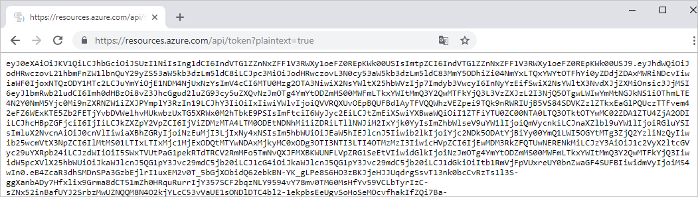
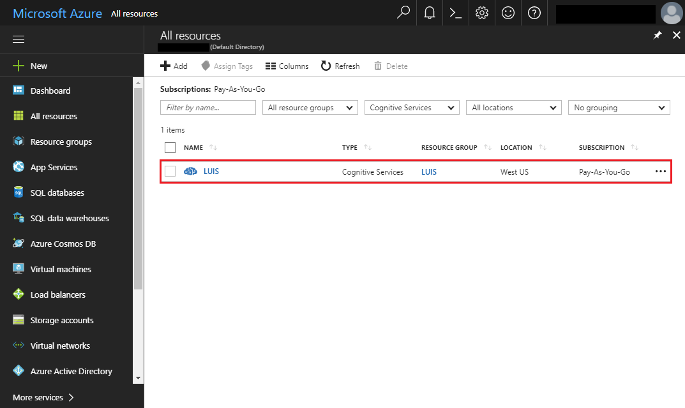
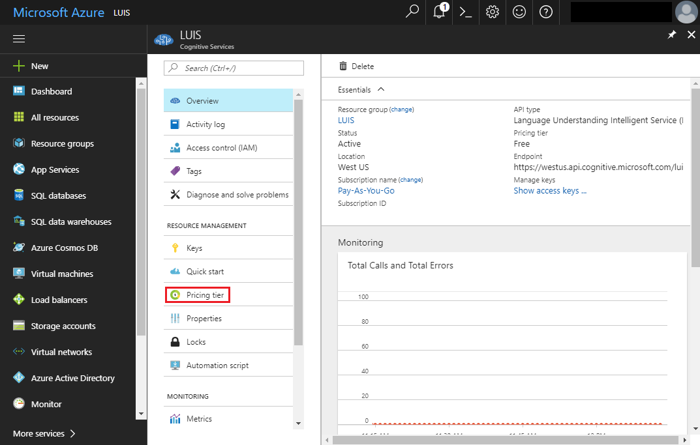
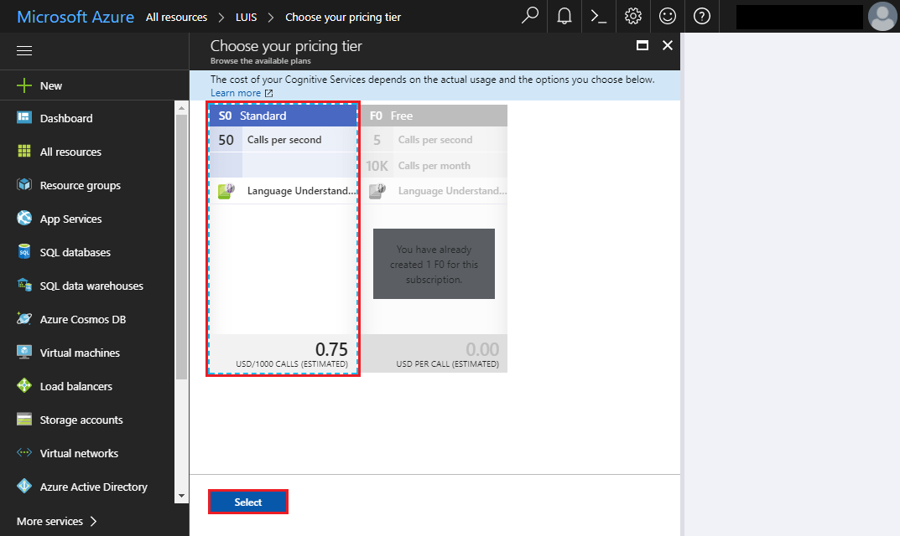
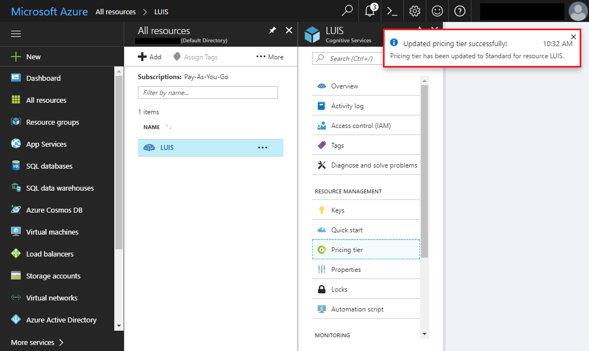
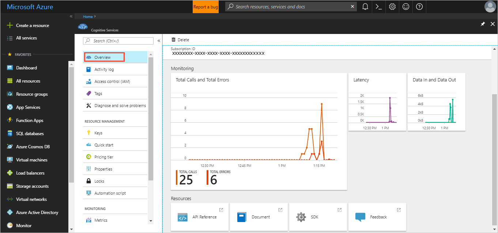
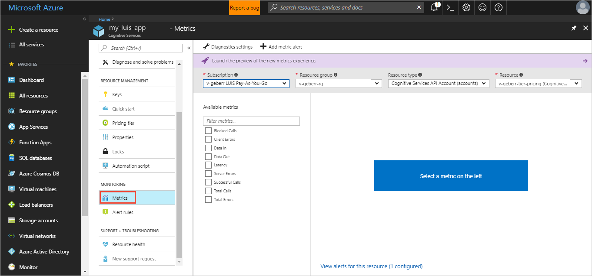
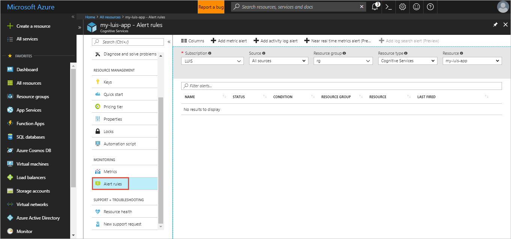

# Using subscription keys with your LUIS app

When you first use Language Understanding (LUIS), you do not need to create subscription keys. You are given 1000 endpoint queries to begin with. 

For testing and prototype only, use the free (F0) tier. For production systems, use a [paid](https://aka.ms/luis-price-tier) tier. Do not use the [authoring key](luis-concept-keys.md#authoring-key) for endpoint queries in production.


<a name="create-luis-service"></a>
<a name="create-language-understanding-endpoint-key-in-the-azure-portal"/>

## Create prediction endpoint runtime resource in the Azure portal

You create the [prediction endpoint resource](get-started-portal-deploy-app.md#create-the-endpoint-resource) in the Azure portal. This resource should only be used for endpoint prediction queries. Do not use this resource for authoring changes to the app.

You can create a Language Understanding resource or a Cognitive Services resource. If you are creating a Language Understanding resource, a good practice is to postpend the resource type to the resource name. 

<a name="programmatic-key" ></a>
<a name="authoring-key" ></a>
<a name="endpoint-key" ></a>
<a name="use-endpoint-key-in-query" ></a>
<a name="api-usage-of-ocp-apim-subscription-key" ></a>
<a name="key-limits" ></a>
<a name="key-limit-errors" ></a>
<a name="key-concepts"></a>
<a name="authoring-key"></a>
<a name="create-and-use-an-endpoint-key"></a>
<a name="assign-endpoint-key"></a>
<a name="assign-resource"></a>

### Using resource from LUIS portal

If you are using the resource from the LUIS portal, you do not need to know your key and location. Instead you need to know your resource tenant, subscription, and resource name.

Once you [assign](#assign-resource-key-to-luis-app-in-luis-portal) your resource to your LUIS app in the LUIS portal, the key and location are provided as part of the query prediction endpoint URL in the Manage section's **Keys and Endpoint settings** page.
 
### Using resource from REST API or SDK

If you are using the resource from the REST API(s) or SDK, you need to know your key and location. This information is provided as part of the query prediction endpoint URL in the Manage section's **Keys and Endpoint settings** page as well as in the Azure portal, on the resource's Overview and Keys pages.

## Assign resource key to LUIS app in LUIS Portal

Every time you create a new resource for LUIS, you need to [assign the resource to the LUIS app](get-started-portal-deploy-app.md#assign-the-resource-key-to-the-luis-app-in-the-luis-portal). After it's assigned, you won't need to do this step again unless you create a new resource. You might create a new resource to expand the regions of your app or to support a higher number of prediction queries.

<!-- content moved to luis-reference-regions.md, need replacement links-->
<a name="regions-and-keys"></a>
<a name="publishing-to-europe"></a>
<a name="publishing-to-australia"></a>

### Unassign resource
When you unassign the endpoint key, it is not deleted from Azure. It is only unlinked from LUIS. 

When an endpoint key is unassigned, or not assigned to the app, any request to the endpoint URL returns an error: `401 This application cannot be accessed with the current subscription`. 

### Include all predicted intent scores
The **Include all predicted intent scores** checkbox allows the endpoint query response to include the prediction score for each intent. 

This setting allows your chatbot or LUIS-calling application to make a programmatic decision based on the scores of the returned intents. Generally the top two intents are the most interesting. If the top score is the None intent, your chatbot can choose to ask a follow-up question that makes a definitive choice between the None intent and the other high-scoring intent. 

The intents and their scores are also included the endpoint logs. You can [export](luis-how-to-start-new-app.md#export-app) those logs and analyze the scores. 

```JSON
{
  "query": "book a flight to Cairo",
  "topScoringIntent": {
    "intent": "None",
    "score": 0.5223427
  },
  "intents": [
    {
      "intent": "None",
      "score": 0.5223427
    },
    {
      "intent": "BookFlight",
      "score": 0.372391433
    }
  ],
  "entities": []
}
```

### Enable Bing spell checker 
In the **Endpoint url settings**, the **Bing spell checker** toggle allows LUIS to correct misspelled words before prediction. Create a **[Bing Spell Check key](https://azure.microsoft.com/try/cognitive-services/?api=spellcheck-api)**. 

Add the **spellCheck=true** querystring parameter and the **bing-spell-check-subscription-key={YOUR_BING_KEY_HERE}**. Replace the `{YOUR_BING_KEY_HERE}` with your Bing spell checker key.

```JSON
{
  "query": "Book a flite to London?",
  "alteredQuery": "Book a flight to London?",
  "topScoringIntent": {
    "intent": "BookFlight",
    "score": 0.780123
  },
  "entities": []
}
```

### Publishing regions

Learn more about publishing [regions](luis-reference-regions.md) including publishing in [Europe](luis-reference-regions.md#publishing-to-europe), and [Australia](luis-reference-regions.md#publishing-to-australia). Publishing regions are different from authoring regions. Create an app in the authoring region corresponding to the publishing region you want for the query endpoint.

## Assign resource without LUIS portal

For automation purposes such as a CI/CD pipeline, you may want to automate the assignment of a LUIS resource to a LUIS app. In order to do that, you need to perform the following steps:

1. Get an Azure Resource Manager token from this [website](https://resources.azure.com/api/token?plaintext=true). This token does expire so use it immediately. The request returns an Azure Resource Manager token.

    

1. Use the token to request the LUIS resources across subscriptions, from the [Get LUIS azure accounts API](https://westus.dev.cognitive.microsoft.com/docs/services/5890b47c39e2bb17b84a55ff/operations/5be313cec181ae720aa2b26c), your user account has access to. 

    This POST API requires the following settings:

    |Header|Value|
    |--|--|
    |`Authorization`|The value of `Authorization` is `Bearer {token}`. Notice that the token value must be preceded by the word `Bearer` and a space.| 
    |`Ocp-Apim-Subscription-Key`|Your [authoring key](luis-how-to-account-settings.md).|

    This API returns an array of JSON objects of your LUIS subscriptions including subscription ID, resource group, and resource name, returned as account name. Find the one item in the array that is the LUIS resource to assign to the LUIS app. 

1. Assign the token to the LUIS resource with the [Assign a LUIS azure accounts to an application](https://westus.dev.cognitive.microsoft.com/docs/services/5890b47c39e2bb17b84a55ff/operations/5be32228e8473de116325515) API. 

    This POST API requires the following settings:

    |Type|Setting|Value|
    |--|--|--|
    |Header|`Authorization`|The value of `Authorization` is `Bearer {token}`. Notice that the token value must be preceded by the word `Bearer` and a space.|
    |Header|`Ocp-Apim-Subscription-Key`|Your [authoring key](luis-how-to-account-settings.md).|
    |Header|`Content-type`|`application/json`|
    |Querystring|`appid`|The LUIS app ID. 
    |Body||{"AzureSubscriptionId":"ddda2925-af7f-4b05-9ba1-2155c5fe8a8e",<br>"ResourceGroup": "resourcegroup-2",<br>"AccountName": "luis-uswest-S0-2"}|

    When this API is successful, it returns a 201 - created status. 

## Change pricing tier

1.  In [Azure](https://portal.azure.com), find your LUIS subscription. Select the LUIS subscription.
    
1.  Select **Pricing tier** in order to see the available pricing tiers. 
    
1.  Select the pricing tier and select **Select** to save your change. 
    
1.  When the pricing change is complete, a pop-up window verifies the new pricing tier. 
    
1. Remember to [assign this endpoint key](#assign-endpoint-key) on the **Publish** page and use it in all endpoint queries. 

## Fix HTTP status code 403 and 429

You get 403 and 429 error status codes when you exceed the transactions per second or transactions per month for your pricing tier.

### When you receive an HTTP 403 error status code

When you use all those free 1000 endpoint queries or you exceed your pricing tier's monthly transactions quota, you receive an HTTP 403 error status code. 

To fix this error, you need to either [change your pricing tier](luis-how-to-azure-subscription.md#change-pricing-tier) to a higher tier or [create a new resource](get-started-portal-deploy-app.md#create-the-endpoint-resource) and [assign it to your app](get-started-portal-deploy-app.md#assign-the-resource-key-to-the-luis-app-in-the-luis-portal).

Solutions for this error include:

* In the [Azure portal](https://portal.azure.com), on your Language Understanding resource, on the **Resource Management -> Pricing tier**, change your pricing tier to a higher TPS tier. You don't need to do anything in the Language Understanding portal if your resource is already assigned to your Language Understanding app.
*  If your usage exceeds the highest pricing tier, add more Language Understanding resources with a load balancer in front of them. The [Language Understanding container](luis-container-howto.md) with Kubernetes or Docker Compose can help with this.

### When you receive an HTTP 429 error status code

This status code is returned when your transactions per second exceeds your pricing tier.  

Solutions include:

* You can [increase your pricing tier](#change-pricing-tier), if you are not at the highest tier.
* If your usage exceeds the highest pricing tier, add more Language Understanding resources with a load balancer in front of them. The [Language Understanding container](luis-container-howto.md) with Kubernetes or Docker Compose can help with this.
* You can gate your client application requests with a [retry policy](https://docs.microsoft.com/azure/architecture/best-practices/transient-faults#general-guidelines) you implement yourself when you get this status code. 

## Viewing summary usage
You can view LUIS usage information in Azure. The **Overview** page shows recent summary information including calls and errors. If you make a LUIS endpoint request, then immediately watch the **Overview page**, allow up to five minutes for the usage to show up.



## Customizing usage charts
Metrics provides a more detailed view into the data.



You can configure your metrics charts for time period and metric type. 


## Total transactions threshold alert
If you would like to know when you have reached a certain transaction threshold, for example 10,000 transactions, you can create an alert. 



Add a metric alert for the **total calls** metric for a certain time period. Add email addresses of all people that should receive the alert. Add webhooks for all systems that should receive the alert. You can also run a logic app when the alert is triggered. 

## Next steps

Learn how to use [versions](luis-how-to-manage-versions.md) to manage changes to your LUIS app.
