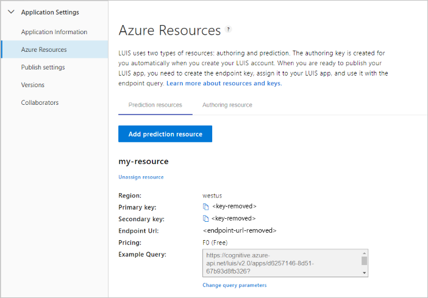

# Create LUIS resources

Authoring and query prediction runtime resources provide authentication to your LUIS app and prediction endpoint.

<a name="programmatic-key" ></a>
<a name="endpoint-key"></a>
<a name="authoring-key"></a>

## LUIS resources

LUIS allows three types of Azure resources and one non-Azure resource:

|Key|Purpose|Cognitive service `kind`|Cognitive service `type`|
|--|--|--|--|
|Authoring key|Access and manage data of application with authoring, training, publishing, and testing. Create a LUIS authoring key if you intend to programmatically author LUIS apps.<br><br>The purpose of the `LUIS.Authoring` key is to allow you to:<br>* programmatically manage Language Understanding apps and models, including training, and publishing<br> * control permissions to the authoring resource by assigning people to [the contributor role](#contributions-from-other-authors).|`LUIS.Authoring`|`Cognitive Services`|
|Query prediction key| Query prediction endpoint requests. Create a LUIS prediction key before your client app requests predictions beyond the 1,000 requests provided by the starter resource. |`LUIS`|`Cognitive Services`|
|[Cognitive Service multi-service resource key](../cognitive-services-apis-create-account-cli.md?tabs=windows#create-a-cognitive-services-resource)|Query prediction endpoint requests shared with LUIS and other supported Cognitive Services.|`CognitiveServices`|`Cognitive Services`|
|Starter|Free authoring (without role-based access control) through the LUIS portal or APIs (including SDKs), free 1,000 prediction endpoint requests per month through a browser, API, or SDKs|-|Not an Azure resource|

When the Azure resource creation process is finished, [assign the key](#assign-a-resource-to-an-app) to the app in the LUIS portal.

It is important to author LUIS apps in [regions](luis-reference-regions.md#publishing-regions) where you want to publish and query.

## Resource ownership

An Azure resource, such as a LUIS, is owned by the subscription containing the resource.

To transfer ownership of a resource, ou can either:
* Transfer [ownership](../../cost-management-billing/manage/billing-subscription-transfer.md) of your subscription
* Export the LUIS app as a file, then import app on a different subscription. Export is available from the **My apps** page in the LUIS portal.


## Resource limits

### Authoring key creation limits

You can create up to 10 authoring keys per region per subscription.

See [Key Limits](luis-limits.md#key-limits) and [Azure regions](luis-reference-regions.md).

Publishing regions are different from authoring regions. Make sure you create an app in the authoring region corresponding to the publishing region you want your client application to be located.

### Key usage limit errors

Usage limits are based on the pricing tier.

If you exceed your transactions-per-second (TPS) quota, you receive an HTTP 429 error. If you exceed your transaction-per-month (TPS) quota, you receive an HTTP 403 error.


### Reset authoring key

For [authoring resource migrated](luis-migration-authoring.md) apps: if your authoring key is compromised, reset the key in the Azure portal on the **Keys** page for that authoring resource.

For apps that have not migrated yet: the key is reset on all your apps in the LUIS portal. If you author your apps via the authoring APIs, you need to change the value of Ocp-Apim-Subscription-Key to the new key.

### Regenerate Azure key

Regenerate the Azure keys from the Azure portal, on the **Keys** page.


## App Ownership, access, and security

An app is defined by its Azure resources, which is determined by the owner's subscription.

You can move your LUIS app. Use the following documentation resources in the Azure portal or Azure CLI:

* [Move app between LUIS authoring resources](https://westus.dev.cognitive.microsoft.com/docs/services/5890b47c39e2bb17b84a55ff/operations/apps-move-app-to-another-luis-authoring-azure-resource)
* [Move resource to new resource group or subscription](../../azure-resource-manager/management/move-resource-group-and-subscription.md)
* [Move resource within same subscription or across subscriptions](../../azure-resource-manager/management/move-limitations/app-service-move-limitations.md)


### Contributions from other authors

For [authoring resource migrated](luis-migration-authoring.md) apps: _contributors_ are managed in the Azure portal for the authoring resource, using the **Access control (IAM)** page. Learn [how to add a user](luis-how-to-collaborate.md), using the collaborator's email address and the _contributor_ role.

For apps that have not migrated yet: all _collaborators_ are managed in the LUIS portal from the **Manage -> Collaborators** page.

### Query prediction access for private and public apps

For a **private** app, query prediction runtime access is available for owners and contributors. For a **public** app, runtime access is available to everyone that has their own Azure [Cognitive Service](../cognitive-services-apis-create-account.md) or [LUIS](#create-resources-in-the-azure-portal) runtime resource, and has the public app's ID.

Currently, there isn't a catalog of public apps.

### Authoring permissions and access
Access to the app from the [LUIS](luis-reference-regions.md#luis-website) portal or the [authoring APIs](https://go.microsoft.com/fwlink/?linkid=2092087) is controlled by the Azure authoring resource.

The owner and all contributors have access to author the app.

|Authoring access includes|Notes|
|--|--|
|Add or remove endpoint keys||
|Exporting version||
|Export endpoint logs||
|Importing version||
|Make app public|When an app is public, anyone with an authoring or endpoint key can query the app.|
|Modify model|
|Publish|
|Review endpoint utterances for [active learning](luis-how-to-review-endpoint-utterances.md)|
|Train|

<a name="prediction-endpoint-runtime-key"></a>

### Prediction endpoint runtime access

Access to query the prediction endpoint is controlled by a setting on the **Application Information** page in the **Manage** section.

|[Private endpoint](#runtime-security-for-private-apps)|[Public endpoint](#runtime-security-for-public-apps)|
|:--|:--|
|Available to owner and contributors|Available to owner, contributors, and anyone else that knows app ID|

You can control who sees your LUIS runtime key by calling it in a server-to-server environment. If you are using LUIS from a bot, the connection between the bot and LUIS is already secure. If you are calling the LUIS endpoint directly, you should create a server-side API (such as an Azure [function](https://azure.microsoft.com/services/functions/)) with controlled access (such as [AAD](https://azure.microsoft.com/services/active-directory/)). When the server-side API is called and authenticated and authorization is verified, pass the call on to LUIS. While this strategy doesn’t prevent man-in-the-middle attacks, it obfuscates your key and endpoint URL from your users, allows you to track access, and allows you to add endpoint response logging (such as [Application Insights](https://azure.microsoft.com/services/application-insights/)).

### Runtime security for private apps

A private app's runtime is only available to the following:

|Key and user|Explanation|
|--|--|
|Owner's authoring key| Up to 1000 endpoint hits|
|Collaborator/contributor authoring keys| Up to 1000 endpoint hits|
|Any key assigned to LUIS by an author or collaborator/contributor|Based on key usage tier|

### Runtime security for public apps

Once an app is configured as public, _any_ valid LUIS authoring key or LUIS endpoint key can query your app, as long as the key has not used the entire endpoint quota.

A user who is not an owner or contributor, can only access a public app's runtime if given the app ID. LUIS doesn't have a public _market_ or other way to search for a public app.

A public app is published in all regions so that a user with a region-based LUIS resource key can access the app in whichever region is associated with the resource key.


### Securing the query prediction endpoint

You can control who can see your LUIS prediction runtime endpoint key by calling it in a server-to-server environment. If you are using LUIS from a bot, the connection between the bot and LUIS is already secure. If you are calling the LUIS endpoint directly, you should create a server-side API (such as an Azure [function](https://azure.microsoft.com/services/functions/)) with controlled access (such as [AAD](https://azure.microsoft.com/services/active-directory/)). When the server-side API is called and authentication and authorization are verified, pass the call on to LUIS. While this strategy doesn’t prevent man-in-the-middle attacks, it obfuscates your endpoint from your users, allows you to track access, and allows you to add endpoint response logging (such as [Application Insights](https://azure.microsoft.com/services/application-insights/)).

<a name="starter-key"></a>

## Sign in to LUIS portal and begin authoring

1. Sign in to [LUIS portal](https://www.luis.ai) and agree to the terms of use.
1. Begin your LUIS app by choosing which type of LUIS authoring key you would like to use: free trial key, or new Azure LUIS authoring key.

    

1. When you are done with your resource selection process, [create a new app](luis-how-to-start-new-app.md#create-new-app-in-luis).


## Create Azure resources

<a name="create-resources-in-the-azure-portal"></a>

[!INCLUDE [Create LUIS resource in Azure Portal](includes/create-luis-resource.md)]

### Create resources in Azure CLI

Use the [Azure CLI](https://docs.microsoft.com/cli/azure/install-azure-cli?view=azure-cli-latest) to create each resource individually.

Resource `kind`:

* Authoring: `LUIS.Authoring`
* Prediction: `LUIS`

1. Sign in to the Azure CLI:

    ```azurecli
    az login
    ```

    This opens a browser to allow you to select the correct account and provide authentication.

1. Create a **LUIS authoring resource**, of kind `LUIS.Authoring`, named `my-luis-authoring-resource` in the _existing_ resource group named `my-resource-group` for the `westus` region.

    ```azurecli
    az cognitiveservices account create -n my-luis-authoring-resource -g my-resource-group --kind LUIS.Authoring --sku F0 -l westus --yes
    ```

1. Create a **LUIS prediction endpoint resource**, of kind `LUIS`, named `my-luis-prediction-resource` in the _existing_ resource group named `my-resource-group` for the `westus` region. If you want a higher throughput than the free tier, change `F0` to `S0`. Learn more about [pricing tiers and throughput](luis-limits.md#key-limits).

    ```azurecli
    az cognitiveservices account create -n my-luis-prediction-resource -g my-resource-group --kind LUIS --sku F0 -l westus --yes
    ```

    > [!Note]
    > This keys are **not** used by the LUIS portal until they are assigned in the LUIS portal on the **Manage -> Azure resources**.

<a name="assign-an-authoring-resource-in-the-luis-portal-for-all-apps"></a>

### Assign resource in the LUIS portal

You can assign an authoring resource for a single app or for all apps in LUIS. The following procedure assigns all apps to a single authoring resource.

1. Sign in to the [LUIS portal](https://www.luis.ai).
1. At the top navigation bar, to the far right, select your user account, then select **Settings**.
1. On the **User Settings** page, select **Add authoring resource** then select an existing authoring resource. Select **Save**.

## Assign a resource to an app

You can assign a to an app with the following procedure.

1. Sign in to the [LUIS portal](https://www.luis.ai), then select an app from the **My apps** list.
1. Navigate to the **Manage -> Azure resources** page.

    

1. Select the Prediction or Authoring resource tab then select the **Add prediction resource** or **Add authoring resource** button.
1. Select the fields in the form to find the correct resource, then select **Save**.

### Assign query prediction runtime resource without using LUIS portal

For automation purposes such as a CI/CD pipeline, you may want to automate the assignment of a LUIS runtime resource to a LUIS app. In order to do that, you need to perform the following steps:

1. Get an Azure Resource Manager token from this [website](https://resources.azure.com/api/token?plaintext=true). This token does expire so use it immediately. The request returns an Azure Resource Manager token.

    

1. Use the token to request the LUIS runtime resources across subscriptions, from the [Get LUIS azure accounts API](https://westus.dev.cognitive.microsoft.com/docs/services/5890b47c39e2bb17b84a55ff/operations/5be313cec181ae720aa2b26c), which your user account has access to.

    This POST API requires the following settings:

    |Header|Value|
    |--|--|
    |`Authorization`|The value of `Authorization` is `Bearer {token}`. Notice that the token value must be preceded by the word `Bearer` and a space.|
    |`Ocp-Apim-Subscription-Key`|Your authoring key.|

    This API returns an array of JSON objects of your LUIS subscriptions including subscription ID, resource group, and resource name, returned as account name. Find the one item in the array that is the LUIS resource to assign to the LUIS app.

1. Assign the token to the LUIS resource with the [Assign a LUIS azure accounts to an application](https://westus.dev.cognitive.microsoft.com/docs/services/5890b47c39e2bb17b84a55ff/operations/5be32228e8473de116325515) API.

    This POST API requires the following settings:

    |Type|Setting|Value|
    |--|--|--|
    |Header|`Authorization`|The value of `Authorization` is `Bearer {token}`. Notice that the token value must be preceded by the word `Bearer` and a space.|
    |Header|`Ocp-Apim-Subscription-Key`|Your authoring key.|
    |Header|`Content-type`|`application/json`|
    |Querystring|`appid`|The LUIS app ID.
    |Body||{"AzureSubscriptionId":"ddda2925-af7f-4b05-9ba1-2155c5fe8a8e",<br>"ResourceGroup": "resourcegroup-2",<br>"AccountName": "luis-uswest-S0-2"}|

    When this API is successful, it returns a 201 - created status.

## Unassign resource

1. Sign in to the [LUIS portal](https://www.luis.ai), then select an app from the **My apps** list.
1. Navigate to the **Manage -> Azure resources** page.
1. Select the Prediction or Authoring resource tab then select the **Unassign resource** button for the resource.

When you unassign a resource, it is not deleted from Azure. It is only unlinked from LUIS.


## Delete account

See [Data storage and removal](luis-concept-data-storage.md#accounts) for information about what data is deleted when you delete your account.

## Change pricing tier

1.  In [Azure](https://portal.azure.com), find your LUIS subscription. Select the LUIS subscription.
    
1.  Select **Pricing tier** in order to see the available pricing tiers.
    
1.  Select the pricing tier and select **Select** to save your change.
    
1.  When the pricing change is complete, a pop-up window verifies the new pricing tier.
    
1. Remember to [assign this endpoint key](#assign-a-resource-to-an-app) on the **Publish** page and use it in all endpoint queries.

## Viewing Azure resource metrics

### Viewing Azure resource summary usage
You can view LUIS usage information in Azure. The **Overview** page shows recent summary information including calls and errors. If you make a LUIS endpoint request, then immediately watch the **Overview page**, allow up to five minutes for the usage to show up.


### Customizing Azure resource usage charts
Metrics provides a more detailed view into the data.


You can configure your metrics charts for time period and metric type.


### Total transactions threshold alert
If you would like to know when you have reached a certain transaction threshold, for example 10,000 transactions, you can create an alert.


Add a metric alert for the **total calls** metric for a certain time period. Add email addresses of all people that should receive the alert. Add webhooks for all systems that should receive the alert. You can also run a logic app when the alert is triggered.

## Next steps

* Learn [how to use versions](luis-how-to-manage-versions.md) to control your app life cycle.
* Migrate to the new [authoring resource](luis-migration-authoring.md)
