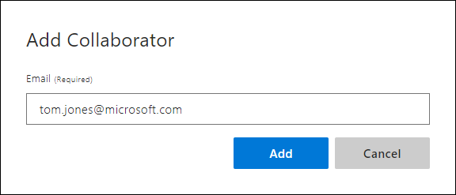
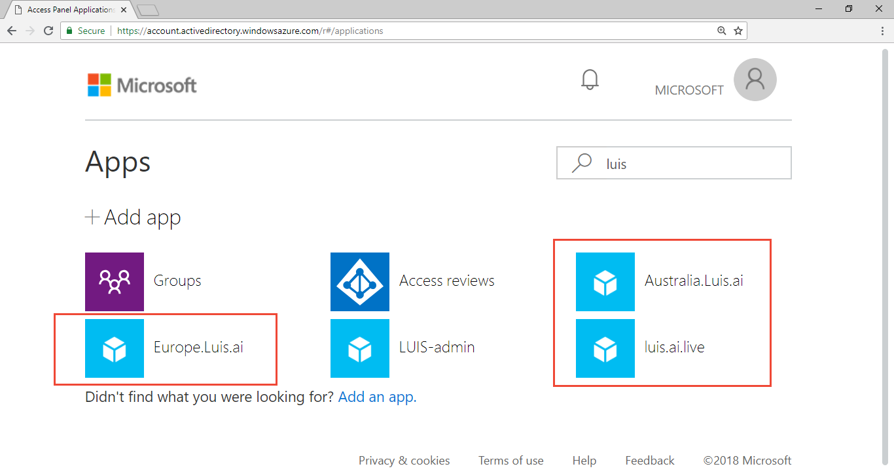

# How to manage authors and collaborators 

An app owner can add collaborators to the app. These collaborators can modify the model, train, and publish the app. 

## Add collaborator

An app has a single author, the owner, but can have many collaborators. To allow collaborators to edit your LUIS app, you must add the email they use to access the LUIS portal to the collaborators list. Once they are added, the app shows in their LUIS portal.

1. Select **Manage** from the top right menu, then select **Collaborators** in the left menu.

2. Select **Add Collaborator** from the toolbar.

    

3. Enter the email address the collaborator uses to sign in to the LUIS portal.

    

## Transfer of ownership

While LUIS doesn't currently support transfer of ownership, you can export your app, and another LUIS user can import the app. There may be minor differences in LUIS scores between the two applications. 

## Azure Active Directory resources

If you use [Azure Active Directory](https://docs.microsoft.com/azure/active-directory/) (Azure AD) in your organization, Language Understanding (LUIS) needs permission to the information about your users' access when they want to use LUIS. The resources that LUIS requires are minimal. 

You see the detailed description when you attempt to sign up with an account that has admin consent or does not require admin consent, such as administrator consent:

* Allows you to sign in to the app with your organizational account and let the app read your profile. It also allows the app to read basic company information. This gives LUIS permission to read basic profile data, such as user ID, email, name
* Allows the app to see and update your data, even when you are not currently using the app. The permission is required to refresh the access token of the user.

## Azure Active Directory tenant user

LUIS uses standard Azure Active Directory (Azure AD) consent flow. 

The tenant admin should work directly with the user who needs access granted to use LUIS in the Azure AD. 

* First, the user signs into LUIS, and sees the pop-up dialog needing admin approval. The user contacts the tenant admin before continuing. 
* Second, the tenant admin signs into LUIS, and sees a consent flow pop-up dialog. This is the dialog the admin needs to give permission for the user. Once the admin accepts the permission, the user is able to continue with LUIS. If the tenant admin will not sign in to LUIS, the admin can access [consent](https://account.activedirectory.windowsazure.com/r#/applications) for LUIS, shown in the following screenshot. Notice the list is filtered to items that include the name `LUIS`.

If the tenant admin only wants certain users to use LUIS, there are a couple of possible solutions:
* Giving the "admin consent" (consent to all users of the Azure AD), but then set to "Yes" the "User assignment required" under Enterprise Application Properties, and finally assign/add only the wanted users to the Application. With this method, the Administrator is still providing "admin consent" to the App, however, it's possible to control the users that can access it.
* A second solution, is by using [Azure AD Graph API](https://docs.microsoft.com/graph/azuread-identity-access-management-concept-overview) to provide consent to each specific user. 

Learn more about Azure active directory users and consent: 
* [Restrict your app](../../active-directory/develop/howto-restrict-your-app-to-a-set-of-users.md) to a set of users

### User accounts with multiple emails for collaborators

If you add collaborators to a LUIS app, you are specifying the exact email address a collaborator needs to use LUIS as a collaborator. While Azure Active Directory (Azure AD) allows a single user to have more than one email account used interchangeably, LUIS requires the user to sign in with the email address specified in the collaborator's list.

