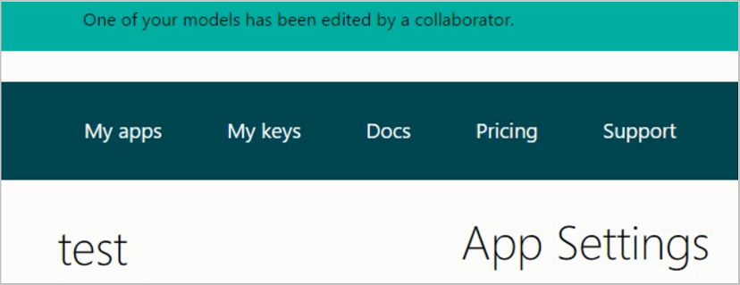

# Collaborate with other contributors on Language Understanding Intelligent Service (LUIS) apps  

You can collaborate with others and work on your LUIS app at the same time. 

To allow collaborators to edit your LUIS app, in the **Collaborators** section of in your **My Apps** page, enter the email of the collaborator and click **Add collaborator**.

* Collaborators can sign in and edit your LUIS app as the same time as you. If a collaborator edits the LUIS app by adding an intent or entity or labeling an utterance, you'll see a notication.

> [!NOTE]
> Collaborators cannot add other collaborators.