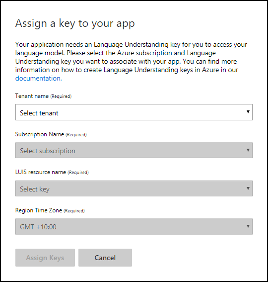
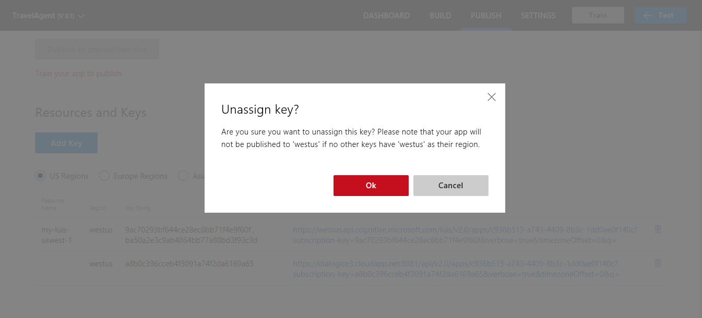

# Manage your LUIS endpoint keys
A key allows you to author and publish your LUIS app, or query your endpoint. 

## Key concepts
See [Keys in LUIS](luis-concept-keys.md) to understand LUIS authoring and endpoint key concepts.

## Assign endpoint key
On the **Publish app** page, there is already a key in the **Resources and Keys** table. This is the authoring (starter) key. 

1. Create a LUIS key on the [Azure portal](https://portal.azure.com). For further instructions, see [Creating an endpoint key using Azure](luis-how-to-azure-subscription.md).
 
2. In order to add the LUIS key created in the previous step, click the **Add Key** button to open the **Assign a key to your app** dialog. 

    
3. Select a Tenant in the dialog. 
 
    > [!Note]
    > In Azure, a tenant represents the Azure Active Directory ID of the client or organization associated with a service. If you previously signed up for an Azure subscription with your individual Microsoft Account, you already have a tenant! When you log in to the Azure portal, you are automatically logged in to [your default tenant](https://docs.microsoft.com/azure/active-directory/develop/active-directory-howto-tenant). You are free to use this tenant but you may want to create an Organizational administrator account.

4. Choose the Azure subscription associated with the Azure LUIS key you want to add.

5. Select the Azure LUIS account. The region of the account is displayed in parentheses. 

    

6. After you assign this endpoint key, use it in all endpoint queries. 

<!-- content moved to luis-reference-regions.md, need replacement links-->

## Publishing regions
Learn more about publishing [regions](luis-reference-regions.md) including publishing in [Europe](luis-reference-regions.md#publishing-to-europe), and [Australia](luis-reference-regions.md#publishing-to-australia). Publishing regions are different from authoring regions. Make sure you create an app in the authoring region corresponding to the publishing region you want.

## Unassign key

* In the **Resources and Keys list**, click the trash bin icon next to the entity you want to unassign. Then, click **OK** in the confirmation message to confirm deletion.
 
    

> [!NOTE]
> Unassigning the LUIS key does not delete it from your Azure subscription.

## Next steps

Use your key to publish your app in the **Publish app** page. For instructions on publishing, see [Publish app](luis-how-to-publish-app.md).