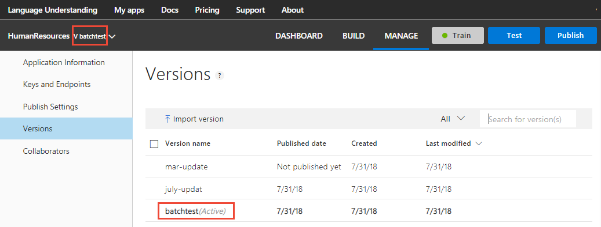

# Manage versions

Versioning the LUIS app allows you to keep separate versions of the app. A version can be based on changes over time, feature groups, or minor fixes as they occur. 

A LUIS app has only one version active at the time. The active version name is visible in the top, left navigation bar and on **Versions**, found in the **Build** section. 

A version name is 10 characters and is used as part of the API route by the API. The name of the first active version is `0.1`. 

## Set active version

Change the active version by selecting the name in the top, left navigation bar or by changing the active version on **Versions**. 

## Actions for versions

A version can be imported from a *.json file, renamed, cloned, exported, deleted, or made the active version from the toolbar. 

When you import a version, it becomes the active version. 

You can delete versions, but you have to keep at least one version of the app. You can delete all versions except the active version. 

Search for a version either by type (active, staging, production) or by version name. 
