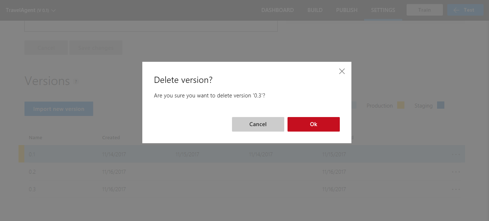

# Manage versions

You can build different versions of your application. Versioning allows you to create a model definition that can be managed, changed, cloned, or exported. 

Trained versions are not automatically available at your app [endpoint](luis-glossary.md#endpoint). You must [publish](PublishApp.md) or republish a version in order for it to be available at your app endpoint. You can publish to **Staging** and **Production** so you can have up to two versions of your app available at the endpoint. If you need more versions of the app available at an endpoint, you should export the version and reimport to a new app. The new app has a different app ID. 

Performance is a consideration when versioning with large LUIS model definitions. In general, cloning should be quicker than exporting the app and reimporting the app. 

## Active version
When an app is first created, the default initial, active version is (0.1). When you make a change to intents, entities, or utterances, that change is made to the active version.

To work with versions, open your app by selecting its name on **My Apps** page, and then select **Settings** in the top bar.

The **Settings** page allows you to configure settings for the entire app including versions, and contributors. 

## Clone version
You can clone a version to create a copy of an existing version and save it as a new version. You may need to clone a version to use the same content of the existing version as a starting point for the new version. 

Once you clone a version, the new version becomes the active version. 

1. On the **Settings** page, after the App Settings and Contributors sections, find the row with the version you want to clone. Select the three dots (...) on the far-right. 

    

2. Select **Clone Version** from the list.

    

3. In the **Clone Version** dialog box, type a name for the new version such as "0.2".

   
 
 > [!NOTE]
 > Version ID can consist only of characters, digits or '.' and cannot be longer than 10 characters.
 
 A new version with the specified name is created and added to the list.
 
  

 > [!NOTE]
 > As shown in the preceding image, a published version is associated with a colored mark, indicating the type of slot where it has been published: Production (green), Staging (red) and both (black). The training and publishing dates are displayed for each published version.

## Set active version
To set a version as active means to make it the current version to work on and edit. You set a version as active to access its data, make updates, as well as to test and publish it.

The initial version (0.1) is the default active version unless you set another version as active. The name of the currently active version is displayed in the top, left panel after the app name. 

**To set a version as active:**

1. On the **Settings** page, in the **Versions** list, on the row of the version you want to clone, select the three dots (...) at the far right.

2. From the pop-up list, select **Set as active**.

    

    The active version is highlighted by a light blue color, as shown in the following screenshot:

     

## Import version
You can import a version from a JSON file. Once you import a version, the new version becomes the active version.

**To import a version:**

1. On the **Settings** page, select **Import new version** button.

    

2. Select **browse** and choose the JSON file.

    

You only need to set a version name if the version in the JSON file already exists in the app.

## Export version
You can export a version as a JSON file.

**To export a version:**

1. On the **Settings** page, in the **Versions** list, on the row of the version you want to clone, select the three dots (...) at the far right.

2. Select **Export version** in the pop-up list of actions and select where you want to save the file.

## Delete a version
You can delete versions, but you have to keep at least one version of the app. You can delete all versions except the active version. 

**To delete a version:** 

1. On the **Settings** page, in the **Versions** list, on the row of the version you want to delete, select the three dots (...) at the far right.

2. Select **Delete version** in the pop-up list of actions and select where you want to save the file.

     

