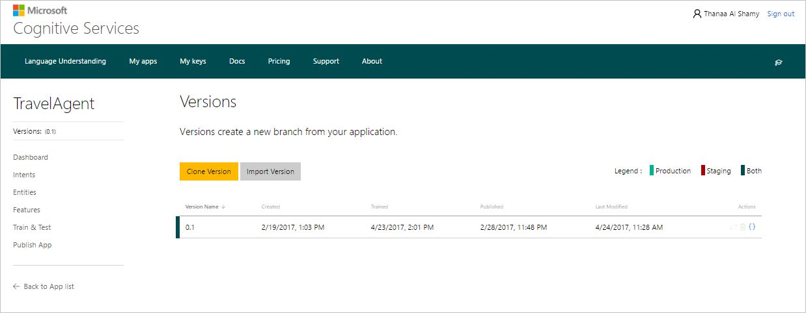
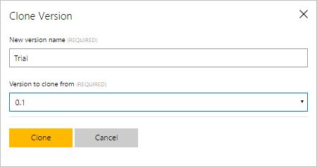
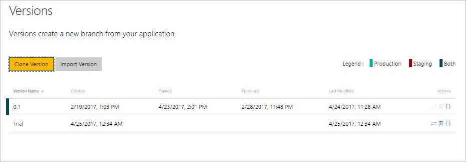
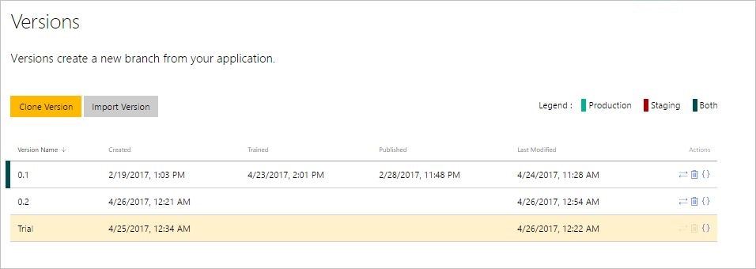
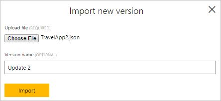

# Manage Versions

You can create and manage different versions of your applications. When an app is first created, the default initial version is (0.1). 

To work with versions, open your app (e.g. TravelAgent app) by clicking its name on **My Apps** page, and then click **Versions** in the application's left panel to access the **Versions** page.

The following procedures will guide you through the actions you need to do while working with versions.

## Clone a version
You can clone a version to create a copy of an existing version and save it as a new version. You may need to do this to use the same content of the existing version as a starting point for the new version and make updates to it, while keeping the source version unchanged.  
 
**To clone a version:**

1. On the **Versions** page, click **Clone Version**. 
2. In the **Clone Version** dialog box, type a name for the new version in the **New Version Name** box (e.g. Trial), select the source version from **Version to clone from**, and then click **Clone**.

 
 
 > [!NOTE]
 > Version name cannot be longer than 10 alphanumeric characters.
 
 A new version with the specified name will be created and added to the list.
 
  

 > [!NOTE]
 > As shown in the above screenshot, a published version is associated with a colored mark, indicating the slot where it has been published: Production slot (green), Staging slot (red) and Both slots (black). Also, the training and publishing dates will be displayed for each published version.

## Set a version as active
To set a version as active means to make it the current version to work on and edit. You'll need to set a version as active to access its data, make updates, as well as to test and publish it.

The initial version (0.1) is the default active version unless you set another version as active. The name of the currently active version is displayed in the left panel under the app name. 

**To set a version as active:**

1. On the **Versions** page, click the **Set as Active Version** button , corresponding to the version you want to set as active.
2. In the confirmation message, click **Yes** to confirm this action. The version will be set as active. 
The active version is highlighted by a light pink color, as shown in the following screenshot.

  

## Import/export a version
You can import/export a version as a JSON file.

**To import a version:**

1. On the **Versions** page, click **Import Version**.
2. In the **Import New Version** dialog box, click **Choose File** to choose the JSON file of the version you want to import.
3. Type the version name in the **Version Name** box, and then click **Import**.

**To export a version:**

1. On the **Versions** page, click the Export Version button , corresponding to the version you want to export.
2. In the **Save As** dialog box, choose the location where you want to save the exported app version, and click **Save**.

## Delete a version
You can delete versions, but you have to keep at least one version of the app. You can delete all versions except the active version. 

**To delete a version:** 

1. Click the **Delete Version** button , corresponding to the version you want to delete.
2. In the confirmation message, click **Yes** to confirm deletion.

