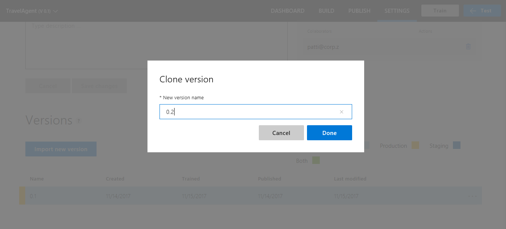
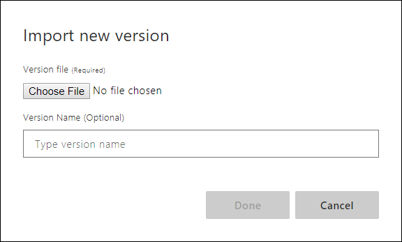

# Use versions to edit and test without impacting staging or production apps

Versions allow you to build and publish different models. A good practice is to clone the current active model to a different [version](luis-concept-version.md) of the app before making changes to the model.

The active version is the version you are editing in the LUIS portal **Build** section with intents, entities, features, and patterns. When using the authoring APIs, you don't need to set the active version because the version-specific REST API calls include the version in the route.

To work with versions, open your app by selecting its name on **My Apps** page, and then select **Manage** in the top bar, then select **Versions** in the left navigation.

The list of versions shows which versions are published, where they are published, and which version is currently active.

## Clone a version

1. Select the version you want to clone then select **Clone** from the toolbar.

2. In the **Clone version** dialog box, type a name for the new version such as "0.2".

   

     > [!NOTE]
     > Version ID can consist only of characters, digits or '.' and cannot be longer than 10 characters.

   A new version with the specified name is created and set as the active version.

## Set active version

Select a version from the list, then select **Activate** from the toolbar.

## Import version

You can import a `.json` or a `.lu` version of your application.

1. Select **Import** from the toolbar, then select the format.

2. In the **Import new version** pop-up window, enter the new ten character version name. You only need to set a version ID if the version in the file already exists in the app.

    

    Once you import a version, the new version becomes the active version.

### Import errors

* Tokenizer errors: If you get a **tokenizer error** when importing, you are trying to import a version that uses a different [tokenizer](luis-language-support.md#custom-tokenizer-versions) than the app currently uses. To fix this, see [Migrating between tokenizer versions](luis-language-support.md#migrating-between-tokenizer-versions).

## Other actions

* To **delete** a version, select a version from the list, then select **Delete** from the toolbar. Select **Ok**.
* To **rename** a version, select a version from the list, then select **Rename** from the toolbar. Enter new name and select **Done**.
* To **export** a version, select a version from the list, then select **Export app** from the toolbar. Choose JSON or LU to export for a backup or to save in source control, choose **Export for container** to [use this app in a LUIS container](luis-container-howto.md).

