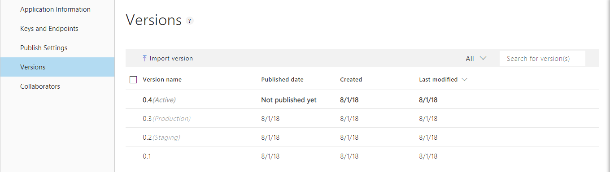
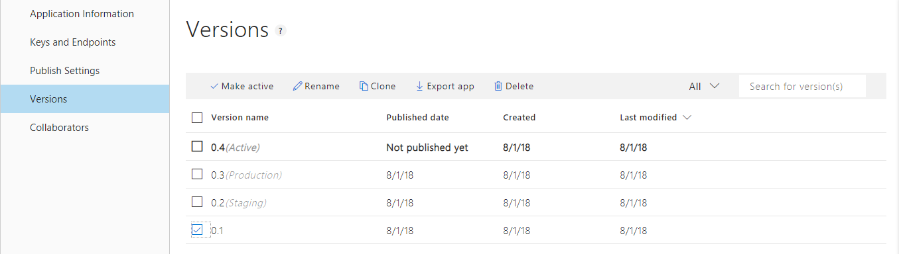

# Manage versions

Versions allow you to build and publish different models. A good practice is to clone the current active model to a different [version](luis-concept-version.md) of the app before making changes to the model. 

To work with versions, open your app by selecting its name on **My Apps** page, and then select **Manage** in the top bar, then select **Versions** in the left navigation. 

The list of versions show which versions are published, where they are published, and which version is currently active. 

## Clone a version

1. Select the version you want to clone then select **Clone** from the toolbar. 

2. In the **Clone version** dialog box, type a name for the new version such as "0.2".

   
 
     > [!NOTE]
     > Version ID can consist only of characters, digits or '.' and cannot be longer than 10 characters.
 
 A new version with the specified name is created and set as the active version.

## Set active version

Select a version from the list, then select **Make Active** from the toolbar. 

## Import version

1. Select **Import version** from the toolbar. 

2. In the **Import new version** pop-up window, enter the new ten character version name. You only need to set a version ID if the version in the JSON file already exists in the app.

    

    Once you import a version, the new version becomes the active version.

## Other actions

* To **delete** a version, select a version from the list, then select **Delete** from the toolbar. Select **Ok**. 
* To **rename** a version, select a version from the list, then select **Rename** from the toolbar. Enter new name and select **Done**. 
* To **export** a version, select a version from the list, then select **Export app** from the toolbar. The file is downloaded to your local machine. 

