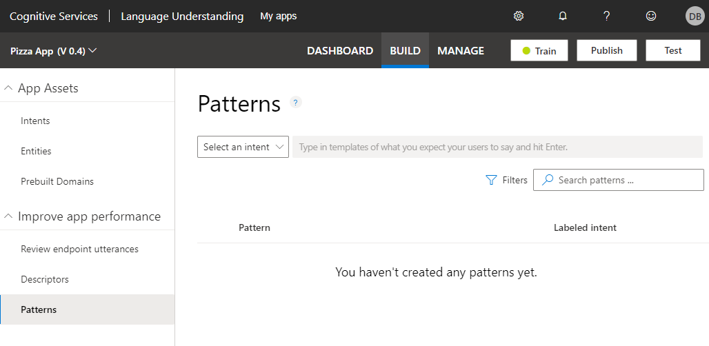
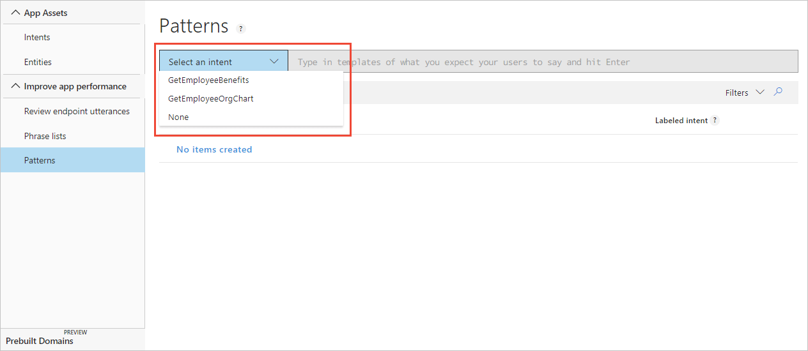

# How to add patterns to improve prediction accuracy
After a LUIS app receives endpoint utterances, use a [pattern](luis-concept-patterns.md) to improve prediction accuracy for utterances that reveal a pattern in word order and word choice. Patterns use specific [syntax](luis-concept-patterns.md#pattern-syntax) to indicate the location of: [entities](luis-concept-entity-types.md), entity [roles](luis-concept-roles.md), and optional text.

## Add template utterance to create pattern
1. Open your app by selecting its name on **My Apps** page, and then select **Patterns** in the left panel, under **Improve app performance**.

    

2. Select the correct intent for the pattern. 

    

3. In the template textbox, type the template utterance and select Enter. When you want to enter the entity name, use the correct pattern entity syntax. Begin the entity syntax with `{`. The list of entities displays. Select the correct entity, and then select Enter. 

    

    If your entity includes a [role](luis-concept-roles.md), indicate the role with a single colon, `:`, after the entity name, such as `{Location:Origin}`. The list of roles for the entities displays in a list. Select the role, and then select Enter. 

    

    After you select the correct entity, finish entering the pattern, and then select Enter. When you are done entering patterns, [train](luis-how-to-train.md) your app.

    

## Train your app after changing model with patterns
After you add, edit, remove, or reassign a pattern, [train](luis-how-to-train.md) and [publish](luis-how-to-publish-app.md) your app for your changes to affect endpoint queries. 

## Use contextual toolbar

The contextual toolbar above the patterns list allows you to:

* Search for patterns
* Edit a pattern
* Reassign individual pattern to different intent
* Reassign several patterns to different intent
* Delete-a-single-pattern
* Delete several patterns
* Filter pattern list by entity
* Filter-pattern-list-by-intent
* Remove entity or intent filter
* Add pattern from existing utterance on intent or entity page

## Next steps

* Learn how to [build a pattern](luis-tutorial-pattern.md) with a pattern.any and roles with a tutorial.
* Learn how to [train](luis-how-to-train.md) your app.
