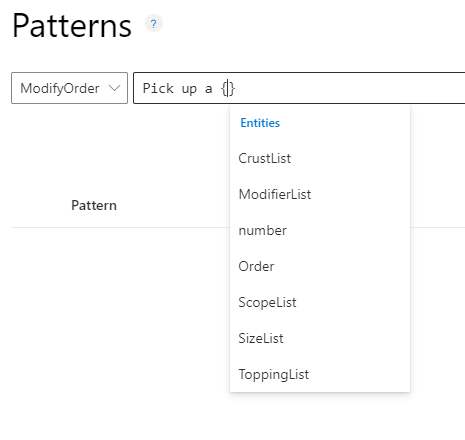
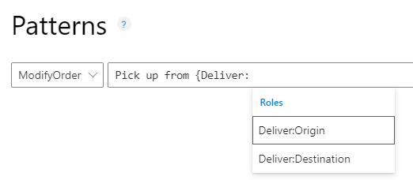
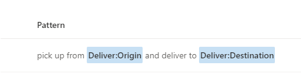
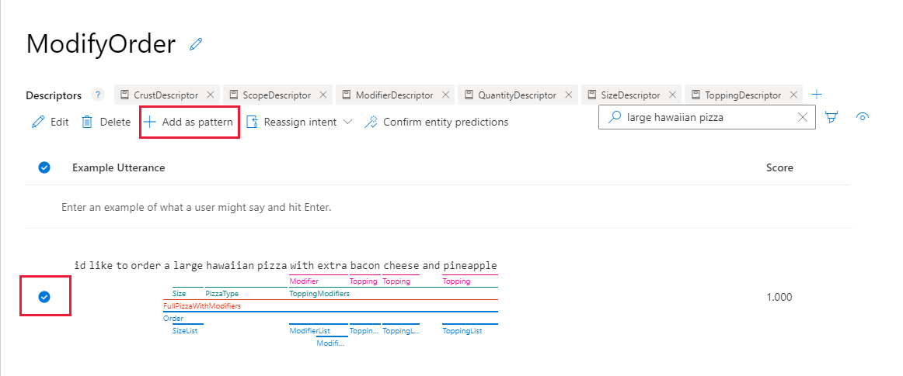

# How to add patterns to improve prediction accuracy
After a LUIS app receives endpoint utterances, use a [pattern](luis-concept-patterns.md) to improve prediction accuracy for utterances that reveal a pattern in word order and word choice. Patterns use specific [syntax](luis-concept-patterns.md#pattern-syntax) to indicate the location of: [entities](luis-concept-entity-types.md), entity [roles](luis-concept-roles.md), and optional text.

> [!CAUTION]
> Patterns only include machine-learning entity parents, not subentities.

## Add template utterance using correct syntax

1. Sign in to the [LUIS portal](https://www.luis.ai), and select your **Subscription** and **Authoring resource** to see the apps assigned to that authoring resource.
1. Open your app by selecting its name on **My Apps** page.
1. Select **Patterns** in the left panel, under **Improve app performance**.

1. Select the correct intent for the pattern.

1. In the template textbox, type the template utterance and select Enter. When you want to enter the entity name, use the correct pattern entity syntax. Begin the entity syntax with `{`. The list of entities displays. Select the correct entity.

    > [!div class="mx-imgBorder"]
    > 

    If your entity includes a [role](luis-concept-roles.md), indicate the role with a single colon, `:`, after the entity name, such as `{Location:Origin}`. The list of roles for the entities displays in a list. Select the role, and then select Enter.

    > [!div class="mx-imgBorder"]
    > 

    After you select the correct entity, finish entering the pattern, and then select Enter. When you are done entering patterns, [train](luis-how-to-train.md) your app.

    > [!div class="mx-imgBorder"]
    > 

## Create a pattern.any entity

[Pattern.any](luis-concept-entity-types.md) entities are only valid in [patterns](luis-how-to-model-intent-pattern.md), not intents' example utterances. This type of entity helps LUIS find the end of entities of varying length and word choice. Because this entity is used in a pattern, LUIS knows where the end of the entity is in the utterance template.

1. Sign in to the [LUIS portal](https://www.luis.ai), and select your **Subscription** and **Authoring resource** to see the apps assigned to that authoring resource.
1. Open your app by selecting its name on **My Apps** page.
1. From the **Build** section, select **Entities** in the left panel, and then select **+ Create**.

1. In the **Choose an entity type** dialog box, enter the entity name in the **Name** box, and select **Pattern.Any** as the **Type** then select **Create**.

    Once you [create a pattern utterance](luis-how-to-model-intent-pattern.md) using this entity, the entity is extracted with a combined machine-learning and text-matching algorithm.

## Adding example utterances as pattern

If you want to add a pattern for an entity, the _easiest_ way is to create the pattern from the Intent details page. This ensures your syntax matches the example utterance.

1. Sign in to the [LUIS portal](https://www.luis.ai), and select your **Subscription** and **Authoring resource** to see the apps assigned to that authoring resource.
1. Open your app by selecting its name on **My Apps** page.
1. On the **Intents** list page, select the intent name of the example utterance you want to create a template utterance from.
1. On the Intent details page, select the row for the example utterance you want to use as the template utterance, then select **+ Add as pattern** from the context toolbar.

    > [!div class="mx-imgBorder"]
    > 

    The utterance must include an entity in order to create a pattern from the utterance.

1. In the pop-up box, select **Done** on the **Confirm patterns** page. You don't need to define the entities' subentities, or features. You only need to list the machine-learning entity.

    > [!div class="mx-imgBorder"]
    > 

1. If you need to edit the template, such as selecting text as optional, with the `[]` (square) brackets, you need to make this edit from the **Patterns** page.

1. In the navigation bar, select **Train** to train the app with the new pattern.

## Train your app after changing model with patterns
After you add, edit, remove, or reassign a pattern, [train](luis-how-to-train.md) and [publish](luis-how-to-publish-app.md) your app for your changes to affect endpoint queries.

## Use contextual toolbar

The contextual toolbar above the patterns list allows you to:

* Search for patterns
* Edit a pattern
* Reassign individual pattern to different intent
* Reassign several patterns to different intent
* Delete-a-single-pattern
* Delete several patterns
* Filter pattern list by entity
* Filter-pattern-list-by-intent
* Remove entity or intent filter
* Add pattern from existing utterance on intent or entity page

## Next steps

* Learn how to [build a pattern](luis-tutorial-pattern.md) with a pattern.any and roles with a tutorial.
* Learn how to [train](luis-how-to-train.md) your app.
