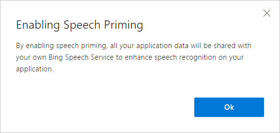
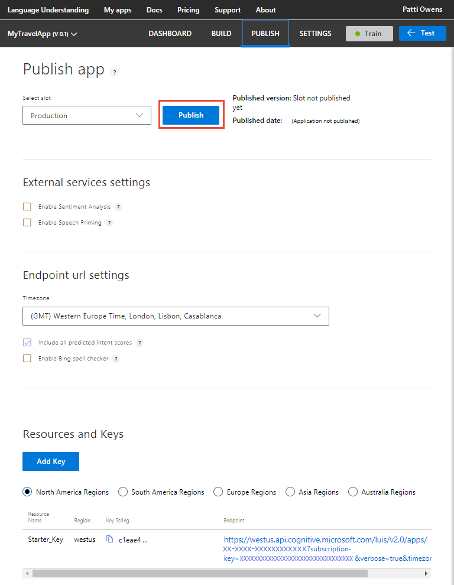
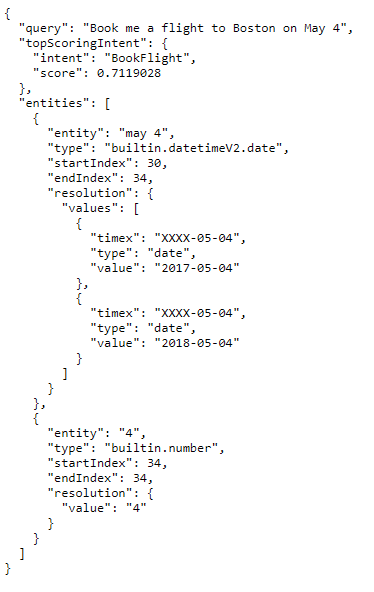

# Publish your trained app
When you finish building and testing your LUIS app, publish it. After the app is published, the Publish page shows all associated HTTP [endpoints](luis-glossary.md#endpoint). These endpoints, per [region](luis-reference-regions.md) and per [key](luis-how-to-manage-keys.md), are then integrated into any client, chatbot, or backend application. 

You can always [test](luis-interactive-test.md) your app before publishing it. 

## Production and staging slots
You can publish your app to the **Staging slot** or the **Production Slot**. By using two publishing slots, this allows you to have two different versions with published endpoints or the same version on two different endpoints. 

<!-- TBD: what is the technical difference? log files, endpoint quota? -->

## Settings configuration requires publishing model
Publish to the endpoint after changes to the following settings. 

## External services settings
External service settings include **[Sentiment Analysis](#enable-sentiment-analysis)** and **[Speech Priming](#enable-speech-priming)**.

### Enable sentiment analysis
In the **External services settings**, the **Enable Sentiment Analysis** checkbox allows LUIS to integrate with [Text Analytics](https://azure.microsoft.com/services/cognitive-services/text-analytics/) to provide sentiment and key phrase analysis. You do not have to provide a Text Analytics key and there is no billing charge for this service to your Azure account. Once you check this setting, it is persistent. 

Sentiment data is a score between 1 and 0 indicating the positive (closer to 1) or negative (closer to 0) sentiment of the data.

For more information about the JSON endpoint response with sentiment analysis, see [Sentiment analysis](luis-concept-data-extraction.md#sentiment-analysis)

### Enable speech priming 
In the **External services settings**, the **Enable Speech Priming** checkbox allows you to have a single endpoint to get a spoken utterance from a chatbot or LUIS-calling application and receive a LUIS prediction response. The Speech priming uses the Cognitive service [Speech API](../Speech-Service/rest-apis.md). 



Once this feature is enabled, publish your app. When you publish your LUIS app, your app model is sent to your own Speech service to prime the Speech service. Your model information is **not** used outside of your own service. 

In order to complete the use of Speech priming, you need the following information to use in the [Speech SDK](../speech-service/speech-sdk-reference.md):
* A LUIS endpoint key.
* The LUIS app ID.
* An endpoint domain, referred to as "Hostname" in Speech SDK, such as "westus.api.cognitive.microsoft.com," where the first subdomain is the region where the app is published.

For more information, see the [Speech to Intent](http://aka.ms/speechsdk) sample.

When your LUIS app is deleted or the Speech service is deleted, your model data is removed. 

## Endpoint URL settings
Endpoint URL services settings include **[Timezone](#set-timezone-offset)** offset, **[all predicted intent scores](#include-all-predicted-intent-scores)**, and **[Bing spell checker](#enable-bing-spell-checker)**.

### Set Timezone offset 
Part of the slot choice is the time zone selection. This timezone setting allows LUIS to [alter](luis-concept-data-alteration.md#change-time-zone-of-prebuilt-datetimev2-entity) any prebuilt datetimeV2 time values during prediction so that the returned entity data is correct according to the selected time zone. 

### Include all predicted intent scores
The **Include all predicted intent scores** checkbox allows the endpoint query response to include the prediction score for each intent. 

This setting allows your chatbot or LUIS-calling application to make a programmatic decision based on the scores of the returned intents. Generally the top two intents are the most interesting. If the top score is the None intent, your chatbot can choose to ask a follow-up question that makes a definitive choice between the None intent and the other high-scoring intent. 

The intents and their scores are also included the endpoint logs. You can [export](luis-how-to-start-new-app.md#export-app) those logs and analyze the scores. 

```
{
  "query": "book a flight to Cairo",
  "topScoringIntent": {
    "intent": "None",
    "score": 0.5223427
  },
  "intents": [
    {
      "intent": "None",
      "score": 0.5223427
    },
    {
      "intent": "BookFlight",
      "score": 0.372391433
    }
  ],
  "entities": []
}
```

### Enable Bing spell checker 
In the **Endpoint url settings**, the **Enable Bing spell checker** checkbox allows LUIS to correct misspelled words before prediction. Create a **[Bing Spell Check key](https://azure.microsoft.com/try/cognitive-services/?api=spellcheck-api)**. Once the key is created, two querystring parameters are added to the endpoint URL on the publish page. 

Add the **spellCheck=true** querystring parameter and the **bing-spell-check-subscription-key={YOUR_BING_KEY_HERE}** . Replace the `{YOUR_BING_KEY_HERE}` with your Bing spell checker key.

```JSON
{
  "query": "Book a flite to London?",
  "alteredQuery": "Book a flight to London?",
  "topScoringIntent": {
    "intent": "BookFlight",
    "score": 0.780123
  },
  "entities": []
}
```

## Publish your trained app to an HTTP endpoint
Open your app by clicking its name on the **My Apps** page, and then click **Publish** in the top panel. 


 
When your app is successfully published, a green success notification appears at the top of the browser. 

* Choose whether to publish to **Production** or to **Staging** by selecting from the drop-down menu under **Select slot**. 

## Assign key

If you want to use a key other than the free Starter_Key shown, click the **Add Key** button. This action opens a dialog that allows you to select an existing endpoint key to assign to the app. For more information on how to create and add endpoint keys to your LUIS app, see [Manage your keys](luis-how-to-manage-keys.md).

To see endpoints and keys associated with other regions, use the radio buttons to switch regions. Each row in the **Resources and Keys** table lists Azure resources associated with your account and the endpoint keys associated with that resource.

## Endpoint URL construction
The endpoint URL corresponds to the Azure region associated with the endpoint key.

This table conveniently reflects your publishing configuration in the URL endpoint with route choices and query string values. If you are constructing your endpoint URLs for your LUIS-calling application, make sure these same routes and query string values are set for the endpoint used -- if you want them set.

The URL route is constructed with the region, and the app ID. If you are publishing in other regions or with other apps, the endpoint URL can be constructed by changing the region and app ID values. 

* Select the Production slot and the **Publish** button. When the publish succeeds, use the displayed endpoint URL to access your LUIS app. 

### Optional query string parameters
The following query string parameters can be used with the endpoint URL:

<!-- TBD: what about speech priming? -->

|Query string|Type|Example value|Purpose|
|--|--|--|--|
|verbose|boolean|true|Include [all intent scores](#include-all-predicted-intent-scores) for utterance|
|timezoneOffset|number (unit is minutes)|60|Set [timezone offset](luis-concept-data-alteration.md#change-time-zone-of-prebuilt-datetimev2-entity) for [datetimeV2 prebuilt entities](luis-reference-prebuilt-datetimev2.md)|
|spellCheck|boolean|true|[correct spelling](#enable-bing-spell-checker) of utterance -- used in conjunction with bing-spell-check-subscription-key query string parameter|
|bing-spell-check-subscription-key|subscription ID||used in conjunction with spellCheck query string parameter|
|staging|boolean|false|select staging or production endpoint|
|log|boolean|true|add query and results to log|


## Test your published endpoint in a browser
Test your published endpoint by selecting the URL in the **Endpoint** column. The default browser opens with the generated URL. Set the URL parameter "&q" to your test query. For example, append `&q=Book me a flight to Boston on May 4` to your URL, and then press Enter. The browser displays the JSON response of your HTTP endpoint. 



## Next steps

* See [Manage keys](./luis-how-to-manage-keys.md) to add keys to your LUIS app, and learn about how keys map to regions.
* See [Train and test your app](luis-interactive-test.md) for instructions on how to test your published app in the test console.
