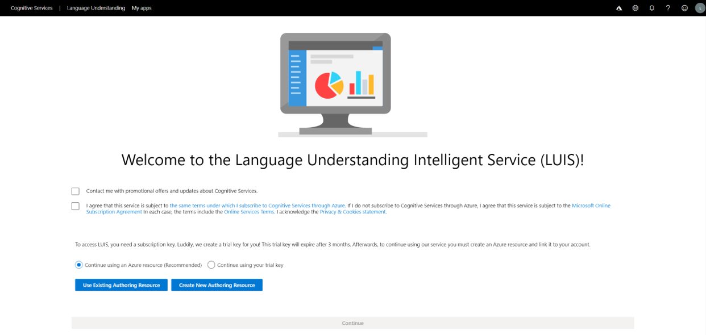
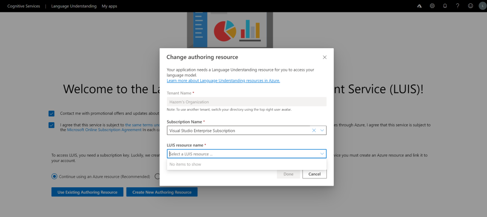
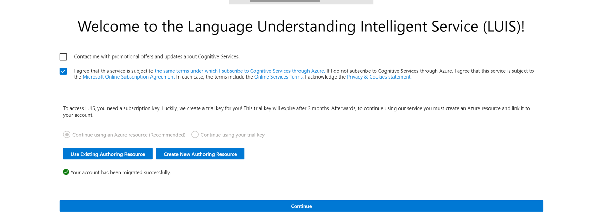
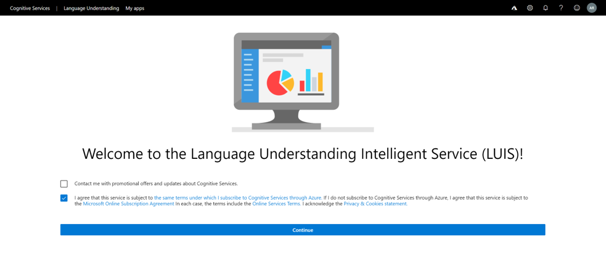

# Sign in to LUIS portal

If you are a new user signing up to LUIS, the signup experience will slightly differ due to:
  * Having your account is associated with an Azure subscription
  * Not having your account is  associated with an Azure subscription

## Associated with an Azure subscription

1. Sign in to [LUIS portal](https://www.luis.ai) and agree to the terms of use.

1. You will have two options signing up:
    * Continue using an Azure resource which is the recommended path and soon will be the only available path. This path allows you to link your LUIS account with an Azure Authoring resource while signing up either by choosing an existing resource in your subscription or creating a new resource. This is equivalent to signing up migrated without the need of undergoing the [migration process](https://docs.microsoft.com/azure/cognitive-services/luis/luis-migration-authoring#what-is-migration) later on. All users will be required to migrate by November 2nd 2020.
    * Continue using the starter or trial key. This path allows you to sign in to LUIS with the starter or the trial resource that is being provided without having to create any resources. If you choose this path, you will eventually be required to [migrate your account](https://docs.microsoft.com/azure/cognitive-services/luis/luis-migration-authoring#migration-steps) and link your applications to an authoring resource. That is why choosing the path where you continue with your Azure resource is recommended.

[Learn more about authoring and starter keys](https://docs.microsoft.com/azure/cognitive-services/luis/luis-how-to-azure-subscription#luis-resources). Note that both resources give you 1 million free authoring transactions and 1000 free prediction endpoint transactions.

    

1. Use an existing authoring resource

    

    If you already have LUIS Authoring resources in your subscription and you associate one with your LUIS account during sign up, choose the **Use existing Authoring Resource** option and provide the following information:

    * **Tenant** - the tenant your Azure subscription is associated with. You will not be able to switch tenants from the existing window. You can switch tenants by selecting the rightmost avatar, which contains your initials in the top bar.
    * **Subscription name** - the subscription that will be associated with the resource. If you have more than one subscription that belongs to your tenant, select the one you want from the drop-down list.
    * **Resource name** - The authoring resource you want you account to be associated to.

> [!Note]
> If the authoring resource that you are looking is greyed out in the dropdown list, this means that you have signed in to a different regional portal. [Understand the concept of regional portals](https://docs.microsoft.com/azure/cognitive-services/luis/luis-reference-regions#luis-authoring-regions).

1. Create a new authoring resource

    

    When **creating a new authoring resource**, provide the following information:

    * **Tenant** - the tenant your Azure subscription is associated with. You will not be able to switch tenants from the existing window. You can switch tenants by selecting the rightmost avatar, which contains your initials in the top bar.
    * **Resource name** - a custom name you choose, used as part of the URL for your authoring transactions. Note that your resource name can only include alphanumeric characters, '-', and can’t start or end with '-'. If any other symbols are included in the name, creating a resource will fail.
    * **Subscription name** - the subscription that will be associated with the resource. If you have more than one subscription that belongs to your tenant, select the one you want from the drop-down list.
    * **Resource group** - a custom resource group name you choose in your subscription. Resource groups allow you to group Azure resources for access and management. Please note that if you currently do not have a resource group in your subscription, you will not be allowed to create one in the LUIS portal. Go to [Azure portal](https://ms.portal.azure.com/#create/Microsoft.ResourceGroup) to create one then go to LUIS to continue the signup process.

1. After your choose your path, it may take a couple of seconds until a sign that says "Your account has been successfully migrated appears. Finish by selecting **Continue**.

    

> [!Note]
> If you have one subscription and one authoring resource in the region you are signing up to in the portal, you will automatically sign in to LUIS migrated and associated with this resource without the need of choosing which path to go in.

## Not associated with an Azure subscription

1. Sign in to [LUIS portal](https://www.luis.ai) and check that you agree to the terms of use.

1. Finish by selecting **Continue**. You will automatically sign in with a trial/starter key. This means that eventually you will eventually be required to [migrate your account](https://docs.microsoft.com/azure/cognitive-services/luis/luis-migration-authoring#migration-steps) and link your applications to an authoring resource. To undergo the migration process, you will need to sign up for an [Azure Free Trial](https://azure.microsoft.com/en-us/free/).

    

## Troubleshooting

* If you create an authoring resource from the Azure portal in a different region than the portal you are signing in to, the authoring resource will be greyed out.
* When creating a new resource, make sure that the resource name only includes alphanumeric characters, '-', and can’t start or end with '-'. Otherwise, it will fail.
* Make sure that you have the [proper permissions on your subscription to create an Azure resource](https://docs.microsoft.com/azure/role-based-access-control/rbac-and-directory-admin-roles#azure-roles). If you do not, please contact the admin of your subscription to give you suffecient permissions.

## Next steps

* Learn how to [start a new app](https://docs.microsoft.com/azure/cognitive-services/luis/luis-how-to-start-new-app)
