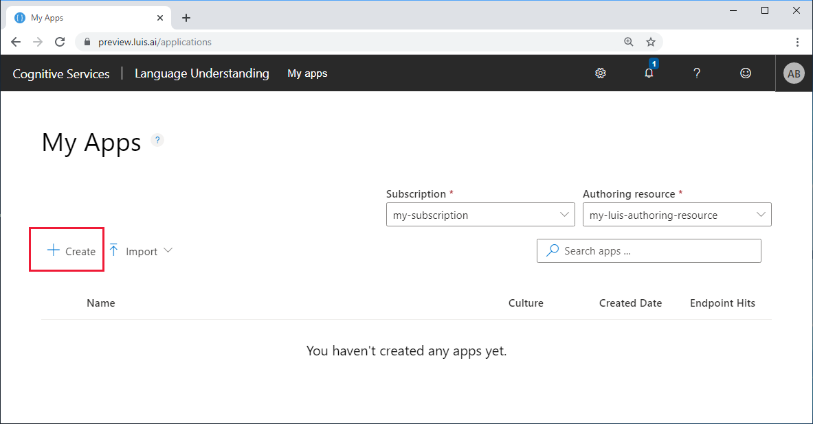
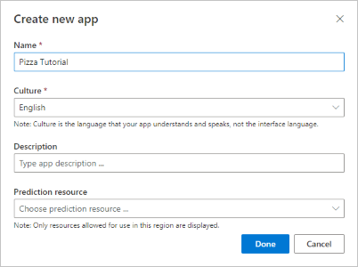
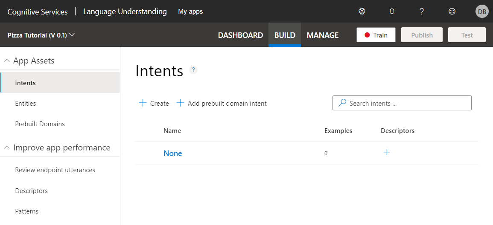

# Create a new LUIS app in the LUIS portal
There are a couple of ways to create a LUIS app. You can create a LUIS app in the LUIS portal, or through the LUIS authoring [APIs](developer-reference-resource.md).

## Using the LUIS portal

You can create a new app in the portal in several ways:

* Start with an empty app and create intents, utterances, and entities.
* Start with an empty app and add a [prebuilt domain](luis-how-to-use-prebuilt-domains.md).
* Import a LUIS app from a `.lu` or `.json` file that already contains intents, utterances, and entities.

## Using the authoring APIs
You can create a new app with the authoring APIs in a couple of ways:

* [Add application](https://westeurope.dev.cognitive.microsoft.com/docs/services/luis-programmatic-apis-v3-0-preview/operations/5890b47c39e2bb052c5b9c2f) - start with an empty app and create intents, utterances, and entities.
* [Add prebuilt application](https://westeurope.dev.cognitive.microsoft.com/docs/services/luis-programmatic-apis-v3-0-preview/operations/59104e515aca2f0b48c76be5) - start with a prebuilt domain, including intents, utterances, and entities.

[!INCLUDE [Sign in to LUIS](./includes/sign-in-process.md)]

## Create new app in LUIS

1. On **My Apps** page, select your **Subscription**, and  **Authoring resource** then **+ Create**. If you are using free trial key, learn how to [create an authoring resource](luis-how-to-azure-subscription.md#create-resources-in-the-azure-portal).

> [!div class="mx-imgBorder"]
> 

1. In the dialog box, enter the name of your application, such as `Pizza Tutorial`.

    

1. Choose your application culture, and then select **Done**. The description and prediction resource are optional at this point. You can set then at any time in the **Manage** section of the portal.

    > [!NOTE]
    > The culture cannot be changed once the application is created.

    After the app is created, the LUIS portal shows the **Intents** list with the `None` intent already created for you. You now have an empty app.

    > [!div class="mx-imgBorder"]
    > 

## Other actions available on My Apps page

The context toolbar provides other actions:

* Rename app
* Import from file using `.lu` or `.json`
* Export app as `.lu` (for [LUDown](https://github.com/microsoft/botbuilder-tools/tree/master/packages/Ludown)), `.json`, or `.zip` (for [LUIS container](luis-container-howto.md))
* Import container endpoint logs, to review endpoint utterances
* Export endpoint logs, as a `.csv`, for offline analysis
* Delete app

## Next steps

If your app design includes intent detection, [create new intents](luis-how-to-add-intents.md), and add example utterances. If your app design is only data extraction, add example utterances to the None intent, then [create entities](luis-how-to-add-example-utterances.md), and label the example utterances with those entities.
