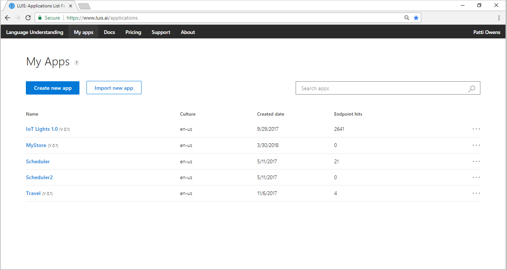
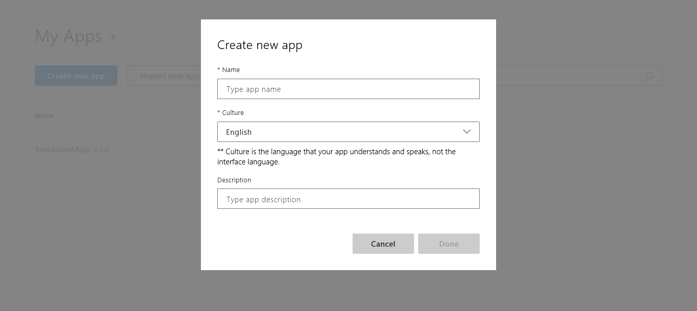
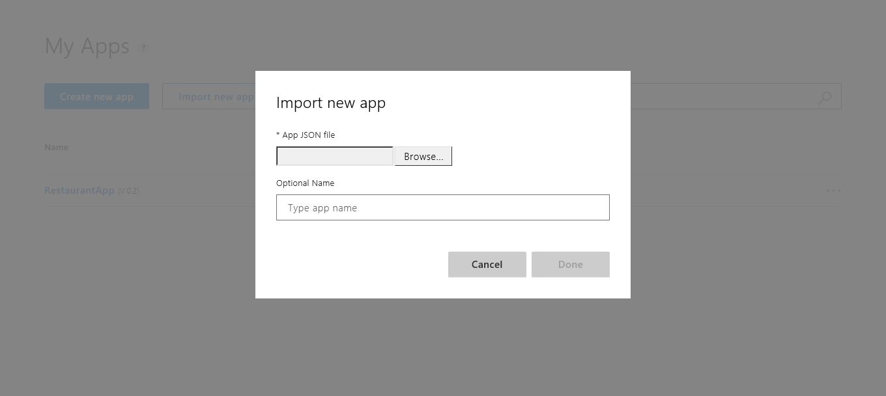

# Create an app
There are a couple of ways to create a LUIS app. You can create a LUIS app in the [LUIS](https://www.luis.ai) portal, or through the LUIS authoring [APIs](https://westus.dev.cognitive.microsoft.com/docs/services/5890b47c39e2bb17b84a55ff/operations/5890b47c39e2bb052c5b9c2f).

## Using the LUIS portal
You can create a new app in the LUIS portal in several ways:

* Start with an empty app and create intents, utterances, and entities.
* Start with an empty app and add a [prebuilt domain](luis-how-to-use-prebuilt-domains.md).
* Import a LUIS app from a JSON file that already contains intents, utterances, and entities.

## Using the authoring APIs
You can create a new app with the authoring APIs in a couple of ways:

* [Start](https://westus.dev.cognitive.microsoft.com/docs/services/5890b47c39e2bb17b84a55ff/operations/5890b47c39e2bb052c5b9c2f) with an empty app and create intents, utterances, and entities.
* [Start](https://westus.dev.cognitive.microsoft.com/docs/services/5890b47c39e2bb17b84a55ff/operations/59104e515aca2f0b48c76be5) with a prebuilt domain.  


<a name="export-app"></a>
<a name="import-new-app"></a>
<a name="delete-app"></a>
 

## Create new app in LUIS

1. On **My Apps** page, select **Create new app**.

    


2. In the dialog box, name your application "TravelAgent".

    

3. Choose your application culture (for TravelAgent app, choose English), and then select **Done**. 

    > [!NOTE]
    > The culture cannot be changed once the application is created. 

    

<!--

## Import new app
You can set the name (50 char max), version (10 char max), and description of an app in the JSON file. Examples of application JSON files are available at [LUIS-Samples](https://github.com/Microsoft/LUIS-Samples/tree/master/documentation-samples/Examples-BookFlight).

1. On **My Apps** page, select **Import new app**.
2. In the **Import new app** dialog, select the JSON file defining the LUIS app.

    

## Export app
1. On **My Apps** page, select the ellipsis (***...***) at the end of the app row.

    [](media/luis-create-new-app/three-dots.png#lightbox)

2. Select **Export app** from the menu. 

## Rename app

1. On **My Apps** page, select the ellipsis (***...***) at the end of the app row. 
2. Select **Rename** from the menu.
3. Enter the new name of the app and select **Done**.

## Delete app

> [!CAUTION]
> You are deleting the app for all collaborators and the owner. [Export](#export-app) the app before deleting it. 

1. On **My Apps** page, select the ellipsis (***...***) at the end of the app row. 
2. Select **Delete** from the menu.
3. Select **Ok** in the confirmation window.

## Export endpoint logs
The logs contain the Query, UTC time, and LUIS JSON response.

1. On **My Apps** page, select the ellipsis (***...***) at the end of the app row. 
2. Select **Export endpoint logs** from the menu.

```
Query,UTC DateTime,Response
text i'm driving and will be 30 minutes late to the meeting,02/13/2018 15:18:43,"{""query"":""text I'm driving and will be 30 minutes late to the meeting"",""intents"":[{""intent"":""None"",""score"":0.111048922},{""intent"":""SendMessage"",""score"":0.987501}],""entities"":[{""entity"":""i ' m driving and will be 30 minutes late to the meeting"",""type"":""Message"",""startIndex"":5,""endIndex"":58,""score"":0.162995353}]}"
```
-->
## Next steps

Your first task in the app is to [add intents](luis-how-to-add-intents.md).