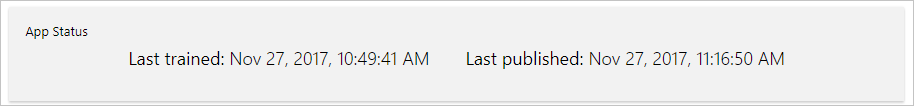
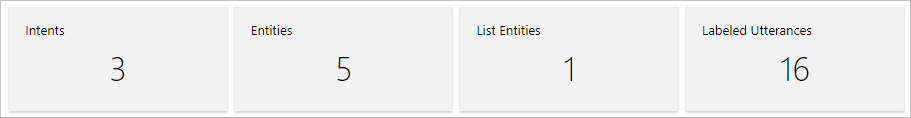
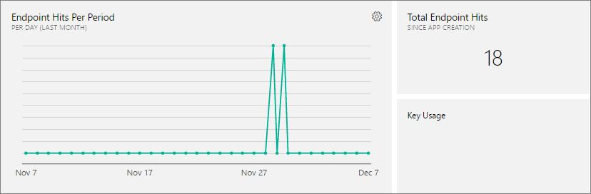
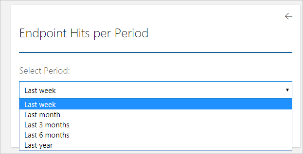
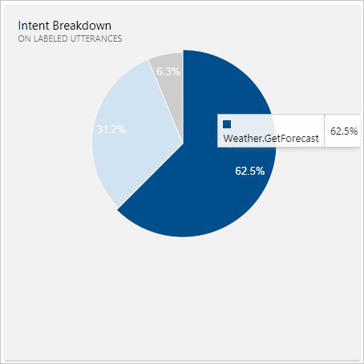
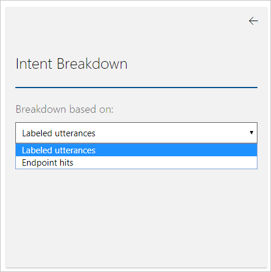
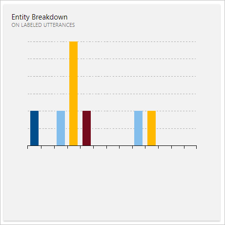

# Application Dashboard
The app dashboard enables you to monitor your app at a single glance. The **Dashboard** displays when you open an app by clicking the application name on **My Apps** page then select **Dashboard** from top panel. 

> [!CAUTION]
> If you want the most up-to-date metrics for LUIS, you need to:
> * Use a LUIS [endpoint key](luis-how-to-azure-subscription.md) created in Azure
> * Use LUIS endpoint key for all endpoint requests including LUIS [API](https://aka.ms/luis-endpoint-apis) and bot
> * Use different endpoint key for each LUIS app. Do not use a single endpoint key for all apps. The endpoint key is tracked at the key level, not at the app level.  

The **Dashboard** page gives you an overview of the LUIS app including the current model state as well as [endpoint](luis-glossary.md#endpoint) usage over time. <!--The following image shows the **Dashboard** page.-->

<!-- TBD: Get a working screen shot

-->

<!-- TBD: IS THIS STILL TRUE?
At the top of the **Dashboard** page, a contextual notification bar constantly displays notifications to update you on the required or recommended actions appropriate for the current state of your app. It also provides useful tips and alerts as needed. A detailed description of the data reported on the **Dashboard** page follows.
-->
  
## App status
The dashboard displays the application's training and publishing status, including the date and time when the app was last trained and published.  

## Model data statistics
The dashboard displays the total numbers of intents, entities, and labeled utterances existing in the app. 

## Endpoint hits
The dashboard displays the total endpoint hits that the LUIS app receives and enables you to display hits within a period that you specify. The total number of hits displayed is the sum of endpoint hits that use an [Endpoint key](./luis-concept-keys.md#endpoint-key) and endpoint hits that use an [Authoring key](./luis-concept-keys.md#authoring-key).

<!-- TBD: this image is old but I don't have a new one based on usage -->

> [!NOTE] 
> The most current endpoint hit count is in the Azure portal on the LUIS service overview. 
 
### Total endpoint hits
The total number of endpoint hits received to your app since app creation up to the current date.

### Endpoint hits per period
The number of hits received within a past period, displayed per day. The points between the start and end dates represent the days falling in this period. Hover your mouse pointer over each point to see the hits count in each day within the period. 

To select a period to view on the chart:
 
1. Click **Additional Settings**  to access the periods list. You can select periods ranging from one week up to one year. 

    

2. Select a period from the list and then click the back arrow  to display the chart.

### Key usage
The number of hits consumed from the application's endpoint key. For more information about endpoint keys, see [Keys in LUIS](luis-concept-keys.md). 
  
## Intent breakdown
The **Intent Breakdown** displays a breakdown of intents based on labeled utterances or endpoint hits. This summary graph shows the relative importance of each intent in the app. When you hover your mouse pointer over a slice, you see the intent name and the percentage it represents of the total count of labeled utterances/endpoint hits. 

To control whether the breakdown is based on labeled utterances or endpoint hits:

1. Click **Additional Settings**  to access the list as in the following image:

    
2. Select a value from the list and then click the back arrow  to display the chart.

## Entity breakdown
The dashboard displays a breakdown of entities based on labeled utterances or endpoint hits. This summary graph shows the relative importance of each entity in the app. When you hover your mouse pointer over a slice, you see the entity name and the percentage in labeled utterances/endpoint hits. 

To control whether the breakdown is based on labeled utterances or endpoint hits:

1. Click **Additional Settings**  to access the list as in the following image:

    
2. Select a value from the list and then click the back arrow  to display the chart accordingly.
