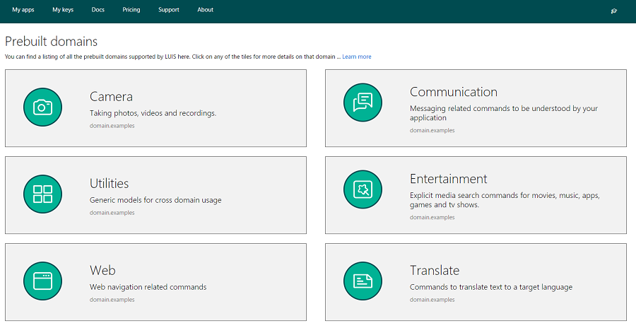
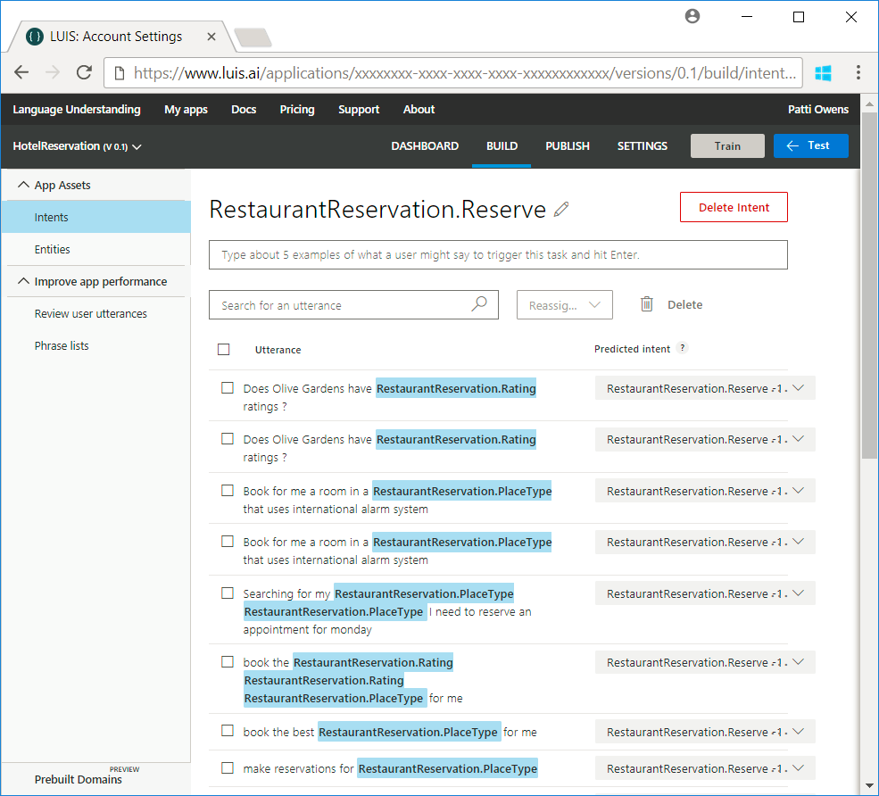

# Use prebuilt domains in LUIS apps  

Language Understanding (LUIS) provides *prebuilt domains*, which are prebuilt sets of [intents](luis-how-to-add-intents.md) and [entities](luis-concept-entity-types.md) that work together for domains or common categories of client applications. 
The prebuilt domains have been pre-trained and are ready for you to add to your LUIS app. The intents and entities in a prebuilt domain are fully customizable once you've added them to your app - you can train them with utterances from your system so they work for your users. You can use an entire prebuilt domain as a starting point for customization, or just borrow a few intents or entities from a prebuilt domain. 

Browse the **Prebuilt domains** tab to see other prebuilt domains you can use in your app. Click on the tile for a domain to add it to your app, or click on **Learn more** in its tile to learn about its intents and entities.

> [!TIP]
> You can find a full listing of the prebuilt domains in the [Prebuilt domains reference](./luis-reference-prebuilt-domains.md).

## Add a prebuilt domain
In the **Prebuilt domains** tab, find the RestaurantReservation domain and click **Add domain**. Once the prebuilt domain has been added to your LUIS app, open **Intents** and click on the RestaurantReservation.Reserve intent. You can see that many example utterances have already been provided and labeled with entities.

## Designing LUIS apps from prebuilt domains
When using prebuilt domains in your LUIS app, you can customize an entire prebuilt domain, or just start with a few of its intents and entities.

## Customizing an entire prebuilt domain
Prebuilt domains are designed to be general. They contain many intents and entities, that you can choose from to customize an app to your needs. If you start from customizing an entire prebuilt domain, delete the intents and entities that your app doesn't need to use. You can also add some intents or entities to the set that the prebuilt domain already provides. For example, if you are using the **Events** prebuilt domain for a sports event app, you can to add entities for sports teams. When you start [providing utterances](luis-how-to-add-example-utterances.md) to LUIS, include terms that are specific to your app. LUIS learns to recognize them and tailors the prebuilt domain's intents and entities to your app's needs. 

> [!TIP]
> The intents and entities in a prebuilt domain work best together. It's better to combine intents and entities from the same domain when possible.
> * A best practice is to use related intents from the same domain. For example, if you are customizing the `MakeReservation` intent in the **Places** domain, then select the `Cancel` intent from the **Places** domain instead of the Cancel intent in the **Events** or **Utilities** domains.

## Changing the behavior of a prebuilt domain intent
You might find that a prebuilt domain contains an intent that is similar to an intent you want to have in your LUIS app but you want it to behave differently. For example, the **Places** prebuilt domain provides an `MakeReservation` intent for making a restaurant reservation, but you want your app to use that intent to make hotel reservations. In that case, you can modify the behavior of that intent by providing utterances to LUIS about making hotel reservations and labeling them using the `MakeReservation` intent, so then LUIS can be retrained to recognize the `MakeReservation` intent in a request to book a hotel.

> [!TIP]
> Check out the Utilities domain for prebuilt intents that you can customize for use in any domain. 
> For example, you can add `Utilities.Repeat` to your app and train it recognize whatever actions user might want to repeat in your application.

## Next step

Customize a prebuilt domain by adding more example utterances to it.

> [!div class="nextstepaction"]
> [Add example utterances](./luis-how-to-add-example-utterances.md)

## Additional resources

See the [Prebuilt domains reference](./luis-reference-prebuilt-domains.md) for more detail on the prebuilt domains.
