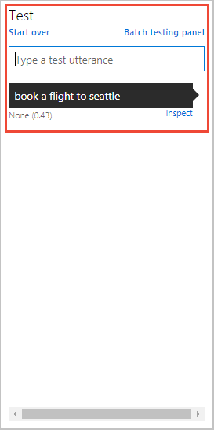
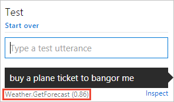
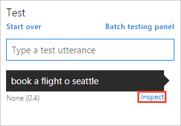
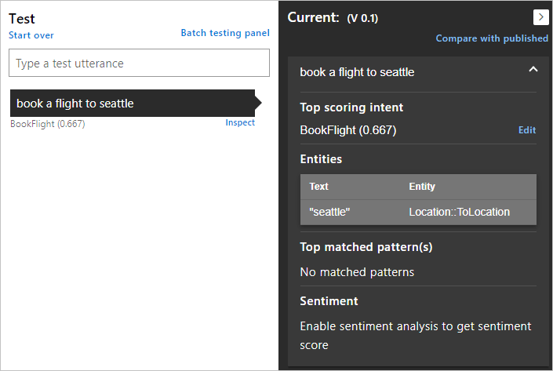
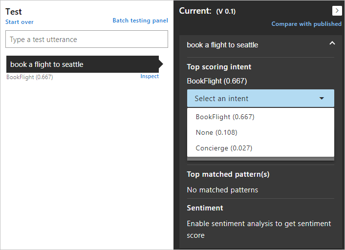
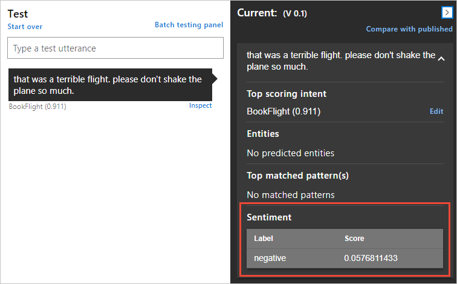
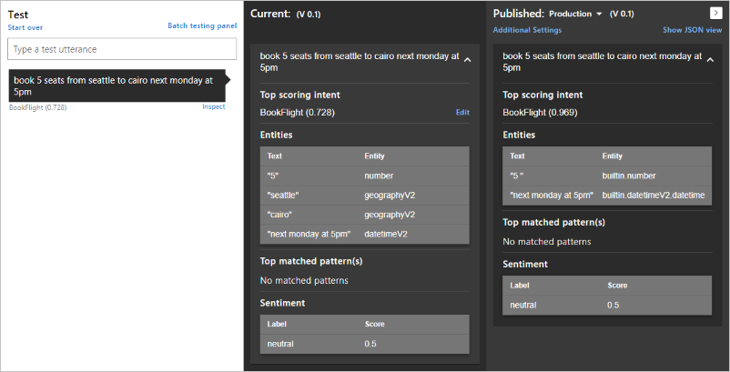
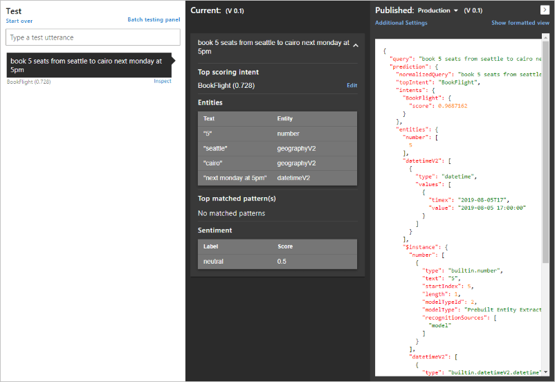
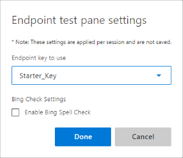
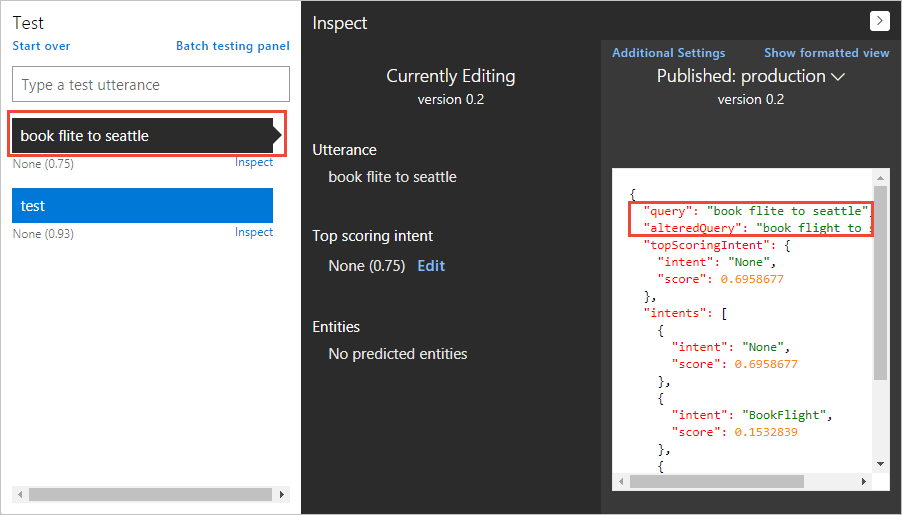

# Test your LUIS app

[Testing](luis-concept-test.md) an app is an iterative process. After training your LUIS app, test it with sample utterances to see if the intents and entities are recognized correctly. If they're not, make updates to the LUIS app, train, and test again. 

<!-- anchors for H2 name changes -->

## Test an utterance

1. Access your app by selecting its name on the **My Apps** page. 

2. To access the **Test** slide-out panel, select **Test** in your application's top panel.

    

3. Enter an utterance in the text box and select Enter. You can type as many test utterances as you want in the **Test**, but only one utterance at a time.

4. The utterance, its top intent, and score are added to the list of utterances under the text box.

    

## Clear test panel
To clear all the entered test utterances and their results from the test console, select **Start over** at the upper-left corner of the **Test panel**. 

## Close test panel
To close the **Test** panel, select the **Test** button again.

## Inspect score
You inspect details of the test result in the **Inspect** panel. 
 
1. With the **Test** slide-out panel open, select **Inspect** for an utterance you want to compare. 

    

2. The **Inspection** panel appears. The panel includes the top scoring intent as well as any identified entities. The panel shows the result of the selected utterance.

    

## Correct top scoring intent

1. If the top scoring intent is incorrect, select the **Edit** button.

2.  In the drop-down list, select the correct intent for the utterance.

    

## View sentiment results

If **Sentiment analysis** is configured on the **[Publish](luis-how-to-publish-app.md#enable-sentiment-analysis)** page, the test results include the sentiment found in the utterance. 

## Correct matched pattern's intent
If you are using [Patterns](luis-concept-patterns.md) and the utterance matched a pattern, but the wrong intent was predicted, select the **Edit** link by the pattern, then select the correct intent.

## Compare with published version
You can test the active version of your app with the published [endpoint](luis-glossary.md#endpoint) version. In the **Inspect** panel, select **Compare with published**. Any testing against the published model is deducted from your Azure subscription quota balance. 

## View endpoint JSON in test panel
You can view the endpoint JSON returned for the comparison by selecting the **Show JSON view**.

<!--Service name is 'Bing Spell Check v7 API' in the portal-->
## Additional settings in test panel

### LUIS endpoint
If you have several LUIS endpoints, use the **Additional Settings** link on the Test's Published pane to change the endpoint used for testing. If you are not sure which endpoint to use, select the default **Starter_Key**. 

### View Bing Spell Check corrections in test panel
Requirements to view the spelling corrections: 

* Published app
* Bing Spell Check [service key](https://azure.microsoft.com/try/cognitive-services/?api=spellcheck-api). The service key is not stored and needs to be reset for each browser session. 

Use the following procedure to include the [Bing Spell Check v7](https://azure.microsoft.com/services/cognitive-services/spell-check/) service  in the Test pane results. 

1. In the **Test** pane, enter an utterance. When the utterance is predicted, select **[Inspect](#inspect-score)** underneath the utterance you entered. 

2. When the **Inspect** panel opens, select **[Compare with Published](#compare-with-published-version)**. 

3. When the **Published** panel opens, select **[Additional Settings](#additional-settings-in-test-panel)**.

4. In the pop-up dialog, enter your **Bing Spell Check** service key. 
    

5. Enter a query with an incorrect spelling such as `book flite to seattle` and select enter. The incorrect spelling of the word `flite` is replaced in the query sent to LUIS and the resulting JSON shows both the original query, as `query`, and the corrected spelling in the query, as `alteredQuery`.

    

## Batch testing
See batch testing [concepts](luis-concept-batch-test.md) and learn [how to](luis-how-to-batch-test.md) test a batch of utterances.

## Next steps

If testing indicates that your LUIS app doesn't recognize the correct intents and entities, you can work to improve your LUIS app's accuracy by labeling more utterances or adding features. 

* [Label suggested utterances with LUIS](luis-how-to-review-endoint-utt.md) 
* [Use features to improve your LUIS app's performance](luis-how-to-add-features.md) 
