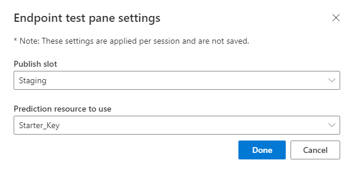

# Test your LUIS app in the LUIS portal

Testing is the process of providing sample utterances to LUIS and getting a response of LUIS-recognized intents and entities. You can test LUIS interactively, one utterance at a time, or provide a set of utterances. While testing, you can compare the current active model's prediction response to the published model's prediction response. 

Testing an app is an iterative process. After training your LUIS app, test it with sample utterances to see if the intents and entities are recognized correctly. If they're not, make updates to the LUIS app, train, and test again.

<!-- anchors for H2 name changes -->

## Interactive testing

Interactive testing is done from the **Test** panel of the LUIS portal. You can enter an utterance to see how intents and entities are identified and scored. If LUIS isn't predicting the intents and entities as you expect on an utterance in the testing panel, copy it to the **Intent** page as a new utterance. Then label the parts of that utterance for entities, and train LUIS. 

See [batch testing](./luis-how-to-batch-test.md) if you are testing more than one utterance at a time, and the [Prediction scores](luis-concept-prediction-score.md) article to learn more about prediction scores.

You can test using the [endpoint](luis-glossary.md#endpoint) with a maximum of two versions of your app. With your main or live version of your app set as the **production** endpoint, add a second version to the **staging** endpoint. This approach gives you three versions of an utterance: the current model in the Test pane of the [LUIS](luis-reference-regions.md) portal, and the two versions at the two different endpoints. 

All endpoint testing counts toward your usage quota. 

## Logging

LUIS stores all logged utterances in the query log, available for download on the LUIS portal from the **Apps** list page, as well as the LUIS [authoring APIs](https://go.microsoft.com/fwlink/?linkid=2092087). 

If you test against an endpoint, and do not want the utterance logged, remember to use the `logging=false` query string configuration.

Any utterances LUIS is unsure of are listed in the **[Review endpoint utterances](luis-how-to-review-endpoint-utterances.md)** page of the [LUIS](luis-reference-regions.md) portal.  

## Test an utterance

> [!NOTE]
> Remember to [train](luis-how-to-train.md) LUIS after you make changes to the model. Changes to the LUIS app are not seen in testing until the app is trained.
> 1. Sign in to the LUIS portal, and select your subscription and authoring resource to see the apps assigned to that authoring resource.
> 2. Open your app by selecting its name on My Apps page.
> 3. In order to test against the most recent version of the active app, select Train from the top menu, before testing.

The test utterance should not be exactly the same as any example utterances in the app. The test utterance should include word choice, phrase length, and entity usage you expect for a user.

1. Sign in to the [LUIS portal](https://www.luis.ai), and select your **Subscription** and **Authoring resource** to see the apps assigned to that authoring resource.
1. Open your app by selecting its name on **My Apps** page.

1. To access the **Test** slide-out panel, select **Test** in your application's top panel.

    > [!div class="mx-imgBorder"]
    > 

1. Enter an utterance in the text box and select Enter. You can type as many test utterances as you want in the **Test**, but only one utterance at a time.

1. The utterance, its top intent, and score are added to the list of utterances under the text box.

    > [!div class="mx-imgBorder"]
    > 

## Inspect the prediction

You inspect details of the test result in the **Inspect** panel.

1. With the **Test** slide-out panel open, select **Inspect** for an utterance you want to compare.

    > [!div class="mx-imgBorder"]
    > 

1. The **Inspection** panel appears. The panel includes the top scoring intent as well as any identified entities. The panel shows the prediction of the selected utterance.

    > [!div class="mx-imgBorder"]
    > 

## Add to example utterances

From the inspection panel, you can add the test utterance to an intent by selecting **Add to example utterances**.

## Disable required features

This toggle helps you determine if the trained app is correctly predicting your entities based on required features. The default setting is to apply the feature as required during prediction. Select this toggle to see what the prediction would be if the subentity’s feature was not required.

### When to disable required features

The trained app may mispredict a machine-learned entity based on one of the following:
* Incorrect labeling of example utterances.
* The required feature doesn't match the text.

An example is a machine-learned entity with a subentity of a person's name.

:::image type="content" source="media/luis-how-to-interactive-test/disable-required-feature.png" alt-text="Screenshot of LUIS portal machine-learned entity schema with required feature":::

An example utterance for this machine-learned entity is: `Assign Bob Jones to work on the new security feature`.

The extraction should be `security feature` as the ticket description and `Bob Jones` as the engineer, two subentities of `Assign ticket` entity.

In order to help the subentity successfully predict, add the prebuilt entity [PersonName](luis-reference-prebuilt-person.md) aa a feature to the `engineer` subentity. If you make the feature required, that means the subentity will only be extracted if the PersonName prebuilt entity is predicted for the text. This means that any name in the text that doesn't predict with PersonName subentity, will not be returned as a labeled subentity, `engineer`.

When you use the interactive test pane, and see a subentity, with a required feature, isn't predicting, toggle this setting, to see if the subentity would be predicted without the feature being required. The subentity may be able to be correctly predicted without the feature as required due to correct labeling of example utterances.

## View sentiment results

If **Sentiment analysis** is configured on the **[Publish](luis-how-to-publish-app.md#enable-sentiment-analysis)** page, the test results include the sentiment found in the utterance.

## Correct matched pattern's intent

If you are using [Patterns](luis-concept-patterns.md) and the utterance matched a pattern, but the wrong intent was predicted, select the **Edit** link by the pattern, then select the correct intent.

## Compare with published version

You can test the active version of your app with the published [endpoint](luis-glossary.md#endpoint) version. In the **Inspect** panel, select **Compare with published**. Any testing against the published model is deducted from your Azure subscription quota balance.

> [!div class="mx-imgBorder"]
> 

## View endpoint JSON in test panel
You can view the endpoint JSON returned for the comparison by selecting the **Show JSON view**.

> [!div class="mx-imgBorder"]
> 

## Additional settings in test panel

### LUIS endpoint

If you have several LUIS endpoints, use the **Additional Settings** link on the Test's Published pane to change the endpoint used for testing. If you are not sure which endpoint to use, select the default **Starter_Key**.

> [!div class="mx-imgBorder"]
> 

## Batch testing
See batch testing [concepts](./luis-how-to-batch-test.md) and learn [how to](luis-how-to-batch-test.md) test a batch of utterances.

## Next steps

If testing indicates that your LUIS app doesn't recognize the correct intents and entities, you can work to improve your LUIS app's accuracy by labeling more utterances or adding features.

* [Label suggested utterances with LUIS](luis-how-to-review-endpoint-utterances.md)
* [Use features to improve your LUIS app's performance](luis-how-to-add-features.md)
* [best practices](luis-concept-best-practices.md)