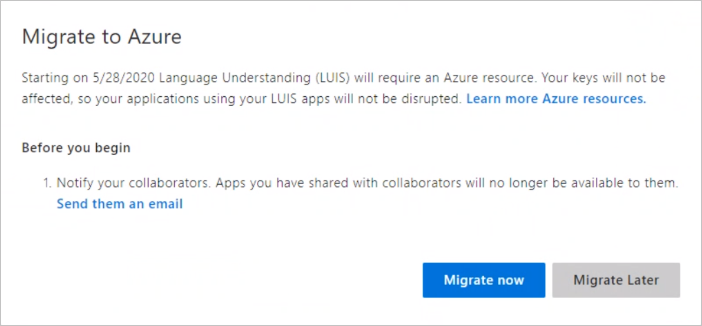
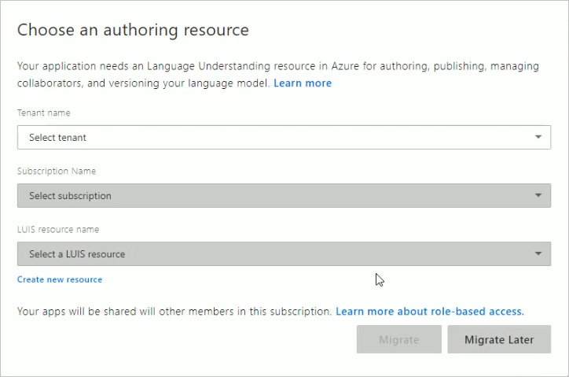

# Steps to migrate to the Azure authoring resource

From the Language Understanding (LUIS) portal, migrate all the apps you own to use the Azure authoring resource.

## Prerequisites

* **Optionally**, backup the apps from the LUIS portal's apps list by exporting each app or use the export [API](https://westus.dev.cognitive.microsoft.com/docs/services/5890b47c39e2bb17b84a55ff/operations/5890b47c39e2bb052c5b9c40).
* **Optionally**, save each app's collaborator's list. This email list is provided as part of the migration process.
* **Required**, you need to have an [Azure subscription](https://azure.microsoft.com/free/). A part of the subscription process does require billing information. However, you can use Free (F0) pricing tiers when you use LUIS. You may eventually find you need a paid tier, as your usage increases. 

If you do not have an Azure subscription, [sign up](https://azure.microsoft.com/free/). 

## Access the migration process

On a weekly basis, you are prompted to migrate your apps. You can cancel this window without migrating. If you want to migrate before the next scheduled period, you can begin the migration process from the **Lock** icon on the top tool bar of the LUIS portal. 

## App owner begins the migration process

The migration process is available if you are the owner of any LUIS apps. 

1. 1. Sign in to [LUIS portal](https://www.luis.ai) and agree to the terms of use.
1. The migration pop-up window allows you to continue the migration or migrate later. Select **Migrate now**. If you choose to migrate later, you have 9 months to migrate to the new authoring key in Azure.

    

1. If any of your apps have collaborators, you are prompted to **send them an email** letting them know about the migration. This is an optional step. The default email application opens with a lightly formatted email. 

    

1. Choose to create a LUIS authoring resource by selecting **Start by creating an authoring resource to migrate your apps to**. 

    

1. In the next window, enter your resource key information. After you enter the information, select **Create resource**. 

    

    When **creating a new authoring resource**, provide the following information: 

    * **Resource name** - a custom name you choose, used as part of the URL for your authoring and prediction endpoint queries.
    * **Tenant** - the tenant your Azure subscription is associated with. 
    * **Subscription name** - the subscription that will be billed for the resource.
    * **Resource group** - a custom resource group name you choose or create. Resource groups allow you to group Azure resources for access and management. 
    * **Location** - the location choice is based on the **resource group** selection.
    * **Pricing tier** - the pricing tier determines the maximum transaction per second and month. 

1. When the authoring resource is created, the success message is shown. Select **Close** to close the pop-up window.

    

    The **My apps** list shows the apps migrated to the new authoring resource. 

    You don't need to know the authoring resource's key to continue editing your apps in the LUIS portal. If you plan to edit your apps programmatically, you need the authoring key values. These values are displayed on the **Manage -> Azure resources** page in the LUIS portal and are also available in the Azure portal on the resource's **Keys** page.  

## After the migration process, add contributors to your authoring resource

[!INCLUDE [Manage contributors for the Azure authoring resource for language understanding](./includes/manage-contributors-authoring-resource.md)]

Learn [how to add contributors](luis-how-to-collaborate.md). 

## Next steps

* Review [concepts](luis-concept-keys.md) about authoring and runtime keys
* Review [how to assign keys](luis-how-to-azure-subscription.md) and add [contributors](luis-how-to-collaborate.md)
