# Migrate to an Azure resource authoring key

Language Understanding (LUIS) authoring authentication changed from an email account to an Azure resource. Although it's not currently required, switching to an Azure resource will be enforced in the future.


## What is migration?

Migration is the process of changing authoring authentication from an email account to an Azure resource. Your account will be linked to an Azure subscription and an Azure authoring resource after you migrate. *All LUIS users (owners or collaborators) will eventually need to migrate.* 

Migration has to be done from the LUIS portal. If you create the authoring keys by using the LUIS CLI, for example, you'll need to complete the migration process in the LUIS portal. You can still have coauthors on your applications after migration, but these will be added on the Azure resource level instead of the application level.

> [!Note]
> Before migration, coauthors are known as _collaborators_ on the LUIS app level. After migration, the Azure role of _contributor_ is used for the same functionality on the Azure resource level.

## Note before you migrate

* Migration is a one-way process. You can't go back after you migrate.
* Applications will automatically migrate with you if you're the owner of the application.
* The owner can't choose a subset of apps to migrate, and the process isn't reversible.
* Applications will disappear from the collaborator's side after the owner migrates.
* Owners are prompted to send emails to collaborators to inform them of the migration.
* Applications will not migrate with you if you're a collaborator on the application.
* There is no way for an owner to know that collaborators have migrated.
* Migration does not automatically collect collaborators and move or add them to the Azure authoring resource. The app owner is the one who needs to complete this step after migration. This step requires [permissions to the Azure authoring resource](https://docs.microsoft.com/azure/cognitive-services/luis/luis-how-to-collaborate).
* After collaborators are assigned to the Azure resource, they need to migrate to access applications. Otherwise, they'll have no access to author the applications.
* A migrated user can't be added as a collaborator of the application.
* If you own prediction keys that are assigned to applications owned by another user, this will block migration for both the owner and collaborators. See the recommendations later in this article.

> [!Note]
> If you need to create a prediction runtime resource, there's [a separate process](luis-how-to-azure-subscription.md#create-resources-in-the-azure-portal) to create it.

## Migration prerequisites

* You need to be associated with a valid Azure subscription. Ask your tenant admin to add you on the subscription, or [sign up for a free one](https://azure.microsoft.com/free/).
* You need to create a LUIS Azure authoring resource from the LUIS portal or from the Azure portal. Creating an authoring resource from the LUIS portal is part of the migration flow that's discussed in the next section.
* If you're a collaborator on applications, the applications won't automatically migrate. We recommend that you back up these applications by exporting them or by using the [export API](https://westus.dev.cognitive.microsoft.com/docs/services/5890b47c39e2bb17b84a55ff/operations/5890b47c39e2bb052c5b9c40). You can import the app back into LUIS after migration. The import process creates a new app with a new app ID, for which you're the owner.
* If you're the owner of the application, you won't need to export your apps because they'll migrate automatically. We recommend that you save each app's collaborator list. An email template that has this list is provided optionally as part of the migration process.


|Portal|Purpose|
|--|--|
|[Azure](https://azure.microsoft.com/free/)| Create prediction and authoring resources.<br> Assign contributors on resources.|
|[LUIS](https://www.luis.ai)| Migrate to new authoring resources.<br> Create new authoring resources in the migration flow.<br> Assign or unassign prediction and authoring resources to apps from the **Manage** > **Azure resources** page. <br> Move applications from one authoring resource to another.  |

> [!Note]
> Authoring your LUIS app is free, as indicated by the F0 tier. Learn [more about pricing tiers](luis-limits.md#key-limits).


## Migration steps

1. In the LUIS portal that you're working on, you can begin the migration process from the **Azure** icon on the top toolbar.

   > [!div class="mx-imgBorder"]
   > 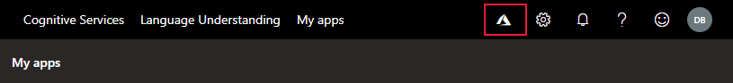

2. The migration pop-up window allows you to continue the migration or migrate later. Select **Migrate now**.

   > [!div class="mx-imgBorder"]
   > 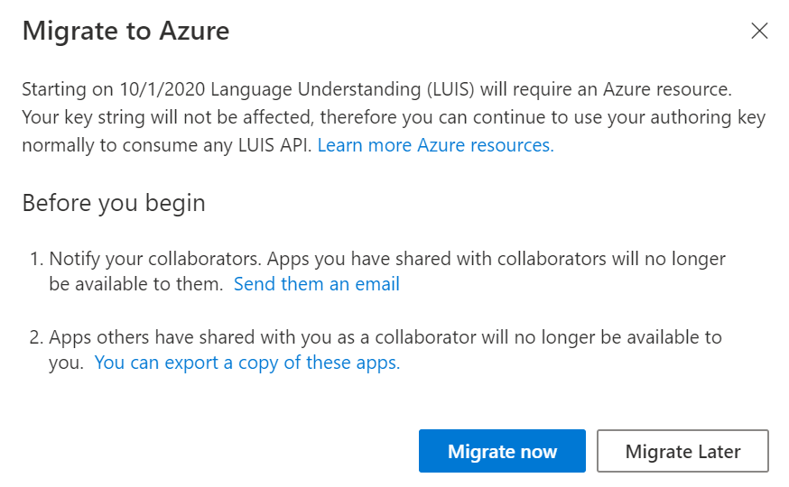

3. If any of your apps have collaborators, you're prompted to send them an email that lets them know about the migration. This is an optional step.

   For each collaborator and app, the default email application opens with a lightly formatted email. You can edit the email before sending it. The email template includes the exact app ID and app name.
   
   ```html
   Dear Sir/Madam,

   I will be migrating my LUIS account to Azure. Consequently, you will no longer have access to the following app:

   App Id: <app-ID-omitted>
   App name: Human Resources
      
   Thank you
   ```
   
   > [!Note]
   > After you migrate your account to Azure, your apps will no longer be available to collaborators.

4. If you're a collaborator on any application, you're prompted to export a copy of the apps by selecting this option during the migration flow. This is an optional step.

   If you select the option, the following page appears. Select the download buttons on the left to export the apps you want. You can import these apps back after you migrate, because they won't be automatically migrated with you.

   > [!div class="mx-imgBorder"]
   > 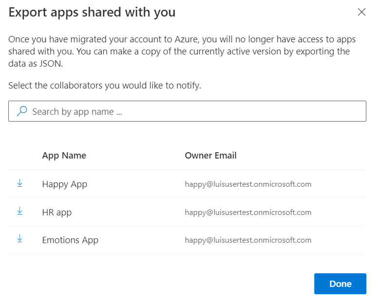

5. You can choose to create a new LUIS authoring resource or migrate to an existing authoring resource if you have already created one from Azure. Choose the option that you want by selecting one of the following buttons.

   > [!div class="mx-imgBorder"]
   > 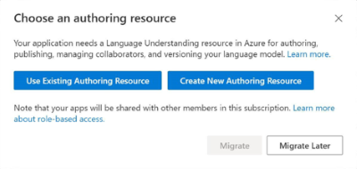

### Create new authoring resource from LUIS to migrate

If you want to create a new authoring resource, select **Create New Authoring Resource** and provide the following information in the next window. Then select **Done**.

> [!div class="mx-imgBorder"]
> 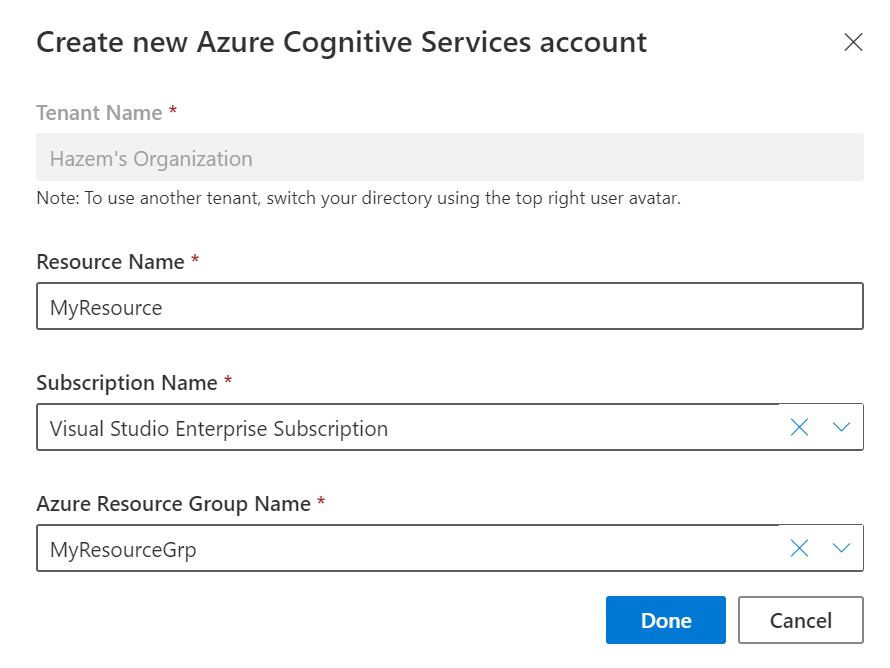

* **Tenant Name**: The tenant that your Azure subscription is associated with. This is set by default to the tenant you're currently using. You can switch tenants by selecting the rightmost avatar, which contains your initials.
* **Resource Name**: A custom name that you choose. It's used as part of the URL for your authoring and prediction endpoint queries.
* **Subscription Name**: The subscription that will be associated with the resource. If you have more than one subscription that belongs to your tenant, select the one you want from the drop-down list.
* **Azure Resource Group Name**: A custom resource group name that you choose from the drop-down list. Resource groups allow you to group Azure resources for access and management.

Note that you can have 10 free authoring resources per region, per subscription. If your subscription has more than 10 authoring resources in the same region, you won't be able to create a new one.

When the authoring resource is created, the success message is shown. Select **Close** to close the pop-up window.

  > [!div class="mx-imgBorder"]
  > 


### Use existing authoring resource to migrate

If your subscription is already associated with a LUIS authoring Azure resource, or if you've created a resource from the Azure portal and you want to migrate to it instead of creating a new one, select **Use Existing Authoring Resource**. Provide the following information in the next window, and then select **Done**.

> [!div class="mx-imgBorder"]
>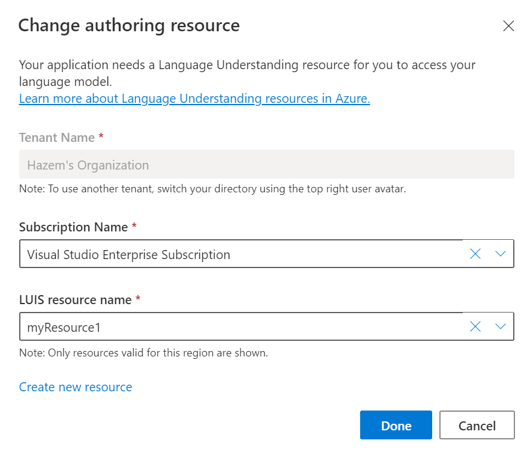

* **Tenant Name**: The tenant that your Azure subscription is associated with. This is set by default to the tenant you're currently using.
* **Subscription Name**: The subscription that will be associated with the resource. If you have more than one subscription that belongs to your tenant, select the one you want from the drop-down list.
* **Resource name**: The authoring resource that you want to migrate to.

> [!Note]
> If you can't see your authoring resource in the drop-down list, make sure that you created it in the proper location according to the LUIS portal where you're signed in. Also make sure that what you created is an authoring resource and not a prediction resource.


Validate your authoring resource name and select the **Migrate** button.

> [!div class="mx-imgBorder"]
> 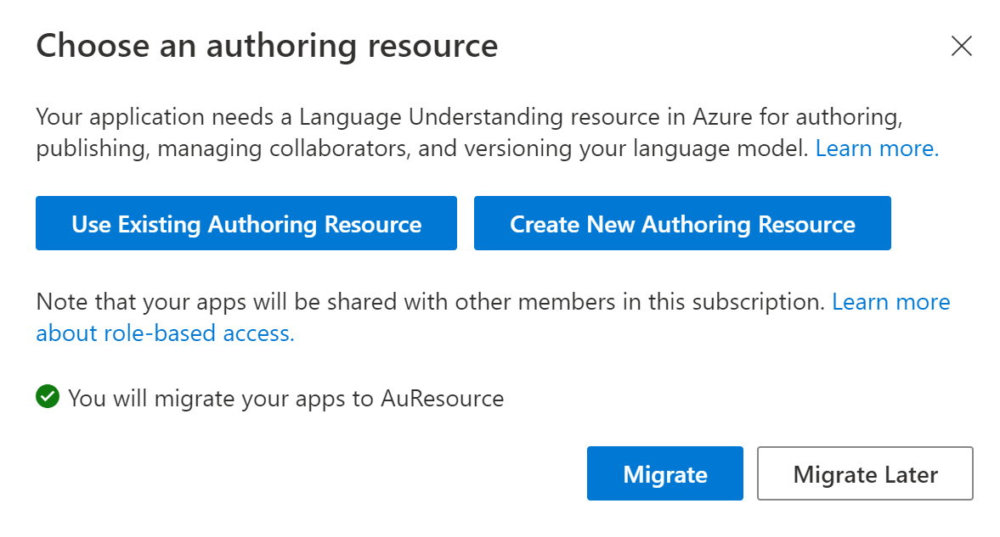

A success message appears. Select **Close** to close the pop-up window.

> [!div class="mx-imgBorder"]
> 

## Using apps after migration

After the migration process, all your LUIS apps for which you're the owner will now be assigned to a single LUIS authoring resource.

The **My Apps** list shows the apps migrated to the new authoring resource. Before you access your apps, select the subscription and LUIS authoring resource to see the apps that you can author.

 > [!div class="mx-imgBorder"]
 > 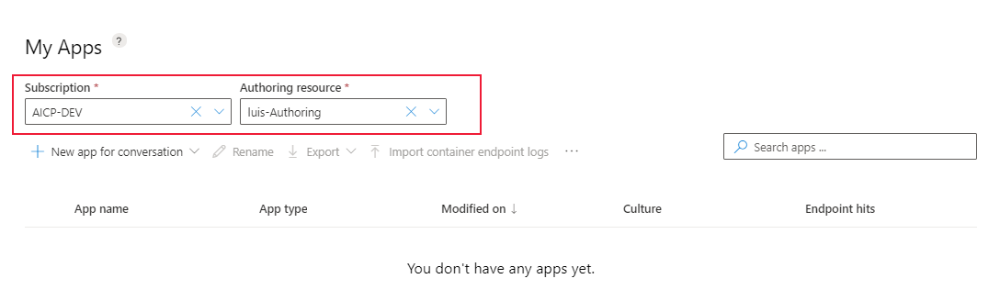

You don't need to know the authoring resource's key to continue editing your apps in the LUIS portal. 

If you plan to edit your apps programmatically, you'll need the authoring key values. These values are displayed on the **Manage** > **Azure Resources** page in the LUIS portal. They're also available in the Azure portal on the resource's **Keys** page. You can also create more authoring resources and assign them from the same page.

 > [!div class="mx-imgBorder"]
 > 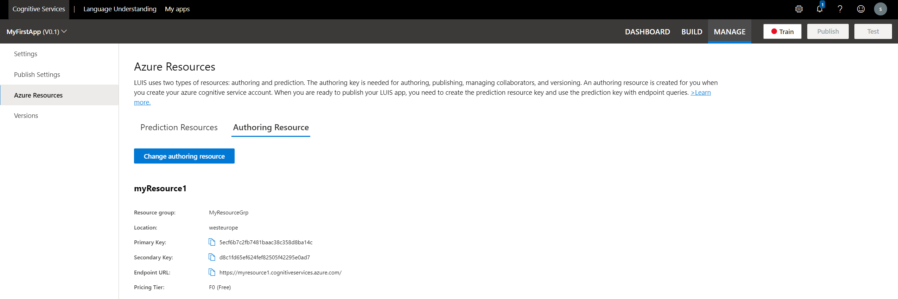

## Adding contributors to authoring resources

[!INCLUDE [Manage contributors for the Azure authoring resource for language understanding](./includes/manage-contributors-authoring-resource.md)]

Learn [how to add contributors](luis-how-to-collaborate.md) on your authoring resource. Contributors will have access to all applications under that resource.

You can add contributors to the authoring resource from the Azure portal, on the **Access Control (IAM)** page for that resource. For more information, see [Add contributor access](luis-migration-authoring-steps.md#after-the-migration-process-add-contributors-to-your-authoring-resource).

> [!Note]
> If the owner of the LUIS app migrated and added the collaborator as a contributor on the Azure resource, the collaborator will still have no access to the app unless they also migrate.

## LUIS portal migration reminders

The [LUIS portal](https://www.luis.ai) provides the migration process.

You'll be asked to migrate if both of these conditions are true:
* You have apps on the email authentication system for authoring.
* You're the app owner.

On a weekly basis, you're prompted to migrate your apps. You can close this window without migrating. If you want to migrate before the next scheduled period, you can begin the migration process from the **Azure** icon on the top toolbar of the LUIS portal.

## Prediction resources blocking migration
Your migration negatively affects any application's runtime. When you migrate, any collaborators are removed from your apps, and you're removed as a collaborator from other apps. This process means the keys that a collaborator assigns are also removed, which might break your application if it's in production. This is the reason we block the migration until you manually remove collaborators or keys assigned to them.

Migration is blocked if either of these conditions is true:

* You have assigned prediction/runtime resources in apps you don't own.
* You have other users assign prediction/runtime resources to apps you own.

### Recommended steps if you're the owner of the app
If you're an owner of some applications and you have collaborators assigned a prediction/runtime key to these applications, an error appears when you migrate. The error lists the application IDs that have prediction keys assigned to them owned by other users.

We recommend that you:
* Notify collaborators about the migration.
* Remove all collaborators from the applications shown in the error.
* Undergo the migration process, which should succeed if you manually remove collaborators.
* Assign collaborators as contributors to your new authoring resource. Collaborators will migrate and reassign the prediction resources back to the applications. Note that this will cause a break in the application temporarily until the prediction resources are reassigned.

There's another potential solution here. Before owner migration, collaborators can add app owners as contributors on their Azure subscriptions from the Azure portal. This step will grant the owner access to the runtime prediction resource. If the owner migrates by using the new subscription they've been added to (which will be found under a new tenant), this step will not just unblock the migration process for both collaborator and app owner. It will also allow for a smooth migration of apps, with the prediction key still assigned to them not breaking the apps.


### Recommended steps if you're a collaborator on an app
If you're collaborating on applications and you have assigned a prediction/runtime key to these applications, an error appears when you migrate. The error lists the application IDs and key paths that are blocking the migration.

We recommend that you:
* Export applications as a backup. This an optional step in the migration process.
* Unassign the prediction resources from the **Manage** > **Azure resources** page.
* Undergo the migration process.
* Import back applications after migration.
* Reassign prediction keys to your applications from the **Manage** > **Azure resources** page.

> [!Note]
> When you import back your applications after you migrate, they'll have different app IDs. They'll also be different from the ones being hit in production. You will now be the owner of these applications.

## Troubleshooting the migration process

When you try to migrate but can't find your Azure subscription in the drop-down list:
* Ensure that you have a valid Azure subscription that's authorized to create Cognitive Services resources. Go to the [Azure portal](https://ms.portal.azure.com) and check the status of the subscription. If you don't have one, [create a free trial](https://azure.microsoft.com/free/).
* Ensure that you're in the proper tenant associated with your valid subscription. You can switch tenants from the avatar to the left of your initials on this toolbar:
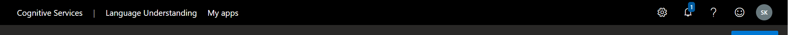

If you have an existing authoring resource but can't find it when you select the **Use Existing Authoring Resource** option:
* Your resource was probably created in a location that's different from the portal where you're signed in. Check the [LUIS authoring regions and portals](https://docs.microsoft.com/azure/cognitive-services/luis/luis-reference-regions#luis-authoring-regions).
* Create a new resource from the LUIS portal instead.

If you select the **Create New Authoring Resource** option and migration fails with the error message "Failed retrieving user's Azure information, retry again later":
* Your subscription might have 10 or more authoring resources per region, per subscription. If that's the case, you won't be able to create a new authoring resource.
* Migrate by selecting the **Use Existing Authoring Resource** option and selecting one of the existing resources under your subscription.

If you see the following error, check the [recommended steps if you're the owner of the app](#recommended-steps-if-youre-the-owner-of-the-app).
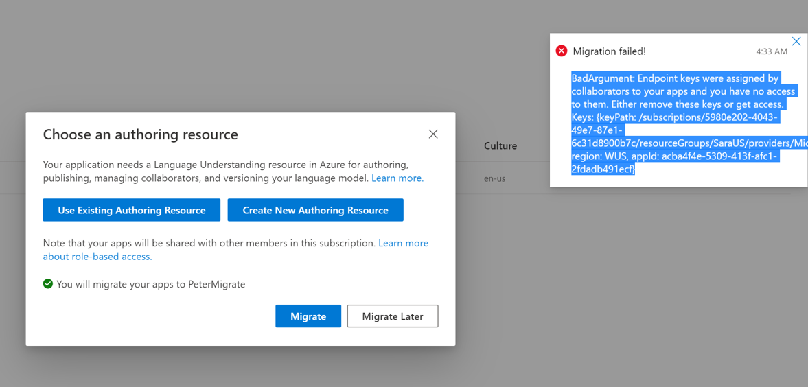

If you see the following error, check the [recommended steps if you're a collaborator on an app](#recommended-steps-if-youre-a-collaborator-on-an-app).


## Next steps

* Review [concepts about authoring and runtime keys](luis-concept-keys.md). 
* Review how to [assign keys](luis-how-to-azure-subscription.md) and [add contributors](luis-how-to-collaborate.md).
