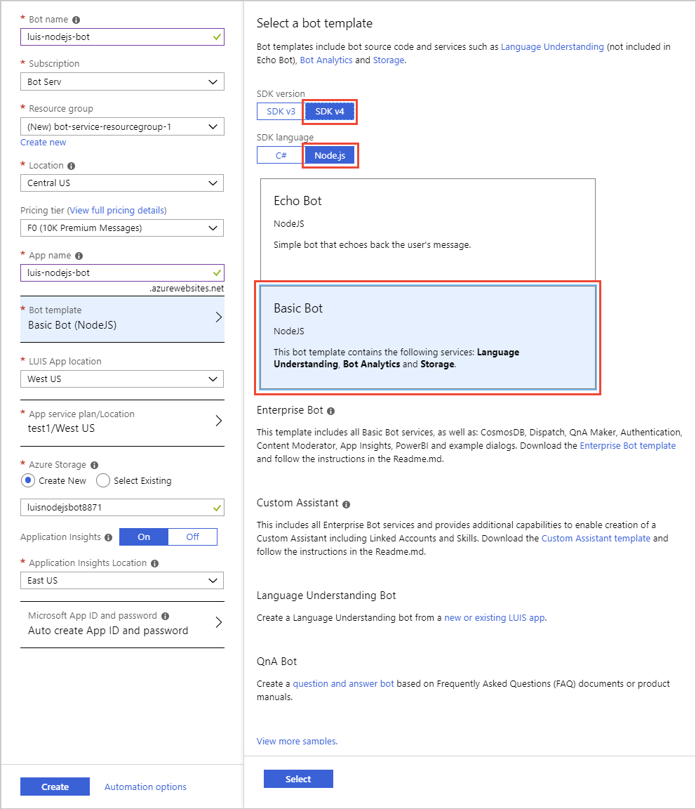

# Tutorial: Use a Web App Bot enabled with Language Understanding in Node.js 

Use Node.js to build a chat bot integrated with language understanding (LUIS). The bot is built with the Azure [Web app bot](https://docs.microsoft.com/azure/bot-service/) resource and [Bot Framework version](https://github.com/Microsoft/botbuilder-dotnet) V4.

**In this tutorial, you learn how to:**

> [!div class="checklist"]
> * Create a web app bot. This process creates a new LUIS app for you.
> * Download the bot project created by the Web bot service
> * Start bot & emulator locally on your computer
> * View utterance results in bot

## Prerequisites

* [Bot emulator](https://aka.ms/abs/build/emulatordownload)
* [Visual Studio Code](https://code.visualstudio.com/Download)


## Create a web app bot resource

1. In the [Azure portal](https://portal.azure.com), select **Create new resource**.

1. In the search box, search for and select **Web App Bot**. Select **Create**.

1. In **Bot Service**, provide the required information:

    |Setting|Purpose|Suggested setting|
    |--|--|--|
    |Bot name|Resource name|`luis-nodejs-bot-` + `<your-name>`, for example, `luis-nodejs-bot-johnsmith`|
    |Subscription|Subscription where to create bot.|Your primary subscription.
    |Resource group|Logical group of Azure resources|Create a new group to store all resources used with this bot, name the group `luis-nodejs-bot-resource-group`.|
    |Location|Azure region - this doesn't have to be the same as the LUIS authoring or publishing region.|`westus`|
    |Pricing tier|Used for service request limits and billing.|`F0` is the free tier.
    |App name|The name is used as the subdomain when your bot is deployed to the cloud (for example, humanresourcesbot.azurewebsites.net).|`luis-nodejs-bot-` + `<your-name>`, for example, `luis-nodejs-bot-johnsmith`|
    |Bot template|Bot framework settings - see next table|
    |LUIS App location|Must be the same as the LUIS resource region|`westus`|
    |App service plan/Location|Do not change from provided default value.|
    |Application Insights|Do not change from provided default value.|
    |Microsoft App ID and password|Do not change from provided default value.|

1. In the **Bot template**, select the following, then choose the **Select** button under these settings:

    |Setting|Purpose|Selection|
    |--|--|--|
    |SDK version|Bot framework version|**SDK v4**|
    |SDK language|Programming language of bot|**Node.js**|
    |Bot|Type of bot|**Basic bot**|
    
1. Select **Create**. This creates and deploys the bot service to Azure. Part of this process creates a LUIS app named `luis-nodejs-bot-XXXX`. This name is based on the /Azure Bot Service app name.

    [](./media/bfv4-nodejs/create-web-app-service.png#lightbox)

    Wait until the bot service is created before continuing.

## The bot has a Language Understanding model

The bot service creation process also creates a new LUIS app with intents and example utterances. The bot provides intent mapping to the new LUIS app for the following intents: 

|Basic bot LUIS intents|example utterance|
|--|--|
|Book flight|`Travel to Paris`|
|Cancel|`bye`|
|None|Anything outside the domain of the app.|

## Test the bot in Web Chat

1. While still in the Azure portal for the new bot, select **Test in Web Chat**. 
1. In the **Type your message** textbox, enter the text `hello`. The bot responds with information about the bot framework, as well as example queries for the specific LUIS model such as booking a flight to Paris. 

    

    You can use the test functionality for quickly testing your bot. For more complete testing, including debugging, download the bot code and use Visual Studio. 

## Download the web app bot source code
In order to develop the web app bot code, download the code and use on your local computer. 

1. In the Azure portal, select **Build** from the **Bot management** section. 

1. Select **Download Bot source code**. 

    [](../../../includes/media/cognitive-services-luis/bfv4/download-code.png#lightbox)

1. When the pop-up dialog asks **Include app settings in the downloaded zip file?**, select **Yes**.

1. When the source code is zipped, a message will provide a link to download the code. Select the link. 

1. Save the zip file to your local computer and extract the files. Open the project with Visual Studio. 

## Review code to send utterance to LUIS and get response

1. Open the **dialogs -> luisHelper.js** file. This is where the user utterance entered into the bot is sent to LUIS. The response from LUIS is returned from the method as a **bookDetails** JSON object. When you create your own bot, you should also create your own object to return the details from LUIS. 

    ```nodejs
    // Copyright (c) Microsoft Corporation. All rights reserved.
    // Licensed under the MIT License.
    
    const { LuisRecognizer } = require('botbuilder-ai');
    
    class LuisHelper {
        /**
         * Returns an object with preformatted LUIS results for the bot's dialogs to consume.
         * @param {*} logger
         * @param {TurnContext} context
         */
        static async executeLuisQuery(logger, context) {
            const bookingDetails = {};
    
            try {
                const recognizer = new LuisRecognizer({
                    applicationId: process.env.LuisAppId,
                    endpointKey: process.env.LuisAPIKey,
                    endpoint: `https://${ process.env.LuisAPIHostName }`
                }, {}, true);
    
                const recognizerResult = await recognizer.recognize(context);
    
                const intent = LuisRecognizer.topIntent(recognizerResult);
    
                bookingDetails.intent = intent;
    
                if (intent === 'Book_flight') {
                    // We need to get the result from the LUIS JSON which at every level returns an array
    
                    bookingDetails.destination = LuisHelper.parseCompositeEntity(recognizerResult, 'To', 'Airport');
                    bookingDetails.origin = LuisHelper.parseCompositeEntity(recognizerResult, 'From', 'Airport');
    
                    // This value will be a TIMEX. And we are only interested in a Date so grab the first result and drop the Time part.
                    // TIMEX is a format that represents DateTime expressions that include some ambiguity. e.g. missing a Year.
                    bookingDetails.travelDate = LuisHelper.parseDatetimeEntity(recognizerResult);
                }
            } catch (err) {
                logger.warn(`LUIS Exception: ${ err } Check your LUIS configuration`);
            }
            return bookingDetails;
        }
    
        static parseCompositeEntity(result, compositeName, entityName) {
            const compositeEntity = result.entities[compositeName];
            if (!compositeEntity || !compositeEntity[0]) return undefined;
    
            const entity = compositeEntity[0][entityName];
            if (!entity || !entity[0]) return undefined;
    
            const entityValue = entity[0][0];
            return entityValue;
        }
    
        static parseDatetimeEntity(result) {
            const datetimeEntity = result.entities['datetime'];
            if (!datetimeEntity || !datetimeEntity[0]) return undefined;
    
            const timex = datetimeEntity[0]['timex'];
            if (!timex || !timex[0]) return undefined;
    
            const datetime = timex[0].split('T')[0];
            return datetime;
        }
    }
    
    module.exports.LuisHelper = LuisHelper;
    ```

1. Open **dialogs -> bookingDialog.js** to understand how the BookingDetails object is used to manage the conversation flow. Travel details are asked in steps, then the entire booking is confirmed and finally repeated back to the user. 

    ```nodejs
    // Copyright (c) Microsoft Corporation. All rights reserved.
    // Licensed under the MIT License.
    
    const { TimexProperty } = require('@microsoft/recognizers-text-data-types-timex-expression');
    const { ConfirmPrompt, TextPrompt, WaterfallDialog } = require('botbuilder-dialogs');
    const { CancelAndHelpDialog } = require('./cancelAndHelpDialog');
    const { DateResolverDialog } = require('./dateResolverDialog');
    
    const CONFIRM_PROMPT = 'confirmPrompt';
    const DATE_RESOLVER_DIALOG = 'dateResolverDialog';
    const TEXT_PROMPT = 'textPrompt';
    const WATERFALL_DIALOG = 'waterfallDialog';
    
    class BookingDialog extends CancelAndHelpDialog {
        constructor(id) {
            super(id || 'bookingDialog');
    
            this.addDialog(new TextPrompt(TEXT_PROMPT))
                .addDialog(new ConfirmPrompt(CONFIRM_PROMPT))
                .addDialog(new DateResolverDialog(DATE_RESOLVER_DIALOG))
                .addDialog(new WaterfallDialog(WATERFALL_DIALOG, [
                    this.destinationStep.bind(this),
                    this.originStep.bind(this),
                    this.travelDateStep.bind(this),
                    this.confirmStep.bind(this),
                    this.finalStep.bind(this)
                ]));
    
            this.initialDialogId = WATERFALL_DIALOG;
        }
    
        /**
         * If a destination city has not been provided, prompt for one.
         */
        async destinationStep(stepContext) {
            const bookingDetails = stepContext.options;
    
            if (!bookingDetails.destination) {
                return await stepContext.prompt(TEXT_PROMPT, { prompt: 'To what city would you like to travel?' });
            } else {
                return await stepContext.next(bookingDetails.destination);
            }
        }
    
        /**
         * If an origin city has not been provided, prompt for one.
         */
        async originStep(stepContext) {
            const bookingDetails = stepContext.options;
    
            // Capture the response to the previous step's prompt
            bookingDetails.destination = stepContext.result;
            if (!bookingDetails.origin) {
                return await stepContext.prompt(TEXT_PROMPT, { prompt: 'From what city will you be travelling?' });
            } else {
                return await stepContext.next(bookingDetails.origin);
            }
        }
    
        /**
         * If a travel date has not been provided, prompt for one.
         * This will use the DATE_RESOLVER_DIALOG.
         */
        async travelDateStep(stepContext) {
            const bookingDetails = stepContext.options;
    
            // Capture the results of the previous step
            bookingDetails.origin = stepContext.result;
            if (!bookingDetails.travelDate || this.isAmbiguous(bookingDetails.travelDate)) {
                return await stepContext.beginDialog(DATE_RESOLVER_DIALOG, { date: bookingDetails.travelDate });
            } else {
                return await stepContext.next(bookingDetails.travelDate);
            }
        }
    
        /**
         * Confirm the information the user has provided.
         */
        async confirmStep(stepContext) {
            const bookingDetails = stepContext.options;
    
            // Capture the results of the previous step
            bookingDetails.travelDate = stepContext.result;
            const msg = `Please confirm, I have you traveling to: ${ bookingDetails.destination } from: ${ bookingDetails.origin } on: ${ bookingDetails.travelDate }.`;
    
            // Offer a YES/NO prompt.
            return await stepContext.prompt(CONFIRM_PROMPT, { prompt: msg });
        }
    
        /**
         * Complete the interaction and end the dialog.
         */
        async finalStep(stepContext) {
            if (stepContext.result === true) {
                const bookingDetails = stepContext.options;
    
                return await stepContext.endDialog(bookingDetails);
            } else {
                return await stepContext.endDialog();
            }
        }
    
        isAmbiguous(timex) {
            const timexPropery = new TimexProperty(timex);
            return !timexPropery.types.has('definite');
        }
    }
    
    module.exports.BookingDialog = BookingDialog;
    ```


## Install dependencies and start the bot code in Visual Studio

1. In VSCode, from the integrated terminal, install dependencies with the command `npm install`.
1. Also from the integrated terminal, start the bot with the command `npm start`. 


## Use the bot emulator to test the bot

1. Begin the Bot Emulator and select **Open Bot**.
1. In the **Open a bot** pop-up dialog, enter your bot URL, such as `http://localhost:3978/api/messages`. The `/api/messages` route is the web address for the bot.
1. Enter the **Microsoft App ID** and **Microsoft App password**, found in the **.env** file in the root of the bot code you downloaded.

    Optionally, you can create a new bot configuration and copy the `MicrosoftAppId` and `MicrosoftAppPassword` from the **.env** file in the Visual Studio project for the bot. The name of the bot configuration file should be the same as the bot name. 

    ```json
    {
        "name": "<bot name>",
        "description": "<bot description>",
        "services": [
            {
                "type": "endpoint",
                "appId": "<appId from .env>",
                "appPassword": "<appPassword from .env>",
                "endpoint": "http://localhost:3978/api/messages",
                "id": "<don't change this value>",
                "name": "http://localhost:3978/api/messages"
            }
        ],
        "padlock": "",
        "version": "2.0",
        "overrides": null,
        "path": "<local path to .bot file>"
    }
    ```

1. In the bot emulator, enter `Hello` and get the same response for the basic bot as you received in the **Test in Web Chat**.

    [](./media/bfv4-nodejs/ask-bot-emulator-a-question-and-get-response.png#lightbox)


## Ask bot a question for the Book Flight intent

1. In the bot emulator, book a flight by entering the following utterance: 

    ```bot
    Book a flight from Paris to Berlin on March 22, 2020
    ```

    The bot emulator asks to confirm. 

1. Select **Yes**. The bot responds with a summary of its actions. 
1. From the log of the bot emulator, select the line that includes `Luis Trace`. This displays the JSON response from LUIS for the intent and entities of the utterance.

    [](./media/bfv4-nodejs/ask-luis-book-flight-question-get-json-response-in-bot-emulator.png#lightbox)


[!INCLUDE [Bot Information](../../../includes/cognitive-services-qnamaker-luis-bot-info.md)]

## Next steps

See more [samples](https://github.com/microsoft/botframework-solutions) with conversational bots. 

> [!div class="nextstepaction"]
> [Build a Language Understanding app with a custom subject domain](luis-quickstart-intents-only.md)