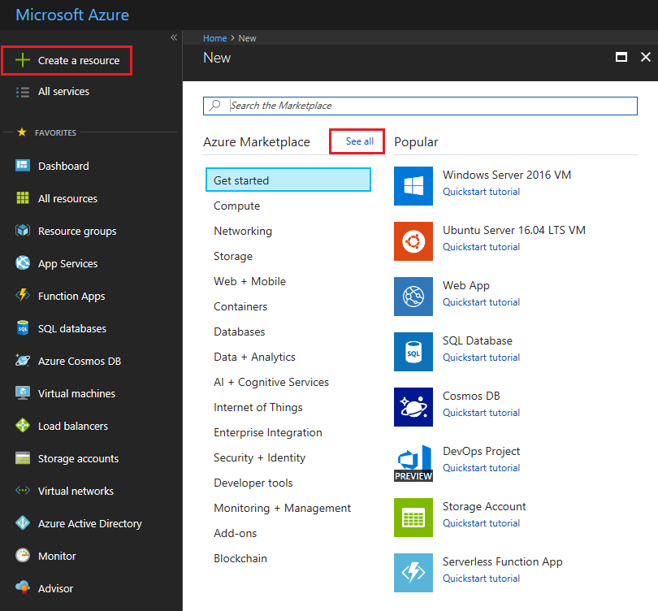
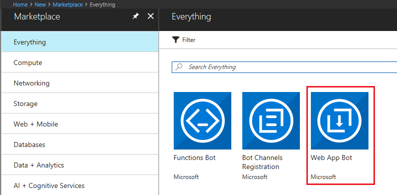
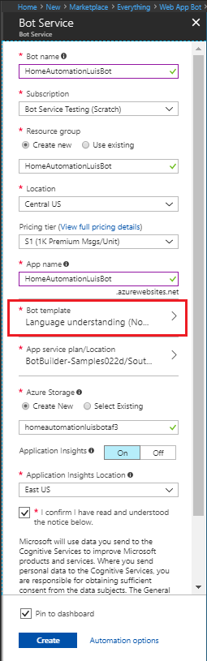
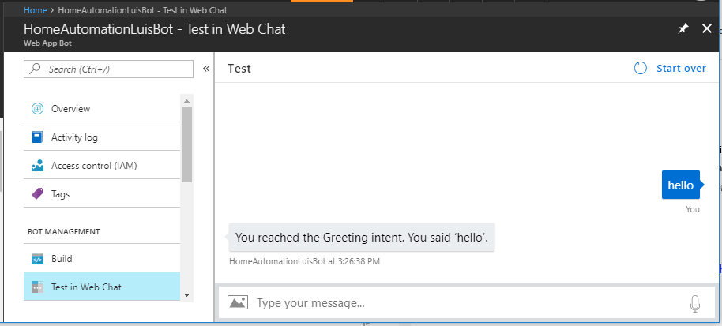
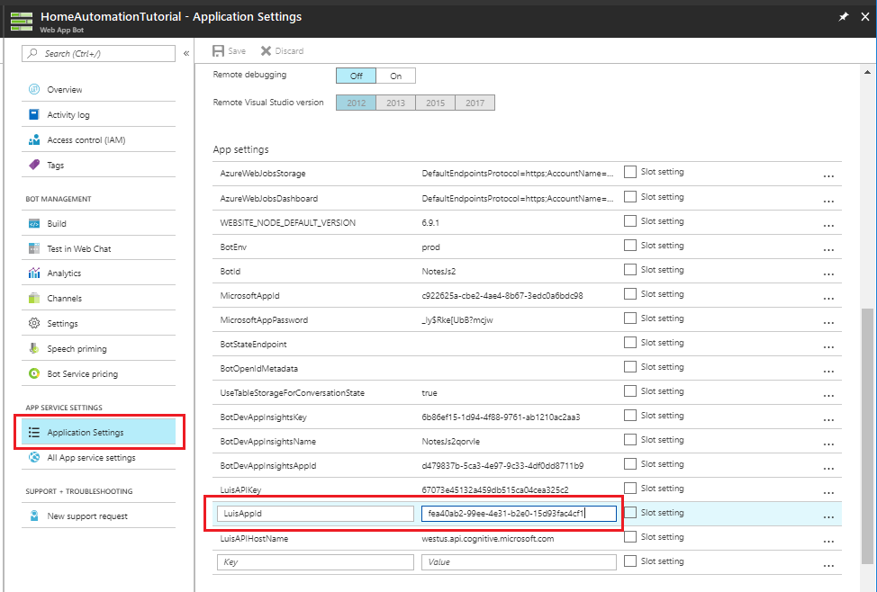
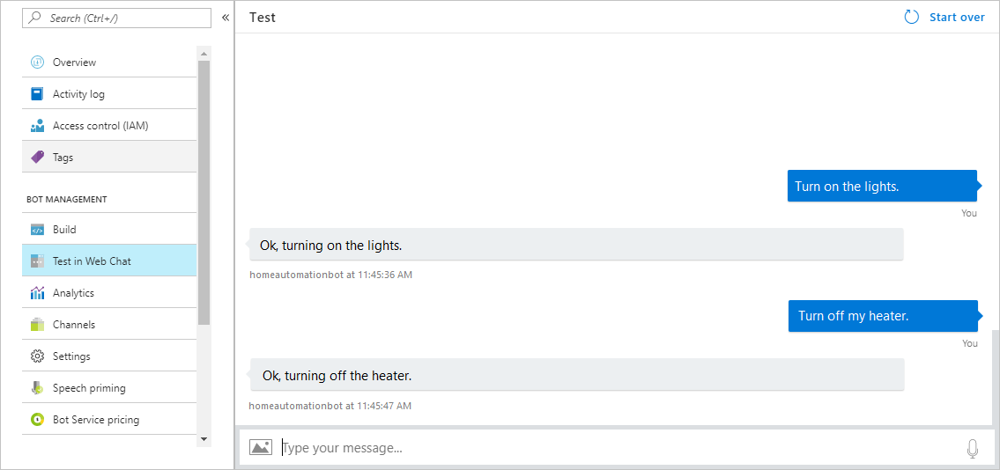

# Integrate LUIS with a bot using the Bot Builder SDK for Node.js

This tutorial walks you through building a bot with the [Bot Framework][BotFramework] that's integrated with a LUIS app.

## Prerequisite

Before you create the bot, follow the steps in [Create an app](./luis-get-started-create-app.md) to build the LUIS app that it uses.

The bot responds to intents from the HomeAutomation domain that are in the LUIS app. For each of these intents, the LUIS app provides an intent that maps to it. The bot provides a dialog that handles the intent that LUIS detects.

| Intent | Example utterance | Bot functionality |
|:----:|:----------:|---|
| HomeAutomation.TurnOn | Turn on the lights. | The bot invokes the `TurnOnDialog` when the `HomeAutomation.TurnOn` is detected. This dialog is where you'd invoke an IoT service to turn on a device and tell the user that the device has been turned on. |
| HomeAutomation.TurnOff | Turn off the bedroom lights. | The bot invokes the `TurnOffDialog` when the `HomeAutomation.TurnOff` is detected. This dialog where you'd invoke an IoT service to turn off a device and tell the user that the device has been turned off. |


## Create a Language Understanding bot with Bot Service

1. In the [Azure portal](https://portal.azure.com), select **Create new resource** in the menu blade and click **See all**.

    

2. In the search box, search for **Web App Bot**. 

    

3. In the **Bot Service** blade, provide the required information, and click **Create**. This creates and deploys the bot service and LUIS app to Azure. 
    * Set **App name** to your bot’s name. The name is used as the subdomain when your bot is deployed to the cloud (for example, mynotesbot.azurewebsites.net). <!-- This name is also used as the name of the LUIS app associated with your bot. Copy it to use later, to find the LUIS app associated with the bot. -->
    * Select the subscription, [resource group](https://docs.microsoft.com/azure/azure-resource-manager/resource-group-overview), App service plan, and [location](https://azure.microsoft.com/regions/).
    * Select the **Language understanding (Node.js)** template for the **Bot template** field.

    

    * Check the box to confirm to the terms of service.

4. Confirm that the bot service has been deployed.
    * Click Notifications (the bell icon that is located along the top edge of the Azure portal). The notification will change from **Deployment started** to **Deployment succeeded**.
    * After the notification changes to **Deployment succeeded**, click **Go to resource** on that notification.

## Try the default bot

Confirm that the bot has been deployed by checking the **Notifications**. The notifications will change from **Deployment in progress...** to **Deployment succeeded**. Click **Go to resource** button to open the bot's resources blade.

Once the bot is registered, click **Test in Web Chat** to open the Web Chat pane. Type "hello" in Web Chat.

  

The bot responds by saying "You have reached Greeting. You said: hello". This confirms that the bot has received your message and passed it to a default LUIS app that it created. This default LUIS app detected a Greeting intent. In the next step you'll connect the bot to the LUIS app you previously created instead of the default LUIS app.

## Connect your LUIS app to the bot

Open **Application Settings** and edit the **LuisAppId** field to contain the application ID of your LUIS app.

  

If you don't have the LUIS app ID, log in to the [LUIS](luis-reference-regions.md) website using the same account you use to log in to Azure. Click on **My apps**. 

1. Find the LUIS app you previously created, that contains the intents and entites from the HomeAutomation domain.
2. In the **Settings** page for the LUIS app, find and copy the app ID.
3. If you haven't trained the app, click the **Train** button in the upper right to train your app.
4. If you haven't published the app, click **PUBLISH** in the top navigation bar to open the **Publish** page. Click the **Publish to production slot** button. 


## Modify the bot code

Click **Build** and then click **Open online code editor**.

   

In the code editor, open `app.js`. It contains the following code:

```javascript
var restify = require('restify');
var builder = require('botbuilder');
var botbuilder_azure = require("botbuilder-azure");

// Setup Restify Server
var server = restify.createServer();
server.listen(process.env.port || process.env.PORT || 3978, function () {
   console.log('%s listening to %s', server.name, server.url); 
});

// Create chat connector for communicating with the Bot Framework Service
var connector = new builder.ChatConnector({
    appId: process.env.MicrosoftAppId,
    appPassword: process.env.MicrosoftAppPassword,
    openIdMetadata: process.env.BotOpenIdMetadata 
});

// Listen for messages from users 
server.post('/api/messages', connector.listen());

var tableName = 'botdata';
var azureTableClient = new botbuilder_azure.AzureTableClient(tableName, process.env['AzureWebJobsStorage']);
var tableStorage = new botbuilder_azure.AzureBotStorage({ gzipData: false }, azureTableClient);

// Create your bot with a function to receive messages from the user
var bot = new builder.UniversalBot(connector);
bot.set('storage', tableStorage);

// Make sure you add code to validate these fields
var luisAppId = process.env.LuisAppId;
var luisAPIKey = process.env.LuisAPIKey;
var luisAPIHostName = process.env.LuisAPIHostName || 'westus.api.cognitive.microsoft.com';

const LuisModelUrl = 'https://' + luisAPIHostName + '/luis/v2.0/apps/' + luisAppId + '?subscription-key=' + luisAPIKey;

// Main dialog with LUIS
var recognizer = new builder.LuisRecognizer(LuisModelUrl);
var intents = new builder.IntentDialog({ recognizers: [recognizer] })
.matches('Greeting', (session) => {
    session.send('You reached Greeting intent, you said \'%s\'.', session.message.text);
})
.matches('Help', (session) => {
    session.send('You reached Help intent, you said \'%s\'.', session.message.text);
})
.matches('Cancel', (session) => {
    session.send('You reached Cancel intent, you said \'%s\'.', session.message.text);
})
.onDefault((session) => {
    session.send('Sorry, I did not understand \'%s\'.', session.message.text);
});

bot.dialog('/', intents);
```
<!-- template revisions -->
<!-- 
```javascript
/*-----------------------------------------------------------------------------
A simple Language Understanding (LUIS) bot for the Microsoft Bot Framework. 
-----------------------------------------------------------------------------*/

var restify = require('restify');
var builder = require('botbuilder');
var botbuilder_azure = require("botbuilder-azure");

// Setup Restify Server
var server = restify.createServer();
server.listen(process.env.port || process.env.PORT || 3978, function () {
   console.log('%s listening to %s', server.name, server.url); 
});
  
// Create chat connector for communicating with the Bot Framework Service
var connector = new builder.ChatConnector({
    appId: process.env.MicrosoftAppId,
    appPassword: process.env.MicrosoftAppPassword,
    openIdMetadata: process.env.BotOpenIdMetadata 
});

// Listen for messages from users 
server.post('/api/messages', connector.listen());

/*----------------------------------------------------------------------------------------
* Bot Storage: This is a great spot to register the private state storage for your bot. 
* We provide adapters for Azure Table, CosmosDb, SQL Azure, or you can implement your own!
* For samples and documentation, see: https://github.com/Microsoft/BotBuilder-Azure
* ---------------------------------------------------------------------------------------- */

var tableName = 'botdata';
var azureTableClient = new botbuilder_azure.AzureTableClient(tableName, process.env['AzureWebJobsStorage']);
var tableStorage = new botbuilder_azure.AzureBotStorage({ gzipData: false }, azureTableClient);

// Create your bot with a function to receive messages from the user
// This default message handler is invoked if the user's utterance doesn't
// match any intents handled by other dialogs.
var bot = new builder.UniversalBot(connector, function (session, args) {
    session.send('You reached the default message handler. You said \'%s\'.', session.message.text);
});

bot.set('storage', tableStorage);

// Make sure you add code to validate these fields
var luisAppId = process.env.LuisAppId;  

var luisAPIKey = process.env.LuisAPIKey;
var luisAPIHostName = process.env.LuisAPIHostName || 'westus.api.cognitive.microsoft.com';

const LuisModelUrl = 'https://' + luisAPIHostName + '/luis/v2.0/apps/' + luisAppId + '?subscription-key=' + luisAPIKey;

// Create a recognizer that gets intents from LUIS, and add it to the bot
var recognizer = new builder.LuisRecognizer(LuisModelUrl);
bot.recognizer(recognizer);

// Add a dialog for each intent that the LUIS app recognizes.
// See https://docs.microsoft.com/bot-framework/nodejs/bot-builder-nodejs-recognize-intent-luis 

bot.dialog('GreetingDialog',
    (session) => {
        session.send('You reached the Greeting intent. You said \'%s\'.', session.message.text);
        session.endDialog();
    }
).triggerAction({
    matches: 'Greeting'
})

bot.dialog('HelpDialog',
    (session) => {
        session.send('You reached the Help intent. You said \'%s\'.', session.message.text);
        session.endDialog();
    }
).triggerAction({
    matches: 'Help'
})

bot.dialog('CancelDialog',
    (session) => {
        session.send('You reached the Cancel intent. You said \'%s\'.', session.message.text);
        session.endDialog();
    }
).triggerAction({
    matches: 'Cancel'
}) 
```
-->

<!-- 
> [!TIP] 
> You can also find the sample code described in this article in the [HomeAutomation bot sample][IoTBotSample].
-->
## Add a default message handler

Remove this line of code.

```javascript
var bot = new builder.UniversalBot(connector);
```

Replace it with the following code that creates the bot with a default message handler.

```javascript
// Create your bot with a function to receive messages from the user
// This default message handler is invoked if the user's utterance doesn't
// match any intents handled by other dialogs.
var bot = new builder.UniversalBot(connector, function (session, args) {
    session.send('You reached the default message handler. You said \'%s\'.', session.message.text);
});
```

## Add dialogs to handle the HomeAutomation intents

Find line of code that creates a `LuisRecognizer`. 

```javascript
// Create a recognizer that gets intents from LUIS
var recognizer = new builder.LuisRecognizer(LuisModelUrl);
```

Add this line of code right after it, to add the recognizer to the bot.
```javascript
// Add the recognizer to the bot
bot.recognizer(recognizer); 
```

Delete the following code from the end of `app.js` in the code editor. You'll replace it with code for dialogs that handle the `HomeAutomation.TurnOn` and `HomeAutomation.TurnOff` intents.

```javascript
var intents = new builder.IntentDialog({ recognizers: [recognizer] })
.matches('Greeting', (session) => {
    session.send('You reached Greeting intent, you said \'%s\'.', session.message.text);
})
.matches('Help', (session) => {
    session.send('You reached Help intent, you said \'%s\'.', session.message.text);
})
.matches('Cancel', (session) => {
    session.send('You reached Cancel intent, you said \'%s\'.', session.message.text);
})
.onDefault((session) => {
    session.send('Sorry, I did not understand \'%s\'.', session.message.text);
});

bot.dialog('/', intents);

```


<!-- move this section to "Add TurnOn intent 
The [matches][matches] option on the [triggerAction][triggerAction] attached to the dialog specifies the name of the intent. The recognizer runs each time the bot receives an utterance from the user. If the highest scoring intent that it detects matches a `triggerAction` bound to a dialog, the bot invokes that dialog.
-->

### Add a dialog that matches HomeAutomation.TurnOn

Copy the following code and add it to `app.js`.

```javascript
bot.dialog('TurnOnDialog',
    (session, args) => {
        // Resolve and store any HomeAutomation.Device entity passed from LUIS.
        var intent = args.intent;
        var device = builder.EntityRecognizer.findEntity(intent.entities, 'HomeAutomation.Device');

        // Turn on a specific device if a device entity is detected by LUIS
        if (device) {
            session.send('Ok, turning on the %s.', device.entity);
            // Put your code here for calling the IoT web service that turns on a device
        } else {
            // Assuming turning on lights is the default
            session.send('Ok, turning on the lights');
            // Put your code here for calling the IoT web service that turns on a device
        }
        session.endDialog();
    }
).triggerAction({
    matches: 'HomeAutomation.TurnOn'
})
```

The [matches][matches] option on the [triggerAction][triggerAction] attached to the dialog specifies the name of the intent. The recognizer runs each time the bot receives an utterance from the user. If the highest scoring intent that it detects matches a `triggerAction` bound to a dialog, the bot invokes that dialog.

### Add a dialog that matches HomeAutomation.TurnOff

Copy the following code and add it to `app.js`.

```javascript
bot.dialog('TurnOffDialog',
    (session, args) => {
        // Resolve and store any HomeAutomation.Device entity passed from LUIS.
        var intent = args.intent;
        var device = builder.EntityRecognizer.findEntity(intent.entities, 'HomeAutomation.Device');

        // Turn off a specific device if a device entity is detected by LUIS
        if (device) {
            session.send('Ok, turning off the %s.', device.entity);
            // Put your code here for calling the IoT web service that turns off a device
        } else {
            // Assuming turning off lights is the default
            session.send('Ok, turning off the lights');
            // Put your code here for calling the IoT web service that turns off a device
        }
        session.endDialog();
    }
).triggerAction({
    matches: 'HomeAutomation.TurnOff'
})
```
## Test the bot

In the Azure Portal, click on **Test in Web Chat** to test the bot. Try type messages like "Turn on the lights", and "turn off my heater" to invoke the intents that you added to it.
   

> [!TIP]
> If you find that your bot doesn't always recognize the correct intent or entities, improve your LUIS app's performance by giving it more example utterances to train it. You can retrain your LUIS app without any modification to your bot's code. See [Add example utterances](https://docs.microsoft.com/azure/cognitive-services/LUIS/add-example-utterances) and [train and test your LUIS app](https://docs.microsoft.com/azure/cognitive-services/LUIS/train-test).


## Next steps

<!-- From trying the bot, you can see that the recognizer can trigger interruption of the currently active dialog. Allowing and handling interruptions is a flexible design that accounts for what users really do. Learn more about the various actions you can associate with a recognized intent.-->
You can try to add other intents, like Help, Cancel, and Greeting, to the LUIS app. Then add dialogs for the new intents and and test them using the bot. 

<!-- 
> [!NOTE] 
> The default LUIS app that the template created contains example utterances for Cancel, Greeting, and Help intents. In the list of apps, find the app that begins with the name specified in **App name** in the **Bot Service** blade when you created the Bot Service. -->

> [!div class="nextstepaction"]
> [Add intents](./add-intents.md)


[intentDialog]: https://docs.botframework.com/node/builder/chat-reference/classes/_botbuilder_d_.intentdialog.html

[intentDialog_matches]: https://docs.botframework.com/node/builder/chat-reference/classes/_botbuilder_d_.intentdialog.html#matches 

[NotesSample]: https://github.com/Microsoft/BotFramework-Samples/tree/master/docs-samples/Node/basics-naturalLanguage

[triggerAction]: https://docs.botframework.com/en-us/node/builder/chat-reference/classes/_botbuilder_d_.dialog.html#triggeraction

[confirmPrompt]: https://docs.botframework.com/node/builder/chat-reference/interfaces/_botbuilder_d_.itriggeractionoptions.html#confirmprompt

[waterfall]: bot-builder-nodejs-dialog-manage-conversation-flow.md#manage-conversation-flow-with-a-waterfall

[session_userData]: https://docs.botframework.com/node/builder/chat-reference/classes/_botbuilder_d_.session.html#userdata

[EntityRecognizer_findEntity]: https://docs.botframework.com/node/builder/chat-reference/classes/_botbuilder_d_.entityrecognizer.html#findentity

[matches]: https://docs.botframework.com/en-us/node/builder/chat-reference/interfaces/_botbuilder_d_.itriggeractionoptions.html#matches

[LUISAzureDocs]: https://docs.microsoft.com/azure/cognitive-services/LUIS/Home

[Dialog]: https://docs.botframework.com/node/builder/chat-reference/classes/_botbuilder_d_.dialog.html

[IntentRecognizerSetOptions]: https://docs.botframework.com/node/builder/chat-reference/interfaces/_botbuilder_d_.iintentrecognizersetoptions.html

[LuisRecognizer]: https://docs.botframework.com/node/builder/chat-reference/classes/_botbuilder_d_.luisrecognizer

[LUISConcepts]: https://docs.botframework.com/node/builder/guides/understanding-natural-language/

[DisambiguationSample]: https://github.com/Microsoft/BotBuilder/tree/master/Node/examples/feature-onDisambiguateRoute

[IDisambiguateRouteHandler]: https://docs.botframework.com/node/builder/chat-reference/interfaces/_botbuilder_d_.idisambiguateroutehandler.html

[RegExpRecognizer]: https://docs.botframework.com/node/builder/chat-reference/classes/_botbuilder_d_.regexprecognizer.html

[AlarmBot]: https://github.com/Microsoft/BotBuilder/blob/master/Node/examples/basics-naturalLanguage/app.js

[LUISBotSample]: https://github.com/Microsoft/BotBuilder-Samples/tree/master/Node/intelligence-LUIS

[UniversalBot]: https://docs.botframework.com/node/builder/chat-reference/classes/_botbuilder_d_.universalbot.html


<!-- Old Links -->
[Github-BotFramework-Emulator-Download]: https://aka.ms/bot-framework-emulator
[Github-LUIS-Samples]: https://github.com/Microsoft/LUIS-Samples
[Github-LUIS-Samples-node-hotel-bot]:https://github.com/Microsoft/LUIS-Samples/tree/master/bot-integration-samples/hotel-finder/nodejs
[NodeJs]: https://nodejs.org/
[BFPortal]: https://dev.botframework.com/
[RegisterInstructions]: https://docs.microsoft.com/bot-framework/portal-register-bot
[BotFramework]: https://docs.microsoft.com/bot-framework/


