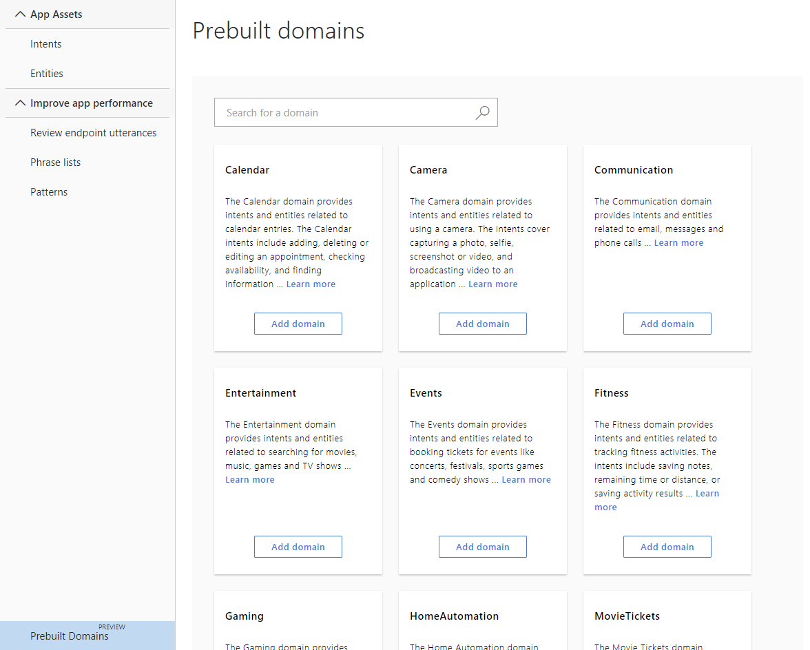

# Add prebuilt domains for common usage scenarios 

LUIS includes a set of prebuilt intents from the prebuilt domains for quickly adding common intents and utterances. This is a quick and easy way to add abilities to your conversational client app without having to design the models for those abilities. 

## Add a prebuilt domain

1. On the **My Apps** page, select your app. This opens your app to the **Build** section of the app. 

1. On the **Intents** page, select **Add prebuilt domains** from the bottom, left toolbar. 

1. Select the **Calendar** intent then select **Add domain** button.

    

1. Select **Intents** in the left navigation to view the Calendar intents. Each intent from this domain is prefixed with `Calendar.`. Along with utterances, two entities for this domain are added to the app: `Calendar.Location` and `Calendar.Subject`. 

## Train and publish

1. After the domain is added, train the app by selecting **Train** in the top, right toolbar. 

1. In the top toolbar, select **Publish**. Publish to **Production**. 

1. When the green success notification appears, select the **Refer to the list of endpoints** link to see the endpoints.

1. Select an endpoint. A new browser tab opens to that endpoint. Keep the browser tab open and continue to the **Test** section.

## Test

Test the new intent at the endpoint by added a value for the **q** parameter: `Schedule a meeting with John Smith in Seattle next week`.

LUIS returns the correct intent and meeting subject:

```json
{
  "query": "Schedule a meeting with John Smith in Seattle next week",
  "topScoringIntent": {
    "intent": "Calendar.Add",
    "score": 0.824783146
  },
  "entities": [
    {
      "entity": "a meeting with john smith",
      "type": "Calendar.Subject",
      "startIndex": 9,
      "endIndex": 33,
      "score": 0.484055847
    }
  ]
}
```

## Next steps
> [!div class="nextstepaction"]
> [Prebuilt domain reference](./luis-reference-prebuilt-domains.md)
