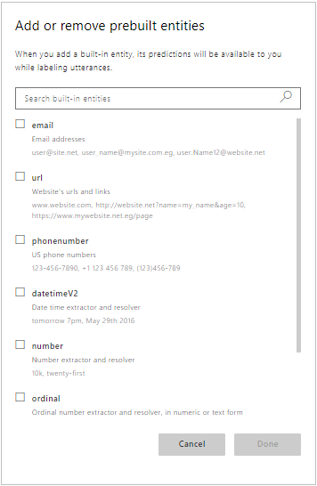
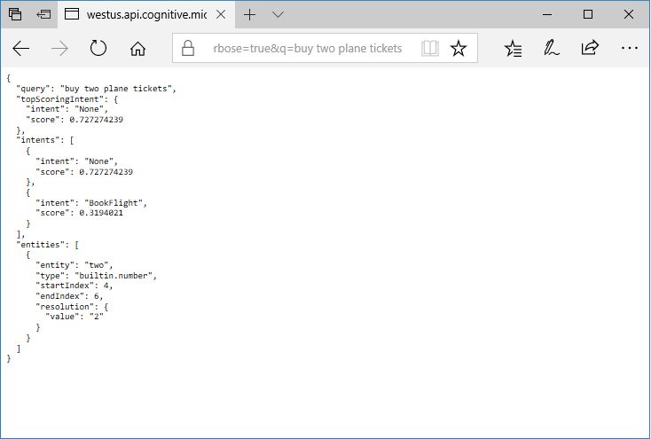

# Prebuilt entities to recognize common data types

LUIS includes a set of prebuilt entities for recognizing common types of information, like dates, times, numbers, measurements, and currency. Prebuilt entity support varies by the culture of your LUIS app. For a full list of the prebuilt entities that LUIS supports, including support by culture, see the [prebuilt entity reference](./luis-reference-prebuilt-entities.md).

> [!NOTE]
> **builtin.datetime** is deprecated. It is replaced by [**builtin.datetimeV2**](luis-reference-prebuilt-datetimev2.md), which provides recognition of date and time ranges, as well as improved recognition of ambiguous dates and times.

## Add a prebuilt entity

1. Open your app by clicking its name on **My Apps** page, and then click **Entities** in the left side. 
2. On the **Entities** page, click **Manage prebuilt entities**.

3. In **Add prebuilt entities** dialog box, click the prebuilt entity you want to add (for example, "datetimeV2"). Then click **Save**.

    

## Use a prebuilt number entity
When a prebuilt entity is included in your application, its predictions are included in your published application. 
The behavior of prebuilt entities is pre-trained and **cannot** be modified. Follow these steps to see how a prebuilt entity works:

1. Add a **number** entity to your app, then [Train](luis-interactive-test.md) and [publish](luis-how-to-publish-app.md) the app.
2. Click on the endpoint URL in the **Publish App** page to open the LUIS endpoint in a web browser. 
3. Append an utterance to the URL that contains a numerical expression. For example, you can type in `buy two plane ticktets`, and see that LUIS identifies `two` as a `builtin.number` entity, and identifies `2` as its value in the `resolution` field. The `resolution` field helps you resolve numbers and dates to a canonical form that's easier for your client application to use. 

    

LUIS can intelligently recognize numbers that aren't in non-standard form. Try out different numerical expressions in your utterances and see what LUIS returns.

The following example shows a JSON response from LUIS, that includes the resolution of the value 24, for the utterance "two dozen".

```json
{
  "query": "order two dozen tickets for group travel",
  "topScoringIntent": {
    "intent": "BookFlight",
    "score": 0.905443209
  },
  "entities": [
    {
      "entity": "two dozen",
      "type": "builtin.number",
      "startIndex": 6,
      "endIndex": 14,
      "resolution": {
        "value": "24"
      }
    }
  ]
}
```
## Use a prebuilt datetimeV2 entity
The **datetimeV2** prebuilt entity recognizes dates, times, date ranges, and time durations. Follow these steps to see how the `datetimeV2` prebuilt entity works:

1. Add a **datetimeV2** entity to your app, then [Train](luis-interactive-test.md) and [publish](luis-how-to-publish-app.md) the app.
2. Click on the endpoint URL in the **Publish App** page to open the LUIS endpoint in a web browser. 
3. Append an utterance to the URL that contains a date range. For example, you can type in `book a flight tomorrow`, and see that LUIS identifies `tomorrow` as a `builtin.datetimeV2.date` entity, and identifies tomorrow's date as its value in the `resolution` field. 

The following example shows what the JSON response from LUIS might look like if today's date were October 31st, 2017.

```json
{
  "query": "book a flight tomorrow",
  "topScoringIntent": {
    "intent": "BookFlight",
    "score": 0.9063408
  },
  "entities": [
    {
      "entity": "tomorrow",
      "type": "builtin.datetimeV2.date",
      "startIndex": 14,
      "endIndex": 21,
      "resolution": {
        "values": [
          {
            "timex": "2017-11-01",
            "type": "date",
            "value": "2017-11-01"
          }
        ]
      }
    }
  ]
}
```

## Next steps
> [!div class="nextstepaction"]
> [Prebuilt entity reference](./luis-reference-prebuilt-entities.md)
