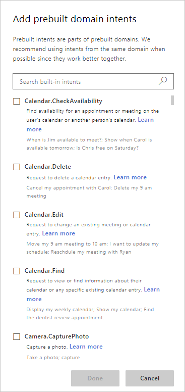
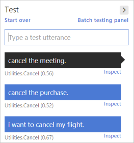

# Add prebuilt intents for common intents 

LUIS includes a set of prebuilt intents from the prebuilt domains for quickly adding common intents and utterances. This is a quick and easy way to add abilities to your conversational client app without having to design the models for those abilities. 

## Add a prebuilt intent

1. On the **My Apps** page, select your app. This opens your app to the **Build** section of the app. 

1. On the **Intents** page, select **Add prebuilt intent** from the toolbar above the intents list. 

1. Select the **Utilities.Cancel** intent from the pop-up dialog. 

    

1. Select the **Done** button.

## Train and test

1. After the intent is added, train the app by selecting **Train** in the top, right toolbar. 

1. Test the new intent by selecting **Test** in the right toolbar. 

1. In the textbox, enter utterances for canceling:

    |Test utterance|Prediction score|
    |--|:--|
    |I want to cancel my flight.|0.67|
    |Cancel the purchase.|0.52|
    |Cancel the meeting.|0.56|

    

## Next steps
> [!div class="nextstepaction"]
> [Prebuilt entities](./luis-prebuilt-entities.md)
