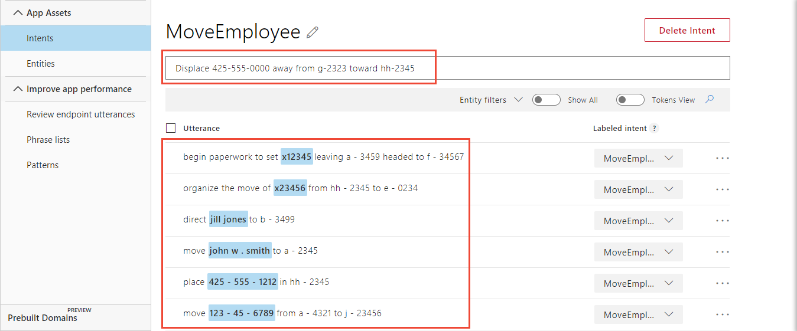
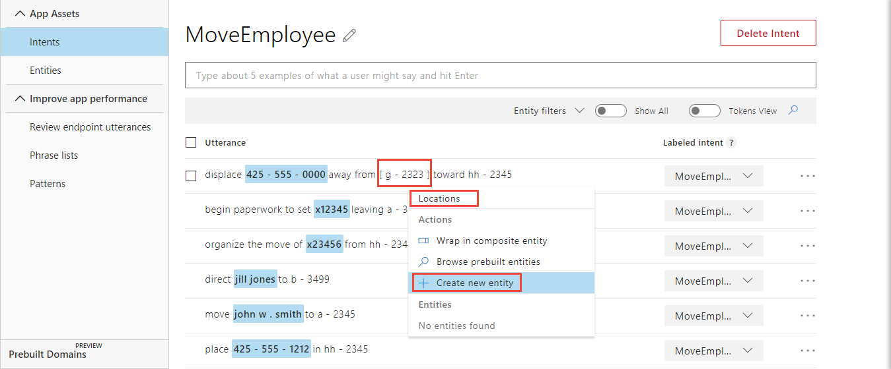
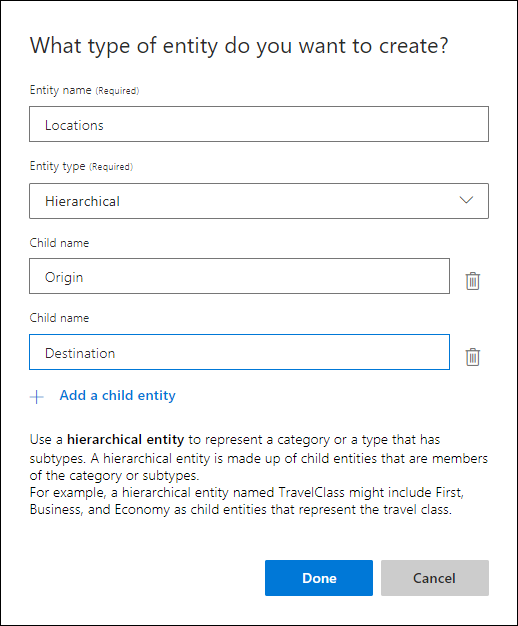
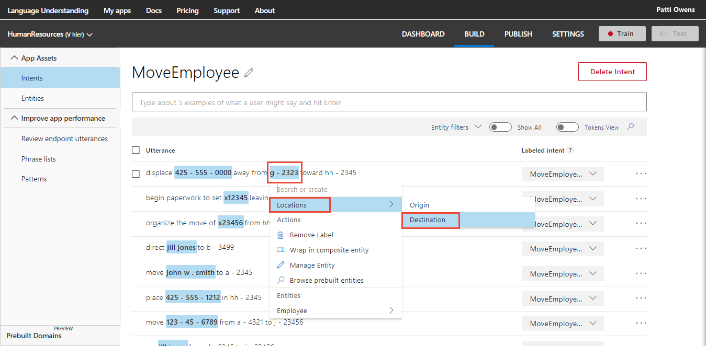
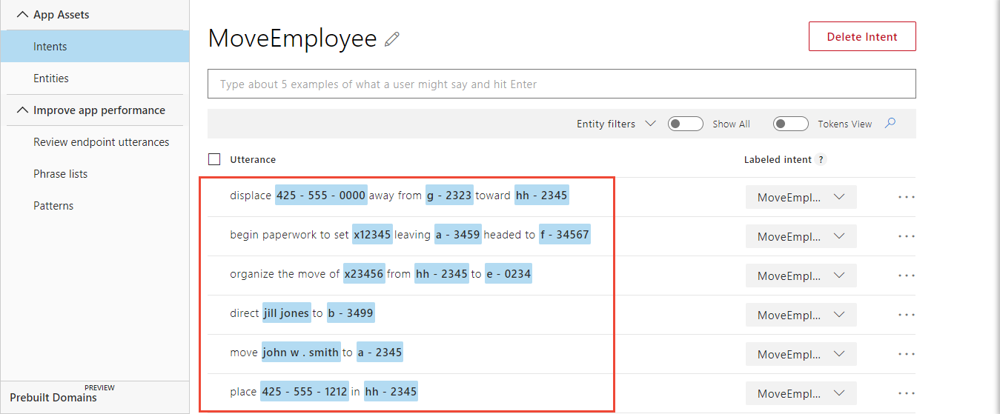
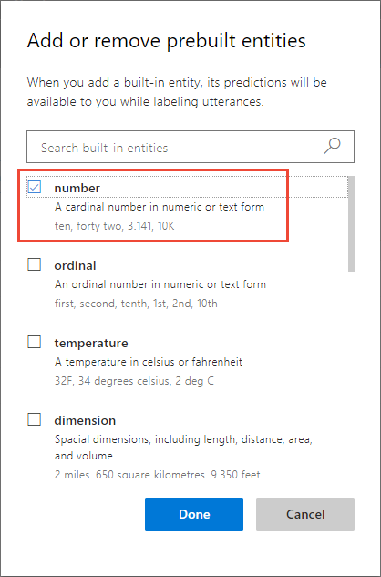

---
title: "Tutorial 5: Parent/Child relationships - LUIS Hierarchical entity for contextually learned data"
titleSuffix: Azure Cognitive Services
description: Find related pieces of data based on context. For example, an origin and destination locations for a physical move from one building and office to another building and office are related. 
services: cognitive-services
author: diberry
manager: cgronlun
ms.service: cognitive-services
ms.component: language-understanding
ms.topic: tutorial
ms.date: 09/09/2018
ms.author: diberry
#Customer intent: As a new user, I want to understand how and why to use the hierarchical entity. 
--- 

# Tutorial 5: Extract contextually-related data
In this tutorial, find related pieces of data based on context. For example, an origin and destination locations for a physical move from one building and office to another building and office are related. To generate a work order both pieces of data may be required and they are related to each other.  

This app determines where an employee is to be moved from the origin location (building and office) to the destination location (building and office). It uses the hierarchical entity to determine the locations within the utterance. The purpose of the **hierarchical** entity is to find related data within the utterance based on context. 

The hierarchical entity is a good fit for this type of data because the two pieces of data:

* Are simple entities.
* Are related to each other in the context of the utterance.
* Use specific word choice to indicate each location. Examples of these words include: from/to, leaving/headed to, away from/toward.
* Both locations are frequently in the same utterance. 
* Need to be grouped and processed by client app as a unit of information.

**In this tutorial, you learn how to:**

<!-- green checkmark -->
> [!div class="checklist"]
> * Use existing tutorial app
> * Add intent 
> * Add location hierarchical entity with origin and destination children
> * Train
> * Publish
> * Get intents and entities from endpoint

[!INCLUDE [LUIS Free account](../../../includes/cognitive-services-luis-free-key-short.md)]

## Use existing app
Continue with the app created in the last tutorial, named **HumanResources**. 

If you do not have the HumanResources app from the previous tutorial, use the following steps:

1.  Download and save [app JSON file](https://github.com/Microsoft/LUIS-Samples/blob/master/documentation-samples/tutorials/custom-domain-list-HumanResources.json).

2. Import the JSON into a new app.

3. From the **Manage** section, on the **Versions** tab, clone the version, and name it `hier`. Cloning is a great way to play with various LUIS features without affecting the original version. Because the version name is used as part of the URL route, the name can't contain any characters that are not valid in a URL. 

## Remove prebuilt number entity from app
In order to see the entire utterance and mark the hierarchical children, temporarily remove the prebuilt number entity.

1. [!include[Start in Build section](../../../includes/cognitive-services-luis-tutorial-build-section.md)]

2. Select **Entities** from the left menu.

3. Select the checkbox to the left of the number entity in the list. Select **Delete**. 

## Add utterances to MoveEmployee intent

1. Select **Intents** from the left menu.

2. Select **MoveEmployee** from the list of intents.

3. Add the following example utterances:

    |Example utterances|
    |--|
    |Move John W. Smith **to** a-2345|
    |Direct Jill Jones **to** b-3499|
    |Organize the move of x23456 **from** hh-2345 **to** e-0234|
    |Begin paperwork to set x12345 **leaving** a-3459 **headed to** f-34567|
    |Displace 425-555-0000 **away from** g-2323 **toward** hh-2345|

    [ ](./media/luis-quickstart-intent-and-hier-entity/hr-enter-utterances.png#lightbox)

    In the [list entity](luis-quickstart-intent-and-list-entity.md) tutorial, an employee is designated by name, email address, phone extension, mobile phone number, or U.S. federal social security number. These employee numbers are used in the utterances. The previous example utterances include different ways to note the origin and destination locations, marked in bold. A couple of the utterances only have destinations on purpose. This helps LUIS understand how those locations are placed in the utterance when the origin is not specified.     

    [!include[Do not use too few utterances](../../../includes/cognitive-services-luis-too-few-example-utterances.md)]  

## Create a location entity
LUIS needs to understand what a location is by labeling the origin and destination in the utterances. If you need to see the utterance in the token (raw) view, select the toggle in the bar above the utterances labeled **Entities View**. After you toggle the switch, the control is labeled **Tokens View**.

Consider the following utterance:

```JSON
mv Jill Jones from a-2349 to b-1298
```

The utterance has two locations specified, `a-2349` and `b-1298`. Assume that the letter corresponds to a building name and the number indicates the office within that building. It makes sense that they are both grouped as children of a hierarchical entity, `Locations`, because both pieces of data need to be extracted from the utterance to complete the request in the client application and they are related to each other. 
 
If only one child (origin or destination) of a hierarchical entity is present, it is still extracted. All children do not need to be found for just one, or some, to be extracted. 

1. In the utterance, `Displace 425-555-0000 away from g-2323 toward hh-2345`, select the word `g-2323`. A drop-down menu appears with a text box at the top. Enter the entity name `Locations` in the text box then select **Create new entity** in the drop-down menu. 

    [](media/luis-quickstart-intent-and-hier-entity/hr-create-new-entity-1.png#lightbox)

2. In the pop-up window, select the **Hierarchical** entity type with `Origin` and `Destination` as the child entities. Select **Done**.

    

3. The label for `g-2323` is marked as `Locations` because LUIS doesn't know if the term was the origin or destination, or neither. Select `g-2323`, then select **Locations**, then follow the menu to the right and select `Origin`.

    [](media/luis-quickstart-intent-and-hier-entity/hr-label-entity.png#lightbox)

5. Label the other locations in all the other utterances by selecting the building and office in the utterance, then selecting Locations, then following the menu to the right to select `Origin` or `Destination`. When all locations are labeled, the utterances in **Tokens View** begin to look like a pattern. 

    [](media/luis-quickstart-intent-and-hier-entity/hr-entities-labeled.png#lightbox)

## Add prebuilt number entity to app
Add the prebuilt number entity back to the application.

1. Select **Entities** from the left navigation menu.

2. Select **Manage prebuilt entities** button.

3. Select **number** from the list of prebuilt entities then select **Done**.

    

## Train the LUIS app

[!INCLUDE [LUIS How to Train steps](../../../includes/cognitive-services-luis-tutorial-how-to-train.md)]

## Publish the app to get the endpoint URL

[!INCLUDE [LUIS How to Publish steps](../../../includes/cognitive-services-luis-tutorial-how-to-publish.md)]

## Query the endpoint with a different utterance

1. [!INCLUDE [LUIS How to get endpoint first step](../../../includes/cognitive-services-luis-tutorial-how-to-get-endpoint.md)]


2. Go to the end of the URL in the address bar and enter `Please relocation jill-jones@mycompany.com from x-2345 to g-23456`. The last querystring parameter is `q`, the utterance **query**. This utterance is not the same as any of the labeled utterances so it is a good test and should return the `MoveEmployee` intent with the hierarchical entity extracted.

    ```JSON
    {
      "query": "Please relocation jill-jones@mycompany.com from x-2345 to g-23456",
      "topScoringIntent": {
        "intent": "MoveEmployee",
        "score": 0.9966052
      },
      "intents": [
        {
          "intent": "MoveEmployee",
          "score": 0.9966052
        },
        {
          "intent": "Utilities.Stop",
          "score": 0.0325253047
        },
        {
          "intent": "FindForm",
          "score": 0.006137873
        },
        {
          "intent": "GetJobInformation",
          "score": 0.00462633232
        },
        {
          "intent": "Utilities.StartOver",
          "score": 0.00415637763
        },
        {
          "intent": "ApplyForJob",
          "score": 0.00382325822
        },
        {
          "intent": "Utilities.Help",
          "score": 0.00249120337
        },
        {
          "intent": "None",
          "score": 0.00130756292
        },
        {
          "intent": "Utilities.Cancel",
          "score": 0.00119622645
        },
        {
          "intent": "Utilities.Confirm",
          "score": 1.26910036E-05
        }
      ],
      "entities": [
        {
          "entity": "jill - jones @ mycompany . com",
          "type": "Employee",
          "startIndex": 18,
          "endIndex": 41,
          "resolution": {
            "values": [
              "Employee-45612"
            ]
          }
        },
        {
          "entity": "x - 2345",
          "type": "Locations::Origin",
          "startIndex": 48,
          "endIndex": 53,
          "score": 0.8520272
        },
        {
          "entity": "g - 23456",
          "type": "Locations::Destination",
          "startIndex": 58,
          "endIndex": 64,
          "score": 0.974032
        },
        {
          "entity": "-2345",
          "type": "builtin.number",
          "startIndex": 49,
          "endIndex": 53,
          "resolution": {
            "value": "-2345"
          }
        },
        {
          "entity": "-23456",
          "type": "builtin.number",
          "startIndex": 59,
          "endIndex": 64,
          "resolution": {
            "value": "-23456"
          }
        }
      ]
    }
    ```
    
    The correct intent is predicted and the entities array has both the origin and destination values in the corresponding **entity** property.
    

## Could you have used a regular expression for each location?
Yes, create the regular expression entity with origin and destination roles and use it in a pattern.

The locations in this example, such as `a-1234`, follow a specific format of one or two letters with a dash then a series of 4 or 5 numerals. This data can be described as a regular expression entity with a role for each location. Roles are available only for patterns. You can create patterns based on these utterances, then create a regular expression for the location format and add it to the patterns. 

## Clean up resources

[!INCLUDE [LUIS How to clean up resources](../../../includes/cognitive-services-luis-tutorial-how-to-clean-up-resources.md)]

## Next steps
This tutorial created a new intent and added example utterances for the contextually-learned data of origin and destination locations. Once the app is trained and published, a client-application can use that information to create a move ticket with the relevant information.

> [!div class="nextstepaction"] 
> [Learn how to add a composite entity](luis-tutorial-composite-entity.md) 