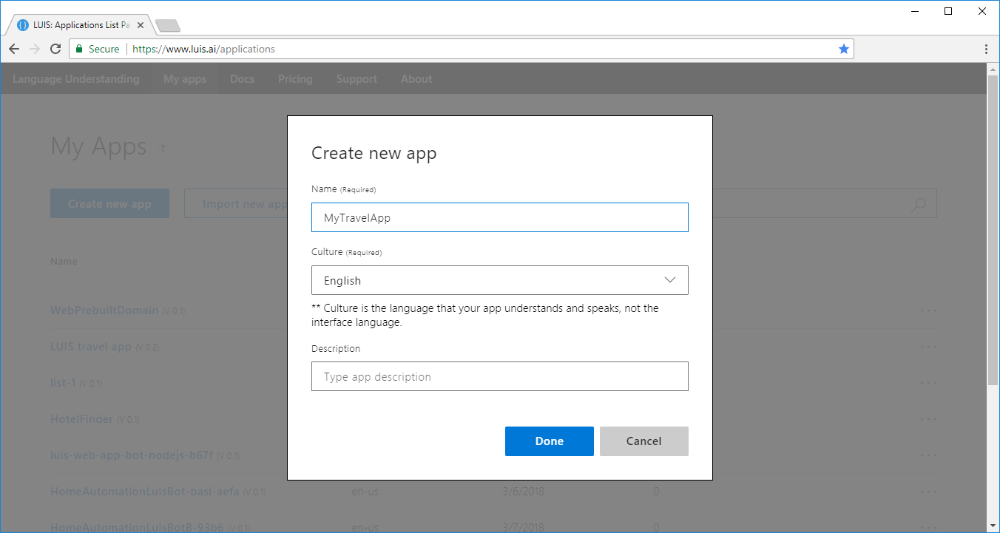
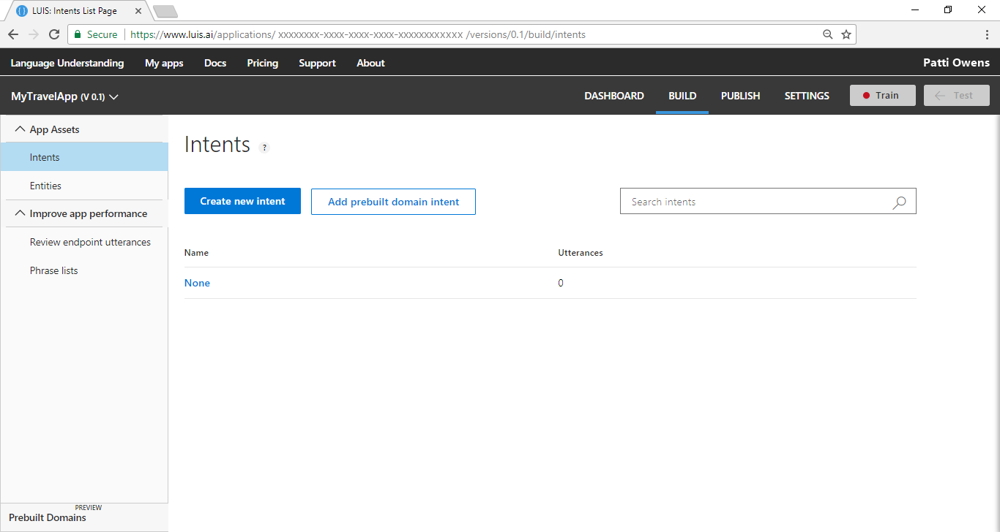
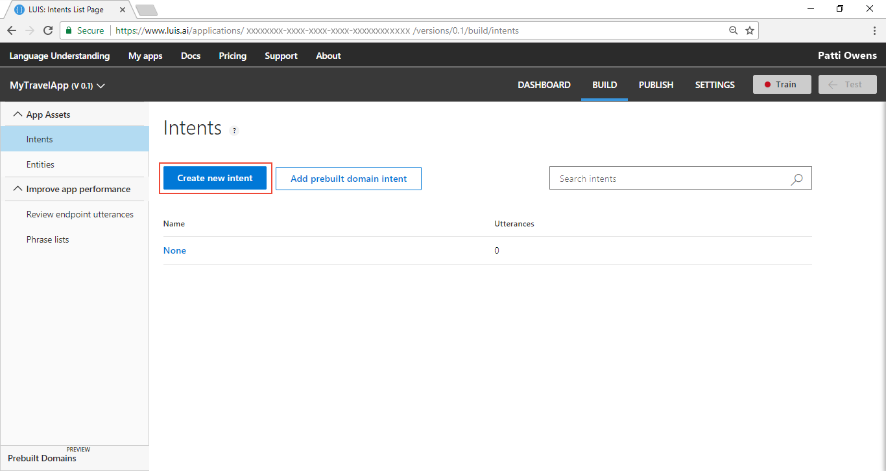
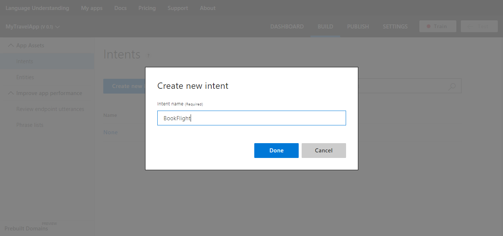
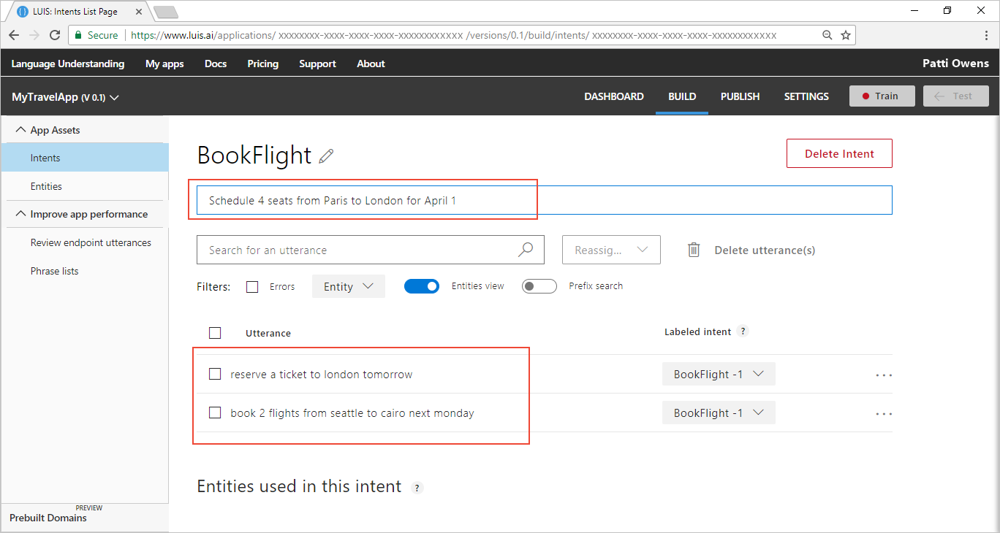
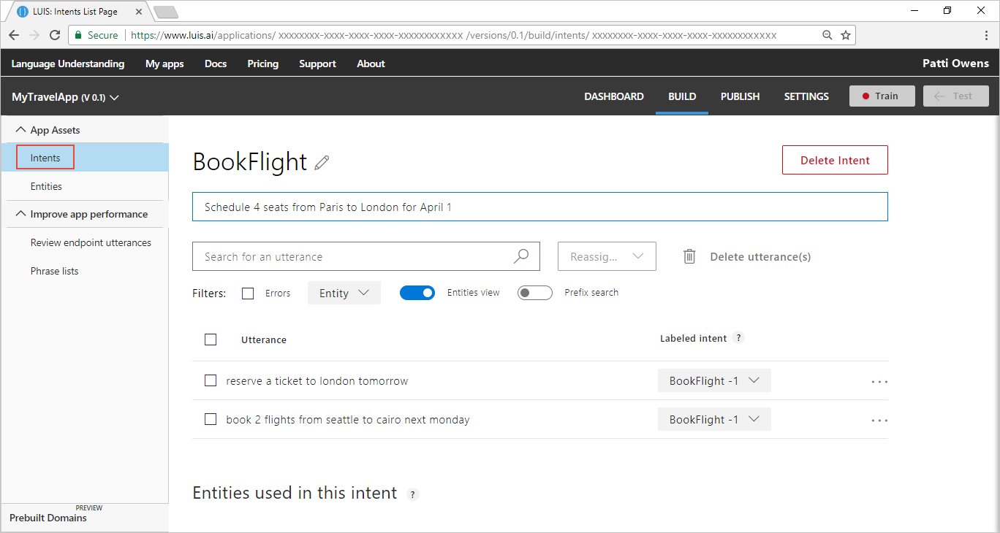
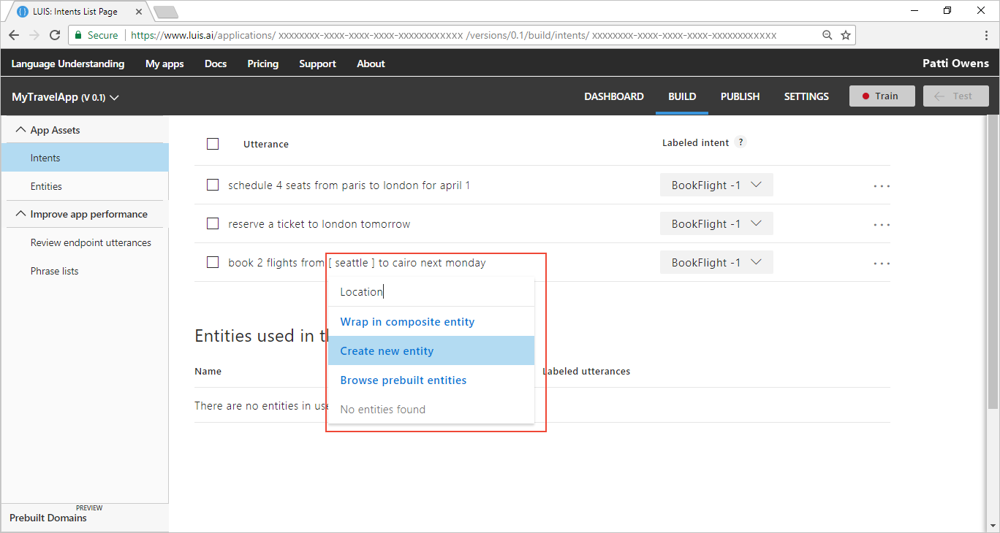
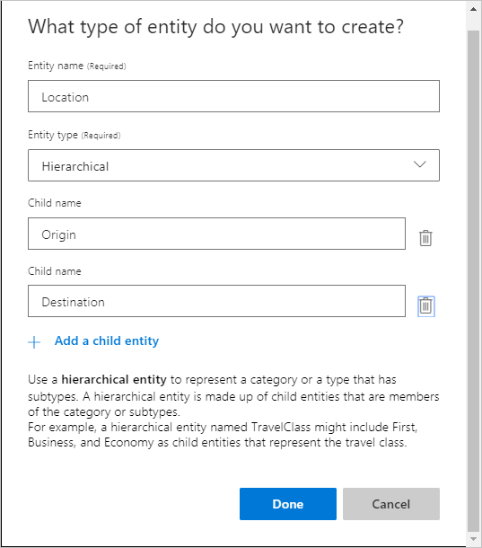
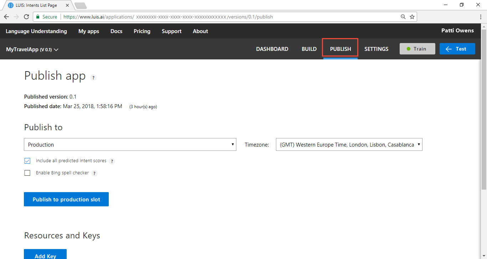
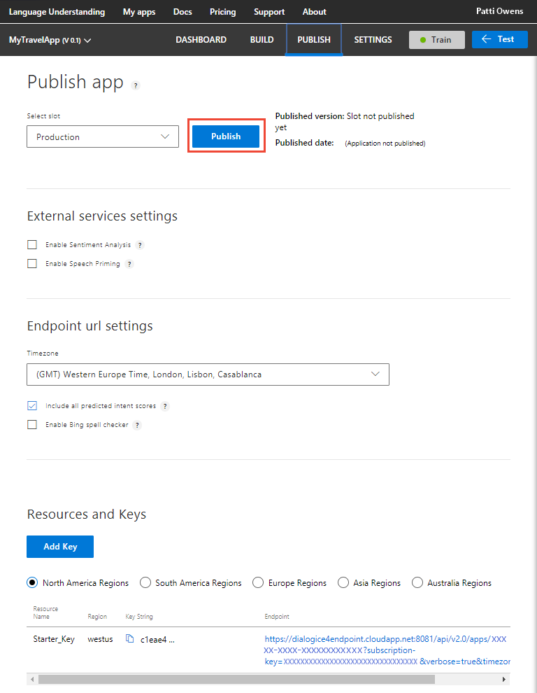

---
title: Create a LUIS app to get location data - Azure | Microsoft Docs 
description: Learn how to create a simple LUIS app using intents and a hierarchical entity to extract data. 
services: cognitive-services
author: v-geberr
manager: kaiqb 

ms.service: cognitive-services
ms.technology: luis
ms.topic: article
ms.date: 03/27/2018
ms.author: v-geberr
--- 

# Simple app with intents and a hierarchical entity
This simple app has two [intents](luis-concept-intent.md) and one hierarchical [entity](luis-concept-entity-types.md). Its purpose is to book flights such as '1 ticket from Seattle to Cairo`. 

## App intents
The intents are categories of what the user wants. This app has two intents: BookFlight and None. The [None](luis-concept-intent.md#none-intent-is-fallback-for-app) intent is purposeful, to indicate anything outside the app.  

## Hierarchical entity is contextually learned 
The purpose of the entity is to find and categorize parts of the text in the utterance. 
A [hierarchical](luis-concept-entity-types.md) entity is learned based on the context of the usage. A person can determine the origin and destination cities in an utterance based on the usage of `to` and `from`. These are an example of contextual usage.  

For this Travel app, LUIS extracts the origin and destination locations in such as way that a standard reservation can be created and filled. LUIS allows utterances to have variations, abbreviations, and slang. 

Simple example utterances from users include:

```
Book a flight to London for next Monday
2 tickets from Dallas to Dublin this weekend
Researve a seat from New York to Paris on the first of April
```

Abbreviated or slang versions of utterances include:

```
LHR tomorrow
SEA to NYC next Monday
LA to MCO spring break
```
 
The hierarchical entity matches origin and destination location. If only one child (origin or destination) of an hierarchical entity is present, it is still extracted. All children do not need to be found for just one, or some, to be extracted. 

## What LUIS does
When the intent and entities of the utterance are identified, [extracted](luis-concept-data-extraction.md#list-entity-data), and returned in JSON from the [endpoint](https://aka.ms/luis-endpoint-apis), LUIS is done. The calling application or chat bot takes that JSON response and fulfills the request -- in whatever way the app or chat bot is designed to do. 

## Create a new app
1. Log in to the [LUIS][LUIS] website. Make sure to log into the [region][LUIS-regions] where you need the LUIS endpoints published.

2. On the [LUIS][LUIS] website, select **Create new app**.  

    [](media/light-box/media/luis-quickstart-intent-and-hier-entity/app-list.png#lightbox)

3. In the pop-up dialog, enter the name `MyTravelApp`. 

    [](media/light-box/media/luis-quickstart-intent-and-hier-entity/create-new-app.png#lightbox)

4. When that process finishes, the app shows the **Intents** page with the **None** Intent. 

    [](media/light-box/media/luis-quickstart-intent-and-hier-entity/intents-page-none-only.png#lightbox)

## Create a new intent

1. On the **Intents** page, select **Create new intent**. 

    [](media/light-box/media/luis-quickstart-intent-and-hier-entity/create-new-intent-button.png#lightbox)

2. Enter the new intent name `BookFlight`. This intent should be selected any time a user wants to make flight reservations.

    By creating an intent, you are creating the primary category of information that you want to identify. Giving the category a name allows any other application that uses the LUIS query results to use that category name to find an appropriate answer or take appropriate action. LUIS won't answer these questions, only identify what type of information is being asked for in natural language. 

    [](media/light-box/media/luis-quickstart-intent-and-hier-entity/create-new-intent.png#lightbox)

3. Add several utterances to the `BookFlight` intent that you expect a user to ask for, such as:

    | Example utterances|
    |--|
    |Book 2 flights from Seattle to Cairo next Monday|
    |Reserve a ticket to London tomorrow|
    |Schedule 4 seats from Paris to London for April 1|

    [](media/light-box/media/luis-quickstart-intent-and-hier-entity/enter-utterances-on-intent.png#lightbox)

## Add utterances to None intent

The LUIS app currently has no utterances for the **None** intent. It needs utterances that you don't want the app to answer, so it has to have utterances in the **None** intent. Do not leave it empty. 

1. Select **Intents** from the left panel. 

    [](media/light-box/media/luis-quickstart-intent-and-hier-entity/select-intents-from-bookflight-intent.png#lightbox)

2. Select the **None** intent. Add three utterances that your user might enter but are not relevant to your app:

    | Example utterances|
    |--|
    |Cancel!|
    |Good bye|
    |What is going on?|

## When the utterance is predicted for the None intent
In your LUIS-calling application (such as a chat bot), when LUIS returns the **None** intent for an utterance, your bot can ask if the user wants to end the conversation. The bot can also give more directions for continuing the conversation if the user doesn't want to end it. 

Entities work in the **None** intent. If the top scoring intent is **None** but an entity is extracted that is meaningful to your chat bot, your chat bot can follow up with a question that focuses the customer's intent. 

## Create a location entity from the Intent page
Now that the two intents have utterances, LUIS needs to understand what a location is. Navigate back to the `BookFlight` intent and label (mark) the city name in an utterance by following the steps:

1. Return to the `BookFlight` intent by selecting **Intents** in the left panel.

2. Select `BookFlight` from the intents list.

3. In the utterance, `Book 2 flights from Seattle to Cairo next Monday`, select the word `Seattle`. A drop-down menu appears with a text box at the top to create a new entity. Enter the entity name `Location` in the text box then select **Create new entity** in the drop-down menu. 

    [](media/light-box/media/luis-quickstart-intent-and-hier-entity/label-seattle-in-utterance.png#lightbox)

4. In the pop-up window, select the **Hierarchical** entity type with `Origin` and `Destination` as the child entities. Select **Done**.

    [](media/light-box/media/luis-quickstart-intent-and-hier-entity/hier-entity-ddl.png#lightbox)

    The label for `Seattle` is marked as `Location` because LUIS doesn't know if the term was the origin or destination, or neither. Select `Seattle`, then select Location, then follow the menu to the right and select `Origin`.

5. Now that the entity is created, and one utterance is labeled, label the other cities by selecting the city name, then selecting Location, then following the menu to the right to select `Origin` or `Destination`.

    [](media/light-box/media/luis-quickstart-intent-and-hier-entity/label-destination-in-utterance.png#lightbox)

## Train the LUIS app
LUIS doesn't know about the changes to the intents and entities (the model), until it is trained. 

1. In the top right side of the LUIS website, select the **Train** button.

    

2. Training is complete when you see the green status bar at the top of the website confirming success.

    

## Publish the app to get the endpoint URL
In order to get a LUIS prediction in a chat bot or other application, you need to publish the app. 

1. In the top right side of the LUIS website, select the **Publish** button. 

    [](media/light-box/media/luis-quickstart-intent-and-hier-entity/publish.png#lightbox)

2. Select the **Publish to production slot**. 

    [](media/light-box/media/luis-quickstart-intent-and-hier-entity/publish-to-production.png#lightbox)

3. Publishing is complete when you see the green status bar at the top of the website confirming success.

## Query the endpoint with a different utterance
1. On the **Publish** page, select the **endpoint** link at the bottom of the page. This action opens another browser window with the endpoint URL in the address bar. 

    [](media/light-box/media/luis-quickstart-intent-and-hier-entity/publish-select-endpoint.png#lightbox)

2. Go to the end of the URL in the address and enter `1 ticket to Portland on Friday`. The last querystring parameter is `q`, the utterance **q**uery. This utterance is not the same as any of the labeled utterances so it is a good test and should return the `BookFlight` intent with the hierarchical entity extracted.

```
{
  "query": "1 ticket to Portland on Friday",
  "topScoringIntent": {
    "intent": "BookFlight",
    "score": 0.9998226
  },
  "intents": [
    {
      "intent": "BookFlight",
      "score": 0.9998226
    },
    {
      "intent": "None",
      "score": 0.221926212
    }
  ],
  "entities": [
    {
      "entity": "portland",
      "type": "Location::Destination",
      "startIndex": 12,
      "endIndex": 19,
      "score": 0.564448953
    }
  ]
}
```

## What has this LUIS app accomplished?
This app, with just two intents and a hierarchical entity, identified a natural language query intention and returned the extracted data. 

Your chat bot now has enough information to determine the primary action, `BookFlight`, and the location information found in the utterance. 

## Where is this LUIS data used? 
LUIS is done with this request. The calling application, such as a chat bot, can take the topScoringIntent result and the data from the entity to take the next step. LUIS doesn't do that programmatic work for the bot or calling application. LUIS only determines what the user's intention is. 

## Next steps

[Learn more about entities](luis-concept-entity-types.md). 

Add the **number** [prebuilt entity](add-entities.md#add-prebuilt-entity) to extract the number of seats. 

Add the **datetimeV2** [prebuilt entity](add-entities.md#add-prebuilt-entity) to extract the date information such as `Friday`.


<!--References-->
[LUIS]:luis-reference-regions.md#luis-website
[LUIS-regions]:luis-reference-regions.md#publishing-regions
