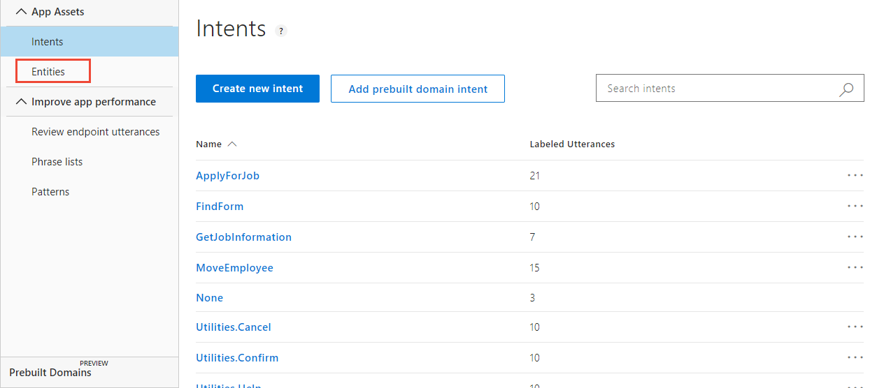
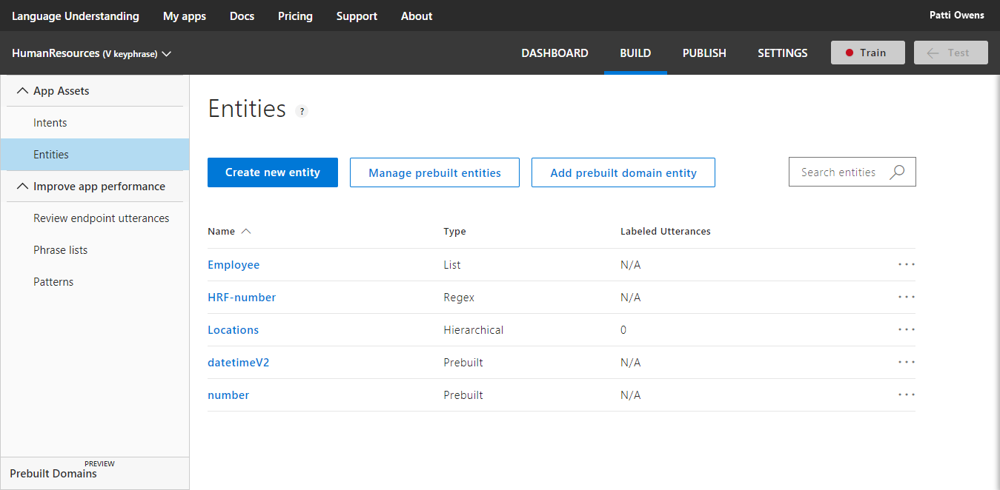

---
title: Tutorial create a LUIS app that returns key phrases - Azure | Microsoft Docs 
description: In this tutorial, learn how to add and return keyPhrase entity to your LUIS app to analyze utterances for key subject matter. 
services: cognitive-services
author: diberry
manager: cjgronlund

ms.service: cognitive-services
ms.component: luis
ms.topic: tutorial
ms.date: 08/02/2018
ms.author: diberry
#Customer intent: As a new user, I want to understand key subject matter in a user's utterances. 

--- 

# Tutorial: 8. Add keyPhrase entity 
In this tutorial, use an app that demonstrates how to extract key subject matter from utterances.

<!-- green checkmark -->
> [!div class="checklist"]
> * Understand keyPhrase entities 
> * Use LUIS app in Human Resources (HR) domain 
> * Add keyPhrase entity to extract content from utterance
> * Train, and publish app
> * Query endpoint of app to see LUIS JSON response including key phrases

[!INCLUDE [LUIS Free account](../../../includes/cognitive-services-luis-free-key-short.md)]

## Before you begin
If you don't have the Human Resources app from the [simple entity](luis-quickstart-primary-and-secondary-data.md) tutorial, [import](luis-how-to-start-new-app.md#import-new-app) the JSON into a new app in the [LUIS](luis-reference-regions.md#luis-website) website. The app to import is found in the [LUIS-Samples](https://github.com/Microsoft/LUIS-Samples/blob/master/documentation-samples/quickstarts/custom-domain-simple-HumanResources.json) Github repository.

If you want to keep the original Human Resources app, clone the version on the [Settings](luis-how-to-manage-versions.md#clone-a-version) page, and name it `keyphrase`. Cloning is a great way to play with various LUIS features without affecting the original version. 

## keyPhrase entity extraction
Key subject matter is provided by the prebuilt entity, **keyPhrase**. This entity returns key subject matter in the utterance.

The following utterances show examples of key phrases:

|Utterance|keyPhrase entity values|
|--|--|
|Is there a new medical plan with a lower deductible offered next year?|"lower deductible"<br>"new medical plan"<br>"year"|
|Is vision therapy covered in the high deductible medical plan?|"high deductible medical plan"<br>"vision therapy"|

Your client application can use these values, along with other extracted entities, to decide the next step in the conversation.

## Add keyPhrase entity 
Add keyPhrase prebuilt entity to extract subject matter from utterances.

1. Make sure your Human Resources app is in the **Build** section of LUIS. You can change to this section by selecting **Build** on the top, right menu bar. 

2. Select **Entities** from the left menu.

    [ ](./media/luis-quickstart-intent-and-key-phrase/hr-select-entities-button.png#lightbox)

3. Select **Manage prebuilt entities**.

    [ ](./media/luis-quickstart-intent-and-key-phrase/hr-manage-prebuilt-entities.png#lightbox)

4. In the pop-up dialog, Select **keyPhrase**, then select **Done**. 

    [ ](./media/luis-quickstart-intent-and-key-phrase/hr-add-or-remove-prebuilt-entities.png#lightbox)

    <!-- TBD: asking Carol
    You won't see these entities labeled in utterances on the intents pages. 
    -->
5. Select **Intents** from the left menu, then select the **Utilities.Confirm** intent. The keyPhrase entity is labeled in several utterances. 

    [ ](./media/luis-quickstart-intent-and-key-phrase/hr-keyphrase-labeled.png#lightbox)

## Train the LUIS app

[!INCLUDE [LUIS How to Train steps](../../../includes/cognitive-services-luis-tutorial-how-to-train.md)]

## Publish app to endpoint

[!INCLUDE [LUIS How to Publish steps](../../../includes/cognitive-services-luis-tutorial-how-to-publish.md)]


## Query the endpoint with an utterance

1. [!INCLUDE [LUIS How to get endpoint first step](../../../includes/cognitive-services-luis-tutorial-how-to-get-endpoint.md)]

2. Go to the end of the URL in the address and enter `does form hrf-123456 cover the new dental benefits and medical plan`. The last querystring parameter is `q`, the utterance **query**. 

```
{
  "query": "does form hrf-123456 cover the new dental benefits and medical plan",
  "topScoringIntent": {
    "intent": "FindForm",
    "score": 0.9300641
  },
  "intents": [
    {
      "intent": "FindForm",
      "score": 0.9300641
    },
    {
      "intent": "ApplyForJob",
      "score": 0.0359598845
    },
    {
      "intent": "GetJobInformation",
      "score": 0.0141798034
    },
    {
      "intent": "MoveEmployee",
      "score": 0.0112197418
    },
    {
      "intent": "Utilities.StartOver",
      "score": 0.00507669244
    },
    {
      "intent": "None",
      "score": 0.00238501839
    },
    {
      "intent": "Utilities.Help",
      "score": 0.00202810857
    },
    {
      "intent": "Utilities.Stop",
      "score": 0.00102957746
    },
    {
      "intent": "Utilities.Cancel",
      "score": 0.0008688423
    },
    {
      "intent": "Utilities.Confirm",
      "score": 3.557994E-05
    }
  ],
  "entities": [
    {
      "entity": "hrf-123456",
      "type": "HRF-number",git 
      "startIndex": 10,
      "endIndex": 19
    },
    {
      "entity": "new dental benefits",
      "type": "builtin.keyPhrase",
      "startIndex": 31,
      "endIndex": 49
    },
    {
      "entity": "medical plan",
      "type": "builtin.keyPhrase",
      "startIndex": 55,
      "endIndex": 66
    },
    {
      "entity": "hrf",
      "type": "builtin.keyPhrase",
      "startIndex": 10,
      "endIndex": 12
    },
    {
      "entity": "-123456",
      "type": "builtin.number",
      "startIndex": 13,
      "endIndex": 19,
      "resolution": {
        "value": "-123456"
      }
    }
  ]
}
```

While searching for a form, the user provided more information than was necessary to find the form. The additional information is returned as **builtin.keyPhrase**. The client application can use this additional information for a follow-up question, such as "Would you like to talk to a Human Resource representative about new dental benefits" or provide a menu with more options including "More information about new dental benefits or medical plan."

## What has this LUIS app accomplished?
This app, with keyPhrase entity detection, identified a natural language query intention and returned the extracted data including the main subject matter. 

Your chatbot now has enough information to determine the next step in the conversation. 

## Where is this LUIS data used? 
LUIS is done with this request. The calling application, such as a chatbot, can take the topScoringIntent result and the keyPhrase data from the utterance to take the next step. LUIS doesn't do that programmatic work for the bot or calling application. LUIS only determines what the user's intention is. 

## Clean up resources

[!INCLUDE [LUIS How to clean up resources](../../../includes/cognitive-services-luis-tutorial-how-to-clean-up-resources.md)]

## Next steps

> [!div class="nextstepaction"]
> [Add sentiment analysis to app](luis-quickstart-intent-and-sentiment-analysis.md)