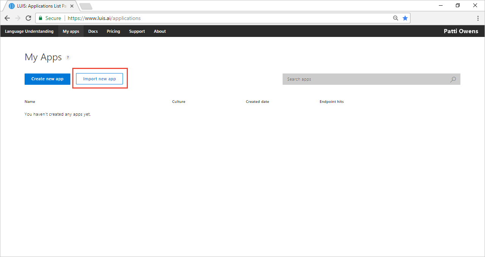
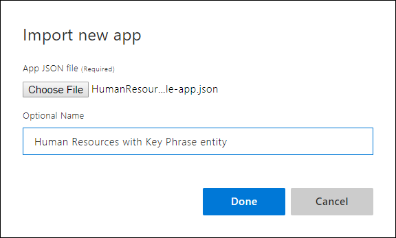
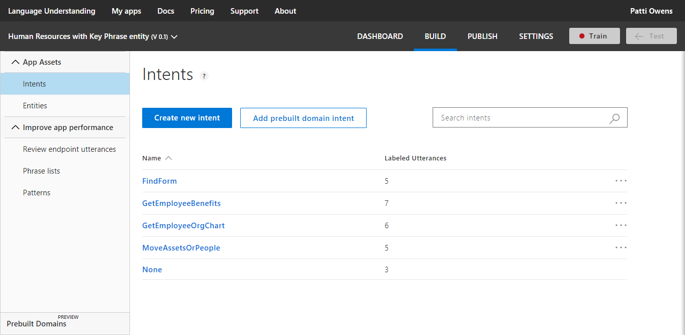
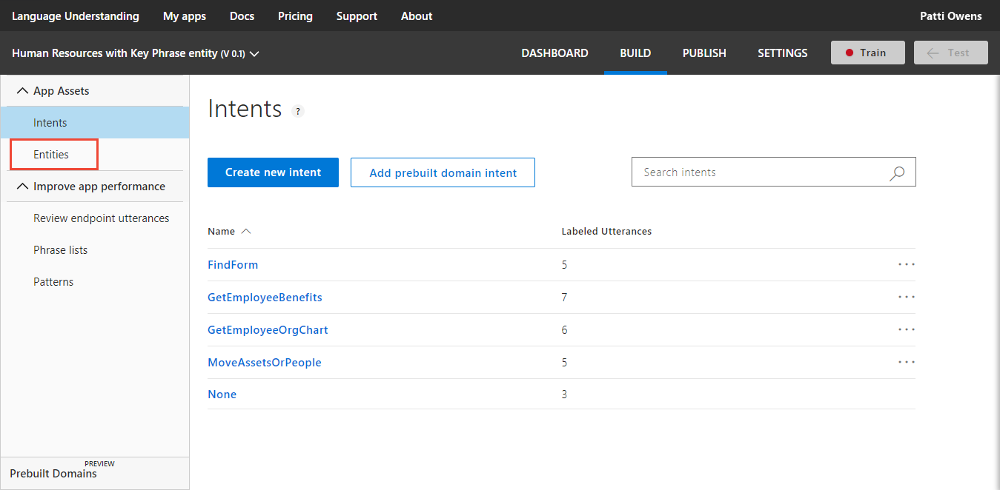
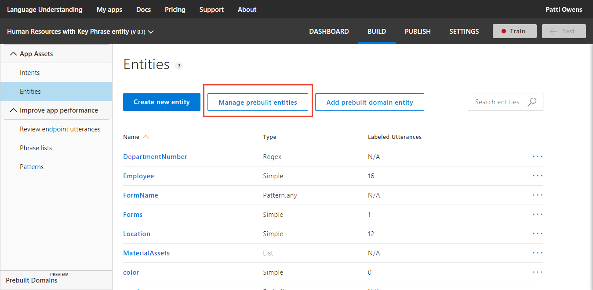
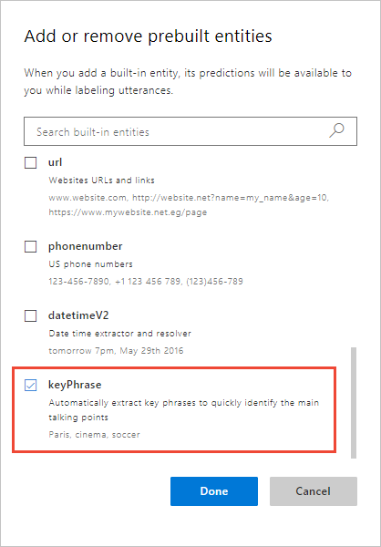
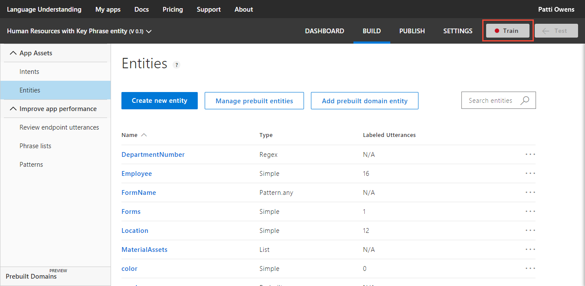
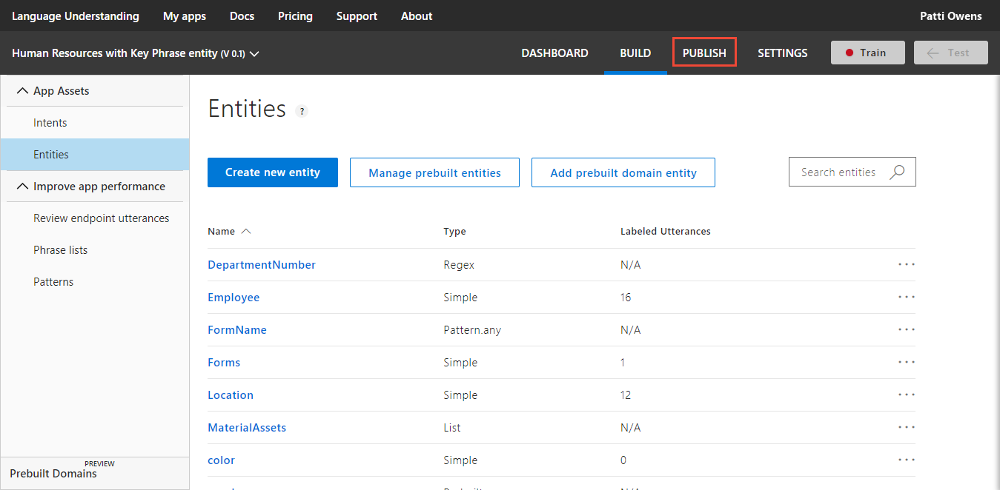
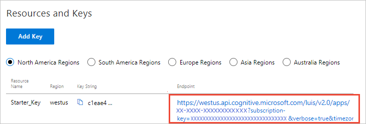

---
title: Tutorial create a LUIS app that returns key phrases - Azure | Microsoft Docs 
description: In this tutorial, learn how to add and return keyPhrase entity to your LUIS app to analyze utterances for key subject matter. 
services: cognitive-services
author: v-geberr
manager: kaiqb 

ms.service: cognitive-services
ms.component: luis
ms.topic: tutorial
ms.date: 05/07/2018
ms.author: v-geberr
#Customer intent: As a new user, I want to understand key subject matter in a user's utterances. 

--- 

# Tutorial: Create app that returns keyPhrases entity data found in utterances
In this tutorial, create an app that demonstrates how to extract key subject matter from utterances.

<!-- green checkmark -->
> [!div class="checklist"]
> * Understand keyPhrase entities 
> * Create new LUIS app for the human resources domain
> * Add _None_ intent and add example utterances
> * Add keyPhrase entity to extract content from utterance
> * Train, and publish app
> * Query endpoint of app to see LUIS JSON response

For this article, you can use the free [LUIS][LUIS] account in order to author your LUIS application.

## keyPhrase entity extraction
Key subject matter is provided by the Prebuilt entity, **keyPhrase**. This entity returns key subject matter in the utterance

The following utterances show examples of key phrases:

|Utterance|keyPhrase entity values|
|--|--|
|Is there a new medical plan with a lower deductible offered next year?|"lower deductible"<br>"new medical plan"<br>"year"|
|Is vision therapy covered in the high deductible medical plan?|"high deductible medical plan"<br>"vision therapy"|

Your chatbot can consider these values, in addition to all other entities extracted, when deciding the next step in the conversation.

## Download sample app
Download the [Human Resources](https://github.com/Microsoft/LUIS-Samples/blob/master/documentation-samples/quickstarts/HumanResources.json) app and save it to a file with the *.json extension. This sample app recognizes utterances relevant to employee benefits, organization charts, and physical assets.

## Create a new app
1. Log in to the [LUIS][LUIS] website. Make sure to log into the [region][LUIS-regions] where you need the LUIS endpoints published.

2. On the [LUIS][LUIS] website, select **Import new app** to import the Human Resources app downloaded in the previous section. 

    [](media/luis-quickstart-intent-and-key-phrase/app-list.png#lightbox)

3. On the **Import new app** dialog box, name the app `Human Resources with Key Phrase entity`. 

    

    When the app creation process completes, LUIS displays the intents list.

    [](media/luis-quickstart-intent-and-key-phrase/intents-list.png#lightbox)

## Add keyPhrase entity 
Add keyPhrase prebuilt entity to extract subject matter from utterances.

1. Select **Entities** from the left menu.

    [ ](./media/luis-quickstart-intent-and-key-phrase/select-entities.png#lightbox)

2. Select **Manage prebuilt entities**.

    [ ](./media/luis-quickstart-intent-and-key-phrase/manage-prebuilt-entities.png#lightbox)

3. In the pop-up dialog, Select **keyPhrase**, then select **Done**. 

    [ ](./media/luis-quickstart-intent-and-key-phrase/add-or-remove-prebuilt-entities.png#lightbox)

    <!-- TBD: asking Carol
    You won't see these entities labeled in utterances on the intents pages. 
    -->

## Train the LUIS app
LUIS doesn't know about this change to the model until it is trained. 

1. In the top right side of the LUIS website, select the **Train** button.

    

2. Training is complete when you see the green status bar at the top of the website confirming success.

    

## Publish app to endpoint

1. Select **Publish** in the top right navigation.

    

2. Select the Production slot and the **Publish** button.

    [](media/luis-quickstart-intent-and-key-phrase/publish-to-production-expanded.png#lightbox)

3. Publishing is complete when you see the green status bar at the top of the website confirming success.

## Query the endpoint with an utterance

1. On the **Publish** page, select the **endpoint** link at the bottom of the page. This action opens another browser window with the endpoint URL in the address bar. 

    

2. Go to the end of the URL in the address and enter `Is there a new medical plan with a lower deductible offered next year?`. The last querystring parameter is `q`, the utterance **query**. 

```
{
  "query": "Is there a new medical plan with a lower deductible offered next year?",
  "topScoringIntent": {
    "intent": "FindForm",
    "score": 0.216838628
  },
  "entities": [
    {
      "entity": "lower deductible",
      "type": "builtin.keyPhrase",
      "startIndex": 35,
      "endIndex": 50
    },
    {
      "entity": "new medical plan",
      "type": "builtin.keyPhrase",
      "startIndex": 11,
      "endIndex": 26
    },
    {
      "entity": "year",
      "type": "builtin.keyPhrase",
      "startIndex": 65,
      "endIndex": 68
    }
  ]
}
```

## What has this LUIS app accomplished?
This app, with keyPhrase entity detection, identified a natural language query intention and returned the extracted data including the main subject matter. 

Your chatbot now has enough information to determine the next step in the conversation. 

## Where is this LUIS data used? 
LUIS is done with this request. The calling application, such as a chatbot, can take the topScoringIntent result and the keyPhrase data from the utterance to take the next step. LUIS doesn't do that programmatic work for the bot or calling application. LUIS only determines what the user's intention is. 

## Clean up resources
When no longer needed, delete the LUIS app. To do so, select the three dot menu (...) to the right of the app name in the app list, select **Delete**. On the pop-up dialog **Delete app?**, select **Ok**.

## Next steps

> [!div class="nextstepaction"]
> [Create app that returns sentiment along with intent prediction](luis-quickstart-intent-and-sentiment-analysis.md)

<!--References-->
[LUIS]:luis-reference-regions.md#luis-website
[LUIS-regions]:luis-reference-regions.md#publishing-regions
