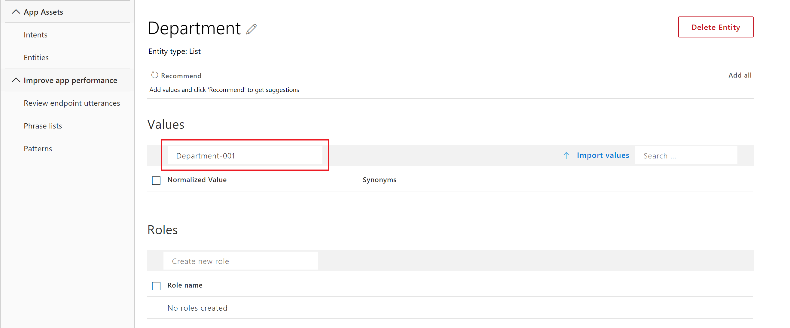
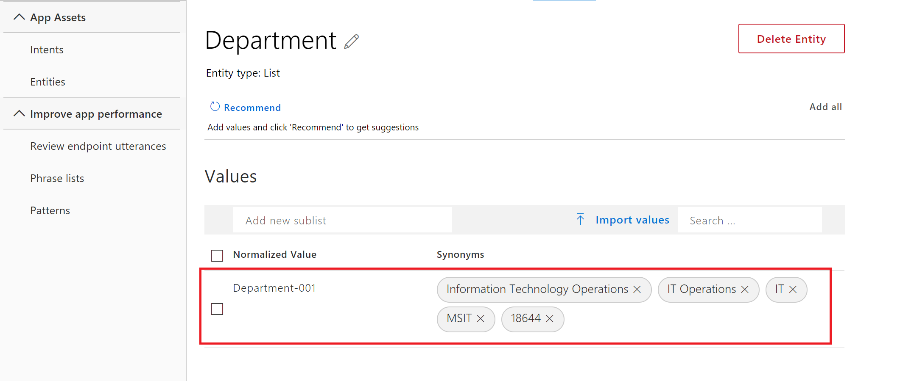
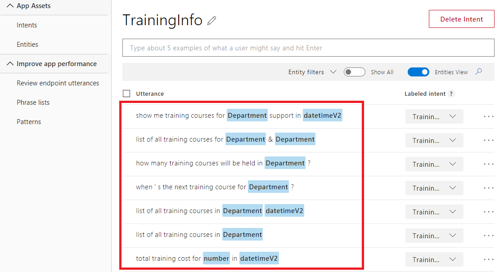

---
title: "Tutorial 4: Exact text match - LUIS list entity"
titleSuffix: Azure Cognitive Services
description: Get data that matches a predefined list of items. Each item on the list can have synonyms that also match exactly
services: cognitive-services
author: diberry
manager: cgronlun
ms.service: cognitive-services
ms.component: language-understanding
ms.topic: tutorial
ms.date: 09/09/2018
ms.author: diberry
#Customer intent: As a new user, I want to understand how and why to use the list entity. 
--- 

# Tutorial 4: Extract exact text matches
In this tutorial, understand how to get data that matches a predefined list of items. Each item on the list can include a list of synonyms. For the human resources app, a department can be identified be several key pieces of information such as name, short name, code for department, and cost center number for the company.

The Human Resources app needs to determine which training courses are on the list for every department. For an utterance about a list of training courses for department, LUIS determines the intent, and extracts the department so that a standard query to list all training courses for that department by the client application.

This app uses a list entity to extract the department. The department can be referred to using full name, short name, code for the department, or cost center number for the company.

A list entity is a good choice for this type of data when:

* The data values are a known set.
* The set doesn't exceed the maximum LUIS [boundaries](luis-boundaries.md) for this entity type.
* The text in the utterance is an exact match with a synonym or the canonical name.

**In this tutorial, you learn how to:**

<!-- green checkmark -->
> [!div class="checklist"]
> * Use existing tutorial app
> * Add TrainingInfo intent
> * Add list entity
> * Train
> * Publish
> * Get intents and entities from endpoint

[!include[LUIS Free account](../../../includes/cognitive-services-luis-free-key-short.md)]

## Use existing app
Continue with the app created in the last tutorial, named **HumanResources**.

If you do not have the HumanResources app from the previous tutorial, use the following steps:

1.  Download and save [app JSON file](https://github.com/Microsoft/LUIS-Samples/blob/master/documentation-samples/tutorials/custom-domain-regex-HumanResources.json).

2. Import the JSON into a new app.

3. From the **Manage** section, on the **Versions** tab, clone the version, and name it `list`. Cloning is a great way to play with various LUIS features without affecting the original version. Because the version name is used as part of the URL route, the name can't contain any characters that are not valid in a URL.


## TrainingInfo intent

1. [!include[Start in Build section](../../../includes/cognitive-services-luis-tutorial-build-section.md)]

2. Select **Create new intent**. 

3. Enter `TrainingInfo` in the pop-up dialog box then select **Done**. 

    

4. Add example utterances to the intent.

    |Example utterances|
    |--|
    |show me training courses for IT support in December|
    |show me upcoming training courses for Marketing & Operations|
    |total training cost for 18644 in April 2018|
    |list of all training courses in MSIT|
    |list of all training courses in MSIT last month|
    |when's the next training course for MSMO?|
    |how many training courses will be held in M&O?|
    |list of all training courses for MSIT & M&O|

    [  ](./media/luis-quickstart-intent-and-list-entity/hr-enter-utterances.png#lightbox)

    Remember that number and datetimeV2 were added in a previous tutorial and will be automatically labeled when they are found in any example utterances. However department names are not labeled yet.

    [!include[Do not use too few utterances](../../../includes/cognitive-services-luis-too-few-example-utterances.md)]  

## Department list entity
Now that the **TrainingInfo** intent has example utterances, LUIS needs to understand what a department is.

The primary, _canonical_, name for each item is the department number. For this domain, examples of the synonyms of each canonical name are:

  |Synonym purpose|Synonym value|
  |--|--|
  |Full Org Name|Information Technology Operations|
  |Common Name|IT Operations|
  |Short Name|IT|
  |Company Code|MSIT|
  |Company Cost Center Number|18644|


1. Select **Entities** in the left panel.

2. Select **Create new entity**.

3. In the entity pop-up dialog, enter `Department` for the entity name, and  **List** for entity type. Select **Done**.  
 
    [](./media/luis-quickstart-intent-and-list-entity/hr-list-entity-ddl.png#lightbox)

4. On the Department entity page, enter `Department-001` as the new value.

    [](./media/media/luis-quickstart-intent-and-list-entity/hr-dep1-value.png#lightbox)

5. For Synonyms, add the following values:

    |Synonym purpose|Synonym value|
    |--|--|
    |Full Org Name|Information Technology Operations|
    |Common Name|IT Operations|
    |Short Name|IT|
    |Company Code|MSIT|
    |Company Cost Center Number|18644|

    [](./media/media/luis-quickstart-intent-and-list-entity/hr-dep1-synonyms.png#lightbox)

6. Enter the `Department-046` as a new value.

7. For Synonyms, add the following values:

    |Synonym purpose|Synonym value|
    |--|--|
    |Full Org Name|Marketing and Operations Organization|
    |Common Name|Marketing & Operations|
    |Short Name|M&O|
    |Company Code|MSMO|
    |Company Cost Center Number|18538|

## Train

[!INCLUDE [LUIS How to Train steps](../../../includes/cognitive-services-luis-tutorial-how-to-train.md)]


After training `Department` entities will be detected like below

  [  ](./media/luis-quickstart-intent-and-list-entity/hr-train-utterances.png#lightbox)

## Publish

[!INCLUDE [LUIS How to Publish steps](../../../includes/cognitive-services-luis-tutorial-how-to-publish.md)]

## Get intent and entities from endpoint

1. [!INCLUDE [LUIS How to get endpoint first step](../../../includes/cognitive-services-luis-tutorial-how-to-get-endpoint.md)] 

2. Go to the end of the URL in the address and enter `list of all training courses in December 2016 for MSIT`. The last querystring parameter is `q`, the utterance **q**uery. This utterance is not the same as any of the labeled utterances so it is a good test and should return the `TrainingInfo` intent with `Department` extracted.

  ```JSON
{
  "query": "list of all training courses in December 2016 for MSIT",
  "topScoringIntent": {
    "intent": "TrainingInfo",
    "score": 0.9630022
  },
  "entities": [
    {
      "entity": "msit",
      "type": "Department",
      "startIndex": 50,
      "endIndex": 53,
      "resolution": {
        "values": [
          "Department-001"
        ]
      }
    },
    {
      "entity": "december 2016",
      "type": "builtin.datetimeV2.daterange",
      "startIndex": 32,
      "endIndex": 44,
      "resolution": {
        "values": [
          {
            "timex": "2016-12",
            "type": "daterange",
            "start": "2016-12-01",
            "end": "2017-01-01"
          }
        ]
      }
    },
    {
      "entity": "2016",
      "type": "builtin.number",
      "startIndex": 41,
      "endIndex": 44,
      "resolution": {
        "subtype": "integer",
        "value": "2016"
      }
    }
  ]
}
  ```

  The department was found and returned as type `Department` with a resolution value of `Department-001`.


## Clean up resources

[!INCLUDE [LUIS How to clean up resources](../../../includes/cognitive-services-luis-tutorial-how-to-clean-up-resources.md)]

## Next steps
This tutorial created a new intent, added example utterances, then created a list entity to extract exact text matches from utterances. After training, and publishing the app, a query to the endpoint identified the intention and returned the extracted data.

> [!div class="nextstepaction"]
> [Add a hierarchical entity to the app](luis-quickstart-intent-and-hier-entity.md)
