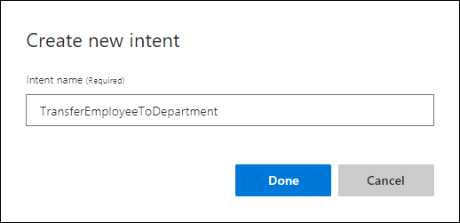
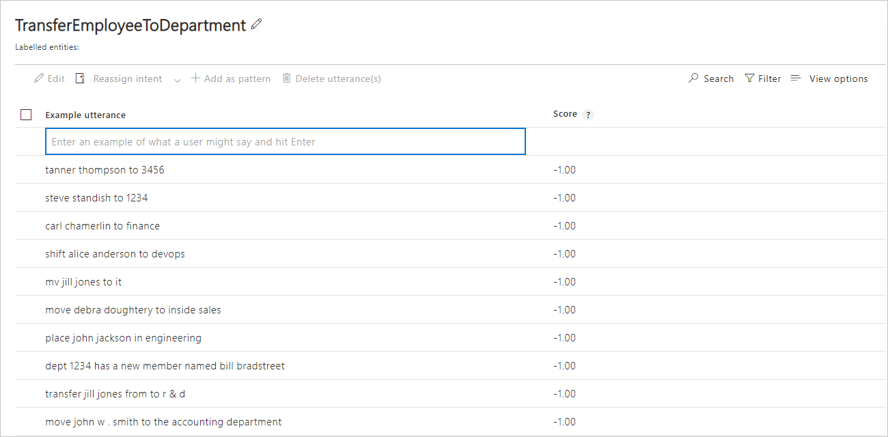

# Tutorial: Get exact text-matched data from an utterance

In this tutorial, understand how to get entity data that matches a predefined list of items. 

**In this tutorial, you learn how to:**

<!-- green checkmark -->
> [!div class="checklist"]
> * Create app
> * Add intent
> * Add list entity 
> * Train 
> * Publish
> * Get intents and entities from endpoint

[!INCLUDE [LUIS Free account](../../../includes/cognitive-services-luis-free-key-short.md)]

## What is a list entity?

A list entity is an exact text match to the words in the utterance. 

Each item on the list can include a list of synonyms. For the human resources app, a company department can be identified by several key pieces of information such as an official name, common acronyms, and billing department codes. 

The Human Resources app needs to determine the department an employee is transferring to. 

A list entity is a good choice for this type of data when:

* The data values are a known set.
* The set doesn't exceed the maximum LUIS [boundaries](luis-boundaries.md) for this entity type.
* The text in the utterance is an exact match with a synonym or the canonical name. LUIS doesn't use the list beyond exact text matches. Stemming, plurals, and other variations are not resolved with just a list entity. To manage variations, consider using a [pattern](luis-concept-patterns.md#syntax-to-mark-optional-text-in-a-template-utterance) with the optional text syntax. 

## Create a new app

[!INCLUDE [Follow these steps to create a new LUIS app](../../../includes/cognitive-services-luis-create-new-app-steps.md)]

## Create an intent to transfer employees to a different department

1. [!INCLUDE [Start in Build section](../../../includes/cognitive-services-luis-tutorial-build-section.md)]

2. Select **Create new intent**. 

3. Enter `TransferEmployeeToDepartment` in the pop-up dialog box then select **Done**. 

    

4. Add example utterances to the intent.

    |Example utterances|
    |--|
    |move John W. Smith to the accounting department|
    |transfer Jill Jones from to R&D|
    |Dept 1234 has a new member named Bill Bradstreet|
    |Place John Jackson in Engineering |
    |move Debra Doughtery to Inside Sales|
    |mv Jill Jones to IT|
    |Shift Alice Anderson to DevOps|
    |Carl Chamerlin to Finance|
    |Steve Standish to 1234|
    |Tanner Thompson to 3456|

    [](media/luis-quickstart-intent-and-list-entity/intent-transfer-employee-to-department.png#lightbox)

    [!INCLUDE [Do not use too few utterances](../../../includes/cognitive-services-luis-too-few-example-utterances.md)]  

## Department list entity

Now that the **TransferEmployeeToDepartment** intent has example utterances, LUIS needs to understand what is a department. 

The primary, _canonical_, name for each item is the department name. Examples of the synonyms of each canonical name are: 

|Canonical name|Synonyms|
|--|--|
|Accounting|acct<br>accting<br>3456|
|Development Operations|Devops<br>4949|
|Engineering|eng<br>enging<br>4567|
|Finance|fin<br>2020|
|Information Technology|IT<br>2323|
|Inside Sales|isale<br>insale<br>1414|
|Research and Development|R&D<br>1234|

1. Select **Entities** in the left panel.

1. Select **Create new entity**.

1. In the entity pop-up dialog, enter `Department` for the entity name, and  **List** for entity type. Select **Done**.  

    [](media/luis-quickstart-intent-and-list-entity/create-new-list-entity-named-department.png#lightbox)

1. On the Department entity page, enter `Accounting` as the new value.

1. For Synonyms, add the synonyms from the previous table.

1. Continue adding all the canonical names and their synonyms. 

## Add example utterances to the None intent 

[!INCLUDE [Follow these steps to add the None intent to the app](../../../includes/cognitive-services-luis-create-the-none-intent.md)]

## Train the app so the changes to the intent can be tested 

[!INCLUDE [LUIS How to Train steps](../../../includes/cognitive-services-luis-tutorial-how-to-train.md)]

## Publish the app so the trained model is queryable from the endpoint

[!INCLUDE [LUIS How to Publish steps](../../../includes/cognitive-services-luis-tutorial-how-to-publish.md)]

## Get intent and entity prediction from endpoint

1. [!INCLUDE [LUIS How to get endpoint first step](../../../includes/cognitive-services-luis-tutorial-how-to-get-endpoint.md)] 

1. Go to the end of the URL in the address and enter `shift Joe Smith to IT`. The last querystring parameter is `q`, the utterance **q**uery. This utterance is not the same as any of the labeled utterances so it is a good test and should return the `TransferEmployeeToDepartment` intent with `Department` extracted.

   ```json
    {
      "query": "shift Joe Smith to IT",
      "topScoringIntent": {
        "intent": "TransferEmployeeToDepartment",
        "score": 0.9775754
      },
      "intents": [
        {
          "intent": "TransferEmployeeToDepartment",
          "score": 0.9775754
        },
        {
          "intent": "None",
          "score": 0.0154493852
        }
      ],
      "entities": [
        {
          "entity": "it",
          "type": "Department",
          "startIndex": 19,
          "endIndex": 20,
          "resolution": {
            "values": [
              "Information Technology"
            ]
          }
        }
      ]
    }
   ```

## Clean up resources

[!INCLUDE [LUIS How to clean up resources](../../../includes/cognitive-services-luis-tutorial-how-to-clean-up-resources.md)]

## Related information

* [List entity](luis-concept-entity-types.md#list-entity) conceptual information
* [How to train](luis-how-to-train.md)
* [How to publish](luis-how-to-publish-app.md)
* [How to test in LUIS portal](luis-interactive-test.md)


## Next steps
This tutorial created a new intent, added example utterances, then created a list entity to extract exact text matches from utterances. After training, and publishing the app, a query to the endpoint identified the intention and returned the extracted data.

Continue with this app, [adding a composite entity](luis-tutorial-composite-entity.md).

> [!div class="nextstepaction"]
> [Add prebuilt entity with a role to the app](tutorial-entity-roles.md)

