---
title: Create a LUIS app to get white listed data - Azure | Microsoft Docs 
description: Learn how to create a simple LUIS app using intents and list entities to extract data. 
services: cognitive-services
author: v-geberr
manager: kaiqb 

ms.service: cognitive-services
ms.component: luis
ms.topic: article
ms.date: 05/07/2018
ms.author: v-geberr
--- 

# Simple app with intents and a list entity
This simple app has two [intents](luis-concept-intent.md) and one list [entity](luis-concept-entity-types.md). Its purpose is to take drink orders such as `1 coke and 1 milk please`. 

## App intents
The intents are categories of what the user wants. This app has two intents: OrderDrink and None. The [None](luis-concept-intent.md#none-intent-is-fallback-for-app) intent is purposeful, to indicate anything outside the app.  

## List entity is an exact text match
The purpose of the entity is to find and categorize parts of the text in the utterance. 
A [list](luis-concept-entity-types.md) entity allows for an exact match of words or phrases.  

For this drink app, LUIS extracts the drink order in such as way that a standard order can be created and filled. LUIS allows utterances to have variations, abbreviations, and slang. 

Simple example utterances from users include:

```
2 glasses of milk
3 bottles of water
2 cokes
```

Abbreviated or slang versions of utterances include:

```
5 milk
3 h2o
1 pop
```
 
The list entity matches `h2o` to water, and `pop` to soft drink.  

## What LUIS does
When the intent and entities of the utterance are identified, [extracted](luis-concept-data-extraction.md#list-entity-data), and returned in JSON from the [endpoint](https://aka.ms/luis-endpoint-apis), LUIS is done. The calling application or chat bot takes that JSON response and fulfills the request -- in whatever way the app or chat bot is designed to do. 

## Create a new app
1. Log in to the [LUIS][LUIS] website. Make sure to log into the [region][LUIS-regions] where you need the LUIS endpoints published.

2. On the [LUIS][LUIS] website, select **Create new app**.  

    

3. In the pop-up dialog, enter the name `MyDrinklist`. 

    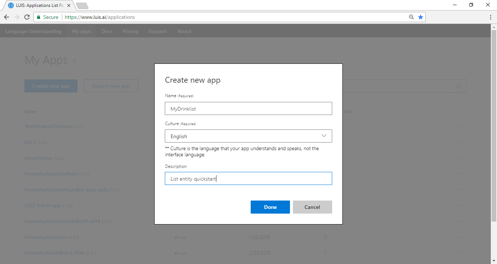

4. When that process finishes, the app shows the **Intents** page with the **None** Intent. 

    [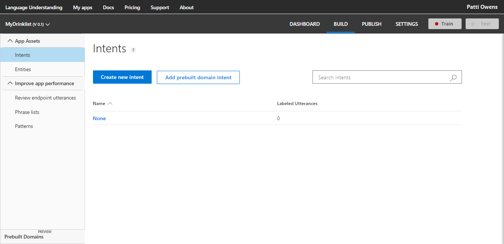](media/luis-quickstart-intent-and-list-entity/intents-page-none-only.png#lightbox)

## Create a new intent

1. On the **Intents** page, select **Create new intent**. 

    [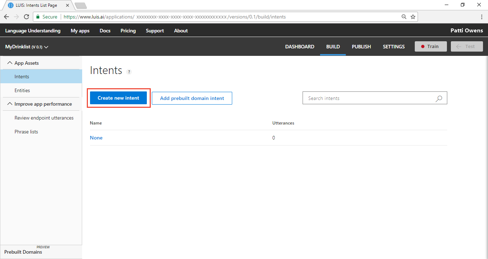](media/luis-quickstart-intent-and-list-entity/create-new-intent.png#lightbox)

2. Enter the new intent name `OrderDrinks`. This intent should be selected any time a user wants to order a drink.

    By creating an intent, you are creating the primary category of information that you want to identify. Giving the category a name allows any other application that uses the LUIS query results to use that category name to find an appropriate answer or take appropriate action. LUIS won't answer these questions, only identify what type of information is being asked for in natural language. 

    [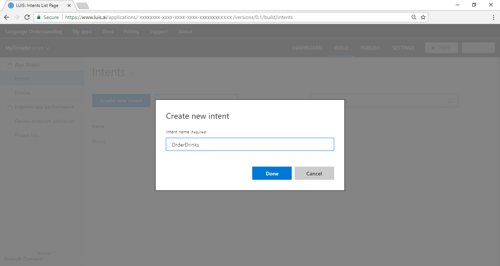](media/luis-quickstart-intent-and-list-entity/intent-create-dialog-order-drinks.png#lightbox)

3. Add several utterances to the `OrderDrinks` intent that you expect a user to ask for, such as:

    | Example utterances|
    |--|
    |Please send 2 cokes and a bottle of water to my room|
    |2 perriers with a twist of lime|
    |h20|

    [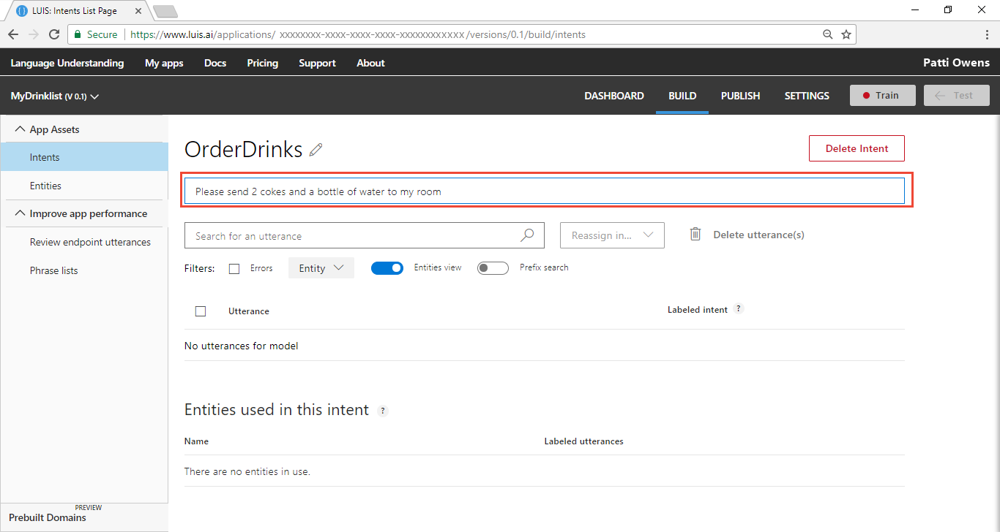](media/luis-quickstart-intent-and-list-entity/intent-order-drinks-utterance.png#lightbox)

## Add utterances to None intent

The LUIS app currently has no utterances for the **None** intent. It needs utterances that you don't want the app to answer, so it has to have utterances in the **None** intent. Do not leave it empty. 

1. Select **Intents** from the left panel. 

    [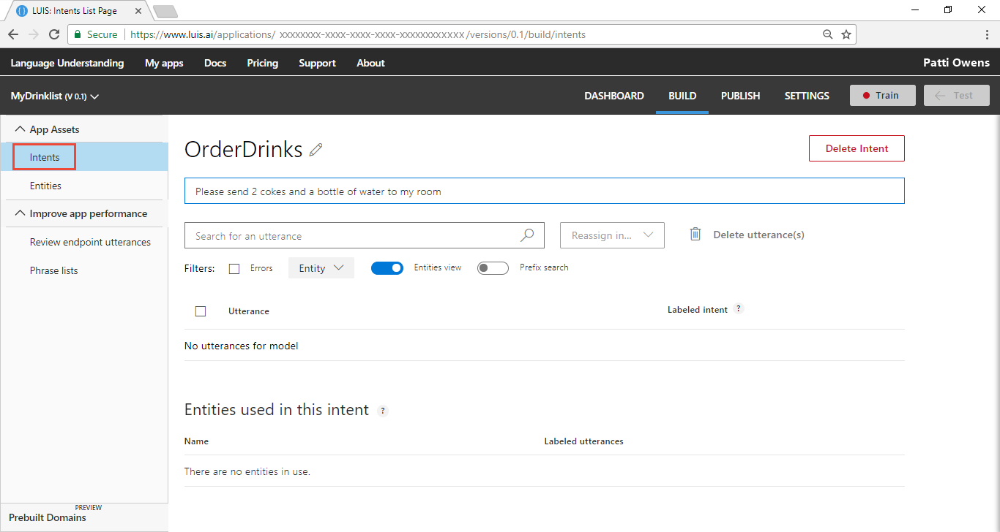](media/luis-quickstart-intent-and-list-entity/left-panel-intents.png#lightbox)

2. Select the **None** intent. Add three utterances that your user might enter but are not relevant to your app:

    | Example utterances|
    |--|
    |Cancel!|
    |Good bye|
    |What is going on?|

## When the utterance is predicted for the None intent
In your LUIS-calling application (such as a chat bot), when LUIS returns the **None** intent for an utterance, your bot can ask if the user wants to end the conversation. The bot can also give more directions for continuing the conversation if the user doesn't want to end it. 

Entities work in the **None** intent. If the top scoring intent is **None** but an entity is extracted that is meaningful to your chat bot, your chat bot can follow up with a question that focuses the customer's intent. 

## Create a menu entity from the Intent page
Now that the two intents have utterances, LUIS needs to understand what a drink is. Navigate back to the `OrderDrinks` intent and label (mark) the drinks in an utterance by following the steps:

1. Return to the `OrderDrinks` intent by selecting **Intents** in the left panel.

2. Select `OrderDrinks` from the intents list.

3. In the utterance, `Please send 2 cokes and a bottle of water to my room`, select the word `water`. A drop-down menu appears with a text box at the top to create a new entity. Enter the entity name `Drink` in the text box then select **Create new entity** in the drop-down menu. 

    [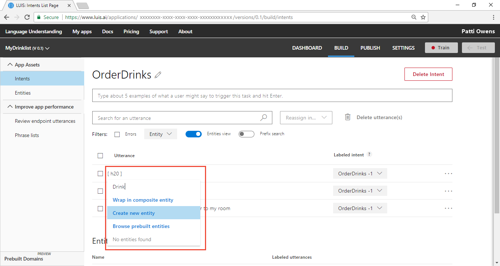](media/luis-quickstart-intent-and-list-entity/intent-label-h2o-in-utterance.png#lightbox)

4. In the pop-up window, select the **List** entity type. Add synonym `h20`. Select the enter key after each synonym. Don't add `perrier` to the synonym list. That is added in the next step as an example. Select **Done**.

    [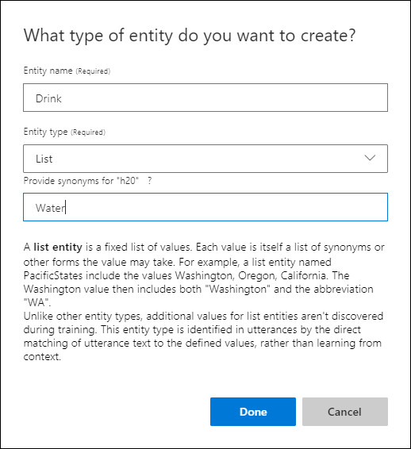](media/luis-quickstart-intent-and-list-entity/create-list-ddl.png#lightbox)

5. Now that the entity is created, label the other synonyms for water by selecting the synonym for water, then select `Drink` in the drop-down list. Follow the menu to the right, then select `Set as synonym`, then select `water`.

    [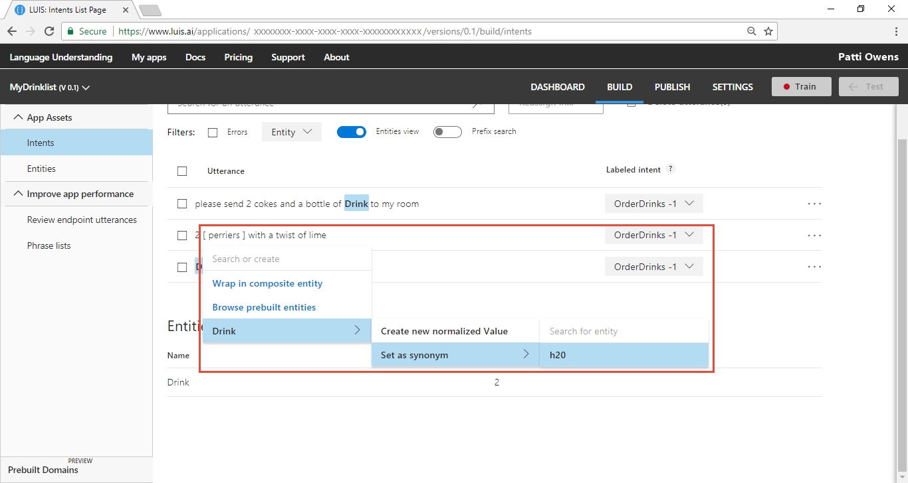](media/luis-quickstart-intent-and-list-entity/intent-label-perriers.png#lightbox)

## Modify the list entity from the Entity page
The drink list entity is created but doesn't have many items and synonyms. If you know some of the terms, abbreviations, and slang, it is quicker to fill in the list on the **Entity** page. 

1. Select **Entities** from the left panel.

    [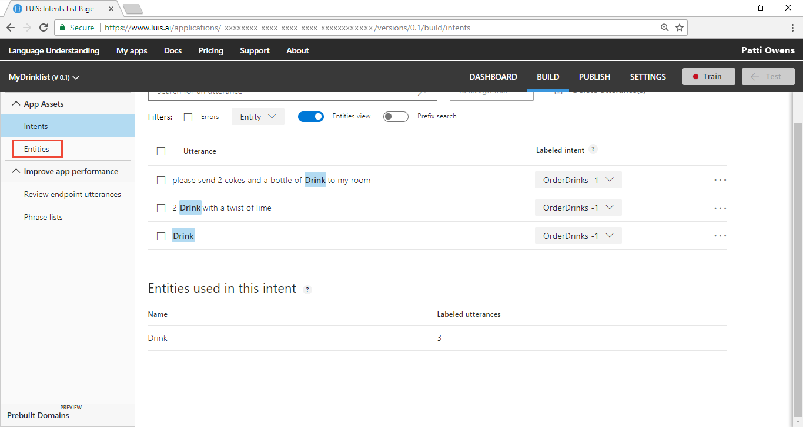](media/luis-quickstart-intent-and-list-entity/intent-select-entities.png#lightbox)

2. Select `Drink` from entities list.

    [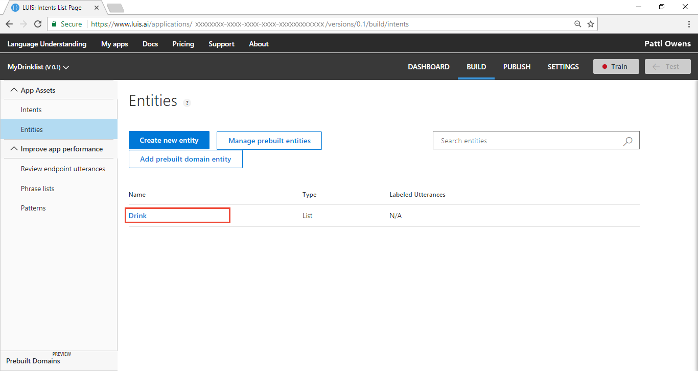](media/luis-quickstart-intent-and-list-entity/entities-select-drink-entity.png#lightbox)

3. In the text box, enter `Soda pop`, then select enter. This is a term that is broadly applied to carbonated drinks. Every culture has a nick-name or slang term for this type of drink.

    [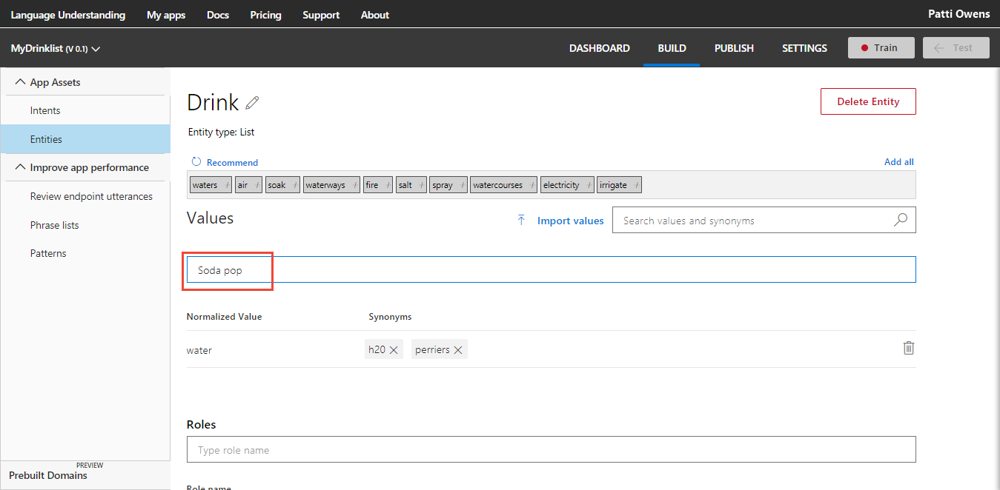](media/luis-quickstart-intent-and-list-entity/drink-entity-enter-canonical-name.png#lightbox)

4. On the same row as `Soda pop`, enter synonyms such as: 

    ```
    coke
    cokes
    coca-cola
    coca-colas
    ```

    The synonyms can include phrases, punctuation, possessives, and plurals. Since the list entity is an exact text match (except for case), the synonyms need to have every variation. You can expand the list as you learn more variations from the query logs or reviewing endpoint hits. 

    This article has a few synonyms, to keep the example short. A production-level LUIS app would have many synonyms and would be reviewed and expanded on a regular basis. 

    [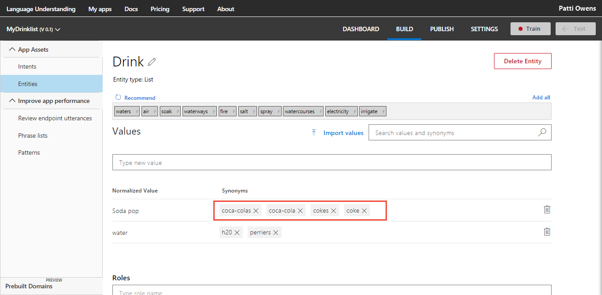](media/luis-quickstart-intent-and-list-entity/drink-entity-enter-synonyms.png#lightbox)

## Train the LUIS app
LUIS doesn't know about the changes to the intents and entities (the model), until it is trained. 

1. In the top right side of the LUIS website, select the **Train** button.

    

2. Training is complete when you see the green status bar at the top of the website confirming success.

    

## Publish the app to get the endpoint URL
In order to get a LUIS prediction in a chat bot or other application, you need to publish the app. 

1. In the top right side of the LUIS website, select the **Publish** button. 

    [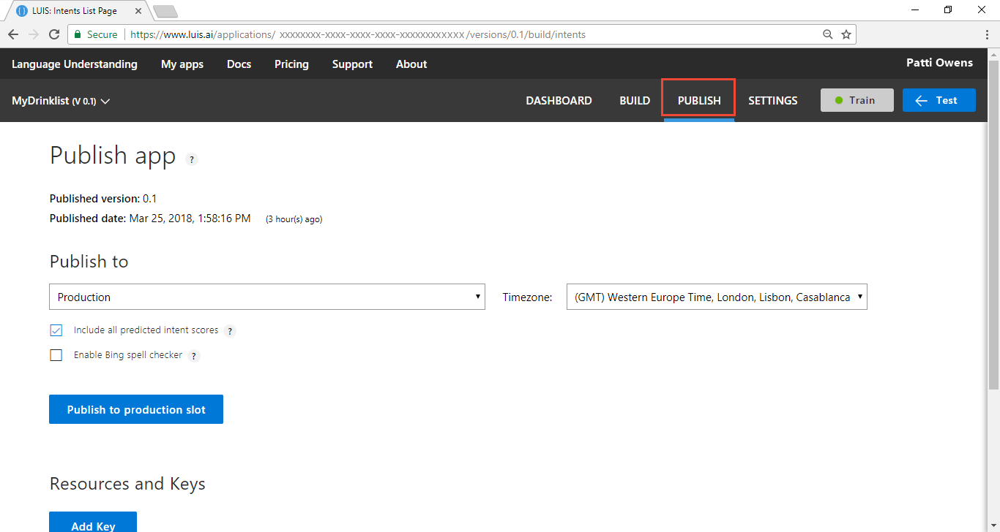](media/luis-quickstart-intent-and-list-entity/publish.png#lightbox)

2. Select the **Publish to production slot**. 

    [](media/luis-quickstart-intent-and-list-entity/publish-to-production.png#lightbox)

3. Publishing is complete when you see the green status bar at the top of the website confirming success.

## Query the endpoint with a different utterance
1. On the **Publish** page, select the **endpoint** link at the bottom of the page. This action opens another browser window with the endpoint URL in the address bar. 

    [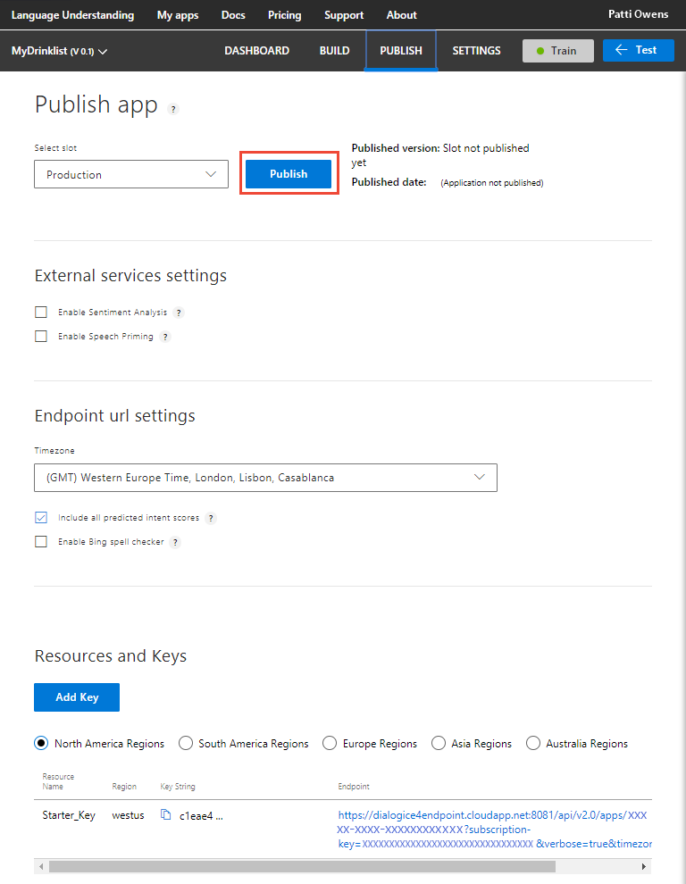](media/luis-quickstart-intent-and-list-entity/publish-select-endpoint.png#lightbox)

2. Go to the end of the URL in the address and enter `2 cokes and 3 waters`. The last querystring parameter is `q`, the utterance **q**uery. This utterance is not the same as any of the labeled utterances so it is a good test and should return the `OrderDrinks` intent with the two drink types of `cokes` and `waters`.

```
{
  "query": "2 cokes and 3 waters",
  "topScoringIntent": {
    "intent": "OrderDrinks",
    "score": 0.999998569
  },
  "intents": [
    {
      "intent": "OrderDrinks",
      "score": 0.999998569
    },
    {
      "intent": "None",
      "score": 0.23884207
    }
  ],
  "entities": [
    {
      "entity": "cokes",
      "type": "Drink",
      "startIndex": 2,
      "endIndex": 6,
      "resolution": {
        "values": [
          "Soda pop"
        ]
      }
    },
    {
      "entity": "waters",
      "type": "Drink",
      "startIndex": 14,
      "endIndex": 19,
      "resolution": {
        "values": [
          "h20"
        ]
      }
    }
  ]
}
```

## Where is the natural language processing in the List entity? 
Because the list entity is an exact text match, it doesn't rely on natural language processing (or machine-learning). LUIS does use natural language processing (or machine-learning) to select the correct top-scoring intent. Additionally, an utterance can be a mix of more than one entity or even more than one type of entity. Each utterance is processed for all the entities in the app, including natural language processing (or machine-learned) entities such as the **Simple** entity.

## What has this LUIS app accomplished?
This app, with just two intents and a list entity, identified a natural language query intention and returned the extracted data. 

Your chat bot now has enough information to determine the primary action, `OrderDrinks`, and what types of drinks were ordered from the Drink list entity. 

## Where is this LUIS data used? 
LUIS is done with this request. The calling application, such as a chat bot, can take the topScoringIntent result and the data from the entity to take the next step. LUIS doesn't do that programmatic work for the bot or calling application.  LUIS only determines what the user's intention is. 

## Next steps

[Learn more about entities](luis-concept-entity-types.md). 

Add the **number** [prebuilt entity](add-entities.md#add-prebuilt-entity) to extract the number for each drink type. 

Add the **dimension** [prebuilt entity](add-entities.md#add-prebuilt-entity) to extract the volume for each drink type such as liters or gallons.


<!--References-->
[LUIS]:luis-reference-regions.md#luis-website
[LUIS-regions]:luis-reference-regions.md#publishing-regions
