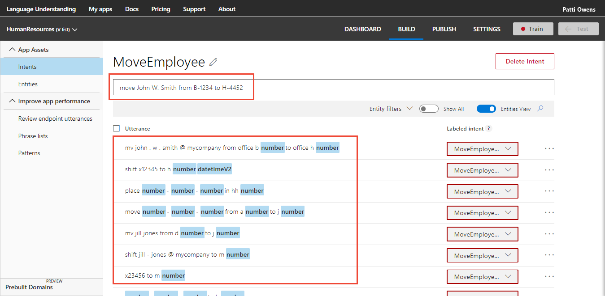
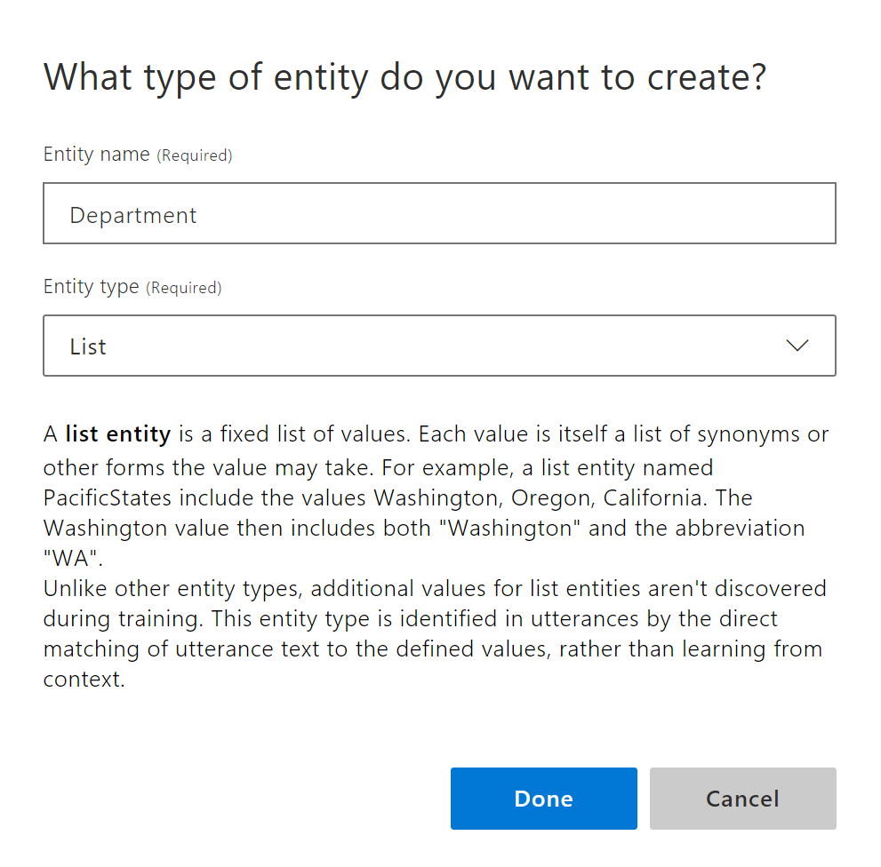
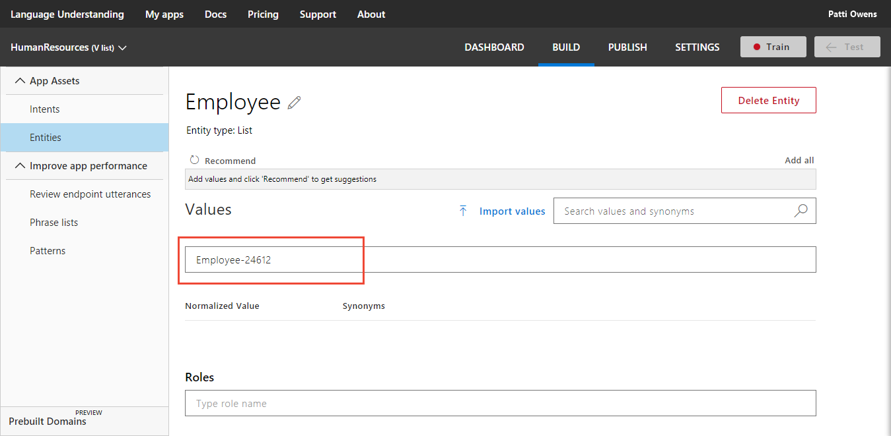
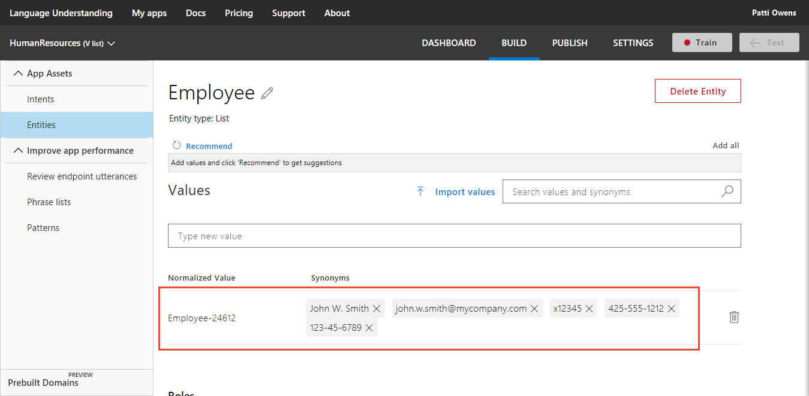

---
title: "Tutorial 4: Exact text match - LUIS list entity"
titleSuffix: Azure Cognitive Services
description: Get data that matches a predefined list of items. Each item on the list can have synonyms that also match exactly
services: cognitive-services
author: diberry
manager: cgronlun
ms.service: cognitive-services
ms.component: language-understanding
ms.topic: tutorial
ms.date: 09/09/2018
ms.author: diberry
#Customer intent: As a new user, I want to understand how and why to use the list entity. 
--- 

# Tutorial 4: Extract exact text matches
In this tutorial, understand how to get data that matches a predefined list of items. Each item on the list can include a list of synonyms. For the human resources app, an employee can be identified be several key pieces of information such as name, email, phone number, and U.S. federal tax ID. 

The Human Resources app needs to determine which employee is moving from one building to a different building. For an utterance about an employee move, LUIS determines the intent, and extracts the employee so that a standard order to move the employee can be created by the client application.

This app uses a list entity to extract the employee. The employee can be referred to using name, company phone extension, mobile phone number, email, or U.S. federal social security number. 

A list entity is a good choice for this type of data when:

* The data values are a known set.
* The set doesn't exceed the maximum LUIS [boundaries](luis-boundaries.md) for this entity type.
* The text in the utterance is an exact match with a synonym or the canonical name. 

**In this tutorial, you learn how to:**

<!-- green checkmark -->
> [!div class="checklist"]
> * Use existing tutorial app
> * Add MoveEmployee intent
> * Add list entity 
> * Train 
> * Publish
> * Get intents and entities from endpoint

[!include[LUIS Free account](../../../includes/cognitive-services-luis-free-key-short.md)]

## Use existing app
Continue with the app created in the last tutorial, named **HumanResources**. 

If you do not have the HumanResources app from the previous tutorial, use the following steps:

1.  Download and save [app JSON file](https://github.com/Microsoft/LUIS-Samples/blob/master/documentation-samples/tutorials/custom-domain-regex-HumanResources.json).

2. Import the JSON into a new app.

3. From the **Manage** section, on the **Versions** tab, clone the version, and name it `list`. Cloning is a great way to play with various LUIS features without affecting the original version. Because the version name is used as part of the URL route, the name can't contain any characters that are not valid in a URL. 


## MoveEmployee intent

1. [!include[Start in Build section](../../../includes/cognitive-services-luis-tutorial-build-section.md)]

2. Select **Create new intent**. 

3. Enter `MoveEmployee` in the pop-up dialog box then select **Done**. 

    

4. Add example utterances to the intent.

    |Example utterances|
    |--|
    |move John W. Smith from B-1234 to H-4452|
    |mv john.w.smith@mycompany.com from office b-1234 to office h-4452|
    |shift x12345 to h-1234 tomorrow|
    |place 425-555-1212 in HH-2345|
    |move 123-45-6789 from A-4321 to J-23456|
    |mv Jill Jones from D-2345 to J-23456|
    |shift jill-jones@mycompany.com to M-12345|
    |x23456 to M-12345|
    |425-555-0000 to h-4452|
    |234-56-7891 to hh-2345|

    [  ](./media/luis-quickstart-intent-and-list-entity/hr-enter-utterances.png#lightbox)

    Remember that number and datetimeV2 were added in a previous tutorial and will be automatically labeled when they are found in any example utterances.

    [!include[Do not use too few utterances](../../../includes/cognitive-services-luis-too-few-example-utterances.md)]  

## Employee list entity
Now that the **MoveEmployee** intent has example utterances, LUIS needs to understand what an employee is. 

The primary, _canonical_, name for each item is the employee number. For this domain, examples of the synonyms of each canonical name are: 

|Synonym purpose|Synonym value|
|--|--|
|Name|John W. Smith|
|Email address|john.w.smith@mycompany.com|
|Phone extension|x12345|
|Personal mobile phone number|425-555-1212|
|U.S. federal social security number|123-45-6789|


1. Select **Entities** in the left panel.

2. Select **Create new entity**.

3. In the entity pop-up dialog, enter `Employee` for the entity name, and  **List** for entity type. Select **Done**.  

    [](media/luis-quickstart-intent-and-list-entity/hr-list-entity-ddl.png#lightbox)

4. On the Employee entity page, enter `Employee-24612` as the new value.

    [](media/luis-quickstart-intent-and-list-entity/hr-emp1-value.png#lightbox)

5. For Synonyms, add the following values:

    |Synonym purpose|Synonym value|
    |--|--|
    |Name|John W. Smith|
    |Email address|john.w.smith@mycompany.com|
    |Phone extension|x12345|
    |Personal mobile phone number|425-555-1212|
    |U.S. federal social security number|123-45-6789|

    [](media/luis-quickstart-intent-and-list-entity/hr-emp1-synonyms.png#lightbox)

6. Enter the `Employee-45612` as a new value.

7. For Synonyms, add the following values:

    |Synonym purpose|Synonym value|
    |--|--|
    |Name|Jill Jones|
    |Email address|jill-jones@mycompany.com|
    |Phone extension|x23456|
    |Personal mobile phone number|425-555-0000|
    |U.S. federal social security number|234-56-7891|

## Train

[!INCLUDE [LUIS How to Train steps](../../../includes/cognitive-services-luis-tutorial-how-to-train.md)]

## Publish

[!INCLUDE [LUIS How to Publish steps](../../../includes/cognitive-services-luis-tutorial-how-to-publish.md)]

## Get intent and entities from endpoint

1. [!INCLUDE [LUIS How to get endpoint first step](../../../includes/cognitive-services-luis-tutorial-how-to-get-endpoint.md)] 

2. Go to the end of the URL in the address and enter `shift 123-45-6789 from Z-1242 to T-54672`. The last querystring parameter is `q`, the utterance **q**uery. This utterance is not the same as any of the labeled utterances so it is a good test and should return the `MoveEmployee` intent with `Employee` extracted.

  ```JSON
  {
    "query": "shift 123-45-6789 from Z-1242 to T-54672",
    "topScoringIntent": {
      "intent": "MoveEmployee",
      "score": 0.9882801
    },
    "intents": [
      {
        "intent": "MoveEmployee",
        "score": 0.9882801
      },
      {
        "intent": "FindForm",
        "score": 0.016044287
      },
      {
        "intent": "GetJobInformation",
        "score": 0.007611245
      },
      {
        "intent": "ApplyForJob",
        "score": 0.007063288
      },
      {
        "intent": "Utilities.StartOver",
        "score": 0.00684710965
      },
      {
        "intent": "None",
        "score": 0.00304174074
      },
      {
        "intent": "Utilities.Help",
        "score": 0.002981
      },
      {
        "intent": "Utilities.Confirm",
        "score": 0.00212222221
      },
      {
        "intent": "Utilities.Cancel",
        "score": 0.00191026414
      },
      {
        "intent": "Utilities.Stop",
        "score": 0.0007461446
      }
    ],
    "entities": [
      {
        "entity": "123 - 45 - 6789",
        "type": "Employee",
        "startIndex": 6,
        "endIndex": 16,
        "resolution": {
          "values": [
            "Employee-24612"
          ]
        }
      },
      {
        "entity": "123",
        "type": "builtin.number",
        "startIndex": 6,
        "endIndex": 8,
        "resolution": {
          "value": "123"
        }
      },
      {
        "entity": "45",
        "type": "builtin.number",
        "startIndex": 10,
        "endIndex": 11,
        "resolution": {
          "value": "45"
        }
      },
      {
        "entity": "6789",
        "type": "builtin.number",
        "startIndex": 13,
        "endIndex": 16,
        "resolution": {
          "value": "6789"
        }
      },
      {
        "entity": "-1242",
        "type": "builtin.number",
        "startIndex": 24,
        "endIndex": 28,
        "resolution": {
          "value": "-1242"
        }
      },
      {
        "entity": "-54672",
        "type": "builtin.number",
        "startIndex": 34,
        "endIndex": 39,
        "resolution": {
          "value": "-54672"
        }
      }
    ]
  }
  ```

  The employee was found and returned as type `Employee` with a resolution value of `Employee-24612`.

## Clean up resources

[!INCLUDE [LUIS How to clean up resources](../../../includes/cognitive-services-luis-tutorial-how-to-clean-up-resources.md)]

## Next steps
This tutorial created a new intent, added example utterances, then created a list entity to extract exact text matches from utterances. After training, and publishing the app, a query to the endpoint identified the intention and returned the extracted data.

> [!div class="nextstepaction"]
> [Add a hierarchical entity to the app](luis-quickstart-intent-and-hier-entity.md)

