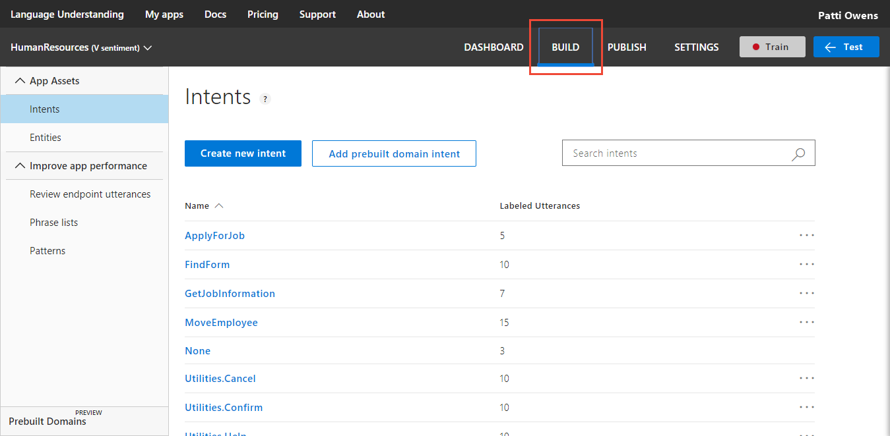
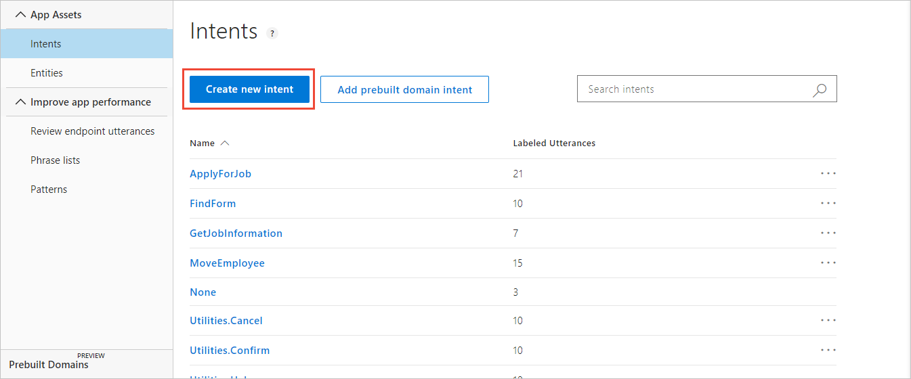
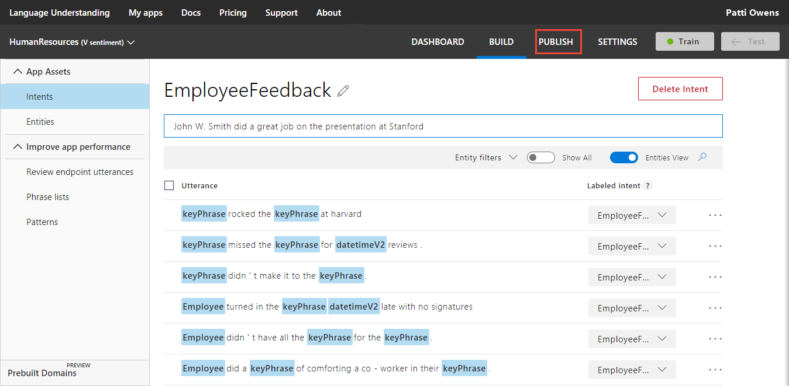

---
title: Tutorial to create a LUIS app that returns sentiment analysis - Azure | Microsoft Docs 
description: In this tutorial, learn how to add sentiment analysis to your LUIS app to analyze utterances for positive, negative, and neutral feelings. 
services: cognitive-services
author: diberry
manager: cjgronlund

ms.service: cognitive-services
ms.component: luis
ms.topic: tutorial
ms.date: 08/02/2018
ms.author: diberry
#Customer intent: As a new user, I want to understand what sentiment is conveyed in a user's utterances. 

--- 

# Tutorial: 9.  Add sentiment analysis
In this tutorial, create an app that demonstrates how to extract positive, negative, and neutral sentiment from utterances.

<!-- green checkmark -->
> [!div class="checklist"]
> * Understand sentiment analysis
> * Use LUIS app in Human Resources (HR) domain 
> * Add sentiment analysis
> * Train, and publish app
> * Query endpoint of app to see LUIS JSON response 

[!INCLUDE [LUIS Free account](../../../includes/cognitive-services-luis-free-key-short.md)]

## Before you begin
If you don't have the Human Resources app from the [prebuilt keyPhrase entity](luis-quickstart-intent-and-key-phrase.md) tutorial, [import](luis-how-to-start-new-app.md#import-new-app) the JSON into a new app in the [LUIS](luis-reference-regions.md#luis-website) website. The app to import is found in the [LUIS-Samples](https://github.com/Microsoft/LUIS-Samples/blob/master/documentation-samples/quickstarts/custom-domain-keyphrase-HumanResources.json) Github repository.

If you want to keep the original Human Resources app, clone the version on the [Settings](luis-how-to-manage-versions.md#clone-a-version) page, and name it `sentiment`. Cloning is a great way to play with various LUIS features without affecting the original version. 

## Sentiment analysis
Sentiment analysis is the ability to determine if a user's utterance is positive, negative, or neutral. 

The following utterances show examples of sentiment:

|Sentiment|Score|Utterance|
|:--|:--|:--|
|positive|0.91 |John W. Smith did a great job on the presentation in Paris.|
|positive|0.84 |jill-jones@mycompany.com did fabulous work on the Parker sales pitch.|

Sentiment analysis is an app setting that applies to every utterance. You do not have to find the words indicating sentiment in the utterance and label them because sentiment analysis applies to the entire utterance. 

## Add EmployeeFeedback intent 
Add a new intent to capture employee feedback from members of the company. 

1. Make sure your Human Resources app is in the **Build** section of LUIS. You can change to this section by selecting **Build** on the top, right menu bar. 

    [ ](./media/luis-quickstart-intent-and-sentiment-analysis/hr-first-image.png#lightbox)

2. Select **Create new intent**.

    [ ](./media/luis-quickstart-intent-and-sentiment-analysis/hr-create-new-intent.png#lightbox)

3. Name the new intent  name `EmployeeFeedback`.

    

4. Add several utterances that indicate an employee doing something well or an area that needs improvement:

    Remember in this Human Resources app, employees are defined in the list entity, `Employee`, by the name, email, phone extension number, mobile phone number, and their U.S. federal social security number. 

    |Utterances|
    |--|
    |425-555-1212 did a nice job of welcoming back a co-worker from maternity leave|
    |234-56-7891 did a great job of comforting a co-worker in their time of grief.|
    |jill-jones@mycompany.com didn't have all the required invoices for the paperwork.|
    |john.w.smith@mycompany.com turned in the required forms a month late with no signatures|
    |x23456 didn't make it to the important marketing off-site meeting.|
    |x12345 missed the meeting for June reviews.|
    |Jill Jones rocked the sales pitch at Harvard|
    |John W. Smith did a great job on the presentation at Stanford|

    [ ](./media/luis-quickstart-intent-and-sentiment-analysis/hr-utterance-examples.png#lightbox)

## Train the LUIS app

[!INCLUDE [LUIS How to Train steps](../../../includes/cognitive-services-luis-tutorial-how-to-train.md)]

## Configure app to include sentiment analysis
Configure sentiment analysis on the **Publish** page. 

1. Select **Publish** in the top right navigation.

    

2. Select **Enable Sentiment Analysis**. 

## Publish app to endpoint

[!INCLUDE [LUIS How to Publish steps](../../../includes/cognitive-services-luis-tutorial-how-to-publish.md)]

## Query the endpoint with an utterance

1. [!INCLUDE [LUIS How to get endpoint first step](../../../includes/cognitive-services-luis-tutorial-how-to-get-endpoint.md)]

2. Go to the end of the URL in the address and enter `Jill Jones work with the media team on the public portal was amazing`. The last querystring parameter is `q`, the utterance **query**. This utterance is not the same as any of the labeled utterances so it is a good test and should return the `EmployeeFeedback` intent with the sentiment analysis extracted.

```
{
  "query": "Jill Jones work with the media team on the public portal was amazing",
  "topScoringIntent": {
    "intent": "EmployeeFeedback",
    "score": 0.4983256
  },
  "intents": [
    {
      "intent": "EmployeeFeedback",
      "score": 0.4983256
    },
    {
      "intent": "MoveEmployee",
      "score": 0.06617523
    },
    {
      "intent": "GetJobInformation",
      "score": 0.04631853
    },
    {
      "intent": "ApplyForJob",
      "score": 0.0103248553
    },
    {
      "intent": "Utilities.StartOver",
      "score": 0.007531875
    },
    {
      "intent": "FindForm",
      "score": 0.00344597152
    },
    {
      "intent": "Utilities.Help",
      "score": 0.00337914471
    },
    {
      "intent": "Utilities.Cancel",
      "score": 0.0026357458
    },
    {
      "intent": "None",
      "score": 0.00214573368
    },
    {
      "intent": "Utilities.Stop",
      "score": 0.00157622492
    },
    {
      "intent": "Utilities.Confirm",
      "score": 7.379545E-05
    }
  ],
  "entities": [
    {
      "entity": "jill jones",
      "type": "Employee",
      "startIndex": 0,
      "endIndex": 9,
      "resolution": {
        "values": [
          "Employee-45612"
        ]
      }
    },
    {
      "entity": "media team",
      "type": "builtin.keyPhrase",
      "startIndex": 25,
      "endIndex": 34
    },
    {
      "entity": "public portal",
      "type": "builtin.keyPhrase",
      "startIndex": 43,
      "endIndex": 55
    },
    {
      "entity": "jill jones",
      "type": "builtin.keyPhrase",
      "startIndex": 0,
      "endIndex": 9
    }
  ],
  "sentimentAnalysis": {
    "label": "positive",
    "score": 0.8694164
  }
}
```

The sentimentAnalysis is positive with a score of 0.86. 

## What has this LUIS app accomplished?
This app, with sentiment analysis enabled, identified a natural language query intention and returned the extracted data including the overall sentiment as a score. 

Your chatbot now has enough information to determine the next step in the conversation. 

## Where is this LUIS data used? 
LUIS is done with this request. The calling application, such as a chatbot, can take the topScoringIntent result and the sentiment data from the utterance to take the next step. LUIS doesn't do that programmatic work for the bot or calling application. LUIS only determines what the user's intention is. 

## Clean up resources

[!INCLUDE [LUIS How to clean up resources](../../../includes/cognitive-services-luis-tutorial-how-to-clean-up-resources.md)]

## Next steps

> [!div class="nextstepaction"] 
> [Review endpoint utterances in the HR app](luis-tutorial-review-endpoint-utterances.md) 

