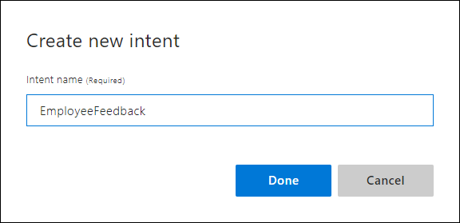
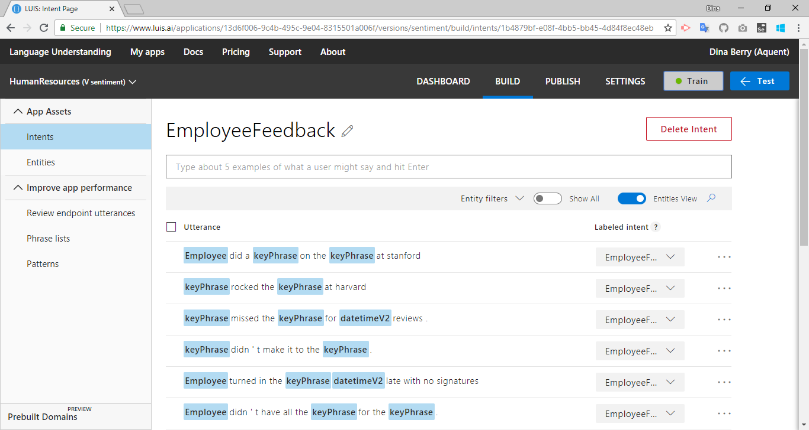
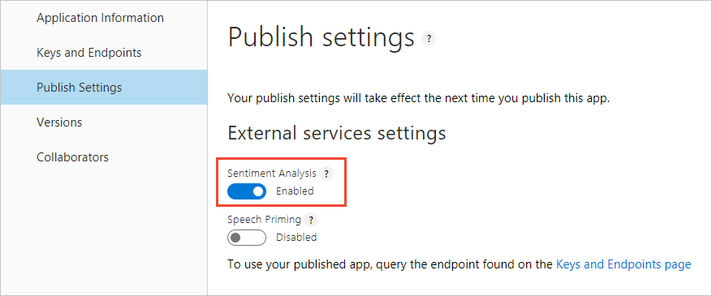

---
title: "Tutorial 9: Sentiment analysis including positive, negative, and neutral in LUIS"
titleSuffix: Azure Cognitive Services
description: In this tutorial, create an app that demonstrates how to extract positive, negative, and neutral sentiment from utterances. Sentiment is determined from the entire utterance.
services: cognitive-services
author: diberry
manager: cgronlun

ms.service: cognitive-services
ms.component: language-understanding
ms.topic: tutorial
ms.date: 09/09/2018
ms.author: diberry
#Customer intent: As a new user, I want to understand what sentiment is conveyed in a user's utterances. 

--- 

# Tutorial 9:  Extract sentiment of overall utterance
In this tutorial, create an app that demonstrates how to extract positive, negative, and neutral sentiment from utterances. Sentiment is determined from the entire utterance.

Sentiment analysis is the ability to determine if a user's utterance is positive, negative, or neutral. 

The following utterances show examples of sentiment:

|Sentiment|Score|Utterance|
|:--|:--|:--|
|positive|0.91 |John W. Smith did a great job on the presentation in Paris.|
|positive|0.84 |jill-jones@mycompany.com did fabulous work on the Parker sales pitch.|

Sentiment analysis is a publish setting that applies to every utterance. You do not have to find the words indicating sentiment in the utterance and label them because sentiment analysis applies to the entire utterance. 

Because it is a publish setting, you do not see it on the intents or entities pages. You can see it in the [interactive test](luis-interactive-test.md#view-sentiment-results) pane or when testing at the endpoint URL. 

**In this tutorial, you learn how to:**

<!-- green checkmark -->
> [!div class="checklist"]
> * Use existing tutorial app 
> * Add sentiment analysis as publish setting
> * Train
> * Publish
> * Get sentiment of utterance from endpoint

[!INCLUDE [LUIS Free account](../../../includes/cognitive-services-luis-free-key-short.md)]

## Use existing app

Continue with the app created in the last tutorial, named **HumanResources**. 

If you do not have the HumanResources app from the previous tutorial, use the following steps:

1.  Download and save [app JSON file](https://github.com/Microsoft/LUIS-Samples/blob/master/documentation-samples/tutorials/custom-domain-keyphrase-HumanResources.json).

2. Import the JSON into a new app.

3. From the **Manage** section, on the **Versions** tab, clone the version, and name it `sentiment`. Cloning is a great way to play with various LUIS features without affecting the original version. Because the version name is used as part of the URL route, the name can't contain any characters that are not valid in a URL.

## EmployeeFeedback intent 
Add a new intent to capture employee feedback from members of the company. 

1. [!include[Start in Build section](../../../includes/cognitive-services-luis-tutorial-build-section.md)]

2. Select **Create new intent**.

3. Name the new intent  name `EmployeeFeedback`.

    

4. Add several utterances that indicate an employee doing something well or an area that needs improvement:

    Remember in this Human Resources app, employees are defined in the list entity, `Employee`, by the name, email, phone extension number, mobile phone number, and their U.S. federal social security number. 

    |Utterances|
    |--|
    |425-555-1212 did a nice job of welcoming back a co-worker from maternity leave|
    |234-56-7891 did a great job of comforting a co-worker in their time of grief.|
    |jill-jones@mycompany.com didn't have all the required invoices for the paperwork.|
    |john.w.smith@mycompany.com turned in the required forms a month late with no signatures|
    |x23456 didn't make it to the important marketing off-site meeting.|
    |x12345 missed the meeting for June reviews.|
    |Jill Jones rocked the sales pitch at Harvard|
    |John W. Smith did a great job on the presentation at Stanford|

    [ ](./media/luis-quickstart-intent-and-sentiment-analysis/hr-utterance-examples.png#lightbox)

## Train

[!INCLUDE [LUIS How to Train steps](../../../includes/cognitive-services-luis-tutorial-how-to-train.md)]

## Configure app to include sentiment analysis
1. Select **Manage** in the top right navigation, then select **Publish settings** from the left menu.

2. Toggle **Sentiment Analysis** to enable this setting. 

    

## Publish

[!INCLUDE [LUIS How to Publish steps](../../../includes/cognitive-services-luis-tutorial-how-to-publish.md)]

## Get sentiment of utterance from endpoint

1. [!INCLUDE [LUIS How to get endpoint first step](../../../includes/cognitive-services-luis-tutorial-how-to-get-endpoint.md)]

2. Go to the end of the URL in the address and enter `Jill Jones work with the media team on the public portal was amazing`. The last querystring parameter is `q`, the utterance **query**. This utterance is not the same as any of the labeled utterances so it is a good test and should return the `EmployeeFeedback` intent with the sentiment analysis extracted.
    
    ```JSON
    {
      "query": "Jill Jones work with the media team on the public portal was amazing",
      "topScoringIntent": {
        "intent": "EmployeeFeedback",
        "score": 0.4983256
      },
      "intents": [
        {
          "intent": "EmployeeFeedback",
          "score": 0.4983256
        },
        {
          "intent": "MoveEmployee",
          "score": 0.06617523
        },
        {
          "intent": "GetJobInformation",
          "score": 0.04631853
        },
        {
          "intent": "ApplyForJob",
          "score": 0.0103248553
        },
        {
          "intent": "Utilities.StartOver",
          "score": 0.007531875
        },
        {
          "intent": "FindForm",
          "score": 0.00344597152
        },
        {
          "intent": "Utilities.Help",
          "score": 0.00337914471
        },
        {
          "intent": "Utilities.Cancel",
          "score": 0.0026357458
        },
        {
          "intent": "None",
          "score": 0.00214573368
        },
        {
          "intent": "Utilities.Stop",
          "score": 0.00157622492
        },
        {
          "intent": "Utilities.Confirm",
          "score": 7.379545E-05
        }
      ],
      "entities": [
        {
          "entity": "jill jones",
          "type": "Employee",
          "startIndex": 0,
          "endIndex": 9,
          "resolution": {
            "values": [
              "Employee-45612"
            ]
          }
        },
        {
          "entity": "media team",
          "type": "builtin.keyPhrase",
          "startIndex": 25,
          "endIndex": 34
        },
        {
          "entity": "public portal",
          "type": "builtin.keyPhrase",
          "startIndex": 43,
          "endIndex": 55
        },
        {
          "entity": "jill jones",
          "type": "builtin.keyPhrase",
          "startIndex": 0,
          "endIndex": 9
        }
      ],
      "sentimentAnalysis": {
        "label": "positive",
        "score": 0.8694164
      }
    }
    ```

    The sentimentAnalysis is positive with a score of 0.86. 

## Clean up resources

[!INCLUDE [LUIS How to clean up resources](../../../includes/cognitive-services-luis-tutorial-how-to-clean-up-resources.md)]

## Next steps
This tutorial adds sentiment analysis as a publish setting to extract sentiment values from the utterance as a whole.

> [!div class="nextstepaction"] 
> [Review endpoint utterances in the HR app](luis-tutorial-review-endpoint-utterances.md) 

