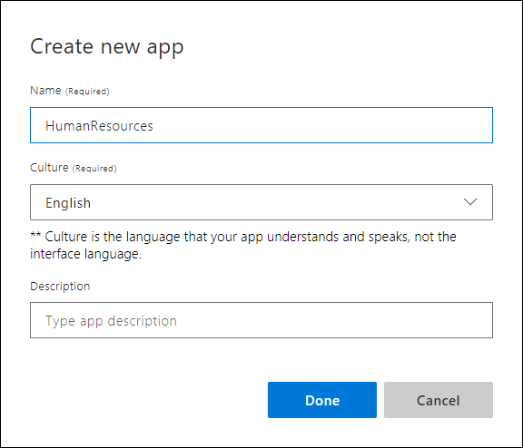

# Tutorial 1: Build custom app to determine user intentions

In this tutorial, you create a custom Human Resources (HR) app that predicts a user's intention based on the utterance (text). When you're finished, you have a LUIS endpoint running in the cloud.

The purpose of the app is to determine the intention of conversational, natural language text. These intentions are categorized into **Intents**. This app has a few intents. The first intent, **`GetJobInformation`**, identifies when a user wants information about jobs available inside a company. The second intent, **`None`**, is used for any utterances from the user that are outside the _domain_ (scope) of this app. Later, a third intent, **`ApplyForJob`**, is added for any utterances about applying for a job. This third intent is different from `GetJobInformation` because the job information should already be known when someone applies for the job. However, depending on the word choice, determining which intent may be tricky because both are about a job.

After LUIS returns the JSON response, LUIS is done with this request. LUIS doesn't provide answers to user utterances, it only identifies what type of information is being asked for in natural language. 

**In this tutorial, you learn how to:**

> [!div class="checklist"]
> * Create a new app 
> * Create intents
> * Add example utterances
> * Train app
> * Publish app
> * Get intent from endpoint

[!INCLUDE [LUIS Free account](../../../includes/cognitive-services-luis-free-key-short.md)]

## Create a new app

1. Sign in to the LUIS portal with the URL of [https://www.luis.ai](https://www.luis.ai). 

2. Select **Create new app**.  

    [ My Apps page")](media/luis-quickstart-intents-only/app-list.png#lightbox)

3. In the pop-up dialog, enter the name `HumanResources` and keep the default culture, **English**. Leave the description empty.

    

    Next, the app shows the **Intents** page with the **None** Intent.

## GetJobInformation intent

1. Select **Create new intent**. Enter the new intent name `GetJobInformation`. This intent is predicted any time a user wants information about open jobs in the company.

     New intent dialog")

2. By providing _example utterances_, you are training LUIS what kinds of utterances should be predicted for this intent. Add several example utterances to this intent that you expect a user to ask, such as:

    | Example utterances|
    |--|
    |Any new jobs posted today?|
    |What positions are available for Senior Engineers?|
    |Is there any work with databases?|
    |Looking for a new situation with responsibilities in accounting|
    |Where is the job listings|
    |New jobs?|
    |Are there any new positions in the Seattle office?|

    [](media/luis-quickstart-intents-only/utterance-getstoreinfo.png#lightbox)

    [!include[Do not use too few utterances](../../../includes/cognitive-services-luis-too-few-example-utterances.md)]    


## None intent 
The client application needs to know if an utterance is outside the subject domain of the application. If LUIS returns the **None** intent for an utterance, your client application can ask if the user wants to end the conversation. The client application can also give more directions for continuing the conversation if the user doesn't want to end it. 

These example utterances, outside the subject domain, are grouped into the **None** intent. Do not leave it empty. 

1. Select **Intents** from the left panel.

2. Select the **None** intent. Add three utterances that your user might enter but are not relevant to your Human Resources app. If the app is about your job postings, some **None** utterances are:

    | Example utterances|
    |--|
    |Barking dogs are annoying|
    |Order a pizza for me|
    |Penguins in the ocean|


## Train 

[!INCLUDE [LUIS How to Train steps](../../../includes/cognitive-services-luis-tutorial-how-to-train.md)]

## Publish

[!INCLUDE [LUIS How to Publish steps](../../../includes/cognitive-services-luis-tutorial-how-to-publish.md)] 

## Get intent

1. [!INCLUDE [LUIS How to get endpoint first step](../../../includes/cognitive-services-luis-tutorial-how-to-get-endpoint.md)]

2. Go to the end of the URL in the address bar and enter `I'm looking for a job with Natural Language Processing`. The last query string parameter is `q`, the utterance **query**. This utterance is not the same as any of the example utterances. It is a good test and should return the `GetJobInformation` intent as the top scoring intent. 

    ```JSON
    {
      "query": "I'm looking for a job with Natural Language Processing",
      "topScoringIntent": {
        "intent": "GetJobInformation",
        "score": 0.8965092
      },
      "intents": [
        {
          "intent": "GetJobInformation",
          "score": 0.8965092
        },
        {
          "intent": "None",
          "score": 0.147104025
        }
      ],
      "entities": []
    }
    ```

    The results include **all the intents** in the app, currently 2. The entities array is empty because this app currently does not have any entities. 

    The JSON result identifies the top scoring intent as **`topScoringIntent`** property. All scores are between 1 and 0, with the better score being close to 1. 

## ApplyForJob intent
Return to the LUIS website and create a new intent to determine if the user utterance is about applying for a job.

1. Select **Build** from the top, right menu to return to app building.

2. Select **Intents** from the left menu.

3. Select **Create new intent** and enter the name `ApplyForJob`. 

    

4. Add several utterances to this intent that you expect a user to ask for, such as:

    | Example utterances|
    |--|
    |I want to apply for the new accounting job|
    |Fill out application for Job 123456|
    |Submit resume for engineering position|
    |Here is my c.v. for position 654234|
    |Job 567890 and my paperwork|

    [](media/luis-quickstart-intents-only/utterance-applyforjob.png#lightbox)

    The labeled intent is outlined in red because LUIS is currently uncertain the intent is correct. Training the app tells LUIS the utterances are on the correct intent. 

## Train again

[!include[LUIS How to Train steps](../../../includes/cognitive-services-luis-tutorial-how-to-train.md)]

## Publish again

[!include[LUIS How to Publish steps](../../../includes/cognitive-services-luis-tutorial-how-to-publish.md)] 

## Get intent again

1. [!INCLUDE [LUIS How to get endpoint first step](../../../includes/cognitive-services-luis-tutorial-how-to-get-endpoint.md)]

2. In the new browser window, enter `Can I submit my resume for job 235986` at the end of the URL. 

    ```JSON
    {
      "query": "Can I submit my resume for job 235986",
      "topScoringIntent": {
        "intent": "ApplyForJob",
        "score": 0.9166808
      },
      "intents": [
        {
          "intent": "ApplyForJob",
          "score": 0.9166808
        },
        {
          "intent": "GetJobInformation",
          "score": 0.07162977
        },
        {
          "intent": "None",
          "score": 0.0262826588
        }
      ],
      "entities": []
    }
    ```

    The results include the new intent **ApplyForJob** as well as the existing intents. 

## Clean up resources

[!INCLUDE [LUIS How to clean up resources](../../../includes/cognitive-services-luis-tutorial-how-to-clean-up-resources.md)]

## Next steps

This tutorial created the Human Resources (HR) app, created 2 intents, added example utterances to each intent, added example utterances to the None intent, trained, published, and tested at the endpoint. These are the basic steps of building a LUIS model. 

> [!div class="nextstepaction"]
> [Add prebuilt intents and entities to this app](luis-tutorial-prebuilt-intents-entities.md)
