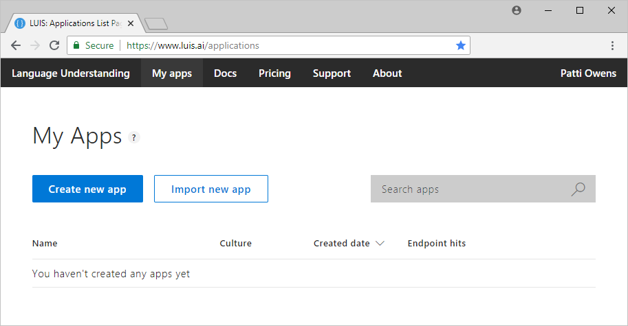
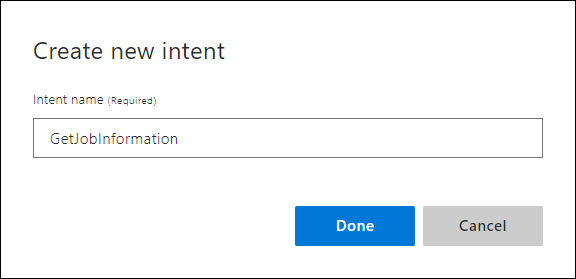

# Tutorial: 1. Build app with custom domain
In this tutorial, create an app that demonstrates how to use **intents** to determine the user's _intention_ based on the utterance (text) they submit to the app. When you're finished, you have a LUIS endpoint running in the cloud.

This app is the simplest type of LUIS app because it doesn't extract data from the utterances. It only determines the user's intention of the utterance.

<!-- green checkmark -->
> [!div class="checklist"]
> * Create a new app for a Human Resources (HR) domain 
> * Add GetJobInformation intent
> * Add example utterances to GetJobInformation intent 
> * Train, and publish app
> * Query endpoint of app to see LUIS JSON response
> * Add ApplyForJob intent
> * Add example utterances to ApplyForJob intent 
> * Train, publish, and query endpoint again 

[!INCLUDE [LUIS Free account](../../../includes/cognitive-services-luis-free-key-short.md)]

## Purpose of the app
This app has a few intents. The first intent, **`GetJobInformation`**, identifies when a user wants information about jobs available inside a company. The second intent, **`None`**, identifies every other type of utterance. Later in the quickstart, a third intent, `ApplyForJob`, is added. 

## Create a new app
1. Log in to the [LUIS](luis-reference-regions.md#luis-website) website. Make sure to log in to the [region](luis-reference-regions.md#publishing-regions) where you need the LUIS endpoints published.

2. On the [LUIS](luis-reference-regions.md#luis-website) website, select **Create new app**.  

    [](media/luis-quickstart-intents-only/app-list.png#lightbox)

3. In the pop-up dialog, enter the name `HumanResources`. This app covers questions about your company's Human Resources department. That type of department handles issues related to employment such as positions in the company that need to be filled.

    

4. When that process finishes, the app shows the **Intents** page with the **None** Intent. 

## Create GetJobInformation intention
1. Select **Create new intent**. Enter the new intent name `GetJobInformation`. This intent is predicted any time a user wants information about open jobs in your company.

    

    By creating an intent, you are creating a category of information that you want to identify. Giving the category a name allows any other application that uses the LUIS query results to use that category name to find an appropriate answer. LUIS doesn't answer these questions, only identify what type of information is being asked for in natural language. 

2. Add seven utterances to this intent that you expect a user to ask for, such as:

    | Example utterances|
    |--|
    |Any new jobs posted today?|
    |What positions are available for Senior Engineers?|
    |Is there any work with databases?|
    |Looking for a new situation with responsibilities in accounting|
    |Where is the job listings|
    |New jobs?|
    |Are there any new positions in the Seattle office?|

    [](media/luis-quickstart-intents-only/utterance-getstoreinfo.png#lightbox)

3. The LUIS app currently has no utterances for the **None** intent. It needs utterances that the app doesn't answer. Do not leave it empty. Select **Intents** from the left panel. 

4. Select the **None** intent. Add three utterances that your user might enter but are not relevant to your app. If the app is about your Job postings, some good **None** utterances are:

    | Example utterances|
    |--|
    |Barking dogs are annoying|
    |Order a pizza for me|
    |Penguins in the ocean|

    In the LUIS-calling application, such as a chatbot, if LUIS returns the **None** intent for an utterance, your bot can ask if the user wants to end the conversation. The chatbot can also give more directions for continuing the conversation if the user doesn't want to end it. 

## Train and publish the app

[!INCLUDE [LUIS How to Train steps](../../../includes/cognitive-services-luis-tutorial-how-to-train.md)]

## Publish app to endpoint

[!INCLUDE [LUIS How to Publish steps](../../../includes/cognitive-services-luis-tutorial-how-to-publish.md)] 

## Query endpoint for GetJobInformation intent

1. [!INCLUDE [LUIS How to get endpoint first step](../../../includes/cognitive-services-luis-tutorial-how-to-get-endpoint.md)]

2. Go to the end of the URL in the address and enter `I'm looking for a job with Natual Language Processing`. The last query string parameter is `q`, the utterance **query**. This utterance is not the same as any of the example utterances in step 4 so it is a good test and should return the `GetJobInformation` intent as the top scoring intent. 

    ```
    {
      "query": "I'm looking for a job with Natual Language Processing",
      "topScoringIntent": {
        "intent": "GetJobInformation",
        "score": 0.8965092
      },
      "intents": [
        {
          "intent": "GetJobInformation",
          "score": 0.8965092
        },
        {
          "intent": "None",
          "score": 0.147104025
        }
      ],
      "entities": []
    }
    ```

## Create ApplyForJob intention
Return to the browser tab for the LUIS website and create a new intention to apply for a job.

1. Select **Build** from the top, right menu to return to app building.

2. Select **Intents** from the left menu.

3. Select **Create new intent** and enter the name `ApplyForJob`. 

    

4. Add several utterances to this intent that you expect a user to ask for, such as:

    | Example utterances|
    |--|
    |I want to apply for the new accounting job|
    |Fill out application for Job 123456|
    |Submit resume for engineering position|
    |Here is my c.v. for position 654234|
    |Job 567890 and my paperwork|

    [](media/luis-quickstart-intents-only/utterance-applyforjob.png#lightbox)

    The labeled intent is outlined in red because LUIS is currently uncertain the intent is correct. Training the app tells LUIS the utterances are on the correct intent. 

    [Train and publish](#train-and-publish-the-app) again. 

## Query endpoint for ApplyForJob intent

1. [!INCLUDE [LUIS How to get endpoint first step](../../../includes/cognitive-services-luis-tutorial-how-to-get-endpoint.md)]

2. In the new browser window, enter `Can I submit my resume for job 235986` at the end of the URL. 

    ```
    {
      "query": "Can I submit my resume for job 235986",
      "topScoringIntent": {
        "intent": "ApplyForJob",
        "score": 0.9166808
      },
      "intents": [
        {
          "intent": "ApplyForJob",
          "score": 0.9166808
        },
        {
          "intent": "GetJobInformation",
          "score": 0.07162977
        },
        {
          "intent": "None",
          "score": 0.0262826588
        }
      ],
      "entities": []
    }
    ```

## What has this LUIS app accomplished?
This app, with just a few intents, identified a natural language query that is of the same intention but worded differently. 

The JSON result identifies the top scoring intent. All scores are between 1 and 0, with the better score being close to 1. The `GetJobInformation` and `None` intents' score are much closer to zero. 

## Where is this LUIS data used? 
LUIS is done with this request. The calling application, such as a chatbot, can take the topScoringIntent result and either find information (not stored in LUIS) to answer the question or end the conversation. These are programmatic options for the bot or calling application. LUIS doesn't do that work. LUIS only determines what the user's intention is. 

## Clean up resources

[!INCLUDE [LUIS How to clean up resources](../../../includes/cognitive-services-luis-tutorial-how-to-clean-up-resources.md)]

## Next steps

> [!div class="nextstepaction"]
> [Add prebuilt intents and entities to this app](luis-tutorial-prebuilt-intents-entities.md)
