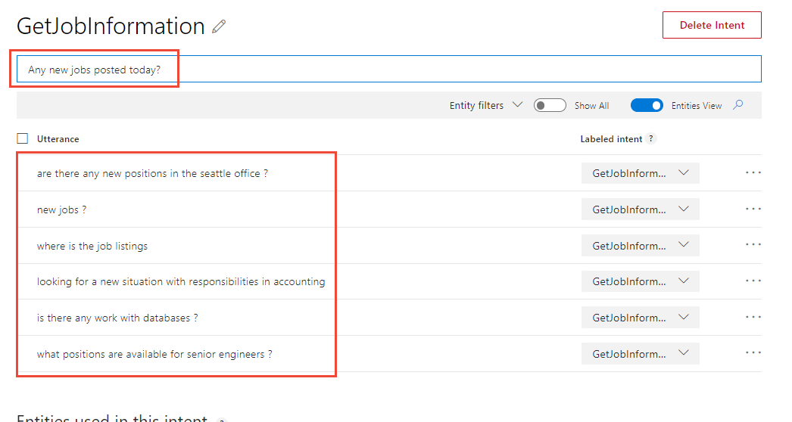
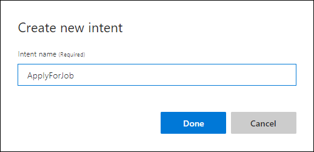
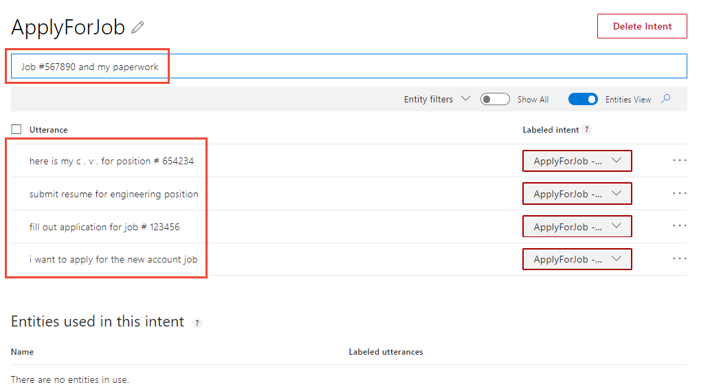

# Tutorial: Build LUIS app to determine user intentions

In this tutorial, you create a custom Human Resources (HR) app that predicts a user's intention based on the utterance (text). 

**In this tutorial, you learn how to:**

> [!div class="checklist"]
> * Create a new app 
> * Create intents
> * Add example utterances
> * Train app
> * Publish app
> * Get intent from endpoint


[!INCLUDE [LUIS Free account](../../../includes/cognitive-services-luis-free-key-short.md)]

## User intentions as intents

The purpose of the app is to determine the intention of conversational, natural language text: 

`Are there any new positions in the Seattle office?`

These intentions are categorized into **Intents**. 

This app has a few intents. 

|Intent|Purpose|
|--|--|
|ApplyForJob|Determine if user is applying for a job.|
|GetJobInformation|Determine if user is looking for information about jobs in general or a specific job.|
|None|Determine if user is asking something app is not supposed to answer. This intent if provided as part of app creation and can't be deleted. |

## Create a new app

[!INCLUDE [Follow these steps to create a new LUIS app](../../../includes/cognitive-services-luis-create-new-app-steps.md)]

## Create intent for job information

1. Select **Create new intent**. Enter the new intent name `GetJobInformation`. This intent is predicted when a user wants information about open jobs in the company. 

     New intent dialog")

1. Select **Done**.

2. Add several example utterances to this intent that you expect a user to ask:

    | Example utterances|
    |--|
    |Any new jobs posted today?|
    |Are there any new positions in the Seattle office?|
    |Are there any remote worker or telecommute jobs open for engineers?|
    |Is there any work with databases?|
    |I'm looking for a co-working situation in the tampa office.|
    |Is there an internship in the san francisco office?|
    |Is there any part-time work for people in college?|
    |Looking for a new situation with responsibilities in accounting|
    |Looking for a job in new york city for bilingual speakers.|
    |Looking for a new situation with responsibilities in accounting.|
    |New jobs?|
    |Show me all the jobs for engineers that were added in the last 2 days.|
    |Today's job postings?|
    |What accounting positions are open in the london office?|
    |What positions are available for Senior Engineers?|
    |Where is the job listings|

    [](media/luis-quickstart-intents-only/utterance-getstoreinfo.png#lightbox)

    By providing _example utterances_, you are training LUIS about what kinds of utterances should be predicted for this intent. 

    [!INCLUDE [Do not use too few utterances](../../../includes/cognitive-services-luis-too-few-example-utterances.md)]    

## Add example utterances to the None intent 

[!INCLUDE [Follow these steps to add the None intent to the app](../../../includes/cognitive-services-luis-create-the-none-intent.md)]

## Train the app before testing or publishing

[!INCLUDE [LUIS How to Train steps](../../../includes/cognitive-services-luis-tutorial-how-to-train.md)]

## Publish the app to query from the endpoint

[!INCLUDE [LUIS How to Publish steps](../../../includes/cognitive-services-luis-tutorial-how-to-publish.md)] 

## Get intent prediction from the endpoint

1. [!INCLUDE [LUIS How to get endpoint first step](../../../includes/cognitive-services-luis-tutorial-how-to-get-endpoint.md)]

1. Go to the end of the URL in the address bar and enter `I'm looking for a job with Natural Language Processing`. The last query string parameter is `q`, the utterance **query**. This utterance is not the same as any of the example utterances. It is a good test and should return the `GetJobInformation` intent as the top scoring intent. 

    ```JSON
    {
      "query": "I'm looking for a job with Natural Language Processing",
      "topScoringIntent": {
        "intent": "GetJobInformation",
        "score": 0.9923871
      },
      "intents": [
        {
          "intent": "GetJobInformation",
          "score": 0.9923871
        },
        {
          "intent": "None",
          "score": 0.007810574
        }
      ],
      "entities": []
    }
    ```

    The `verbose=true` querystring parameter means include **all the intents** in the app's query results. The entities array is empty because this app currently does not have any entities. 

    The JSON result identifies the top scoring intent as **`topScoringIntent`** property. All scores are between 1 and 0, with the better score being close to 1. 

## Create intent for job applications

Return to the LUIS portal and create a new intent to determine if the user utterance is about applying for a job.

1. Select **Build** from the top, right menu to return to app building.

1. Select **Intents** from the left menu to get to the list of intents.

1. Select **Create new intent** and enter the name `ApplyForJob`. 

    

1. Add several utterances to this intent that you expect a user to ask for, such as:

    | Example utterances|
    |--|
    |Fill out application for Job 123456|
    |Here is my c.v. for position 654234|
    |Here is my resume for the part-time receptionist post.|
    |I'm applying for the art desk job with this paperwork.|
    |I'm applying for the summer college internship in Research and Development in San Diego|
    |I'm requesting to submit my resume to the temporary position in the cafeteria.|
    |I'm submitting my resume for the new Autocar team in Columbus, OH|
    |I want to apply for the new accounting job|
    |Job 456789 accounting internship paperwork is here|
    |Job 567890 and my paperwork|
    |My papers for the tulsa accounting internship are attached.|
    |My paperwork for the holiday delivery position|
    |Please send my resume for the new accounting job in seattle|
    |Submit resume for engineering position|
    |This is my c.v. for post 234123 in Tampa.|

<!--

    [](media/luis-quickstart-intents-only/utterance-applyforjob.png#lightbox)

    The labeled intent is outlined in red because LUIS is currently uncertain the intent is correct. Training the app tells LUIS the utterances are on the correct intent. 

-->

## Train again

[!INCLUDE [LUIS How to Train steps](../../../includes/cognitive-services-luis-tutorial-how-to-train.md)]

## Publish again

[!INCLUDE [LUIS How to Publish steps](../../../includes/cognitive-services-luis-tutorial-how-to-publish.md)] 

## Get intent prediction again

1. [!INCLUDE [LUIS How to get endpoint first step](../../../includes/cognitive-services-luis-tutorial-how-to-get-endpoint.md)]

2. In the new browser window, enter `Can I submit my resume for job 235986` at the end of the URL. 

    ```json
    {
      "query": "Can I submit my resume for job 235986",
      "topScoringIntent": {
        "intent": "ApplyForJob",
        "score": 0.9634406
      },
      "intents": [
        {
          "intent": "ApplyForJob",
          "score": 0.9634406
        },
        {
          "intent": "GetJobInformation",
          "score": 0.0171300638
        },
        {
          "intent": "None",
          "score": 0.00670867041
        }
      ],
      "entities": []
    }
    ```

    The results include the new intent **ApplyForJob** as well as the existing intents. 

## Client-application next steps

After LUIS returns the JSON response, LUIS is done with this request. LUIS doesn't provide answers to user utterances, it only identifies what type of information is being asked for in natural language. The conversational follow-up is provided by the client application such as an Azure Bot. 

## Clean up resources

[!INCLUDE [LUIS How to clean up resources](../../../includes/cognitive-services-luis-tutorial-how-to-clean-up-resources.md)]

## Related information

* [Types of entities](luis-concept-entity-types.md)
* [How to train](luis-how-to-train.md)
* [How to publish](luis-how-to-publish-app.md)
* [How to test in LUIS portal](luis-interactive-test.md)
* [Azure Bot](https://docs.microsoft.com/azure/bot-service/?view=azure-bot-service-4.0)


## Next steps

This tutorial created the Human Resources (HR) app, created 2 intents, added example utterances to each intent, added example utterances to the None intent, trained, published, and tested at the endpoint. These are the basic steps of building a LUIS model. 

Continue with this app, [adding a simple entity and phrase list](luis-quickstart-primary-and-secondary-data.md).

> [!div class="nextstepaction"]
> [Add prebuilt intents and entities to this app](luis-tutorial-prebuilt-intents-entities.md)
