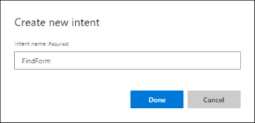
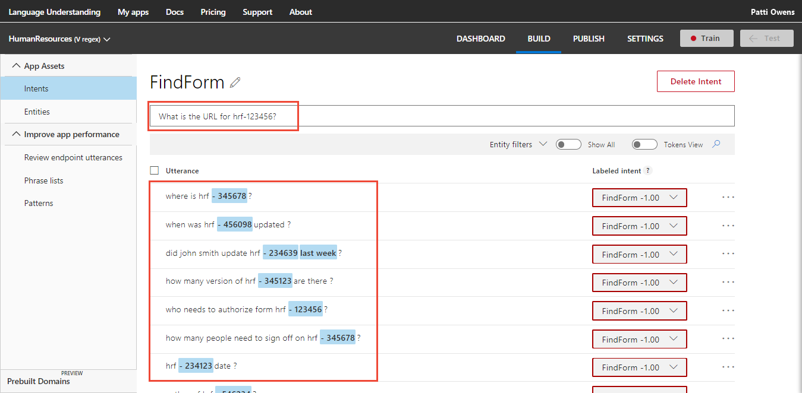
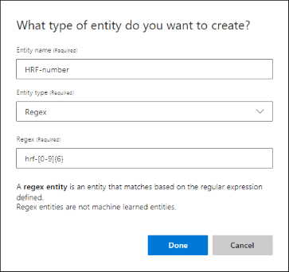
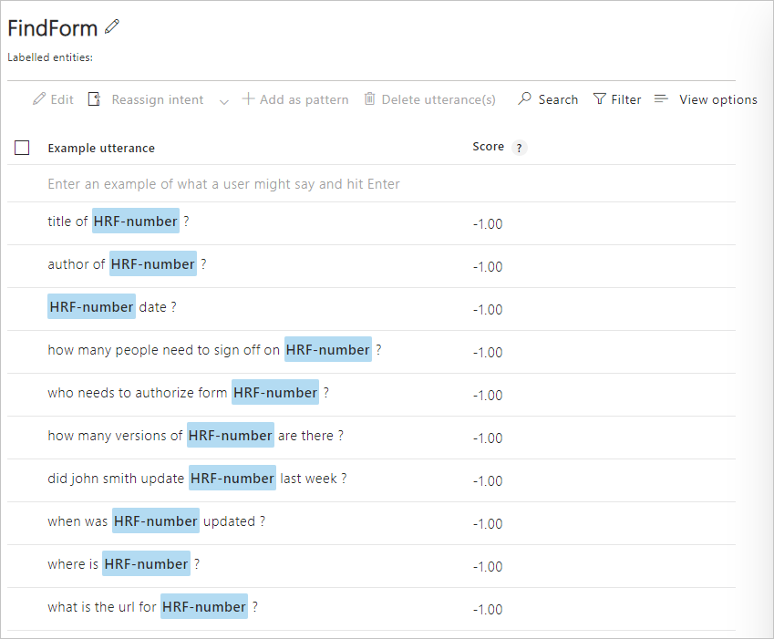

# Tutorial: Get well-formatted data from the utterance
In this tutorial, create an app to extract consistently-formatted data from an utterance using the **Regular Expression** entity.

**In this tutorial, you learn how to:**

<!-- green checkmark -->
> [!div class="checklist"]
> * Create a new app 
> * Add intent
> * Add regular expression entity 
> * Train
> * Publish
> * Get intents and entities from endpoint

[!INCLUDE [LUIS Free account](../../../includes/cognitive-services-luis-free-key-short.md)]

## Regular expression entities

This app's use of the regular expression entity is to pull out well-formatted Human Resources (HR) form numbers from an utterance. While the utterance's intent is always determined with machine-learning, this specific entity type is not machine-learned. 

**Example utterances include:**

|Example utterances|
|--|
|Where is HRF-123456?|
|Who authored HRF-123234?|
|HRF-456098 is published in French?|
|HRF-456098|
|HRF-456098 date?|
 
A regular expression is a good choice for this type of data when:

* the data is well-formatted.


## Create a new app

[!INCLUDE [Follow these steps to create a new LUIS app](../../../includes/cognitive-services-luis-create-new-app-steps.md)]

## Create intent for finding form

1. [!INCLUDE [Start in Build section](../../../includes/cognitive-services-luis-tutorial-build-section.md)]

1. Select **Create new intent**. 

1. Enter `FindForm` in the pop-up dialog box then select **Done**. 

    

1. Add example utterances to the intent.

    |Example utterances|
    |--|
    |What is the URL for hrf-123456?|
    |Where is hrf-345678?|
    |When was hrf-456098 updated?|
    |Did John Smith update hrf-234639 last week?|
    |How many versions of hrf-345123 are there?|
    |Who needs to authorize form hrf-123456?|
    |How many people need to sign off on hrf-345678?|
    |hrf-234123 date?|
    |author of hrf-546234?|
    |title of hrf-456234?|

    [](./media/luis-quickstart-intents-regex-entity/findform-intent.png#lightbox)

    [!INCLUDE [Do not use too few utterances](../../../includes/cognitive-services-luis-too-few-example-utterances.md)]  

## Use the regular expression entity for well-formatted data
The regular expression entity to match the form number is `hrf-[0-9]{6}`. This regular expression matches the literal characters `hrf-` but ignores case and culture variants. It matches digits 0-9, for 6 digits exactly.

HRF stands for `human resources form`.

LUIS tokenizes the utterance when it is added to an intent. The tokenization for these utterances adds spaces before and after the hyphen, `Where is HRF - 123456?`  The regular expression is applied to the utterance in its raw form, before it is tokenized. Because it is applied to the _raw_ form, the regular expression doesn't have to deal with word boundaries. 

Create a regular expression entity to tell LUIS what an HRF-number format is in the following steps:

1. Select **Entities** in the left panel.

1. Select **Create new entity** button on the Entities Page. 

1. In the pop-up dialog, enter the new entity name `HRF-number`, select **RegEx** as the entity type, enter `hrf-[0-9]{6}` as the **Regex** value, and then select **Done**.

    

1. Select **Intents** from the left menu, then **FindForm** intent to see the regular expression labeled in the utterances. 

    [](./media/luis-quickstart-intents-regex-entity/labeled-utterances-for-entity.png#lightbox)

    Because the entity is not a machine-learned entity, the entity is applied to the utterances and displayed in the LUIS website as soon as it is created.

## Add example utterances to the None intent 

[!INCLUDE [Follow these steps to add the None intent to the app](../../../includes/cognitive-services-luis-create-the-none-intent.md)]

## Train the app before testing or publishing

[!INCLUDE [LUIS How to Train steps](../../../includes/cognitive-services-luis-tutorial-how-to-train.md)]

## Publish the app to query from the endpoint

[!INCLUDE [LUIS How to Publish steps](../../../includes/cognitive-services-luis-tutorial-how-to-publish.md)]

## Get intent and entity prediction from endpoint

1. [!INCLUDE [LUIS How to get endpoint first step](../../../includes/cognitive-services-luis-tutorial-how-to-get-endpoint.md)]

2. Go to the end of the URL in the address and enter the following utterance:

    `When were HRF-123456 and hrf-234567 published in the last year?`

    The last querystring parameter is `q`, the utterance **query**. This utterance is not the same as any of the labeled utterances so it is a good test and should return the `FindForm` intent with the two form numbers of `HRF-123456` and `hrf-234567`.

    ```json
    {
      "query": "When were HRF-123456 and hrf-234567 published in the last year?",
      "topScoringIntent": {
        "intent": "FindForm",
        "score": 0.9988884
      },
      "intents": [
        {
          "intent": "FindForm",
          "score": 0.9988884
        },
        {
          "intent": "None",
          "score": 0.00204812363
        }
      ],
      "entities": [
        {
          "entity": "hrf-123456",
          "type": "HRF-number",
          "startIndex": 10,
          "endIndex": 19
        },
        {
          "entity": "hrf-234567",
          "type": "HRF-number",
          "startIndex": 25,
          "endIndex": 34
        }
      ]
    }
    ```

    By using a regular expression entity, LUIS extracts named data, which is more programmatically helpful to the client application receiving the JSON response.


## Clean up resources

[!INCLUDE [LUIS How to clean up resources](../../../includes/cognitive-services-luis-tutorial-how-to-clean-up-resources.md)]

## Related information

* [Regular expression](luis-concept-entity-types.md#regular-expression-entity) entity concepts
* [How to train](luis-how-to-train.md)
* [How to publish](luis-how-to-publish-app.md)
* [How to test in LUIS portal](luis-interactive-test.md)

## Next steps
This tutorial created a new intent, added example utterances, then created a regular expression entity to extract well-formatted data from the utterances. After training, and publishing the app, a query to the endpoint identified the intention and returned the extracted data.

> [!div class="nextstepaction"]
> [Learn about the list entity](luis-quickstart-intent-and-list-entity.md)

