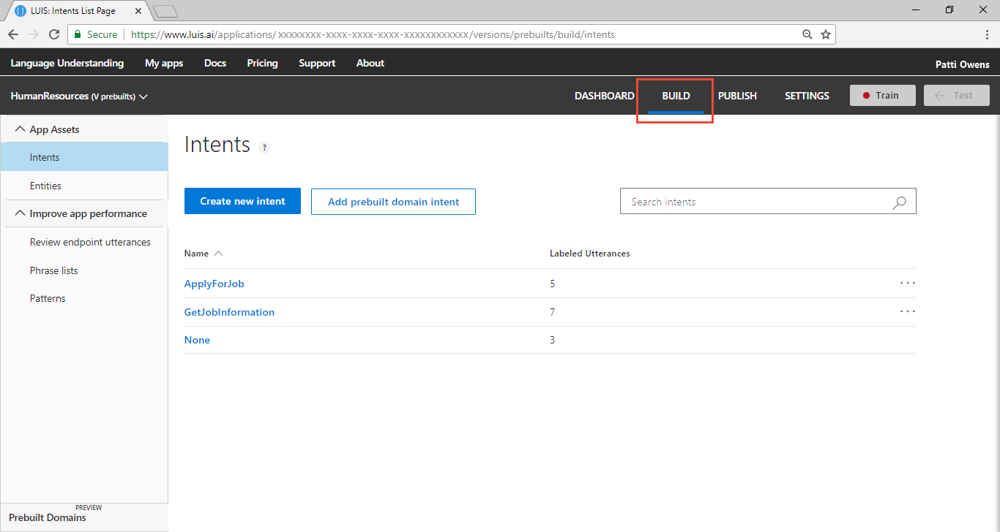

---
title: Tutorial creating a LUIS app to get regular-expression matched data - Azure | Microsoft Docs 
description: In this tutorial, learn how to create a simple LUIS app using intents and a regular expression entity to extract data. 
services: cognitive-services
author: v-geberr
manager: kaiqb 

ms.service: cognitive-services
ms.component: luis
ms.topic: tutorial
ms.date: 06/18/2018
ms.author: v-geberr
#Customer intent: As a new user, I want to understand how and why to use the regular expression entity. 
--- 

# Tutorial: Use regular expression entity
In this tutorial, you create an app that demonstrates how to extract consistently formatted data from an utterance using the **Regular Expression** entity.


<!-- green checkmark -->
> [!div class="checklist"]
> * Understand regular expression entities 
> * Create new LUIS app for a Human Resources (HR) domain with FindForm intent
> * Add _None_ intent and add example utterances
> * Add regular expression entity to extract Form number from utterance
> * Train, and publish app
> * Query endpoint of app to see LUIS JSON response

For this article, you need a free [LUIS][LUIS] account in order to author your LUIS application.

## Before you begin
If you do not have the Human Resources app from the [custom domain](luis-tutorial-prebuilt-intents-entities.md) tutorial, [import](create-new-app.md#import-new-app) the JSON into a new app in the [LUIS][LUIS] website, from the [LUIS-Samples](https://github.com/Microsoft/LUIS-Samples/blob/master/documentation-samples/quickstarts/custom-domain-prebuilts-HumanResources.json) Github repository.

If you want to keep the original Human Resources app, clone the version on the [Settings](luis-how-to-manage-versions.md#clone-a-version) page, and name it `regex`. Cloning is a great way to play with various LUIS features without affecting the original version. 


## Purpose of the regular expression entity
The purpose of an entity is to get important data from the utterance. The app's use of the regular expression entity is to pull out formatted Human Resources (HR) Form numbers from an utterance. It is not machine-learned. 

Simple example utterances from users include:

```
Where is HRF-123456?
Who authored HRF-123234?
HRF-456098 is published in French?
```

Abbreviated or slang versions of utterances include:

```
HRF-456098
HRF-456098 date?
HRF-456098 title?
```
 
The regular expression entity to match is `hrf-[0-9]{6}`. This regular expression matches the literal characters `hrf-` but ignores case and culture variants. It matches digits 0-9, for 6 digits exactly. 

HRF stands for human resources form.

## Add FindForm intent

1. Make sure your Human Resources app is in the **Build** section of LUIS. You can change to this section by selecting **Build** on the top, right menu bar. 

    [ ](./media/luis-tutorial-prebuilt-intents-and-entities/first-image.png#lightbox)

2. Select **Create new intent**. 

    [  ](./media/luis-tutorial-prebuilt-intents-and-entities/add-prebuilt-domain-button.png#lightbox)

3. Enter `FindForm` in the pop-up dialog box then select **Done**. 

    [ ](./media/luis-tutorial-prebuilt-intents-and-entities/prebuilt-intent-utilities.png#lightbox)

4. Add example utterances to the intent.

|Example utterances|
|--|
|What is the URL for hrf-123456?|
|Where is hrf-345678?|
|When was hrf-456098 updated?|
|Did John Smith update hrf-234639 last week?|
|How many version of hrf-345123 are there?|
|Who needs to authorize form hrf-123456?|
|How many people need to sign off on hrf-345678?|
|hrf-234123 date?|
|author of hrf-546234?|
|title of hrf-456234?|

## Create a HRF-number regular expression entity 
Create a regular expression entity to tell LUIS what a HRF-number format is by following the steps:

1. Select **Entities** in the left panel.

2. Select **Create new entity** button on the Entities Page. 

    

3. In the pop-up dialog, enter the new entity name `HRF-number`, select **RegEx** as the entity type, enter `hrf-[0-9]{6}` as the Regex, and then select **Done**.

    

4. Now that the entity is created, select **Intents** then **FindForm** entity to see the regular expression labeled in the utterances. 

    

## Train the LUIS app

1. In the top right side of the LUIS website, select the **Train** button.

    

2. Training is complete when you see the green status bar at the top of the website confirming success.

    

## Publish the app to get the endpoint URL
In order to get a LUIS prediction in a chatbot or other application, you need to publish the app. 

1. In the top right side of the LUIS website, select the **Publish** button. 

    

2. Select the Production slot and the **Publish** button.

    

3. Publishing is complete when you see the green status bar at the top of the website confirming success.

    

## Query the endpoint with a different utterance
1. On the **Publish** page, select the **endpoint** link at the bottom of the page. This action opens another browser window with the endpoint URL in the address bar. 

2. Go to the end of the URL in the address and enter `When were HRF-123456 and hrf-234567 published?`. The last querystring parameter is `q`, the utterance **q**uery. This utterance is not the same as any of the labeled utterances so it is a good test and should return the `FindForm` intent with the two form numbers of `HRF-123456` and `hrf-234567`.

    ```
    ```

## What has this LUIS app accomplished?
This app identified the intention and returned the extracted data. 

Your chatbot now has enough information to determine the primary action, `FindForm`, and which form numbers were in the search. 

## Where is this LUIS data used? 
LUIS is done with this request. The calling application, such as a chatbot, can take the topScoringIntent result and the form numbers and search a third-party API. LUIS doesn't do that work. LUIS only determines what the user's intention is and extracts data about that intention. 

## Clean up resources
When no longer needed, delete the LUIS app. To do so, select the three dot menu (...) to the right of the app name in the app list, select **Delete**. On the pop-up dialog **Delete app?**, select **Ok**.

## Next steps

> [!div class="nextstepaction"]
> [Learn about the KeyPhrase entity](luis-quickstart-intent-and-key-phrase.md)

<!--References-->
[LUIS]: luis-reference-regions.md#luis-website
[LUIS-regions]: luis-reference-regions.md#publishing-regions
