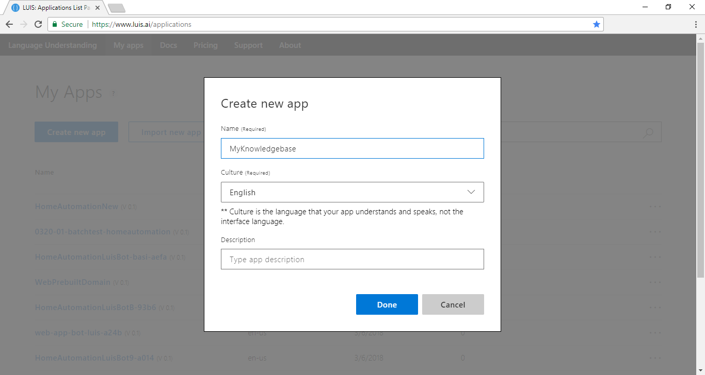
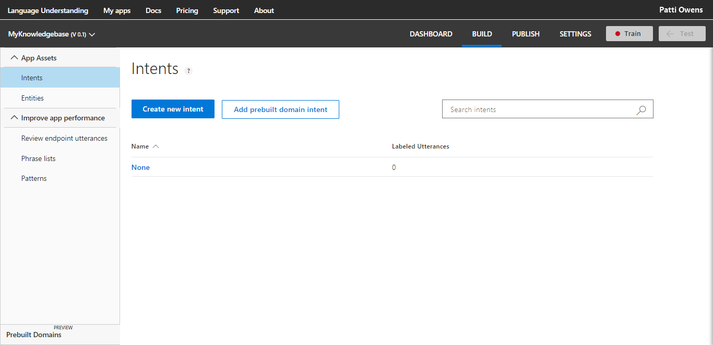
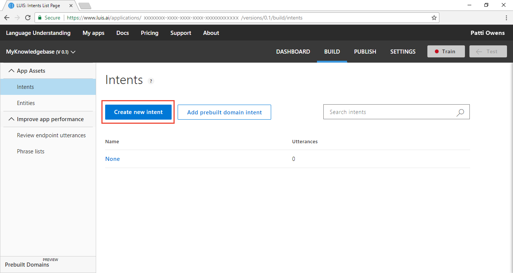
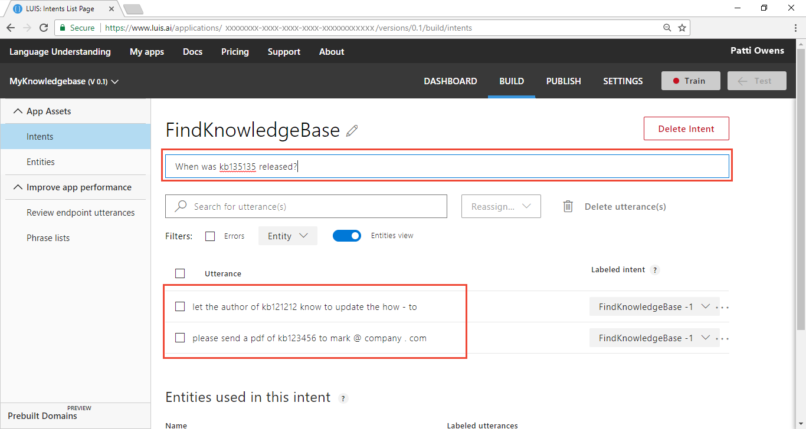
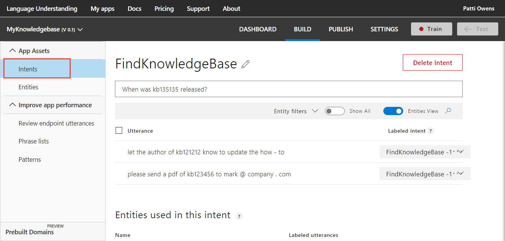
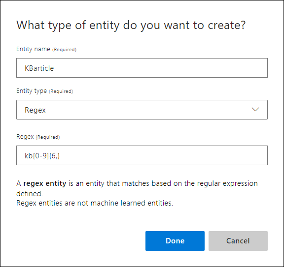
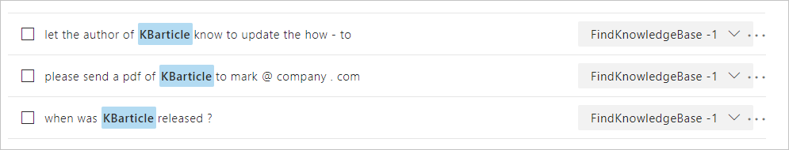
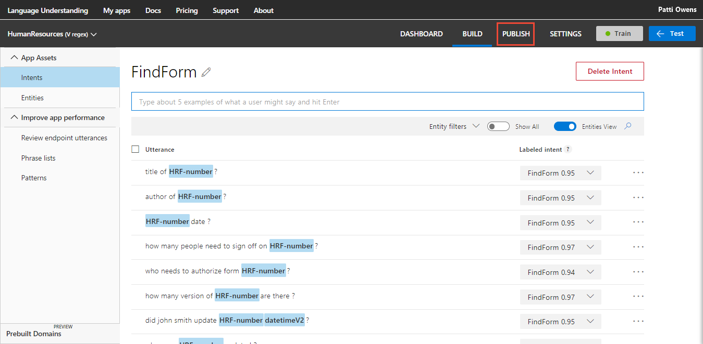
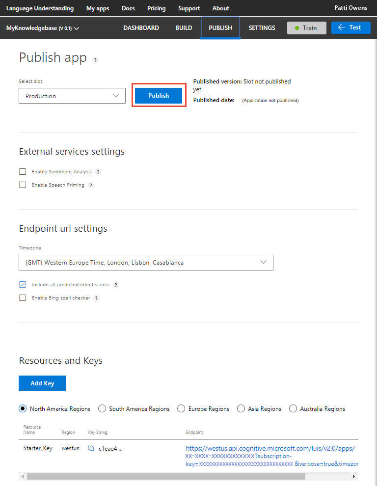
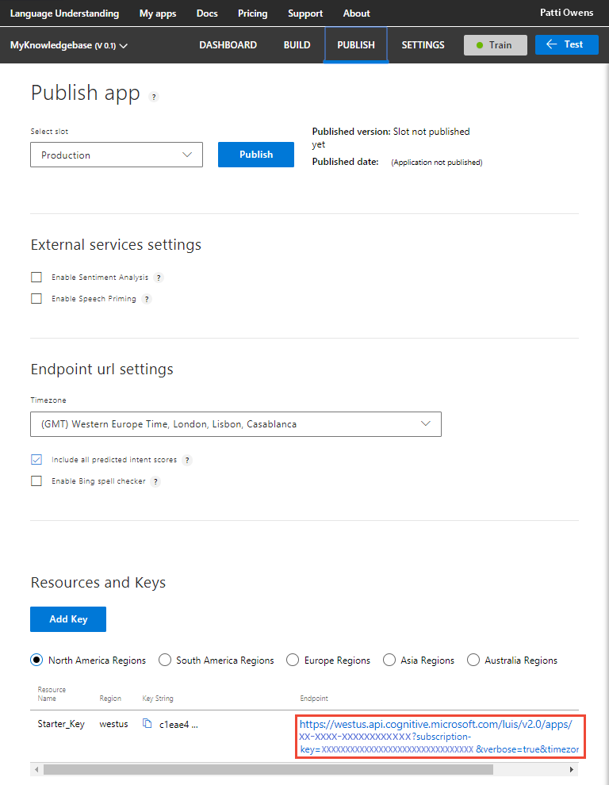

---
title: Create a LUIS app to get regular-expression matched data - Azure | Microsoft Docs 
description: Learn how to create a simple LUIS app using intents and a regular expression entity to extract data. 
services: cognitive-services
author: v-geberr
manager: kaiqb 

ms.service: cognitive-services
ms.component: luis
ms.topic: article
ms.date: 05/07/2018
ms.author: v-geberr
--- 

# Simple app with intents and a regular expression entity
This simple app has two [intents](luis-concept-intent.md) and one regular expression [entity](luis-concept-entity-types.md). Its purpose is to pull out Knowledge Base (KB) article numbers from an utterance. 

## App intents
The intents are categories of what the user wants. This app has two intents: FindArticle and None. The [None](luis-concept-intent.md#none-intent-is-fallback-for-app) intent is purposeful, to indicate anything outside the app.  

## Regular expression entity is a regular expression match
The purpose of an entity is to find and categorize parts of the text in the utterance. 
A [regular expression](luis-concept-entity-types.md) entity allows for a regular expression match of words or phrases in the utterance. It is not machine-learned.   

For this Knowledge Base app, LUIS extracts the KB document number in such as way that a standard order can be created and filled. LUIS allows utterances to have variations, abbreviations, and slang. 

Simple example utterances from users include:

```
When was KB123456 published?
Who authored KB112211?
KB224466 is about published in French?
```

Abbreviated or slang versions of utterances include:

```
KB123456
kb123456 date?
Kb123456 title?
```
 
The regular expression entity to match is `kb[0-9]{6,}`. This regular expression matches the characters `kb` literally but ignores case and culture variants. It matches digits 0-9, which can have between 6 and an unlimited number of digits. This doesn't match any number without `kb` or with a space between `kb` and the digits. And it doesn't match when there are fewer than six digits. The point is that the regular expression is a work in progress. When you review endpoint utterances or query logs, you notice variations in the usage of the KB number. 

## What LUIS does
When the intent and entities of the utterance are identified, [extracted](luis-concept-data-extraction.md#list-entity-data), and returned in JSON from the [endpoint](https://aka.ms/luis-endpoint-apis), LUIS is done. The calling application or chat bot takes that JSON response and fulfills the request -- in whatever way the app or chat bot is designed to do. 

## Create a new app
1. Log in to the [LUIS][LUIS] website. Make sure to log into the [region][LUIS-regions] where you need the LUIS endpoints published.

2. On the [LUIS][LUIS] website, select **Create new app**.  

    

3. In the pop-up dialog, enter the name `MyKnowledgebase`. 

    

4. When that process finishes, the app shows the **Intents** page with the **None** Intent. 

    

## Create a new intent

1. On the **Intents** page, select **Create new intent**. 

    

2. Enter the new intent name `FindKnowledgeBase`. This intent should be selected any time a user wants information about a knowledge base article.

    By creating an intent, you are creating the primary category of information that you want to identify. Giving the category a name allows any other application that uses the LUIS query results to use that category name to find an appropriate answer or take appropriate action. LUIS won't answer these questions, only identify what type of information is being asked for. 

    

3. Add several utterances to the `FindKnowledgeBase` intent that you expect a user to ask for, such as:

    | Example utterances|
    |--|
    |Please send a PDF of kb123456 to mark@company.com|
    |Let the author of KB121212 know to update the how-to|
    |When was kb135135 released?|

    

## Add utterances to None intent

The LUIS app currently has no utterances for the **None** intent. It needs utterances that you don't want the app to answer, so it has to have utterances in the **None** intent. Do not leave it empty. 

1. Select **Intents** from the left panel. 

    

2. Select the **None** intent. Add three utterances that your user might enter but are not relevant to your app:

    | Example utterances|
    |--|
    |Cancel!|
    |Good bye|
    |What is going on?|

## When the utterance is predicted for the None intent
In your LUIS-calling application (such as a chat bot), when LUIS returns the **None** intent for an utterance, your bot can ask if the user wants to end the conversation. The bot can also give more directions for continuing the conversation if the user doesn't want to end it. 

Entities work in the **None** intent. If the top scoring intent is **None** but an entity is extracted that is meaningful to your chat bot, your chat bot can follow up with a question that focuses the customer's intent. 

## Create a KnowledgeBase article regular expression entity 
Now that the two intents have utterances, LUIS needs to understand what a KB number is. Create a regular expression entity by following the steps:

1. Select **Entities** in the left panel.

2. Select **Create new entity** button on the Entities Page. 

    

3. In the pop-up dialog, enter the new entity name `KBarticle`, select **RegEx** as the entity type, enter `kb[0-9]{6,}` as the Regex, and then select **Done**.

    

4. Now that the entity is created, select **Intents** then **FindKnowledgeBase** entity to see the regular expression labeled in the utterances. 

    

## Train the LUIS app
LUIS doesn't know about the changes to the intents and entities (the model), until it is trained. 

1. In the top right side of the LUIS website, select the **Train** button.

    

2. Training is complete when you see the green status bar at the top of the website confirming success.

    

## Publish the app to get the endpoint URL
In order to get a LUIS prediction in a chat bot or other application, you need to publish the app. 

1. In the top right side of the LUIS website, select the **Publish** button. 

    

2. Select the **Publish to production slot**. 

    

3. Publishing is complete when you see the green status bar at the top of the website confirming success.

    

## Query the endpoint with a different utterance
1. On the **Publish** page, select the **endpoint** link at the bottom of the page. This action opens another browser window with the endpoint URL in the address bar. 

2. Go to the end of the URL in the address and enter `When were KB123456 and kb234567 published?`. The last querystring parameter is `q`, the utterance **q**uery. This utterance is not the same as any of the labeled utterances so it is a good test and should return the `FindKnowledgeBase` intent with the two KBarticles of `KB123456` and `kb234567`.

    ```
    {
        "query": "when were kb123456 and kb234567 published?",
        "topScoringIntent": {
            "intent": "FindKnowledgeBase",
            "score": 1.0
         },
        "entities": [
            {
                "entity": "kb123456",
                "type": "KBarticle",
                "startIndex": 10,
                "endIndex": 17
            },
            {
                "entity": "kb234567",
                "type": "KBarticle",
                "startIndex": 23,
                "endIndex": 30
            }
        ]
    }
    ```

## What has this LUIS app accomplished?
This app, with just two intents and a regular expression entity, identified the intention and returned the extracted data. 

Your chat bot now has enough information to determine the primary action, `FindKnowledgeBase`, and which KB articles were in the search. 

## Where is this LUIS data used? 
LUIS is done with this request. The calling application, such as a chat bot, can take the topScoringIntent result and the kb article numbers and search a third-party API. LUIS doesn't do that work. LUIS only determines what the user's intention is and extracts data about that intention. 

## Next steps

[Learn more about entities](luis-concept-entity-types.md). 


<!--References-->
[LUIS]:luis-reference-regions.md#luis-website
[LUIS-regions]:luis-reference-regions.md#publishing-regions
