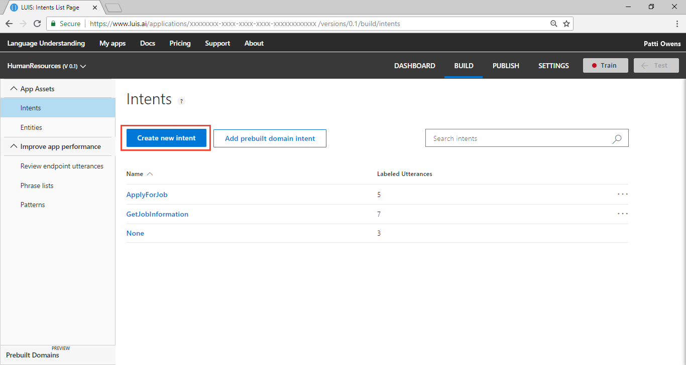
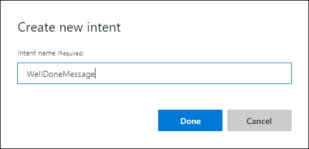
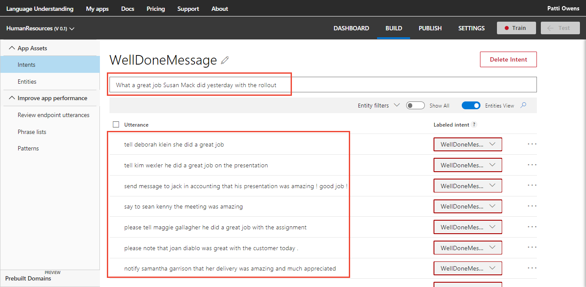
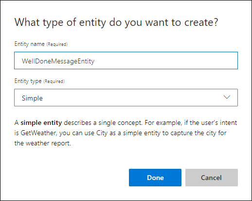
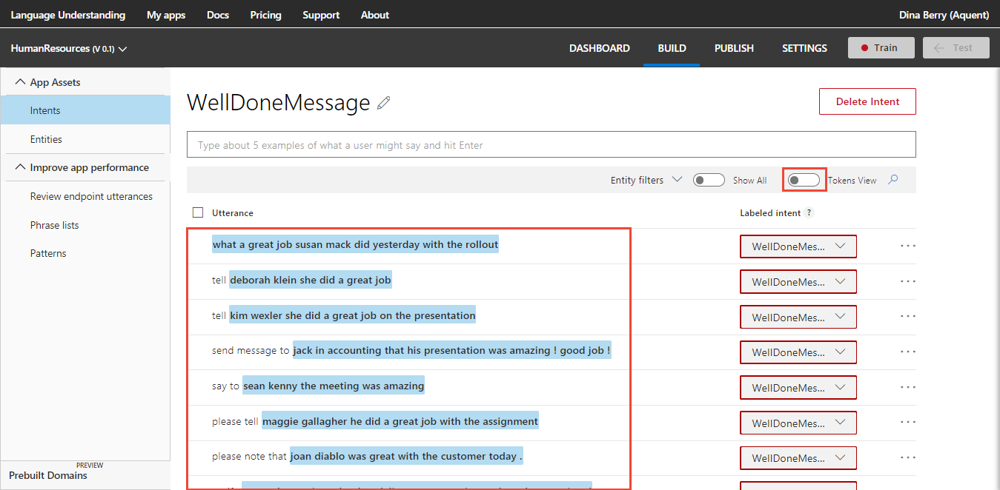
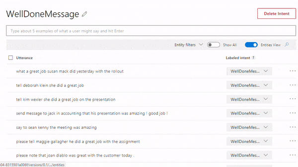
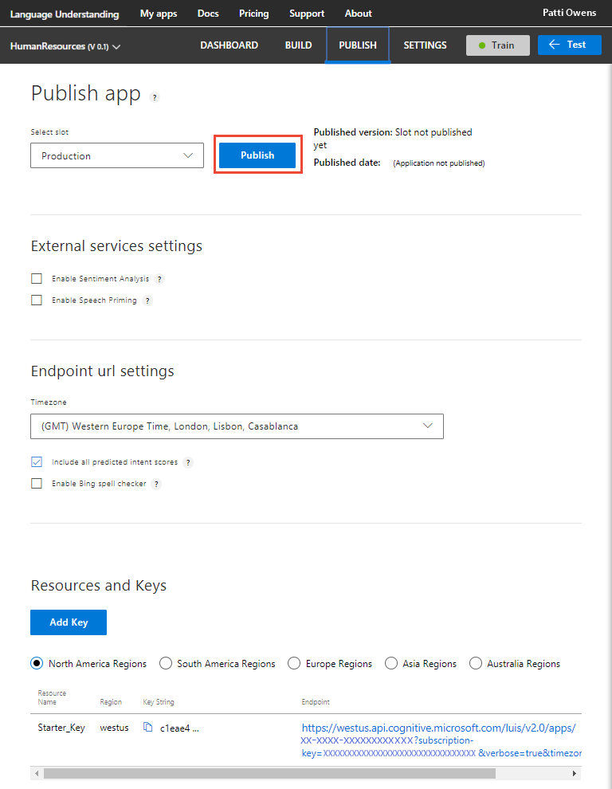

---
title: Tutorial creating a LUIS app to extract data - Azure | Microsoft Docs 
description: In this tutorial, learn how to create a simple LUIS app using intents and a simple entity to extract machine-learned data. 
services: cognitive-services
author: v-geberr
manager: kaiqb 

ms.service: cognitive-services
ms.component: luis
ms.topic: tutorial
ms.date: 06/13/2018
ms.author: v-geberr
#Customer intent: As a new user, I want to understand how and why to use the simple entity.  
--- 

# Tutorial: Create app that uses simple entity
In this tutorial, create an app that demonstrates how to extract machine-learned data from an utterance using the **Simple** entity.

<!-- green checkmark -->
> [!div class="checklist"]
> * Understand simple entities 
> * Create new intent with example utterances
> * Create new entity and label example utterances
> * Train, and publish app
> * Query endpoint of app to see LUIS JSON response

For this article, you need a free [LUIS][LUIS] account in order to author your LUIS application.

## Before you begin
If you do not have the Human Resources app from the [custom domain](luis-quickstart-intents-only.md) quickstart, [import](create-new-app.md#import-new-app) the JSON into a new app in the [LUIS][LUIS] website, from the [LUIS-Samples](https://github.com/Microsoft/LUIS-Samples/blob/master/documentation-samples/quickstarts/custom-domain-intent-only-HumanResources.json) Github repository.

If you want to keep the original Human Resources app, clone the version on the [Settings](luis-how-to-manage-versions.md#clone-a-version) page, and name it `simple`. Cloning is a great way to play with various LUIS features without affecting the original version. 

## Purpose of the app
This app demonstrates how to pull data out of an utterance. Consider the following utterance from a chatbot:

```JSON
Advise the board that the CEO's meeting went well
```

The intent is to send a message. The important data of the utterance is the message itself,  `the CEOs meeting went well`.  

## Purpose of the simple entity
The purpose of a simple entity is to teach LUIS what the entity is and where it can be found in an utterance. The part of the utterance that contains the data changes from utterance to utterance based on word choice and utterance length. LUIS needs examples of entities in any utterance across all intents.  

For this simple app, the entity is at the end of the utterance. 

## Create new intent with example utterances
1. Log in to the [LUIS][LUIS] website. Make sure to log into the [region](luis-reference-regions.md#luis-website) where you need the LUIS endpoints published.

2. Open the Human Resources domain app created in the [custom domain](luis-quickstart-intents-only.md) quickstart.   

3. On the **Intents** page, select **Create new intent**. 

    [](media/luis-quickstart-primary-and-secondary-data/hr-create-new-intent.png#lightbox)

2. Enter the new intent name `WellDoneMessage`. This intent should be selected any time a user wants to send a message of congratulations on a job well done to an employee.

    By creating an intent, you are creating the primary category of information that you want to identify. Giving the category a name allows any other application that uses the LUIS query results to use that category name to find an appropriate answer or take appropriate action. LUIS won't answer these questions, only identify what type of information is being asked for in natural language. 

    

3. Add several utterances to the `WellDoneMessage` intent that you expect a user to ask for, such as:

    | Example utterances|
    |--|
    |Advise the board that the CEO's meeting went well|
    |Be sure to tell Valerie Louis that her delivery was well received|
    |Brief Garrett Simons that his trip was well received|
    |Convey our congratulations to Mike Oliver on his show|
    |Good job Brad Jones!|
    |Great performance John Devry|
    |Inform Jack Constantine that he did a great job|
    |Last week the Manager of Sales did a great job at the conference|
    |Let it be known that Irene Bonds is doing a great job in customer service|
    |Nice to say what a great job Denise in Design did yesterday at the meeting|
    |Note that Greg Vining is a great developer|
    |Notify Samantha Garrison that her delivery was amazing and much appreciated|
    |Please note that Joan Diablo was great with the customer today.|
    |Please tell Maggie Gallagher he did a great job with the assignment|
    |Say to Sean Kenny the meeting was amazing|
    |Send message to Jack in Accounting that his presentation was amazing! Good job!|
    |Tell Kim Wexler she did a great job on the presentation|
    |Tell Deborah Klein she did a great job|
    |What a great job Susan Mack did yesterday with the rollout|

    [](media/luis-quickstart-primary-and-secondary-data/hr-example-utterances.png#lightbox)

## Create new entity and label example utterances
The following procedure describes how to create an entity from an utterance and continue labeling other utterances. A [short video](#video) shows this procedure at the end of this section.

1. On the top utterance, select the left-most word of the message, enter `WellDoneMessageEntity` in the top field of the pop-up window, then select **Create new entity** on the pop-up window. 

2. A pop-up window displays allowing you to correct the spelling of the entity name and select the type of **Simple** entity. Select **Done**.

    

3. Select the message in the next utterance, then select **WellDoneMessageEntity** from the pop-up window. Label all messages in the utterances of this intent. 

    The following table is marked with square brackets to mark which words are part of the message.

    | Example utterances [marked] with WellDoneMessageEntity entity|
    |--|
    |Advise the board that [_the CEO's meeting went well_]|
    |Be sure to tell [_Valerie Louis that her delivery was well received_]|
    |Brief [_Garrett Simons that his trip was well received_]|
    |Convey [_our congratulations to Mike Oliver on his show_]|
    |[_Good job Brad Jones!_]|
    |[_Great performance John Devry_]|
    |Inform [_Jack Constantine that he did a great job_]|
    |[_Last week the Manager of Sales did a great job at the conference_]|
    |Let it be known that [_Irene Bonds is doing a great job in customer service_]|
    |Nice to say [_what a great job Denise in Design did yesterday at the meeting_]|
    |Note that [_Greg Vining is a great developer_]|
    |Notify [_Samantha Garrison that her delivery was amazing and much appreciated_]|
    |Please note that [_Joan Diablo was great with the customer today._]|
    |Please tell [_Maggie Gallagher he did a great job with the assignment_]|
    |Say to [_Sean Kenny the meeting was amazing_]|
    |Send message to [_Jack in Accounting that his presentation was amazing! Good job!_]|
    |Tell [_Kim Wexler she did a great job on the presentation_]|
    |Tell [_Deborah Klein she did a great job_]|
    |[_What a great job Susan Mack did yesterday with the rollout_]|

4. Select the Tokens View toggle on the toolbar above the utterances to verify the messages are labeled correctly. 

    [](media/luis-quickstart-primary-and-secondary-data/hr-labeled-utterances.png#lightbox)

<!--

    View a quick video showing this process to create an entity and label an utterance.

    <a name="video"></a>
    

-->

## Train the LUIS app
LUIS doesn't know about the changes to the intents and entities (the model), until it is trained. 

1. In the top right side of the LUIS website, select the **Train** button.

    

2. Training is complete when you see the green status bar at the top of the website confirming success.

    

## Publish the app to get the endpoint URL
In order to get a LUIS prediction in a chatbot or other application, you need to publish the app. 

1. In the top right side of the LUIS website, select the **Publish** button. 

2. Select the Production slot and the **Publish** button.

    [](media/luis-quickstart-primary-and-secondary-data/hr-publish-to-production.png#lightbox)

3. Publishing is complete when you see the green status bar at the top of the website confirming success.

## Query the endpoint with a different utterance
On the **Publish** page, select the **endpoint** link at the bottom of the page. 

[](media/luis-quickstart-primary-and-secondary-data/hr-publish-select-endpoint.png#lightbox)

This action opens another browser window with the endpoint URL in the address bar. Go to the end of the URL in the address and enter `Tell John Smith what a great job he did on the presentation`. The last querystring parameter is `q`, the utterance **query**. This utterance is not the same as any of the labeled utterances so it is a good test and should return the `WellDoneMessage` intent and `WellDoneMessageEntity`.

```
{
  "query": "Tell John Smith what a great job he did on the presentation",
  "topScoringIntent": {
    "intent": "WellDoneMessage",
    "score": 0.9911686
  },
  "intents": [
    {
      "intent": "WellDoneMessage",
      "score": 0.9911686
    },
    {
      "intent": "ApplyForJob",
      "score": 0.0119273383
    },
    {
      "intent": "GetJobInformation",
      "score": 0.0100734336
    },
    {
      "intent": "None",
      "score": 0.00442946469
    }
  ],
  "entities": [
    {
      "entity": "john smith what a great job he did on the presentation",
      "type": "WellDoneMessageEntity",
      "startIndex": 5,
      "endIndex": 58,
      "score": 0.7065823
    }
  ]
}
```

## What has this LUIS app accomplished?
This app, with a new intent and entity, identified a natural language query intention and returned the message data. 

The JSON result identifies the top scoring intent and extracted the data of the message.

Your chatbot now has enough information to determine the primary action and a parameter of that action, the text of the message. 

## Where is this LUIS data used? 
LUIS is done with this request. The calling application, such as a chatbot, can take the topScoringIntent result and the data from the entity to send the message through a third-party API. If there are other programmatic options for the bot or calling application, LUIS doesn't do that work. LUIS only determines what the user's intention is. 

## Clean up resources
When no longer needed, delete the LUIS app. To do so, select the three dot menu (...) to the right of the app name in the app list, select **Delete**. On the pop-up dialog **Delete app?**, select **Ok**.

## Next steps

> [!div class="nextstepaction"]
> [Learn how to add a hierarchical entity](luis-quickstart-intent-and-hier-entity.md)


<!--References-->
[LUIS]: luis-reference-regions.md#luis-website
