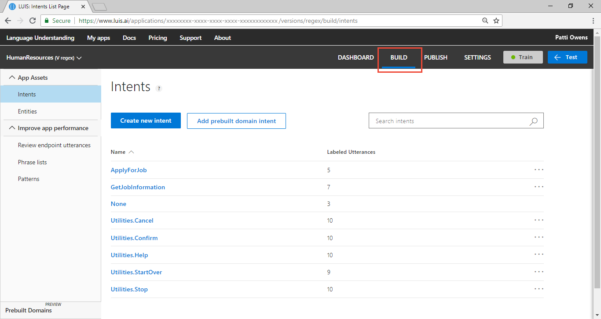
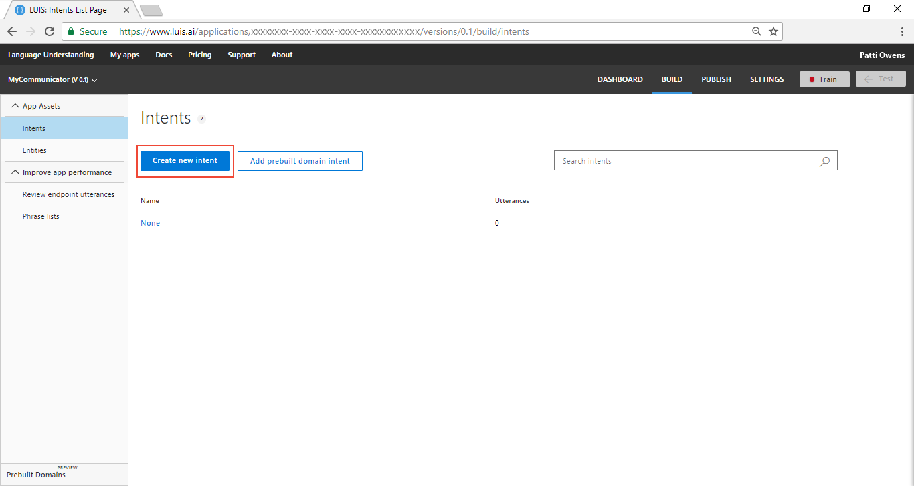
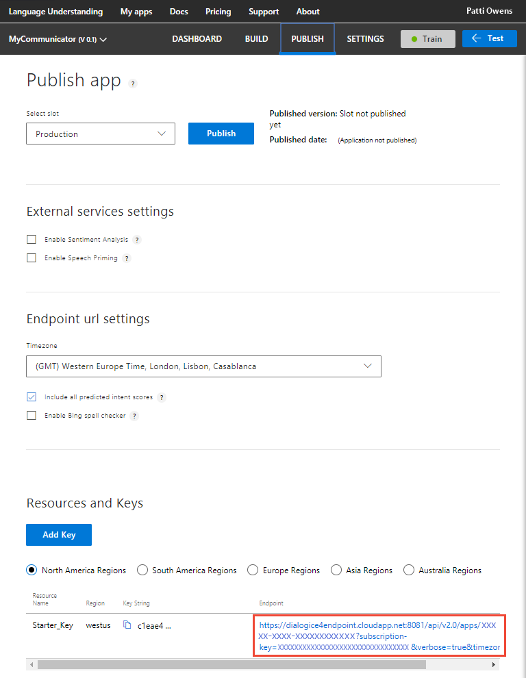

---
title: Tutorial creating a LUIS app to extract data - Azure | Microsoft Docs 
description: In this tutorial, learn how to create a simple LUIS app using intents and a simple entity to extract machine-learned data. 
services: cognitive-services
author: v-geberr
manager: kaiqb 

ms.service: cognitive-services
ms.component: luis
ms.topic: tutorial
ms.date: 06/26/2018
ms.author: v-geberr
#Customer intent: As a new user, I want to understand how and why to use the simple entity.  
--- 

# Tutorial: Create app that uses simple entity
In this tutorial, create an app that demonstrates how to extract machine-learned data from an utterance using the **Simple** entity.

<!-- green checkmark -->
> [!div class="checklist"]
> * Understand simple entities 
> * Create new LUIS app for the Human Resources (HR) domain 
> * Add simple entity to extract jobs from app
> * Train, and publish app
> * Query endpoint of app to see LUIS JSON response
> * Add phrase list to boost job title extraction
> * Train, and publish app
> * Query endpoint of app to see LUIS JSON response

For this article, you need a free [LUIS][LUIS] account in order to author your LUIS application.

## Before you begin
If you don't have the Human Resources app from the [hierarchical entities](luis-quickstart-intent-and-hier-entity.md) tutorial, [import](create-new-app.md#import-new-app) the JSON into a new app in the [LUIS](luis-reference-regions.md#luis-website) website. The app to import is found in the [LUIS-Samples](https://github.com/Microsoft/LUIS-Samples/blob/master/documentation-samples/quickstarts/custom-domain-hier-HumanResources.json) Github repository.

If you want to keep the original Human Resources app, clone the version on the [Settings](luis-how-to-manage-versions.md#clone-a-version) page, and name it `simple`. Cloning is a great way to play with various LUIS features without affecting the original version.  

## Purpose of the app
This app demonstrates how to pull data out of an utterance. Consider the following utterances from a chatbot:

|Utterance|Extractable job name|Job information type|
|:--|:--|:--|
|I want to apply for the new accounting job.|accounting|job or department name|
|Please submit my resume for the engineering position.|engineering|job or department name|
|Fill out application for job 123456|123456|specific job number|

Job title, department name, and even job description can all be used interchangeably to refer to a position in a company. This app needs to extract that name or phrase and return it. 

This tutorial adds a new entity to extract job or department name. The ability to extract a specific job number is shown in the regular expression [tutorial](luis-quickstart-intent-regex-entity.md). 

## Purpose of the simple entity
The purpose of the simple entity in this LUIS app is to teach LUIS what a job title or department is and where it can be found in an utterance. The part of the utterance that is the job can change from utterance to utterance based on word choice and utterance length. LUIS needs examples of jobs in any utterance across all intents.  

The job title or department is difficult to determine because a job title or department is a name. A name can be a noun, verb, or a phrase of several words. For example:

|Jobs|
|--|
|engineer|
|software engineer|
|senior software engineer|
|engineering team lead |
|air traffic controller|
|motor vehicle operator|
|ambulance driver|
|tender|
|extruder|
|millwright|

This LUIS app has job titles and departments in several intents. By labeling these words in all the intents' utterances, LUIS learns more about what a job title or department is and where it is found in utterances.

## Create job simple entity

1. Make sure your Human Resources app is in the **Build** section of LUIS. You can change to this section by selecting **Build** on the top, right menu bar. 

    [ ](./media/luis-quickstart-intents-regex-entity/first-image.png#lightbox)

2. On the **Intents** page, select **ApplyForJob** intent. 

    [](media/luis-quickstart-primary-and-secondary-data/create-new-intent-button.png#lightbox)

3. In the utterance, `I want to apply for the new accounting job`, select `accounting`, enter `Job` in the top field of the pop-up menu, then select **Create new entity** in the pop-up menu. 

4. In the pop-up window, verify the entity name and type and select **Done**.

5. In the utterance, `Submit resume for engineering position`, label the word engineering as a Job entity. Select the word engineering, then select Job from the pop-up menu. 

    All the utterances are labeled but five utterances isn't enough to teach LUIS about job-related words and phrases. The jobs that use the number value do not need more examples because that uses a regular expression entity. The jobs that are words or phrases need at least 15 more examples. 

6. Add more utterances and mark the job words or phrases as **Job** entity. In the following table, the square brackets indicate the job-related words to label as a job entity. The words `job` and `c.v.` have synonyms across the utterances to teach LUIS words that are related to this intent. The job types are general across employment on purpose for an employment service. If you wanted jobs related to a specific industry, the job words should reflect that. 

    |Utterance|Job entity|
    |I'm applying for the Program Manager desk in R&D|Program Manager|
    |Here is my line cook application.|line cook|
    |My resume for camp counselor is attached.|camp counselor|
    |This is my c.v. for administrative assistant.|administrative assistant|
    |I want to apply for the management job in sales.|management, sales|
    |This is my resume for the new accounting position.|accounting|
    |My application for barback is included.|barback|
    |I'm submitting my application for roofer and framer.|roofer, framer|
    |My c.v. for bus driver is here.|bus driver|
    |I'm a registered nurse. Here is my resume.|registered nurse|
    |I would like to submit my paperwork for the teaching position I saw in the paper.|teaching|
    |This is my c.v. for the stocker post in fruits and vegetables.|stocker|
    |Apply for tile work.|tile|
    |Attached resume for landscape architect.|landscape architect|
    |My curriculum vitae for professor of biology is enclosed.|professor of biology|
    |I would like to apply for the position in photography.|photography|git 

## Label entity in example utterances for GetJobInformation intent
1. Select **Intents** from the left menu.

2. Select **GetJobInformation** from the list of intents. 

3. Label the jobs in the example utterances:

    |Utterance|Job entity|
    |Is there any work in databases?|databases|
    |Looking for a new situation with responsibilities in accounting|accounting|
    |What positions are available for senior engineers?|senior engineers|

    There are other example utterances but they do not contain job words.

## Train the LUIS app
LUIS doesn't know about the changes to the intents and entities (the model), until it is trained. 

1. In the top right side of the LUIS website, select the **Train** button.

    

2. Training is complete when you see the green status bar at the top of the website confirming success.

    

## Publish the app to get the endpoint URL
In order to get a LUIS prediction in a chatbot or other application, you need to publish the app. 

1. In the top right side of the LUIS website, select the **Publish** button. 

2. Select the Production slot and the **Publish** button.

    [](media/luis-quickstart-primary-and-secondary-data/publish-to-production.png#lightbox)

3. Publishing is complete when you see the green status bar at the top of the website confirming success.

## Query the endpoint with a different utterance
On the **Publish** page, select the **endpoint** link at the bottom of the page. 

[](media/luis-quickstart-primary-and-secondary-data/publish-select-endpoint.png#lightbox)

This action opens another browser window with the endpoint URL in the address bar. Go to the end of the URL in the address and enter `text I'm driving and will be 30 minutes late to the meeting`. The last querystring parameter is `q`, the utterance **query**. This utterance is not the same as any of the labeled utterances so it is a good test and should return the `SendMessage` utterances.

```
{
  "query": "text I'm driving and will be 30 minutes late to the meeting",
  "topScoringIntent": {
    "intent": "SendMessage",
    "score": 0.987501
  },
  "intents": [
    {
      "intent": "SendMessage",
      "score": 0.987501
    },
    {
      "intent": "None",
      "score": 0.111048922
    }
  ],
  "entities": [
    {
      "entity": "i ' m driving and will be 30 minutes late to the meeting",
      "type": "Message",
      "startIndex": 5,
      "endIndex": 58,
      "score": 0.162995353
    }
  ]
}
```

## What has this LUIS app accomplished?
This app, with just two intents and one entity, identified a natural language query intention and returned the message data. 

The JSON result identifies the top scoring intent `SendMessage` with a score of 0.987501. All scores are between 1 and 0, with the better score being close to 1. The `None` intent's score is 0.111048922, much closer to zero. 

The message data has a type, `Message`, as well as a value, `i ' m driving and will be 30 minutes late to the meeting`. 

Your chatbot now has enough information to determine the primary action, `SendMessage`, and a parameter of that action, the text of the message. 

## Where is this LUIS data used? 
LUIS is done with this request. The calling application, such as a chatbot, can take the topScoringIntent result and the data from the entity to send the message through a 3rd party API. If there are other programmatic options for the bot or calling application, LUIS doesn't do that work. LUIS only determines what the user's intention is. 

## Clean up resources
When no longer needed, delete the LUIS app. To do so, select the three dot menu (...) to the right of the app name in the app list, select **Delete**. On the pop-up dialog **Delete app?**, select **Ok**.

## Next steps

> [!div class="nextstepaction"]
> [Learn how to add a hierarchical entity](luis-quickstart-intent-and-hier-entity.md)


<!--References-->
[LUIS]: https://docs.microsoft.com/azure/cognitive-services/luis/luis-reference-regions#luis-website
