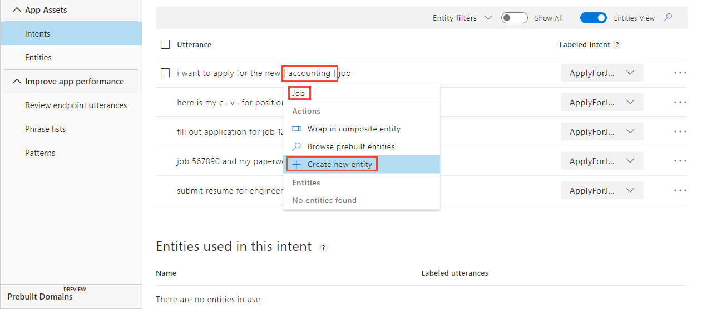
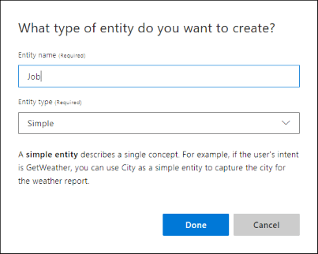
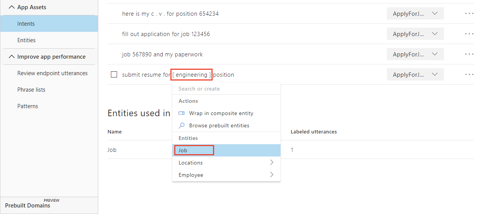
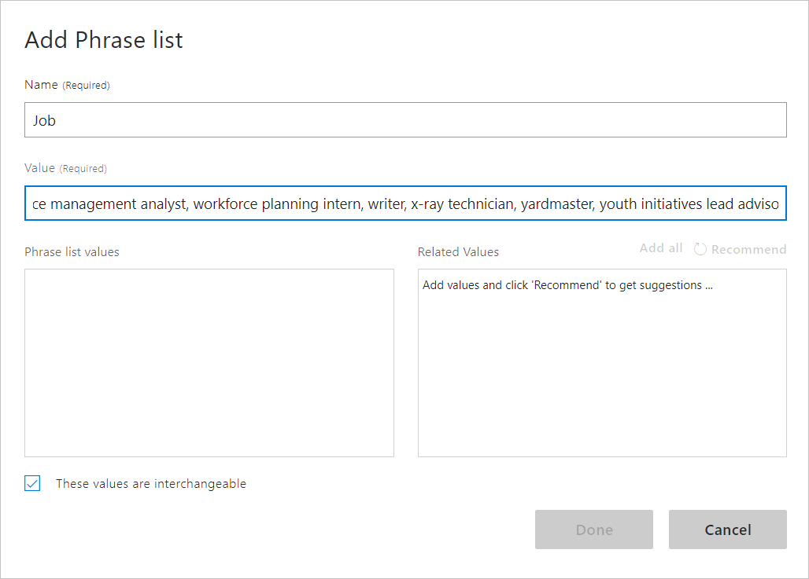
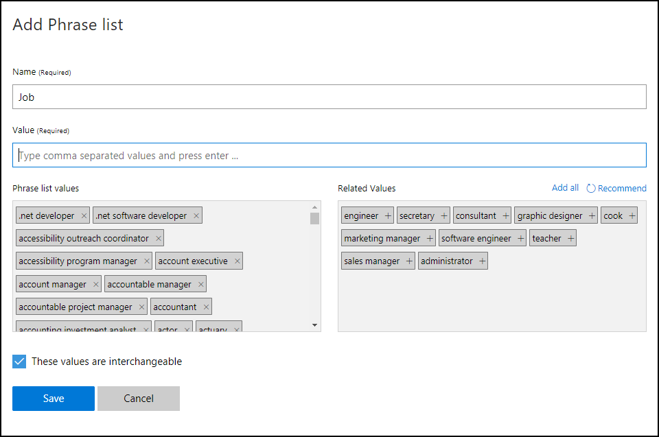

# Tutorial: Extract names with simple entity and a phrase list

In this tutorial, extract machine-learned data of employment job name from an utterance using the **Simple** entity. To increase the extraction accuracy, add a phrase list of terms specific to the simple entity.

The simple entity detects a single data concept contained in words or phrases.

**In this tutorial, you learn how to:**

<!-- green checkmark -->
> [!div class="checklist"]
> * Import example app
> * Add simple entity 
> * Add phrase list to boost signal words
> * Train 
> * Publish 
> * Get intents and entities from endpoint

[!INCLUDE [LUIS Free account](../../../includes/cognitive-services-luis-free-key-short.md)]


## Simple entity

This tutorial adds a new simple entity to extract the job name. The purpose of the simple entity in this LUIS app is to teach LUIS what a job name is and where it can be found in an utterance. The part of the utterance that is the job name can change from utterance to utterance based on word choice and utterance length. LUIS needs examples of job names  across all intents that use job names.  

The simple entity is a good fit for this type of data when:

* Data is a single concept.
* Data is not well-formatted such as a regular expression.
* Data is not common such as a prebuilt entity of phone number or data.
* Data is not matched exactly to a list of known words, such as a list entity.
* Data does not contain other data items such as a composite entity or contextual roles.

Consider the following utterances from a chat bot:

|Utterance|Extractable job name|
|:--|:--|
|I want to apply for the new accounting job.|accounting|
|Submit my resume for the engineering position.|engineering|
|Fill out application for job 123456|123456|

The job name is difficult to determine because a name can be a noun, verb, or a phrase of several words. For example:

|Jobs|
|--|
|engineer|
|software engineer|
|senior software engineer|
|engineering team lead |
|air traffic controller|
|motor vehicle operator|
|ambulance driver|
|tender|
|extruder|
|millwright|

This LUIS app has job names in several intents. By labeling these words in all the intents' utterances, LUIS learns more about what a job name is and where it is found in utterances.

Once the entities are marked in the example utterances, it is important to add a phrase list to boost the signal of the simple entity. A phrase list is **not** used as an exact match and does not need to be every possible value you expect. 

## Import example app

1.  Download and save the [app JSON file](https://github.com/Azure-Samples/cognitive-services-language-understanding/blob/master/documentation-samples/tutorials/build-app/intentonly.json) from the Intents tutorial.

2. Import the JSON into a new app.

3. From the **Manage** section, on the **Versions** tab, clone the version, and name it `simple`. Cloning is a great way to play with various LUIS features without affecting the original version. Because the version name is used as part of the URL route, the name can't contain any characters that are not valid in a URL.

## Mark entities in example utterances of an intent

1. [!INCLUDE [Start in Build section](../../../includes/cognitive-services-luis-tutorial-build-section.md)]

1. On the **Intents** page, select **ApplyForJob** intent. 

1. In the utterance, `I want to apply for the new accounting job`, select `accounting`, enter `Job` in the top field of the pop-up menu, then select **Create new entity** in the pop-up menu. 

    [](media/luis-quickstart-primary-and-secondary-data/hr-create-entity.png#lightbox)

1. In the pop-up window, verify the entity name and type and select **Done**.

    

1. In the remaining utterances, mark the job-related words with **Job** entity by selecting the word or phrase, then selecting **Job** from the pop-up menu. 

    [](media/luis-quickstart-primary-and-secondary-data/hr-label-simple-entity.png#lightbox)


## Add more example utterances and mark entity

Simple entities need many examples in order to have a high confidence of prediction. 
 
1. Add more utterances and mark the job words or phrases as **Job** entity. 

    |Utterance|Job entity|
    |:--|:--|
    |I'm applying for the Program Manager desk in R&D|Program Manager|
    |Here is my line cook application.|line cook|
    |My resume for camp counselor is attached.|camp counselor|
    |This is my c.v. for administrative assistant.|administrative assistant|
    |I want to apply for the management job in sales.|management, sales|
    |This is my resume for the new accounting position.|accounting|
    |My application for barback is included.|barback|
    |I'm submitting my application for roofer and framer.|roofer, framer|
    |My c.v. for bus driver is here.|bus driver|
    |I'm a registered nurse. Here is my resume.|registered nurse|
    |I would like to submit my paperwork for the teaching position I saw in the paper.|teaching|
    |This is my c.v. for the stocker post in fruits and vegetables.|stocker|
    |Apply for tile work.|tile|
    |Attached resume for landscape architect.|landscape architect|
    |My curriculum vitae for professor of biology is enclosed.|professor of biology|
    |I would like to apply for the position in photography.|photography|

## Mark job entity in other intents

1. Select **Intents** from the left menu.

1. Select **GetJobInformation** from the list of intents. 

1. Label the jobs in the example utterances

    If there are more example utterances in one intent than another intent, that intent has a higher likelihood of being the highest predicted intext. 

## Train the app so the changes to the intent can be tested 

[!INCLUDE [LUIS How to Train steps](../../../includes/cognitive-services-luis-tutorial-how-to-train.md)]

## Publish the app so the trained model is queryable from the endpoint

[!INCLUDE [LUIS How to Publish steps](../../../includes/cognitive-services-luis-tutorial-how-to-publish.md)]

## Get intent and entity prediction from endpoint 

1. [!INCLUDE [LUIS How to get endpoint first step](../../../includes/cognitive-services-luis-tutorial-how-to-get-endpoint.md)]

2. Go to the end of the URL in the address and enter `Here is my c.v. for the engineering job`. The last querystring parameter is `q`, the utterance **query**. This utterance is not the same as any of the labeled utterances so it is a good test and should return the `ApplyForJob` utterances.

    ```json
    {
      "query": "Here is my c.v. for the engineering job",
      "topScoringIntent": {
        "intent": "ApplyForJob",
        "score": 0.98052007
      },
      "intents": [
        {
          "intent": "ApplyForJob",
          "score": 0.98052007
        },
        {
          "intent": "GetJobInformation",
          "score": 0.03424581
        },
        {
          "intent": "None",
          "score": 0.0015820954
        }
      ],
      "entities": [
        {
          "entity": "engineering",
          "type": "Job",
          "startIndex": 24,
          "endIndex": 34,
          "score": 0.668959737
        }
      ]
    }
    ```
    
    LUIS found the correct intent, **ApplyForJob**, and extracted the correct entity, **Job**, with a value of `engineering`.


## Names are tricky
The LUIS app found the correct intent with high confidence and it extracted the job name, but names are tricky. Try the utterance `This is the lead welder paperwork`.  

In the following JSON, LUIS responds with the correct intent, `ApplyForJob`, but didn't extract the `lead welder` job name. 

```json
{
  "query": "This is the lead welder paperwork",
  "topScoringIntent": {
    "intent": "ApplyForJob",
    "score": 0.860295951
  },
  "intents": [
    {
      "intent": "ApplyForJob",
      "score": 0.860295951
    },
    {
      "intent": "GetJobInformation",
      "score": 0.07265678
    },
    {
      "intent": "None",
      "score": 0.00482481951
    }
  ],
  "entities": []
}
```

Because a name can be anything, LUIS predicts entities more accurately if it has a phrase list of words to boost the signal.

## To boost signal of the job-related words, add a phrase list of job-related words

Open the [jobs-phrase-list.csv](https://github.com/Azure-Samples/cognitive-services-language-understanding/blob/master/documentation-samples/quickstarts/job-phrase-list.csv) from the Azure-Samples GitHub repository. The list is over 1,000 job words and phrases. Look through the list for job words that are meaningful to you. If your words or phrases are not on the list, add your own.

1. In the **Build** section of the LUIS app, select **Phrase lists** found under the **Improve app performance** menu.

1. Select **Create new phrase list**. 

1. Name the new phrase list `JobNames` and copy the list from jobs-phrase-list.csv into the **Values** text box. Select enter. 

    [](media/luis-quickstart-primary-and-secondary-data/hr-create-phrase-list-1.png#lightbox)

    If you want more words added to the phrase list, select **Recommand** then review the new **Related Values** and add any that are relevant. 

    Make sure to keep the **These values are interchangeable** checked because these values should all be treated as synonyms for jobs. Learn more about interchangeable and noninterchangeable [phrase list concepts](luis-concept-feature.md#how-to-use-phrase-lists).

1. Select **Save** to activate the phrase list.

    [](media/luis-quickstart-primary-and-secondary-data/hr-create-phrase-list-2.png#lightbox)

1. Train and publish the app again to use phrase list.

1. Requery at the endpoint with the same utterance: `This is the lead welder paperwork.`

    The JSON response includes the extracted entity:

    ```json
      {
      "query": "This is the lead welder paperwork.",
      "topScoringIntent": {
        "intent": "ApplyForJob",
        "score": 0.983076453
      },
      "intents": [
        {
          "intent": "ApplyForJob",
          "score": 0.983076453
        },
        {
          "intent": "GetJobInformation",
          "score": 0.0120766377
        },
        {
          "intent": "None",
          "score": 0.00248388131
        }
      ],
      "entities": [
        {
          "entity": "lead welder",
          "type": "Job",
          "startIndex": 12,
          "endIndex": 22,
          "score": 0.8373154
        }
      ]
    }
    ```

## Clean up resources

[!INCLUDE [LUIS How to clean up resources](../../../includes/cognitive-services-luis-tutorial-how-to-clean-up-resources.md)]

## Related information

* [Intents without entities tutorial](luis-quickstart-intents-only.md)
* [Simple entity](luis-concept-entity-types.md) conceptual information
* [Phrase list](luis-concept-feature.md) conceptual information
* [How to train](luis-how-to-train.md)
* [How to publish](luis-how-to-publish-app.md)
* [How to test in LUIS portal](luis-interactive-test.md)


## Next steps

In this tutorial, the Human Resources app uses a machine-learned simple entity to find job names in utterances. Because job names can be such a wide variety of words or phrases, the app needed a phrase list to boost the job name words. 

> [!div class="nextstepaction"]
> [Add a prebuilt keyphrase entity](luis-quickstart-intent-and-key-phrase.md)
