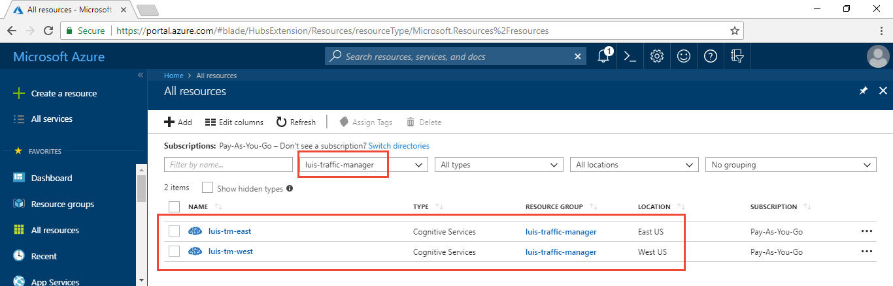
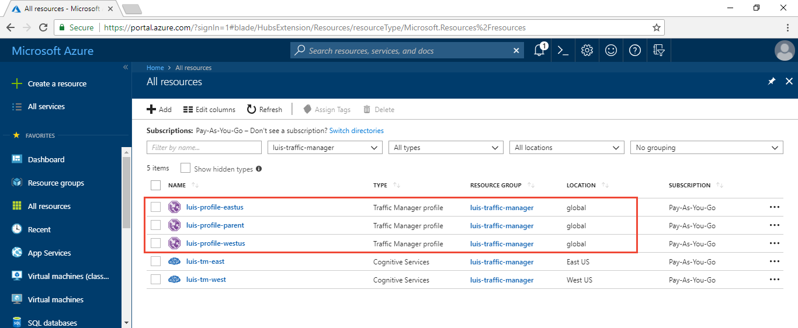
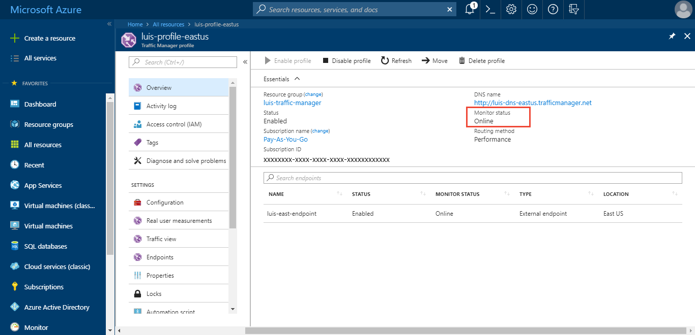

# Use Microsoft Azure Traffic Manager to manage endpoint quota across keys
Language Understanding (LUIS) offers the ability to increase the endpoint request quota beyond a single key's quota. This is done by creating more keys for LUIS and adding them to the LUIS application on the **Publish** page in the **Resources and Keys** section.

The client-application has to manage the traffic across the keys. LUIS doesn't do that.

This article explains how to manage the traffic across keys with Azure [Traffic Manager][traffic-manager-marketing]. You must already have a trained and published LUIS app. If you do not have one, follow the Prebuilt domain [quickstart](luis-get-started-create-app.md).

[!INCLUDE [updated-for-az](../../../includes/updated-for-az.md)]

## Connect to PowerShell in the Azure portal
In the [Azure][azure-portal] portal, open the PowerShell window. The icon for the PowerShell window is the **>_** in the top navigation bar. By using PowerShell from the portal, you get the latest PowerShell version and you are authenticated. PowerShell in the portal requires an [Azure Storage](https://azure.microsoft.com/services/storage/) account.


The following sections use [Traffic Manager PowerShell cmdlets](https://docs.microsoft.com/powershell/module/az.trafficmanager/#traffic_manager).

## Create Azure resource group with PowerShell
Before creating the Azure resources, create a resource group to contain all the resources. Name the resource group `luis-traffic-manager` and use the region is `West US`. The region of the resource group stores metadata about the group. It won't slow down your resources if they are in another region.

Create resource group with **[New-AzResourceGroup](https://docs.microsoft.com/powershell/module/az.resources/new-azresourcegroup)** cmdlet:

```powerShell
New-AzResourceGroup -Name luis-traffic-manager -Location "West US"
```

## Create LUIS keys to increase total endpoint quota
1. In the Azure portal, create two **Language Understanding** keys, one in the `West US` and one in the `East US`. Use the existing resource group, created in the previous section, named `luis-traffic-manager`.

    

2. In the [LUIS][LUIS] website, in the **Manage** section, on the **Azure Resources** page, assign keys to the app, and republish the app by selecting the **Publish** button in the top right menu.

    The example URL in the **endpoint** column uses a GET request with the endpoint key as a query parameter. Copy the two new keys' endpoint URLs. They are used as part of the Traffic Manager configuration later in this article.

## Manage LUIS endpoint requests across keys with Traffic Manager
Traffic Manager creates a new DNS access point for your endpoints. It does not act as a gateway or proxy but strictly at the DNS level. This example doesn't change any DNS records. It uses a DNS library to communicate with Traffic Manager to get the correct endpoint for that specific request. _Each_ request intended for LUIS first requires a Traffic Manager request to determine which LUIS endpoint to use.

### Polling uses LUIS endpoint
Traffic Manager polls the endpoints periodically to make sure the endpoint is still available. The Traffic Manager URL polled needs to be accessible with a GET request and return a 200. The endpoint URL on the **Publish** page does this. Since each endpoint key has a different route and query string parameters, each endpoint key needs a different polling path. Each time Traffic Manager polls, it does cost a quota request. The query string parameter **q** of the LUIS endpoint is the utterance sent to LUIS. This parameter, instead of sending an utterance, is used to add Traffic Manager polling to the LUIS endpoint log as a debugging technique while getting Traffic Manager configured.

Because each LUIS endpoint needs its own path, it needs its own Traffic Manager profile. In order to manage across profiles, create a [_nested_ Traffic Manager](https://docs.microsoft.com/azure/traffic-manager/traffic-manager-nested-profiles) architecture. One parent profile points to the children profiles and manage traffic across them.

Once the Traffic Manager is configured, remember to change the path to use the logging=false query string parameter so your log is not filling up with polling.

## Configure Traffic Manager with nested profiles
The following sections create two child profiles, one for the East LUIS key and one for the West LUIS key. Then a parent profile is created and the two child profiles are added to the parent profile.

### Create the East US Traffic Manager profile with PowerShell
To create the East US Traffic Manager profile, there are several steps: create profile, add endpoint, and set endpoint. A Traffic Manager profile can have many endpoints but each endpoint has the same validation path. Because the LUIS endpoint URLs for the east and west subscriptions are different due to region and endpoint key, each LUIS endpoint has to be a single endpoint in the profile.

1. Create profile with **[New-AzTrafficManagerProfile](https://docs.microsoft.com/powershell/module/az.trafficmanager/new-aztrafficmanagerprofile)** cmdlet

    Use the following cmdlet to create the profile. Make sure to change the `appIdLuis` and `subscriptionKeyLuis`. The subscriptionKey is for the East US LUIS key. If the path is not correct, including the LUIS app ID and endpoint key, the Traffic Manager polling is a status of `degraded` because Traffic Manage can't successfully request the LUIS endpoint. Make sure the value of `q` is `traffic-manager-east` so you can see this value in the LUIS endpoint logs.

    ```powerShell
    $eastprofile = New-AzTrafficManagerProfile -Name luis-profile-eastus -ResourceGroupName luis-traffic-manager -TrafficRoutingMethod Performance -RelativeDnsName luis-dns-eastus -Ttl 30 -MonitorProtocol HTTPS -MonitorPort 443 -MonitorPath "/luis/v2.0/apps/<appID>?subscription-key=<subscriptionKey>&q=traffic-manager-east"
    ```

    This table explains each variable in the cmdlet:

    |Configuration parameter|Variable name or Value|Purpose|
    |--|--|--|
    |-Name|luis-profile-eastus|Traffic Manager name in Azure portal|
    |-ResourceGroupName|luis-traffic-manager|Created in previous section|
    |-TrafficRoutingMethod|Performance|For more information, see [Traffic Manager routing methods][routing-methods]. If using performance, the URL request to the Traffic Manager must come from the region of the user. If going through a chatbot or other application, it is the chatbot's responsibility to mimic the region in the call to the Traffic Manager. |
    |-RelativeDnsName|luis-dns-eastus|This is the subdomain for the service: luis-dns-eastus.trafficmanager.net|
    |-Ttl|30|Polling interval, 30 seconds|
    |-MonitorProtocol<BR>-MonitorPort|HTTPS<br>443|Port and protocol for LUIS is HTTPS/443|
    |-MonitorPath|`/luis/v2.0/apps/<appIdLuis>?subscription-key=<subscriptionKeyLuis>&q=traffic-manager-east`|Replace `<appIdLuis>` and `<subscriptionKeyLuis>` with your own values.|

    A successful request has no response.

2. Add East US endpoint with **[Add-AzTrafficManagerEndpointConfig](https://docs.microsoft.com/powershell/module/az.trafficmanager/add-aztrafficmanagerendpointconfig)** cmdlet

    ```powerShell
    Add-AzTrafficManagerEndpointConfig -EndpointName luis-east-endpoint -TrafficManagerProfile $eastprofile -Type ExternalEndpoints -Target eastus.api.cognitive.microsoft.com -EndpointLocation "eastus" -EndpointStatus Enabled
    ```
    This table explains each variable in the cmdlet:

    |Configuration parameter|Variable name or Value|Purpose|
    |--|--|--|
    |-EndpointName|luis-east-endpoint|Endpoint name displayed under the profile|
    |-TrafficManagerProfile|$eastprofile|Use profile object created in Step 1|
    |-Type|ExternalEndpoints|For more information, see [Traffic Manager endpoint][traffic-manager-endpoints] |
    |-Target|eastus.api.cognitive.microsoft.com|This is the domain for the LUIS endpoint.|
    |-EndpointLocation|"eastus"|Region of the endpoint|
    |-EndpointStatus|Enabled|Enable endpoint when it is created|

    The successful response looks like:

    ```console
    Id                               : /subscriptions/<azure-subscription-id>/resourceGroups/luis-traffic-manager/providers/Microsoft.Network/trafficManagerProfiles/luis-profile-eastus
    Name                             : luis-profile-eastus
    ResourceGroupName                : luis-traffic-manager
    RelativeDnsName                  : luis-dns-eastus
    Ttl                              : 30
    ProfileStatus                    : Enabled
    TrafficRoutingMethod             : Performance
    MonitorProtocol                  : HTTPS
    MonitorPort                      : 443
    MonitorPath                      : /luis/v2.0/apps/<luis-app-id>?subscription-key=f0517d185bcf467cba5147d6260bb868&q=traffic-manager-east
    MonitorIntervalInSeconds         : 30
    MonitorTimeoutInSeconds          : 10
    MonitorToleratedNumberOfFailures : 3
    Endpoints                        : {luis-east-endpoint}
    ```

3. Set East US endpoint with **[Set-AzTrafficManagerProfile](https://docs.microsoft.com/powershell/module/az.trafficmanager/set-aztrafficmanagerprofile)** cmdlet

    ```powerShell
    Set-AzTrafficManagerProfile -TrafficManagerProfile $eastprofile
    ```

    A successful response will be the same response as step 2.

### Create the West US Traffic Manager profile with PowerShell
To create the West US Traffic Manager profile, follow the same steps: create profile, add endpoint, and set endpoint.

1. Create profile with **[New-AzTrafficManagerProfile](https://docs.microsoft.com/powershell/module/az.TrafficManager/New-azTrafficManagerProfile)** cmdlet

    Use the following cmdlet to create the profile. Make sure to change the `appIdLuis` and `subscriptionKeyLuis`. The subscriptionKey is for the East US LUIS key. If the path is not correct including the LUIS app ID and endpoint key, the Traffic Manager polling is a status of `degraded` because Traffic Manage can't successfully request the LUIS endpoint. Make sure the value of `q` is `traffic-manager-west` so you can see this value in the LUIS endpoint logs.

    ```powerShell
    $westprofile = New-AzTrafficManagerProfile -Name luis-profile-westus -ResourceGroupName luis-traffic-manager -TrafficRoutingMethod Performance -RelativeDnsName luis-dns-westus -Ttl 30 -MonitorProtocol HTTPS -MonitorPort 443 -MonitorPath "/luis/v2.0/apps/<appIdLuis>?subscription-key=<subscriptionKeyLuis>&q=traffic-manager-west"
    ```

    This table explains each variable in the cmdlet:

    |Configuration parameter|Variable name or Value|Purpose|
    |--|--|--|
    |-Name|luis-profile-westus|Traffic Manager name in Azure portal|
    |-ResourceGroupName|luis-traffic-manager|Created in previous section|
    |-TrafficRoutingMethod|Performance|For more information, see [Traffic Manager routing methods][routing-methods]. If using performance, the URL request to the Traffic Manager must come from the region of the user. If going through a chatbot or other application, it is the chatbot's responsibility to mimic the region in the call to the Traffic Manager. |
    |-RelativeDnsName|luis-dns-westus|This is the subdomain for the service: luis-dns-westus.trafficmanager.net|
    |-Ttl|30|Polling interval, 30 seconds|
    |-MonitorProtocol<BR>-MonitorPort|HTTPS<br>443|Port and protocol for LUIS is HTTPS/443|
    |-MonitorPath|`/luis/v2.0/apps/<appIdLuis>?subscription-key=<subscriptionKeyLuis>&q=traffic-manager-west`|Replace `<appId>` and `<subscriptionKey>` with your own values. Remember this endpoint key is different than the east endpoint key|

    A successful request has no response.

2. Add West US endpoint with **[Add-AzTrafficManagerEndpointConfig](https://docs.microsoft.com/powershell/module/az.TrafficManager/Add-azTrafficManagerEndpointConfig)** cmdlet

    ```powerShell
    Add-AzTrafficManagerEndpointConfig -EndpointName luis-west-endpoint -TrafficManagerProfile $westprofile -Type ExternalEndpoints -Target westus.api.cognitive.microsoft.com -EndpointLocation "westus" -EndpointStatus Enabled
    ```

    This table explains each variable in the cmdlet:

    |Configuration parameter|Variable name or Value|Purpose|
    |--|--|--|
    |-EndpointName|luis-west-endpoint|Endpoint name displayed under the profile|
    |-TrafficManagerProfile|$westprofile|Use profile object created in Step 1|
    |-Type|ExternalEndpoints|For more information, see [Traffic Manager endpoint][traffic-manager-endpoints] |
    |-Target|westus.api.cognitive.microsoft.com|This is the domain for the LUIS endpoint.|
    |-EndpointLocation|"westus"|Region of the endpoint|
    |-EndpointStatus|Enabled|Enable endpoint when it is created|

    The successful response looks like:

    ```console
    Id                               : /subscriptions/<azure-subscription-id>/resourceGroups/luis-traffic-manager/providers/Microsoft.Network/trafficManagerProfiles/luis-profile-westus
    Name                             : luis-profile-westus
    ResourceGroupName                : luis-traffic-manager
    RelativeDnsName                  : luis-dns-westus
    Ttl                              : 30
    ProfileStatus                    : Enabled
    TrafficRoutingMethod             : Performance
    MonitorProtocol                  : HTTPS
    MonitorPort                      : 443
    MonitorPath                      : /luis/v2.0/apps/c3fc5d1e-5187-40cc-af0f-fbde328aa16b?subscription-key=e3605f07e3cc4bedb7e02698a54c19cc&q=traffic-manager-west
    MonitorIntervalInSeconds         : 30
    MonitorTimeoutInSeconds          : 10
    MonitorToleratedNumberOfFailures : 3
    Endpoints                        : {luis-west-endpoint}
    ```

3. Set West US endpoint with **[Set-AzTrafficManagerProfile](https://docs.microsoft.com/powershell/module/az.TrafficManager/Set-azTrafficManagerProfile)** cmdlet

    ```powerShell
    Set-AzTrafficManagerProfile -TrafficManagerProfile $westprofile
    ```

    A successful response is the same response as step 2.

### Create parent Traffic Manager profile
Create the parent Traffic Manager profile and link two child Traffic Manager profiles to the parent.

1. Create parent profile with **[New-AzTrafficManagerProfile](https://docs.microsoft.com/powershell/module/az.TrafficManager/New-azTrafficManagerProfile)** cmdlet

    ```powerShell
    $parentprofile = New-AzTrafficManagerProfile -Name luis-profile-parent -ResourceGroupName luis-traffic-manager -TrafficRoutingMethod Performance -RelativeDnsName luis-dns-parent -Ttl 30 -MonitorProtocol HTTPS -MonitorPort 443 -MonitorPath "/"
    ```

    This table explains each variable in the cmdlet:

    |Configuration parameter|Variable name or Value|Purpose|
    |--|--|--|
    |-Name|luis-profile-parent|Traffic Manager name in Azure portal|
    |-ResourceGroupName|luis-traffic-manager|Created in previous section|
    |-TrafficRoutingMethod|Performance|For more information, see [Traffic Manager routing methods][routing-methods]. If using performance, the URL request to the Traffic Manager must come from the region of the user. If going through a chatbot or other application, it is the chatbot's responsibility to mimic the region in the call to the Traffic Manager. |
    |-RelativeDnsName|luis-dns-parent|This is the subdomain for the service: luis-dns-parent.trafficmanager.net|
    |-Ttl|30|Polling interval, 30 seconds|
    |-MonitorProtocol<BR>-MonitorPort|HTTPS<br>443|Port and protocol for LUIS is HTTPS/443|
    |-MonitorPath|`/`|This path doesn't matter because the child endpoint paths are used instead.|

    A successful request has no response.

2. Add East US child profile to parent with **[Add-AzTrafficManagerEndpointConfig](https://docs.microsoft.com/powershell/module/az.TrafficManager/Add-azTrafficManagerEndpointConfig)** and **NestedEndpoints** type

    ```powerShell
    Add-AzTrafficManagerEndpointConfig -EndpointName child-endpoint-useast -TrafficManagerProfile $parentprofile -Type NestedEndpoints -TargetResourceId $eastprofile.Id -EndpointStatus Enabled -EndpointLocation "eastus" -MinChildEndpoints 1
    ```

    This table explains each variable in the cmdlet:

    |Configuration parameter|Variable name or Value|Purpose|
    |--|--|--|
    |-EndpointName|child-endpoint-useast|East profile|
    |-TrafficManagerProfile|$parentprofile|Profile to assign this endpoint to|
    |-Type|NestedEndpoints|For more information, see [Add-AzTrafficManagerEndpointConfig](https://docs.microsoft.com/powershell/module/az.trafficmanager/Add-azTrafficManagerEndpointConfig). |
    |-TargetResourceId|$eastprofile.Id|ID of the child profile|
    |-EndpointStatus|Enabled|Endpoint status after adding to parent|
    |-EndpointLocation|"eastus"|[Azure region name](https://azure.microsoft.com/global-infrastructure/regions/) of resource|
    |-MinChildEndpoints|1|Minimum number to child endpoints|

    The successful response look like the following and includes the new `child-endpoint-useast` endpoint:

    ```console
    Id                               : /subscriptions/<azure-subscription-id>/resourceGroups/luis-traffic-manager/providers/Microsoft.Network/trafficManagerProfiles/luis-profile-parent
    Name                             : luis-profile-parent
    ResourceGroupName                : luis-traffic-manager
    RelativeDnsName                  : luis-dns-parent
    Ttl                              : 30
    ProfileStatus                    : Enabled
    TrafficRoutingMethod             : Performance
    MonitorProtocol                  : HTTPS
    MonitorPort                      : 443
    MonitorPath                      : /
    MonitorIntervalInSeconds         : 30
    MonitorTimeoutInSeconds          : 10
    MonitorToleratedNumberOfFailures : 3
    Endpoints                        : {child-endpoint-useast}
    ```

3. Add West US child profile to parent with **[Add-AzTrafficManagerEndpointConfig](https://docs.microsoft.com/powershell/module/az.TrafficManager/Add-azTrafficManagerEndpointConfig)** cmdlet and **NestedEndpoints** type

    ```powerShell
    Add-AzTrafficManagerEndpointConfig -EndpointName child-endpoint-uswest -TrafficManagerProfile $parentprofile -Type NestedEndpoints -TargetResourceId $westprofile.Id -EndpointStatus Enabled -EndpointLocation "westus" -MinChildEndpoints 1
    ```

    This table explains each variable in the cmdlet:

    |Configuration parameter|Variable name or Value|Purpose|
    |--|--|--|
    |-EndpointName|child-endpoint-uswest|West profile|
    |-TrafficManagerProfile|$parentprofile|Profile to assign this endpoint to|
    |-Type|NestedEndpoints|For more information, see [Add-AzTrafficManagerEndpointConfig](https://docs.microsoft.com/powershell/module/az.trafficmanager/Add-azTrafficManagerEndpointConfig). |
    |-TargetResourceId|$westprofile.Id|ID of the child profile|
    |-EndpointStatus|Enabled|Endpoint status after adding to parent|
    |-EndpointLocation|"westus"|[Azure region name](https://azure.microsoft.com/global-infrastructure/regions/) of resource|
    |-MinChildEndpoints|1|Minimum number to child endpoints|

    The successful response look like  and includes both the previous `child-endpoint-useast` endpoint and the new `child-endpoint-uswest` endpoint:

    ```console
    Id                               : /subscriptions/<azure-subscription-id>/resourceGroups/luis-traffic-manager/providers/Microsoft.Network/trafficManagerProfiles/luis-profile-parent
    Name                             : luis-profile-parent
    ResourceGroupName                : luis-traffic-manager
    RelativeDnsName                  : luis-dns-parent
    Ttl                              : 30
    ProfileStatus                    : Enabled
    TrafficRoutingMethod             : Performance
    MonitorProtocol                  : HTTPS
    MonitorPort                      : 443
    MonitorPath                      : /
    MonitorIntervalInSeconds         : 30
    MonitorTimeoutInSeconds          : 10
    MonitorToleratedNumberOfFailures : 3
    Endpoints                        : {child-endpoint-useast, child-endpoint-uswest}
    ```

4. Set endpoints with **[Set-AzTrafficManagerProfile](https://docs.microsoft.com/powershell/module/az.TrafficManager/Set-azTrafficManagerProfile)** cmdlet

    ```powerShell
    Set-AzTrafficManagerProfile -TrafficManagerProfile $parentprofile
    ```

    A successful response is the same response as step 3.

### PowerShell variables
In the previous sections, three PowerShell variables were created: `$eastprofile`, `$westprofile`, `$parentprofile`. These variables are used toward the end of the Traffic Manager configuration. If you chose not to create the variables, or forgot to, or your PowerShell window times out, you can use the PowerShell cmdlet, **[Get-AzTrafficManagerProfile](https://docs.microsoft.com/powershell/module/az.TrafficManager/Get-azTrafficManagerProfile)**, to get the profile again and assign it to a variable.

Replace the items in angle brackets, `<>`, with the correct values for each of the three profiles you need.

```powerShell
$<variable-name> = Get-AzTrafficManagerProfile -Name <profile-name> -ResourceGroupName luis-traffic-manager
```

## Verify Traffic Manager works
To verify that the Traffic Manager profiles work, the profiles need to have the status of `Online` This status is based on the polling path of the endpoint.

### View new profiles in the Azure portal
You can verify that all three profiles are created by looking at the resources in the `luis-traffic-manager` resource group.



### Verify the profile status is Online
The Traffic Manager polls the path of each endpoint to make sure it is online. If it is online, the status of the child profiles are `Online`. This is displayed on the **Overview** of each profile.



### Validate Traffic Manager polling works
Another way to validate the traffic manager polling works is with the LUIS endpoint logs. On the [LUIS][LUIS] website apps list page, export the endpoint log for the application. Because Traffic Manager polls often for the two endpoints, there are entries in the logs even if they have only been on a few minutes. Remember to look for entries where the query begins with `traffic-manager-`.

```console
traffic-manager-west	6/7/2018 19:19	{"query":"traffic-manager-west","intents":[{"intent":"None","score":0.944767}],"entities":[]}
traffic-manager-east	6/7/2018 19:20	{"query":"traffic-manager-east","intents":[{"intent":"None","score":0.944767}],"entities":[]}
```

### Validate DNS response from Traffic Manager works
To validate that the DNS response returns a LUIS endpoint, request the Traffic Manage parent profile DNS using a DNS client library. The DNS name for the parent profile is `luis-dns-parent.trafficmanager.net`.

The following Node.js code makes a request for the parent profile and returns a LUIS endpoint:

```javascript
const dns = require('dns');

dns.resolveAny('luis-dns-parent.trafficmanager.net', (err, ret) => {
  console.log('ret', ret);
});
```

The successful response with the LUIS endpoint is:

```json
[
    {
        value: 'westus.api.cognitive.microsoft.com',
        type: 'CNAME'
    }
]
```

## Use the Traffic Manager parent profile
In order to manage traffic across endpoints, you need to insert a call to the Traffic Manager DNS to find the LUIS endpoint. This call is made for every LUIS endpoint request and needs to simulate the geographic location of the user of the LUIS client application. Add the DNS response code in between your LUIS client application and the request to LUIS for the endpoint prediction.

## Resolving a degraded state

Enable [diagnostic logs](../../traffic-manager/traffic-manager-diagnostic-logs.md) for Traffic Manager to see why endpoint status is degraded.

## Clean up
Remove the two LUIS endpoint keys, the three Traffic Manager profiles, and the resource group that contained these five resources. This is done from the Azure portal. You delete the five resources from the resources list. Then delete the resource group.

## Next steps

Review [middleware](https://docs.microsoft.com/azure/bot-service/bot-builder-create-middleware?view=azure-bot-service-4.0&tabs=csaddmiddleware%2Ccsetagoverwrite%2Ccsmiddlewareshortcircuit%2Ccsfallback%2Ccsactivityhandler) options in BotFramework v4 to understand how this traffic management code can be added to a BotFramework bot.

[traffic-manager-marketing]: https://azure.microsoft.com/services/traffic-manager/
[traffic-manager-docs]: https://docs.microsoft.com/azure/traffic-manager/
[LUIS]: https://docs.microsoft.com/azure/cognitive-services/luis/luis-reference-regions#luis-website
[azure-portal]: https://portal.azure.com/
[azure-storage]: https://azure.microsoft.com/services/storage/
[routing-methods]: https://docs.microsoft.com/azure/traffic-manager/traffic-manager-routing-methods
[traffic-manager-endpoints]: https://docs.microsoft.com/azure/traffic-manager/traffic-manager-endpoint-types
