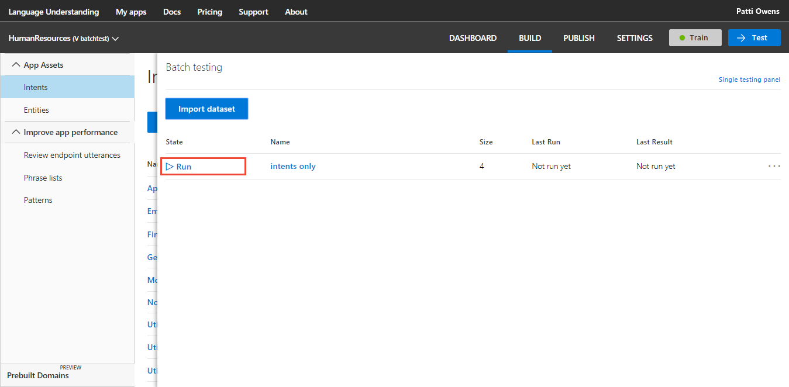
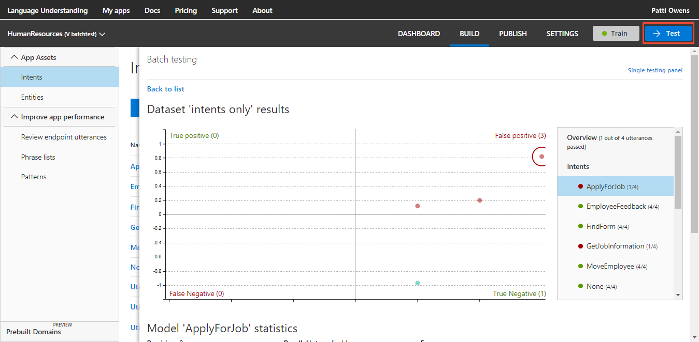
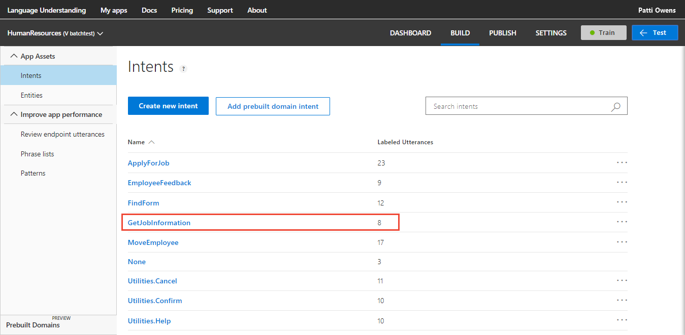

# Improve app with batch test

This tutorial demonstrates how to use batch testing to find utterance prediction issues.  

In this tutorial, you learn how to:

<!-- green checkmark -->
> [!div class="checklist"]
* Create a batch test file 
* Run a batch test
* Review test results
* Fix errors for intents
* Retest the batch

For this article, you need a free [LUIS](luis-reference-regions.md#luis-website) account in order to author your LUIS application.

## Before you begin
If you don't have the Human Resources app from the [review endpoint utterances](luis-tutorial-review-endpoint-utterances.md) tutorial, [import](luis-how-to-start-new-app.md#import-new-app) the JSON into a new app in the [LUIS](luis-reference-regions.md#luis-website) website. The app to import is found in the [LUIS-Samples](https://github.com/Microsoft/LUIS-Samples/blob/master/documentation-samples/quickstarts/custom-domain-review-HumanResources.json) Github repository.

If you want to keep the original Human Resources app, clone the version on the [Settings](luis-how-to-manage-versions.md#clone-a-version) page, and name it `batchtest`. Cloning is a great way to play with various LUIS features without affecting the original version. 

## Purpose of batch testing
Batch testing allows you to validate a model's state with a known set of test utterances and labeled entities. In the JSON-formatted batch file, add the utterances and set the entity labels you need predicted inside the utterance. 

The recommended test strategy for LUIS uses three separate sets of data: example utterances provided to the model, batch test utterances, and endpoint utterances. For this tutorial, make sure you are not using the utterances from either example utterances (added to an intent), or endpoint utterances. 

To verify your batch test utterances against the example utterances and endpoint utterances, [export](luis-how-to-start-new-app.md#export-app) the app and [download](luis-how-to-start-new-app.md#export-endpoint-logs) the query log. Compare the app example utterance's and query log utterances to the batch test utterances. 

Requirements for batch testing:

* 1000 utterances per test. 
* No duplicates. 
* Entity types allowed: simple and composite.

## Create a batch file with utterances
1. Create `HumanResources-jobs-batch.json` in a text editor such as [VSCode](https://code.visualstudio.com/). 

2. In the JSON-formatted batch file, add utterances with the **Intent** you want predicted in the test. 

    ```JSON
    [
        {
        "text": "Are there any janitorial jobs currently open?",
        "intent": "GetJobInformation",
        "entities": []
        },
        {
        "text": "I would like a fullstack typescript programming with azure job",
        "intent": "GetJobInformation",
        "entities": []
        },
        {
        "text": "Is there a database position open in Los Colinas?",
        "intent": "GetJobInformation",
        "entities": []
        },
        {
        "text": "Can I apply for any database jobs with this resume?",
        "intent": "GetJobInformation",
        "entities": []
        }
    ]
    ```

## Run the batch

1. Select **Test** in the top navigation bar. 

    [ ](./media/luis-tutorial-batch-testing/hr-first-image.png#lightbox)

2. Select **Batch testing panel** in the right-side panel. 

    [ ](./media/luis-tutorial-batch-testing/hr-batch-testing-panel-link.png#lightbox)

3. Select **Import dataset**.

    [ ](./media/luis-tutorial-batch-testing/hr-import-dataset-button.png#lightbox)

4. Choose the file system location of the `HumanResources-jobs-batch.json` file.

5. Name the dataset `intents only` and select **Done**.

    

6. Select the **Run** button. Wait until the test is done.

    [ ](./media/luis-tutorial-batch-testing/hr-run-button.png#lightbox)

7. Select **See results**.

8. Review results in the graph and legend.

    [ ](./media/luis-tutorial-batch-testing/hr-intents-only-results-1.png#lightbox)

## Review batch results
The batch chart displays four quadrants of results. To the right of the chart is a filter. By default, the filter is set to the first intent in the list. The filter contains all the intents and only simple, hierarchical (parent-only), and composite entities. When you select a section of the chart or a point within the chart, the associated utterance(s) display below the chart. 

While hovering over the chart, a mouse wheel can enlarge or reduce the display in the chart. This is useful when there are many points on the chart clustered tightly together. 

The chart is in four quadrants, with two of the sections displayed in red. **These are the sections to focus on**. 

### ApplyForJob test results
The **ApplyForJob** test results displayed in the filter show that 1 of the four predictions was successful. Select the name **False positive** above the top right quadrant to see the utterances below the chart. 


The three utterances had a top intent of **ApplyForJob**. The intent stated in the batch file had a lower score. Why did this happen? The two intents are very closely related in terms of word choice and word arrangement. Additionally, there are almost three times as many examples for **ApplyForJob** than **GetJobInformation**. This unevenness of example utterances weighs in **ApplyForJob** intent's favor. 

Notice that both intents have the same count of errors: 


The utterance corresponding the top point in the **False positive** section is `Can I apply for any database jobs with this resume?`. The word `resume` has only been used in **ApplyForJob**. 

The other two points in the chart had much lower scores for the wrong intent, meaning they are closer to the correct intent. 

## Fix the app based on batch results
The goal of this section is to have the three utterances that were incorrectly predicted for **ApplyForJob** to be correctly predicted for **GetJobInformation**, after the app is fixed. 

A seemingly quick fix would be to add these batch file utterances to the correct intent. That is not what you want to do though. You want LUIS to correctly predict these utterances without adding them as examples. 

You might also wonder about removing utterances from **ApplyForJob** until the utterance quantity is the same as **GetJobInformation**. That may fix the test results but would hinder LUIS from predicting that intent accurately next time. 

The first fix is to add more utterances to **GetJobInformation**. The second fix is to reduce the weight of the word `resume` toward the **ApplyForJob** intent. 

### Add more utterances to **GetJobInformation**
1. Close the batch test panel by selecting the **Test** button in the top navigation panel. 

    [ ](./media/luis-tutorial-batch-testing/hr-close-test-panel.png#lightbox)

2. Select **GetJobInformation** from the intents list. 

    [ ](./media/luis-tutorial-batch-testing/hr-select-intent-to-fix-1.png#lightbox)

3. Add more utterances that are varied for length, word choice, and word arrangement, making sure to include the terms `resume` and `c.v.`:

    ```JSON
    Is there a new job in the warehouse for a stocker?
    Where are the roofing jobs today?
    I heard there was a medical coding job that requires a resume.
    I would like a job helping college kids write their c.v.s. 
    Here is my resume, looking for a new post at the community college using computers.
    What positions are available in child and home care?
    Is there an intern desk at the newspaper?
    My C.v. shows I'm good at analyzing procurement, budgets, and lost money. Is there anything for this type of work?
    Where are the earth drilling jobs right now?
    I've worked 8 years as an EMS driver. Any new jobs?
    New food handling jobs?
    How many new yard work jobs are available?
    Is there a new HR post for labor relations and negotiations?
    I have a masters in library and archive management. Any new positions?
    Are there any babysitting jobs for 13 year olds in the city today?
    ```

4. Train the app by selecting **Train** in the top right navigation.

## Verify the fix worked
In order to verify that the utterances in the batch test are correctly predicted, run the batch test again.

1. Select **Test** in the top navigation bar. If the batch results are still open, select **Back to list**.  

2. Select the ellipsis (***...***) button to the right of the batch name and select **Run Dataset**. Wait until the batch test is done. Notice that the **See results** button is now green. This means the entire batch ran successfully.

3. Select **See results**. The intents should all have green icons to the left of the intent names. 

    [ ](./media/luis-tutorial-batch-testing/hr-batch-test-intents-no-errors.png#lightbox)


## What has this tutorial accomplished?
This app prediction accuracy has increased by finding errors in the batch and correcting the model by adding more example utterances to the correct intent and training. 

## Clean up resources
When no longer needed, delete the LUIS app. Select **My apps** in the top left menu. Select the ellipsis **...** to the right of the app name in the app list, select **Delete**. On the pop-up dialog **Delete app?**, select **Ok**.


## Next steps

> [!div class="nextstepaction"]
> [Learn about patterns](luis-tutorial-pattern.md)

