# Use batch testing to find prediction accuracy issues

This tutorial demonstrates how to use batch testing to find utterance prediction issues.  

In this tutorial, you learn how to:

> [!div class="checklist"]
* Create a batch test file 
* Run a batch test
* Review test results
* Fix errors for intents
* Retest the batch

## Prerequisites

> [!div class="checklist"]
> * For this article, you also need a [LUIS][LUIS] account in order to author your LUIS application.

> [!Tip]
> If you do not already have a subscription, you can register for a [free account](https://azure.microsoft.com/free/).

## Create new app
This article uses the prebuilt domain HomeAutomation. The prebuilt domain has intents, entities, and utterances for controlling HomeAutomation devices such as lights. Create the app, add the domain, train, and publish.

1. In the [LUIS] website, create a new app by selecting **Create new app** on the **MyApps** page. 

    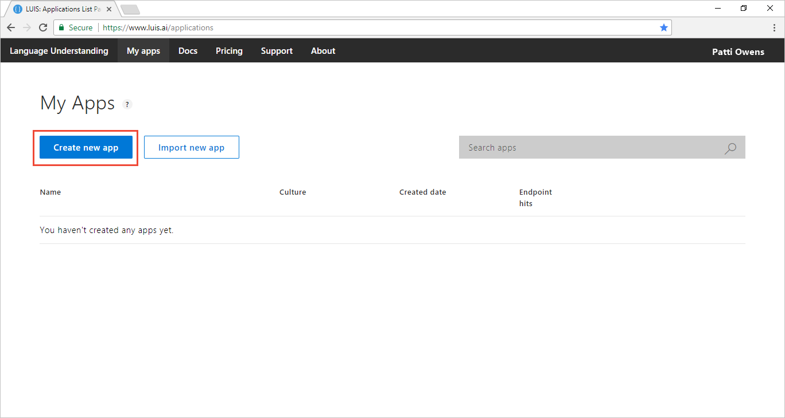

2. Enter the name `Batchtest-HomeAutomation` in the dialog.

    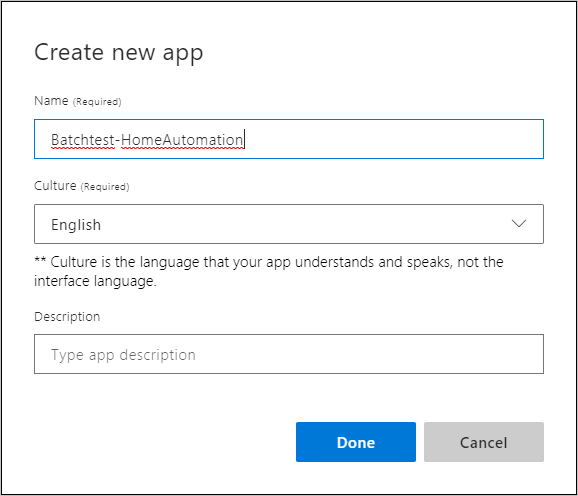

3. Select **Prebuilt Domains** in bottom left corner. 

    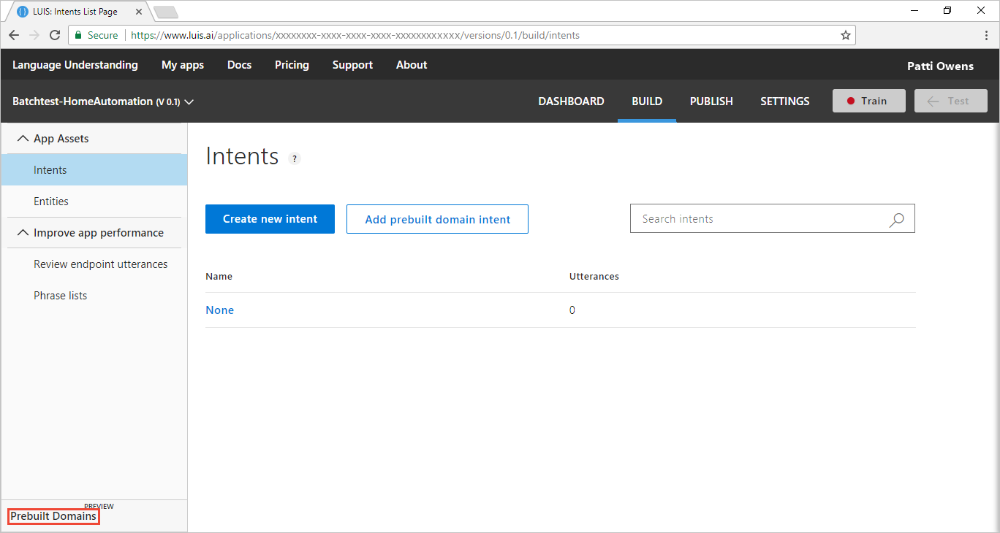

4. Select **Add Domain** for HomeAutomation.

    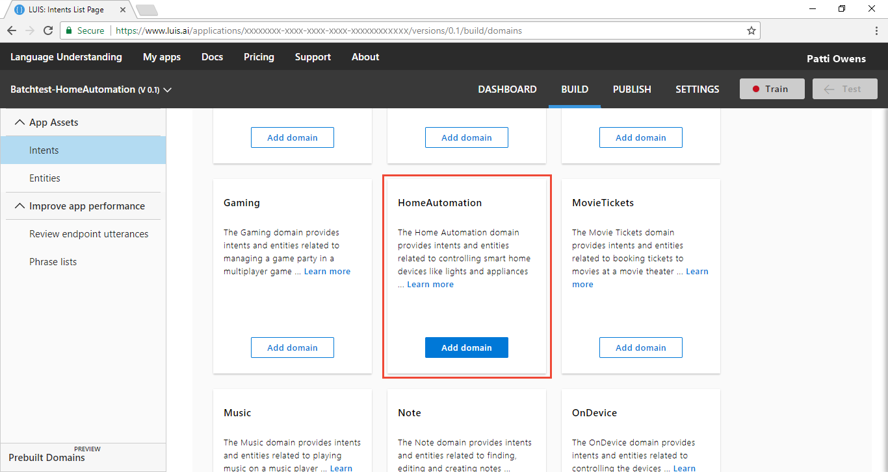

5. Select **Train** in the top right navigation bar.

    

## Batch test criteria
Batch testing can test up to 1000 utterances at a time. The batch should not have duplicates. [Export](create-new-app.md#export-app) the app in order to see the list of current utterances.  

The test strategy for LUIS uses three separate sets of data: model utterances, batch test utterances, and endpoint utterances. For this tutorial, make sure you are not using the utterances from either model utterances (added to an intent), or endpoint utterances. 

Do not use any of the utterances already in the app for the batch test:

```
'breezeway on please',
'change temperature to seventy two degrees',
'coffee bar on please',
'decrease temperature for me please',
'dim kitchen lights to 25 .',
'fish pond off please',
'fish pond on please',
'illuminate please',
'living room lamp on please',
'living room lamps off please',
'lock the doors for me please',
'lower your volume',
'make camera 1 off please',
'make some coffee',
'play dvd',
'set lights bright',
'set lights concentrate',
'set lights out bedroom',
'shut down my work computer',
'silence the phone',
'snap switch fan fifty percent',
'start master bedroom light .',
'theater on please',
'turn dimmer off',
'turn off ac please',
'turn off foyer lights',
'turn off living room light',
'turn off staircase',
'turn off venice lamp',
'turn on bathroom heater',
'turn on external speaker',
'turn on my bedroom lights .',
'turn on the furnace room lights',
'turn on the internet in my bedroom please',
'turn on thermostat please',
'turn the fan to high',
'turn thermostat on 70 .' 
```

## Create a batch to test intent prediction accuracy
1. Create `homeauto-batch-1.json` in a text editor such as [VSCode](https://code.visualstudio.com/). 

2. Add utterances with the **Intent** you want predicted in the test. For this tutorial, to make it simple, take utterances in the `HomeAutomation.TurnOn` and `HomeAutomation.TurnOff` and switch the `on` and `off` text in the utterances. For the `None` intent, add a couple of utterances that are not part of the [domain](luis-glossary.md#domain) (subject) area. 

    In order to understand how the batch test results correlate to the batch JSON, add only six intents.

    ```JSON
    [
        {
          "text": "lobby on please",
          "intent": "HomeAutomation.TurnOn",
          "entities": []
        },
        {
          "text": "change temperature to seventy one degrees",
          "intent": "HomeAutomation.TurnOn",
          "entities": []
        },
        {
          "text": "where is my pizza",
          "intent": "None",
          "entities": []
        },
        {
          "text": "help",
          "intent": "None",
          "entities": []
        },
        {
          "text": "breezeway off please",
          "intent": "HomeAutomation.TurnOff",
          "entities": []
        },
        {
          "text": "coffee bar off please",
          "intent": "HomeAutomation.TurnOff",
          "entities": []
        }
    ]
    ```

## Run the batch
1. Select **Test** in the top navigation bar. 

    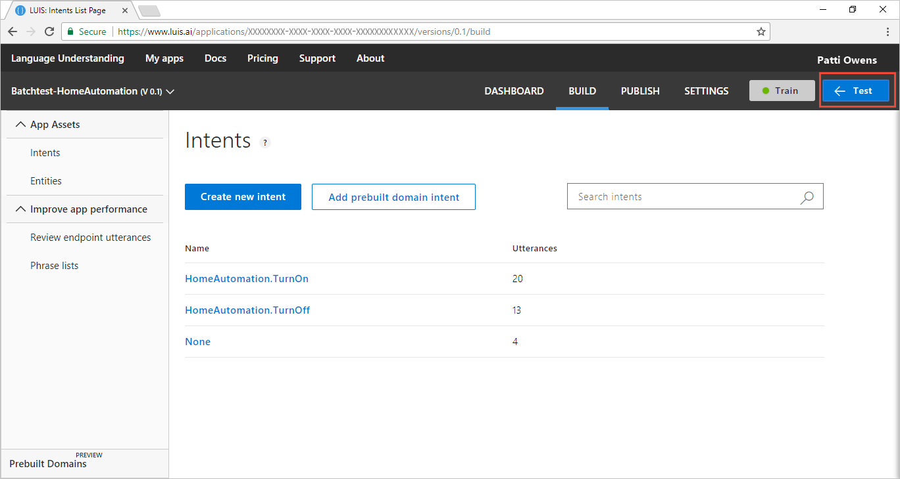

2. Select **Batch testing panel** in the right-side panel. 

    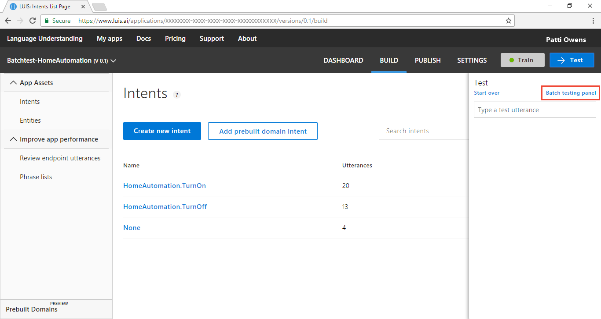

3. Select **Import dataset**.

    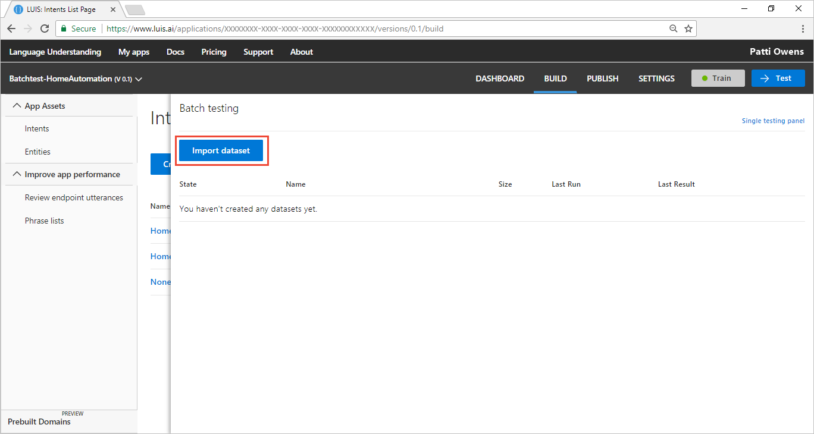

4. Choose the file system location of the `homeauto-batch-1.json` file.

5. Name the dataset `set 1`.

    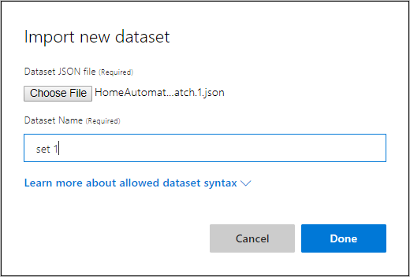

6. Select the **Run** button. Wait until the test is done.

    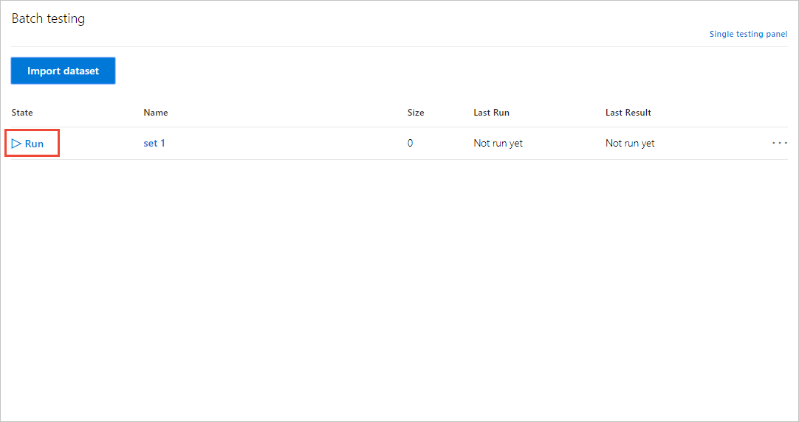

7. Select **See results**.

    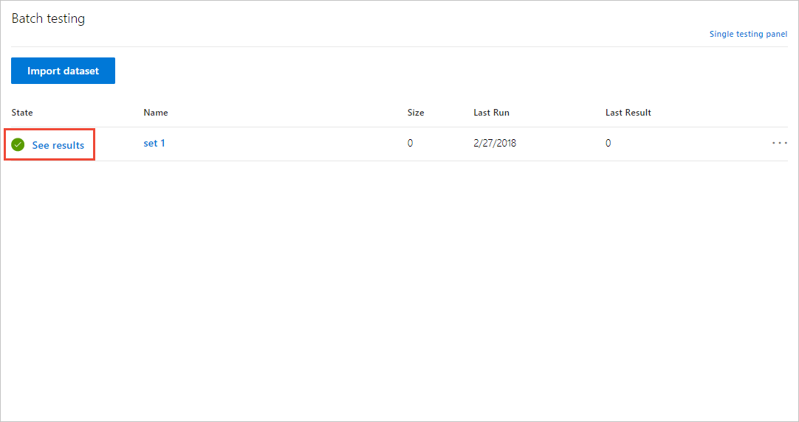

8. Review results in the graph and legend.

    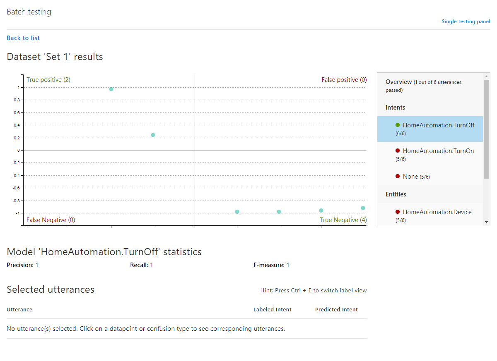

## Review batch results
The batch results are in two sections. The top section contains the graph and the legend. The bottom section displays utterances when you select an area name of the graph.

Any errors are indicated by the color red. The graph is in four sections, with two of the sections displayed in red. **These are the sections to focus on**. 

The top right section indicates the test incorrectly predicted the existence of an intent or entity. The bottom left section indicates the test incorrectly predicted the absence of an intent or entity.

### HomeAutomation.TurnOff test results
In the legend, select the `HomeAutomation.TurnOff` intent. It has a green success icon to the left of the name in the legend. There are no errors for this intent. 


### HomeAutomation.TurnOn and None intents have errors
The other two intents have errors, meaning the test predictions didn't match the batch file expectations. Select the `None` intent in the legend to review the first error. 

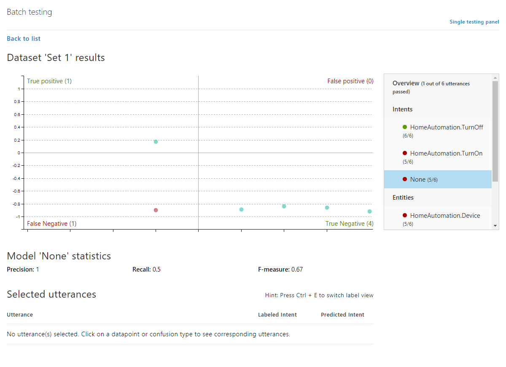

Failures appear on the chart in the red sections: **False Positive** and **False Negative**. Select the **False Negative** section name in the chart to see the failed utterances below the chart. 

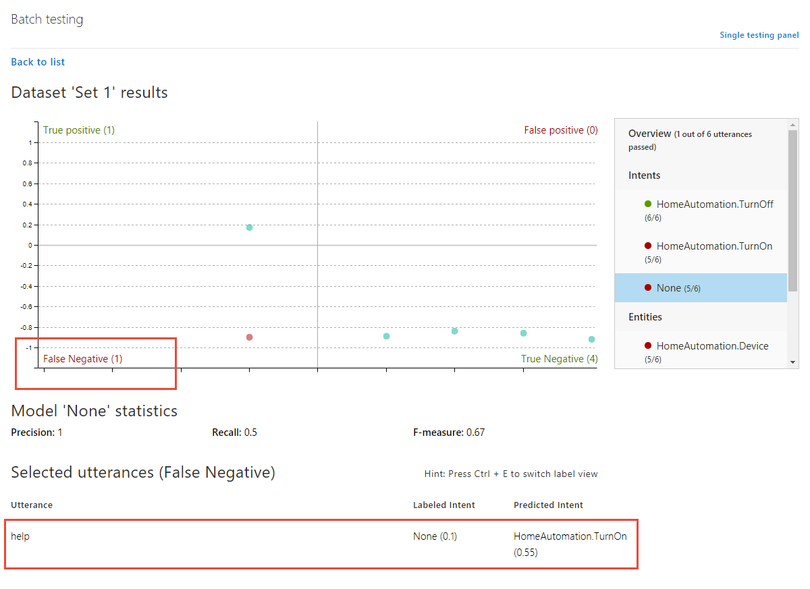

The failing utterance, `help` was expected as a `None` intent but the test predicted `HomeAutomation.TurnOn` intent.  

There are two failures, one in HomeAutomation.TurnOn, and one in None. Both were caused by the utterance `help` because it failed to meet the expectation in None and it was an unexpected match for the HomeAutomation.TurnOn intent. 

To determine why the `None` utterances are failing, review the utterances currently in `None`. 

## Review None intent's utterances

1. Close the **Test** panel by selecting the **Test** button on the top navigation bar. 

2. Select **Build** from the top navigation panel. 

3. Select **None** intent from list of intents.

4. Select Control+E to see the token view of the utterances 
    
    |None intent's utterances|Prediction score|
    |--|--|
    |"decrease temperature for me please"|0.44|
    |"dim kitchen lights to 25."|0.43|
    |"lower your volume"|0.46|
    |"turn on the internet in my bedroom please"|0.28|

## Fix None intent's utterances
    
Any utterances in `None` are supposed to be outside of the app domain. These utterances are relative to HomeAutomation, so they are in the wrong intent. 

LUIS also gives the utterances less than 50% (<.50) prediction score. If you look at the utterances in the other two intents, you see much higher prediction scores. When LUIS has low scores for example utterances, that is a good indication the utterances are confusing to LUIS between the current intent and other intents. 

To fix the app, the utterances currently in the `None` intent need to be moved into the correct intent and the `None` intent needs new, appropriate intents. 

Three of the utterances in the `None` intent are meant to lower the automation device settings. They use words such as `dim`, `lower`, or `decrease`. The fourth utterance asks to turn on the internet. Since all four utterances are about turning on or changing the degree of power to a device, they should be moved to the `HomeAutomation.TurnOn` intent. 

This is just one solution. You could also create a new intent of `ChangeSetting` and move the utterances using dim, lower, and decrease into that new intent. 

## Fix the app based on batch results
Move the four utterances to the `HomeAutomation.TurnOn` intent. 

1. Select the checkbox above the utterance list so all utterances are selected. 

2. In the **Reassign intent** drop-down, select `HomeAutomation.TurnOn`. 

    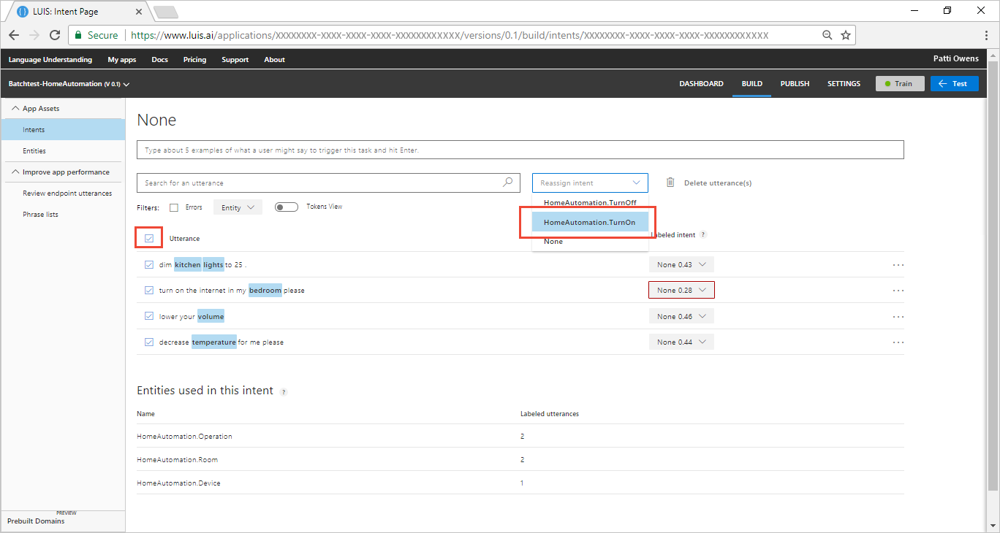

    After the four utterances are reassigned, the utterance list for the `None` intent is empty.

3. Add four new intents for the None intent:

    ```
    "fish"
    "dogs"
    "beer"
    "pizza"
    ```

    These utterances are definitely outside the domain of HomeAutomation. As you enter each utterance, watch the score for it. The score may be low, or even very low (with a red box around it). After you train the app, in step 8, the score will be much higher. 

7. Remove any labels by selecting the blue label in the utterance and select **Remove label**.

8. Select **Train** in the top right navigation bar. The score of each utterance is much higher. All scores for the `None` intent should be above .80 now. 

## Verify the fix worked
In order to verify that the utterances in the batch test are correctly predicted for the **None** intent, run the batch test again.

1. Select **Test** in the top navigation bar. 

2. Select **Batch testing panel** in the right-side panel. 

3. Select the three dots (...) to the right of the batch name and select **Run Dataset**. Wait until the batch test is done.

    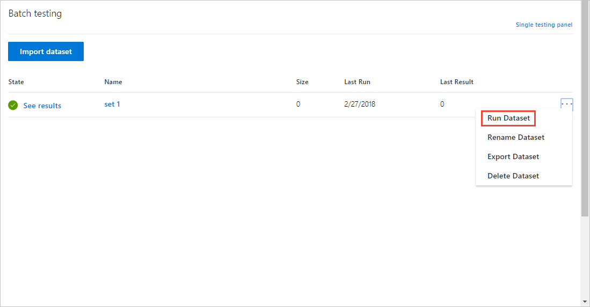

4. Select **See results**. The intents should all have green icons to the left of the intent names. With the right filter set to the `HomeAutomation.Turnoff` intent, select the green dot in the top right panel closest to the middle of the chart. The name of the utterance appears in the table below the chart. The score of `breezeway off please` is very low. An optional activity is to add more utterances to the intent to increase this score. 

    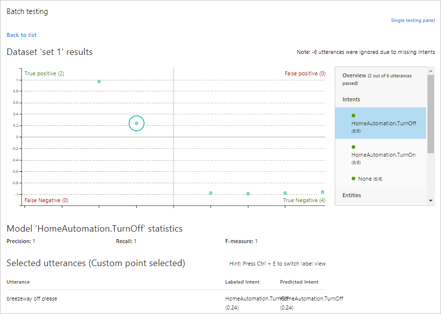

<!--
    The Entities section of the legend may have errors. That is the next thing to fix.

## Create a batch to test entity detection
1. Create `homeauto-batch-2.json` in a text editor such as [VSCode](https://code.visualstudio.com/). 

2. Utterances have entities identified with `startPos` and `endPost`. These two elements identify the entity before [tokenization](luis-glossary.md#token), which happens in some [cultures](luis-supported-languages.md#tokenization) in LUIS. If you plan to batch test in a tokenized culture, learn how to [extract](luis-concept-data-extraction.md#tokenized-entity-returned) the non-tokenized entities.

    Copy the following JSON into the file:

    ```JSON
    [
        {
          "text": "lobby on please",
          "intent": "HomeAutomation.TurnOn",
          "entities": [
            {
              "entity": "HomeAutomation.Room",
              "startPos": 0,
              "endPos": 4
            }
          ]
        },
        {
          "text": "change temperature to seventy one degrees",
          "intent": "HomeAutomation.TurnOn",
          "entities": [
            {
              "entity": "HomeAutomation.Operation",
              "startPos": 7,
              "endPos": 17
            }
          ]
        },
        {
          "text": "where is my pizza",
          "intent": "None",
          "entities": []
        },
        {
          "text": "help",
          "intent": "None",
          "entities": []
        },
        {
          "text": "breezeway off please",
          "intent": "HomeAutomation.TurnOff",
          "entities": [
            {
              "entity": "HomeAutomation.Room",
              "startPos": 0,
              "endPos": 9
            }
          ]
        },
        {
          "text": "coffee bar off please",
          "intent": "HomeAutomation.TurnOff",
          "entities": [
            {
              "entity": "HomeAutomation.Device",
              "startPos": 0,
              "endPos": 10
            }
          ]
        }
      ]
    ```

3. Import the batch file, following the [same instructions](#run-the-batch) as the first import, and name the dataset `set 2`. Run the test.

## Possible entity errors
Since the intents in the right-side filter of the test panel still pass the test, this section focuses on correct entity identification. 

Entity testing is diferrent than intents. An utterance will have only one top scoring intent, but it may have several entities. An utterance's entity may be correctly identified, may be incorrectly identified as an entity other than the one in the batch test, may overlap with other entities, or not identified at all. 

## Review entity errors
1. Select `HomeAutomation.Device` in the filter panel. The chart changes to show a single false positive and several true negatives. 

2. Select the False positive section name. The utterance for this chart point is displayed below the chart. The labeled intent and the predicted intent are the same, which is consistent with the test -- the intent prediction is correct. 

    The issue is that the HomeAutomation.Device was detected but the batch expected HomeAutomation.Room for the utterance "coffee bar off please". `Coffee bar` could be a room or a device, depending on the environment and context. As the model designer, you can either enforce the selection as `HomeAutomation.Room` or change the batch file to use `HomeAutomation.Device`. 

    If you want to reinforce that coffee bar is a room, you nee to add an utterances to LUIS that help LUIS decide a coffee bar is a room. 

    The most direct route is to add the utterance to the intent but that to add the utterance for every entity detection error is not the machine-learned solution. Another fix would be to add an utterance with `coffee bar`.

## Add utterance to help extract entity
1. Select the **Test** button on the top navigation to close the batch test panel.

2. On the `HomeAutomation.TurnOn` intent, add the utterance, `turn coffee bar on please`. The uttterance should have all three entities detected after you select enter. 

3. Select **Train** on the top navigation panel. Wait until training completes successfully.

3. Select **Test** on the top navigation panel to open the Batch testing pane again. 

4. If the list of datasets is not visible, select **Back to list**. Select the three dots (...) at the end of `Set 2` and select `Run Dataset`. Wait for the test to complete.

5. Select **See results** to review the test results.

6. 
-->
## Next steps

> [!div class="nextstepaction"]
> [Learn more about example utterances](Add-example-utterances.md)

[LUIS]: luis-reference-regions.md