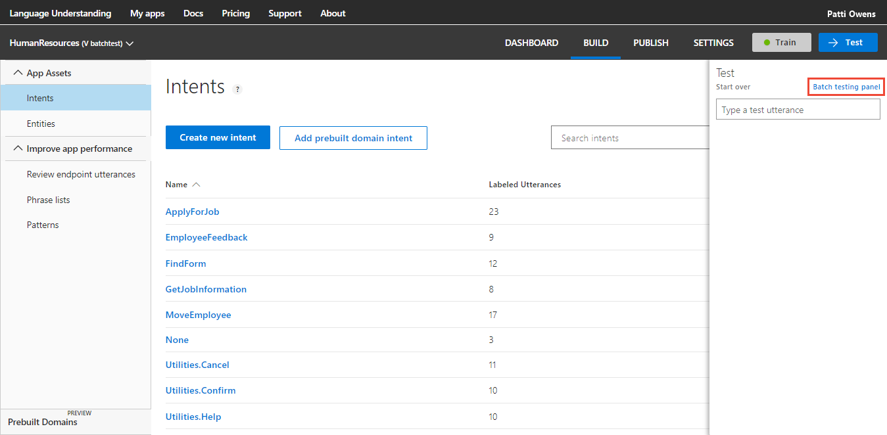
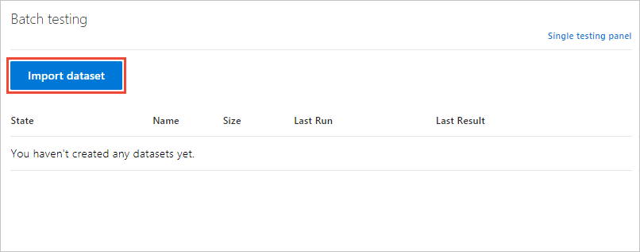
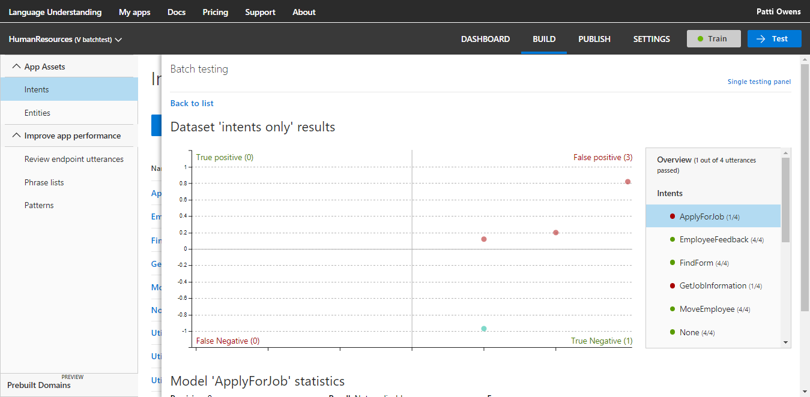
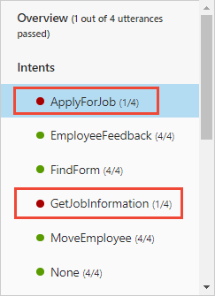
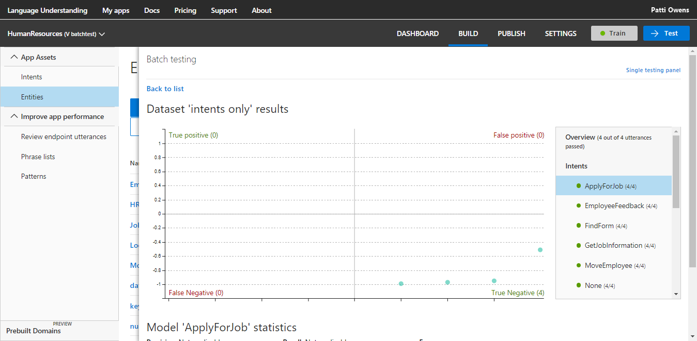
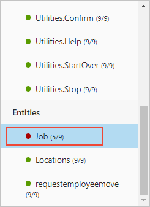
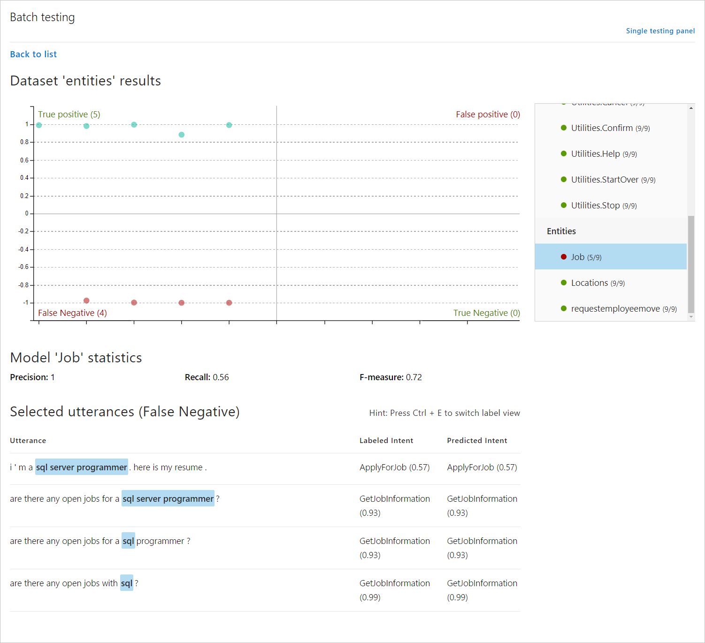

# Tutorial 2: Batch test data sets

This tutorial demonstrates how to use batch testing to find utterance prediction issues in your app and fix them.  

Batch testing allows you to validate the active, trained model's state with a known set of labeled utterances and entities. In the JSON-formatted batch file, add the utterances and set the entity labels you need predicted inside the utterance. 

Requirements for batch testing:

* Maximum of 1000 utterances per test. 
* No duplicates. 
* Entity types allowed: only machined-learned entities of simple, hierarchical (parent-only), and composite. Batch testing is only useful for machined-learned intents and entities.

When using an app other than this tutorial, do *not* use the example utterances already added to an intent. 

**In this tutorial, you learn how to:**

<!-- green checkmark -->
> [!div class="checklist"]
> * Use existing tutorial app
> * Create a batch test file 
> * Run a batch test
> * Review test results
> * Fix errors 
> * Retest the batch

[!INCLUDE [LUIS Free account](../../../includes/cognitive-services-luis-free-key-short.md)]

## Use existing app

Continue with the app created in the last tutorial, named **HumanResources**. 

If you do not have the HumanResources app from the previous tutorial, use the following steps:

1.  Download and save [app JSON file](https://github.com/Microsoft/LUIS-Samples/blob/master/documentation-samples/tutorials/custom-domain-review-HumanResources.json).

2. Import the JSON into a new app.

3. From the **Manage** section, on the **Versions** tab, clone the version, and name it `batchtest`. Cloning is a great way to play with various LUIS features without affecting the original version. Because the version name is used as part of the URL route, the name can't contain any characters that are not valid in a URL. 

4. Train the app.

## Batch file

1. Create `HumanResources-jobs-batch.json` in a text editor or [download](https://github.com/Microsoft/LUIS-Samples/blob/master/documentation-samples/tutorials/HumanResources-jobs-batch.json) it. 

2. In the JSON-formatted batch file, add utterances with the **Intent** you want predicted in the test. 

   [!code-json[Add the intents to the batch test file](~/samples-luis/documentation-samples/tutorials/HumanResources-jobs-batch.json "Add the intents to the batch test file")]

## Run the batch

1. Select **Test** in the top navigation bar. 

2. Select **Batch testing panel** in the right-side panel. 

    

3. Select **Import dataset**.

    

4. Choose the file location of the `HumanResources-jobs-batch.json` file.

5. Name the dataset `intents only` and select **Done**.

    

6. Select the **Run** button. 

7. Select **See results**.

8. Review results in the graph and legend.

    

## Review batch results

The batch chart displays four quadrants of results. To the right of the chart is a filter. By default, the filter is set to the first intent in the list. The filter contains all the intents and only simple, hierarchical (parent-only), and composite entities. When you select a [section of the chart](luis-concept-batch-test.md#batch-test-results) or a point within the chart, the associated utterance(s) display below the chart. 

While hovering over the chart, a mouse wheel can enlarge or reduce the display in the chart. This is useful when there are many points on the chart clustered tightly together. 

The chart is in four quadrants, with two of the sections displayed in red. **These are the sections to focus on**. 

### GetJobInformation test results

The **GetJobInformation** test results displayed in the filter show that 2 of the four predictions were successful. Select the name **False positive** above the top right quadrant to see the utterances below the chart. 

Why are two of the utterances predicted as **ApplyForJob**, instead of the correct intent **GetJobInformation**? The two intents are very closely related in terms of word choice and word arrangement. Additionally, there are almost three times as many examples for **ApplyForJob** than **GetJobInformation**. This unevenness of example utterances weighs in **ApplyForJob** intent's favor. 

Notice that both intents have the same count of errors. An incorrect prediction in one intent affects the other intent as well. They both have errors because the utterances were incorrectly predicted for one intent, and also incorrectly not predicted for another intent. 

The utterances corresponding the top point in the **False positive** section are `Can I apply for any database jobs with this resume?` and `Can I apply for any database jobs with this resume?`. For the first utterance, the word `resume` has only been used in **ApplyForJob**. For the second utterance, the word `apply` has only been used in the **ApplyForJob** intent.

## Fix the app

The goal of this section is to have all the utterances correctly predicted for **GetJobInformation** by fixing the app. 

A seemingly quick fix would be to add these batch file utterances to the correct intent. That is not what you want to do though. You want LUIS to correctly predict these utterances without adding them as examples. 

You might also wonder about removing utterances from **ApplyForJob** until the utterance quantity is the same as **GetJobInformation**. That may fix the test results but would hinder LUIS from predicting that intent accurately next time. 

The first fix is to add more utterances to **GetJobInformation**. The second fix is to reduce the weight of words like `resume` and `apply` toward the **ApplyForJob** intent. 

### Add more utterances

1. Close the batch test panel by selecting the **Test** button in the top navigation panel. 

2. Select **GetJobInformation** from the intents list. 

3. Add more utterances that are varied for length, word choice, and word arrangement, making sure to include the terms `resume`, `c.v.`, and `apply`:

    |Example utterances for **GetJobInformation** intent|
    |--|
    |Does the new job in the warehouse for a stocker require that I apply with a resume?|
    |Where are the roofing jobs today?|
    |I heard there was a medical coding job that requires a resume.|
    |I would like a job helping college kids write their c.v.s. |
    |Here is my resume, looking for a new post at the community college using computers.|
    |What positions are available in child and home care?|
    |Is there an intern desk at the newspaper?|
    |My C.v. shows I'm good at analyzing procurement, budgets, and lost money. Is there anything for this type of work?|
    |Where are the earth drilling jobs right now?|
    |I've worked 8 years as an EMS driver. Any new jobs?|
    |New food handling jobs require application?|
    |How many new yard work jobs are available?|
    |Is there a new HR post for labor relations and negotiations?|
    |I have a masters in library and archive management. Any new positions?|
    |Are there any babysitting jobs for 13 year olds in the city today?|

    Do not label the **Job** entity in the utterances. This section of the tutorial is focused on intent prediction only.

4. Train the app by selecting **Train** in the top right navigation.

## Verify the new model

In order to verify that the utterances in the batch test are correctly predicted, run the batch test again.

1. Select **Test** in the top navigation bar. If the batch results are still open, select **Back to list**.  

2. Select the ellipsis (***...***) button to the right of the batch name and select **Run Dataset**. Wait until the batch test is done. Notice that the **See results** button is now green. This means the entire batch ran successfully.

3. Select **See results**. The intents should all have green icons to the left of the intent names. 

    

## Create batch file with entities 

In order to verify entities in a batch test, the entities need to be labeled in the batch JSON file. Only the machine-learned entities are used: simple, hierarchical (parent-only), and composite entities. Do not add non-machine-learned entities because they are always found either through regular expressions, or explicit text matches.

The variation of entities for total word ([token](luis-glossary.md#token)) count can impact the prediction quality. Make sure the training data supplied to the intent with labeled utterances includes a variety of lengths of entity. 

When first writing and testing batch files, it is best to start with a few utterances and entities that you know work, as well as a few that you think may be incorrectly predicted. This helps you focus in on the problem areas quickly. After testing the **GetJobInformation** and **ApplyForJob** intents using several different Job names, which were not predicted, this batch test file was developed to see if there is a prediction problem with certain values for **Job** entity. 

The value of a **Job** entity, provided in the test utterances, is usually one or two words, with a few examples being more words. If _your own_ human resources app typically has job names of many words, the example utterances labeled with **Job** entity in this app would not work well.

1. Create `HumanResources-entities-batch.json` in a text editor such as [VSCode](https://code.visualstudio.com/) or [download](https://github.com/Microsoft/LUIS-Samples/blob/master/documentation-samples/tutorials/HumanResources-entities-batch.json) it.

2. In the JSON-formatted batch file, add an array of objects that include utterances with the **Intent** you want predicted in the test as well as locations of any entities in the utterance. Since an entity is token-based, make sure to start and stop each entity on a character. Do not begin or end the utterance on a space. This causes an error during the batch file import.  

   [!code-json[Add the intents and entities to the batch test file](~/samples-luis/documentation-samples/tutorials/HumanResources-entities-batch.json "Add the intents and entities to the batch test file")]

## Run the batch with entities

1. Select **Test** in the top navigation bar. 

2. Select **Batch testing panel** in the right-side panel. 

3. Select **Import dataset**.

4. Choose the file system location of the `HumanResources-entities-batch.json` file.

5. Name the dataset `entities` and select **Done**.

6. Select the **Run** button. Wait until the test is done.

7. Select **See results**.

## Review entity batch results

The chart opens with all the intents correctly predicted. Scroll down in the right-side filter to find the erroring entity predictions. 

1. Select the **Job** entity in the filter.

    

    The chart changes to display the entity predictions. 

2. Select **False Negative** in the lower, left quadrant of the chart. Then use the keyboard combination control + E to switch into the token view. 

    
    
    Reviewing the utterances below the chart reveals a consistent error when the Job name includes `SQL`. Reviewing the example utterances and the Job phrase list, SQL is only used once, and only as part of a larger job name, `sql/oracle database administrator`.

## Fix the app based on entity batch results

Fixing the app requires LUIS to correctly determine the variations of SQL jobs. There are several options for that fix. 

* Explicitly add more example utterances, which use SQL and label those words as a Job entity. 
* Explicitly add more SQL jobs to the phrase list

These tasks are left for you to do.

Adding a [pattern](luis-concept-patterns.md) before the entity is correctly predicted, is not going to fix the problem. This is because the pattern won't match until all the entities in the pattern are detected. 

## Clean up resources

[!INCLUDE [LUIS How to clean up resources](../../../includes/cognitive-services-luis-tutorial-how-to-clean-up-resources.md)]

## Next steps

The tutorial used a batch test to find problems with the current model. The model was fixed and retested with the batch file to verify the change was correct.

> [!div class="nextstepaction"]
> [Learn about patterns](luis-tutorial-pattern.md)

